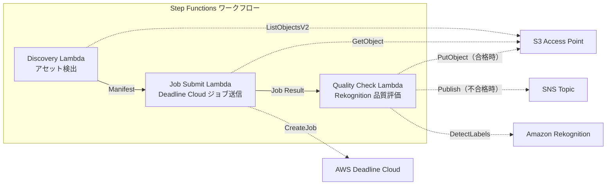

# UC4: Medien – VFX-Rendering-Pipeline

🌐 **Language / 言語**: [日本語](README.md) | [English](README.en.md) | [한국어](README.ko.md) | [简体中文](README.zh-CN.md) | [繁體中文](README.zh-TW.md) | [Français](README.fr.md) | Deutsch | [Español](README.es.md)

## Übersicht
FSx for NetApp ONTAP nutzt S3 Access Points für serverlose Workflows, die VFX-Rendering-Jobs automatisch versenden, Qualitätskontrollen durchführen und genehmigte Ausgaben zurückschreiben.
### Fälle, für die dieses Muster geeignet ist
- VFX / Animationsproduktionen verwenden FSx ONTAP als Rendering-Speicher
- Wir möchten die Qualitätskontrolle nach Abschluss des Renderings automatisieren und die Belastung durch manuelle Überprüfungen reduzieren
- Qualitätsgeprüfte Assets sollen automatisch zurück auf den Dateiserver geschrieben werden (S3 AP PutObject)
- Wir möchten eine Pipeline aufbauen, die Deadline Cloud und bestehende NAS-Speicher integriert
### Fälle, in denen dieses Muster nicht geeignet ist
- Sofortige Kick-Starts für Rendering-Jobs (durch Dateispeicherung ausgelöst)
- Nutzung einer anderen Rendering-Farm als Deadline Cloud (z.B. Thinkbox Deadline On-Premise)
- Rendering-Ausgaben übersteigen 5 GB (obere Grenze für S3 AP PutObject)
- Qualitätskontrolle erfordert eigenes Bildqualitätsbewertungsmodell (Rekognition-Etiketterkennung ist unzureichend)
### Hauptfunktionen
- Automatische Erkennung von Rendering-Ziel-Assets über S3 AP
- Automatisches Senden von Rendering-Jobs an AWS Deadline Cloud
- Qualitätsbewertung (Auflösung, Artefakte, Farbkonsistenz) mit Amazon Rekognition
- Bei bestandener Qualität PutObject an FSx ONTAP über S3 AP, bei nicht bestandener Qualität SNS-Benachrichtigung
## Architektur



### Workflow-Schritte
1. **Discovery**: Entdeckung von Renderziel-Assets von S3 AP und Generierung eines Manifests
2. **Job Submit**: Abrufen der Assets über S3 AP und Senden eines Rendering-Jobs an AWS Deadline Cloud
3. **Quality Check**: Bewertung der Qualität der Rendering-Ergebnisse mit Rekognition. Bei Bestehen einen PutObject an S3 AP, bei Misslingen eine SNS-Benachrichtigung für eine erneute Rendering-Flag
## Voraussetzungen
- AWS-Konto und entsprechende IAM-Berechtigungen
- FSx for NetApp ONTAP-Dateisystem (ONTAP 9.17.1P4D3 oder höher)
- S3 Access Point aktivierter Volume
- ONTAP REST API-Authentifizierungsdaten in Secrets Manager registriert
- VPC, private Subnetz
- AWS Deadline Cloud Farm / Queue konfiguriert
- Amazon Rekognition verfügbare Region
## Bereitstellungsschritte

### 1. Vorbereitung der Parameter
Vor dem Deployment überprüfen Sie bitte die folgenden Werte:

- FSx ONTAP S3 Access Point Alias
- ONTAP Verwaltungs-IP-Adresse
- Secrets Manager Geheimnamen
- AWS Deadline Cloud Farm ID / Warteschlangen-ID
- VPC ID, privates Subnetz ID
### 2. CloudFormation-Bereitstellung

```bash
aws cloudformation deploy \
  --template-file media-vfx/template.yaml \
  --stack-name fsxn-media-vfx \
  --parameter-overrides \
    S3AccessPointAlias=<your-volume-ext-s3alias> \
    S3AccessPointName=<your-s3ap-name> \
    S3AccessPointOutputAlias=<your-output-volume-ext-s3alias> \
    OntapSecretName=<your-ontap-secret-name> \
    OntapManagementIp=<your-ontap-management-ip> \
    ScheduleExpression="rate(1 hour)" \
    VpcId=<your-vpc-id> \
    PrivateSubnetIds=<subnet-1>,<subnet-2> \
    NotificationEmail=<your-email@example.com> \
    DeadlineFarmId=<your-deadline-farm-id> \
    DeadlineQueueId=<your-deadline-queue-id> \
    QualityThreshold=80.0 \
    EnableVpcEndpoints=false \
    EnableCloudWatchAlarms=false \
  --capabilities CAPABILITY_IAM CAPABILITY_AUTO_EXPAND \
  --region ap-northeast-1
```
> **Hinweis**: Ersetzen Sie die Platzhalter `<...>` durch die tatsächlichen Umgebungswerte.
### 3. Überprüfung der SNS-Abonnements
Nach der Bereitstellung erhalten Sie eine E-Mail zur Bestätigung der SNS-Abonnements an die angegebene E-Mail-Adresse.

> **Hinweis**: Wenn `S3AccessPointName` weggelassen wird, kann es dazu kommen, dass die IAM-Richtlinie nur auf Alias-Basis beruht und ein `AccessDenied`-Fehler auftritt. Die Angabe wird in der Produktionsumgebung empfohlen. Weitere Informationen finden Sie im [Anleitung zur Fehlerbehebung](../docs/guides/troubleshooting-guide.md#1-accessdenied-fehler).
## Liste der Konfigurationsparameter

| パラメータ | 説明 | デフォルト | 必須 |
|-----------|------|----------|------|
| `S3AccessPointAlias` | FSx ONTAP S3 AP Alias（入力用） | — | ✅ |
| `S3AccessPointName` | S3 AP 名（ARN ベースの IAM 権限付与用。省略時は Alias ベースのみ） | `""` | ⚠️ 推奨 |
| `S3AccessPointOutputAlias` | FSx ONTAP S3 AP Alias（出力用） | — | ✅ |
| `OntapSecretName` | ONTAP 認証情報の Secrets Manager シークレット名 | — | ✅ |
| `OntapManagementIp` | ONTAP クラスタ管理 IP アドレス | — | ✅ |
| `ScheduleExpression` | EventBridge Scheduler のスケジュール式 | `rate(1 hour)` | |
| `VpcId` | VPC ID | — | ✅ |
| `PrivateSubnetIds` | プライベートサブネット ID リスト | — | ✅ |
| `NotificationEmail` | SNS 通知先メールアドレス | — | ✅ |
| `DeadlineFarmId` | AWS Deadline Cloud Farm ID | — | ✅ |
| `DeadlineQueueId` | AWS Deadline Cloud Queue ID | — | ✅ |
| `QualityThreshold` | Rekognition 品質評価の閾値（0.0〜100.0） | `80.0` | |
| `EnableVpcEndpoints` | Interface VPC Endpoints の有効化 | `false` | |
| `EnableCloudWatchAlarms` | CloudWatch Alarms の有効化 | `false` | |

## Kostenstruktur

### On-Demand-Anfrage (nach Nutzung abgerechnet)

| サービス | 課金単位 | 概算（100 アセット/月） |
|---------|---------|----------------------|
| Lambda | リクエスト数 + 実行時間 | ~$0.01 |
| Step Functions | ステート遷移数 | 無料枠内 |
| S3 API | リクエスト数 | ~$0.01 |
| Rekognition | 画像数 | ~$0.10 |
| Deadline Cloud | レンダリング時間 | 別途見積もり※ |
※ Die Kosten für AWS Deadline Cloud hängen von der Größe und Dauer der Rendering-Jobs ab.
### Rund-um-die-Uhr-Betrieb (optional)

| サービス | パラメータ | 月額 |
|---------|-----------|------|
| Interface VPC Endpoints | `EnableVpcEndpoints=true` | ~$28.80 |
| CloudWatch Alarms | `EnableCloudWatchAlarms=true` | ~$0.20 |
> In Demo-/PoC-Umgebungen sind sie ab **~0,12 €/Monat** (ohne Deadline Cloud) nur mit variablen Kosten verfügbar.
## Bereinigung

```bash
# CloudFormation スタックの削除
aws cloudformation delete-stack \
  --stack-name fsxn-media-vfx \
  --region ap-northeast-1

# 削除完了を待機
aws cloudformation wait stack-delete-complete \
  --stack-name fsxn-media-vfx \
  --region ap-northeast-1
```
> **Hinweis**: Das Löschen des Stacks kann fehlschlagen, wenn sich Objekte im S3-Bucket befinden. Bitte leeren Sie den Bucket zuvor.
## Unterstützte Regionen
UC4 verwendet die folgenden Dienste:
| サービス | リージョン制約 |
|---------|-------------|
| Amazon Rekognition | ほぼ全リージョンで利用可能 |
| AWS Deadline Cloud | 対応リージョンが限定的（[Deadline Cloud 対応リージョン](https://docs.aws.amazon.com/general/latest/gr/deadline-cloud.html)） |
| AWS X-Ray | ほぼ全リージョンで利用可能 |
| CloudWatch EMF | ほぼ全リージョンで利用可能 |
> Details finden Sie in der [Regionskompatibilitätsmatrix](../docs/region-compatibility.md).
## Referenzlinks

### AWS-Dokumentation
- [FSx ONTAP S3 Access Points 概要](https://docs.aws.amazon.com/fsx/latest/ONTAPGuide/accessing-data-via-s3-access-points.html)
- [Streaming mit CloudFront (offizielles Tutorial)](https://docs.aws.amazon.com/fsx/latest/ONTAPGuide/tutorial-stream-video-with-cloudfront.html)
- [Serverlose Verarbeitung mit Lambda (offizielles Tutorial)](https://docs.aws.amazon.com/fsx/latest/ONTAPGuide/tutorial-process-files-with-lambda.html)
- [Deadline Cloud API Referenz](https://docs.aws.amazon.com/deadline-cloud/latest/APIReference/Welcome.html)
- [Rekognition DetectLabels API](https://docs.aws.amazon.com/rekognition/latest/dg/API_DetectLabels.html)
### AWS-Blogartikel
- [S3 AP 発表ブログ](https://aws.amazon.com/blogs/aws/amazon-fsx-for-netapp-ontap-now-integrates-with-amazon-s3-for-seamless-data-access/)
- [3 つのサーバーレスアーキテクチャパターン](https://aws.amazon.com/blogs/storage/bridge-legacy-and-modern-applications-with-amazon-s3-access-points-for-amazon-fsx/)
### GitHub-Beispiel
- [aws-samples/amazon-rekognition-serverless-large-scale-image-and-video-processing](https://github.com/aws-samples/amazon-rekognition-serverless-large-scale-image-and-video-processing) — Rekognition Großflächige Verarbeitung
- [aws-samples/dotnet-serverless-imagerecognition](https://github.com/aws-samples/dotnet-serverless-imagerecognition) — AWS Step Functions + Rekognition
- [aws-samples/serverless-patterns](https://github.com/aws-samples/serverless-patterns) — Sammlung serverloser Muster
## Verifizierte Umgebung

| 項目 | 値 |
|------|-----|
| AWS リージョン | ap-northeast-1 (東京) |
| FSx ONTAP バージョン | ONTAP 9.17.1P4D3 |
| FSx 構成 | SINGLE_AZ_1 |
| Python | 3.12 |
| デプロイ方式 | CloudFormation (標準) |

## Lambda VPC Konfigurationsarchitektur
Aufgrund der Erkenntnisse aus der Überprüfung wurden die Lambda-Funktionen in und außerhalb der VPC getrennt platziert.

**Lambda innerhalb der VPC** (nur Funktionen, die ONTAP REST API-Zugriff benötigen):
- Discovery Lambda — S3 AP + ONTAP API

**Lambda außerhalb der VPC** (nur AWS-verwaltete Dienste-APIs):
- Alle anderen Lambda-Funktionen

> **Grund**: Für den Zugriff auf AWS-verwaltete Dienste-APIs (Athena, Bedrock, Textract usw.) von Lambda innerhalb der VPC ist ein Interface VPC Endpoint erforderlich (jeweils $7,20/Monat). Lambda außerhalb der VPC kann direkt über das Internet auf die AWS-APIs zugreifen und ohne zusätzliche Kosten arbeiten.

> **Hinweis**: Bei UC (UC1 Legal & Compliance) mit ONTAP REST API ist `EnableVpcEndpoints=true` erforderlich, um ONTAP-Anmeldeinformationen über den Secrets Manager VPC Endpoint abzurufen.