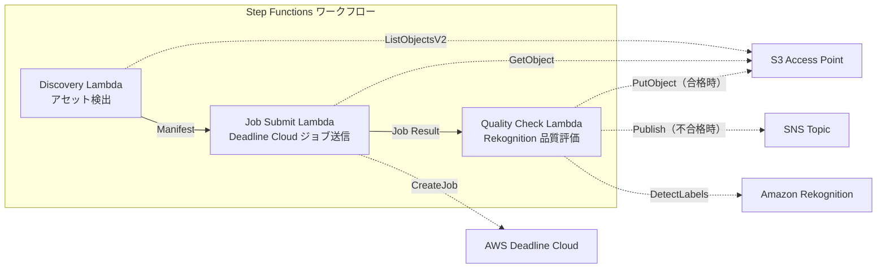

# UC4: Media — VFX Rendering Pipeline

🌐 **Language / 言語**: [日本語](README.md) | English | [한국어](README.ko.md) | [简体中文](README.zh-CN.md) | [繁體中文](README.zh-TW.md) | [Français](README.fr.md) | [Deutsch](README.de.md) | [Español](README.es.md)

📚 **Documentation**: [Architecture Diagram](docs/architecture.en.md) | [Demo Guide](docs/demo-guide.en.md)

## Overview
Leveraging S3 Access Points in FSx for NetApp ONTAP, this serverless workflow automates the submission of VFX rendering jobs, quality checks, and the write-back of approved outputs.
### When this pattern is suitable
- Using FSx for NetApp ONTAP as rendering storage for VFX / animation production
- We want to automate quality checks after rendering and reduce the burden of manual review
- We want to automatically write back the assets that passed quality checks to the file server (S3 AP PutObject)
- We want to build a pipeline that integrates Deadline Cloud with existing NAS storage
### Cases where this pattern is not suitable
- Immediate kick of rendering jobs (file save triggers) required
- Using a rendering farm other than Deadline Cloud (e.g., Thinkbox Deadline on-premises)
- Rendering output exceeds 5 GB (limit of S3 AP PutObject)
- A proprietary image quality evaluation model is required for quality checks (Rekognition's label detection is insufficient)
### Main Features
- Automatic detection of rendering target assets via S3 AP
- Automatic submission of rendering jobs to AWS Deadline Cloud
- Quality assessment by Amazon Rekognition (resolution, artifacts, color consistency)
- If quality is approved, execute PutObject to FSx ONTAP via S3 AP; if failed, send SNS notification
## Architecture



### Workflow Step
1. **Discovery**: Detect rendering target assets from S3 AP and generate a Manifest
2. **Job Submit**: Retrieve assets via S3 AP and submit rendering jobs to AWS Deadline Cloud
3. **Quality Check**: Evaluate the quality of rendering results with Rekognition. If passed, PutObject to S3 AP, and if failed, flag for re-rendering with an SNS notification
## Prerequisites
- AWS account and appropriate IAM permissions
- FSx for NetApp ONTAP file system (ONTAP 9.17.1P4D3 or later)
- Volumes with S3 Access Point enabled
- ONTAP REST API credentials registered in Secrets Manager
- VPC, private subnets
- AWS Deadline Cloud Farm / Queue set up
- Amazon Rekognition available region
## Deployment Steps

### 1. Preparing the parameters
Before deployment, please confirm the following values:

- FSx ONTAP S3 Access Point Alias
- ONTAP Management IP Address
- Secrets Manager Secret Name
- AWS Deadline Cloud Farm ID / Queue ID
- VPC ID, Private Subnet ID
### 2. CloudFormation Deployment

```bash
aws cloudformation deploy \
  --template-file media-vfx/template.yaml \
  --stack-name fsxn-media-vfx \
  --parameter-overrides \
    S3AccessPointAlias=<your-volume-ext-s3alias> \
    S3AccessPointName=<your-s3ap-name> \
    S3AccessPointOutputAlias=<your-output-volume-ext-s3alias> \
    OntapSecretName=<your-ontap-secret-name> \
    OntapManagementIp=<your-ontap-management-ip> \
    ScheduleExpression="rate(1 hour)" \
    VpcId=<your-vpc-id> \
    PrivateSubnetIds=<subnet-1>,<subnet-2> \
    NotificationEmail=<your-email@example.com> \
    DeadlineFarmId=<your-deadline-farm-id> \
    DeadlineQueueId=<your-deadline-queue-id> \
    QualityThreshold=80.0 \
    EnableVpcEndpoints=false \
    EnableCloudWatchAlarms=false \
  --capabilities CAPABILITY_IAM CAPABILITY_AUTO_EXPAND \
  --region ap-northeast-1
```
> **Note**: Replace the placeholder `<...>` with the actual environment values.
### 3. Verifying SNS Subscriptions
After deployment, an SNS subscription confirmation email will be sent to the specified email address.

> **Note**: If `S3AccessPointName` is omitted, the IAM policy may only be Alias-based, which can result in an `AccessDenied` error. It is recommended to specify it in a production environment. For more details, please refer to the [Troubleshooting Guide](../docs/guides/troubleshooting-guide.md#1-accessdenied-error).
## List of Configuration Parameters

| パラメータ | 説明 | デフォルト | 必須 |
|-----------|------|----------|------|
| `S3AccessPointAlias` | FSx ONTAP S3 AP Alias（入力用） | — | ✅ |
| `S3AccessPointName` | S3 AP 名（ARN ベースの IAM 権限付与用。省略時は Alias ベースのみ） | `""` | ⚠️ 推奨 |
| `S3AccessPointOutputAlias` | FSx ONTAP S3 AP Alias（出力用） | — | ✅ |
| `OntapSecretName` | ONTAP 認証情報の Secrets Manager シークレット名 | — | ✅ |
| `OntapManagementIp` | ONTAP クラスタ管理 IP アドレス | — | ✅ |
| `ScheduleExpression` | EventBridge Scheduler のスケジュール式 | `rate(1 hour)` | |
| `VpcId` | VPC ID | — | ✅ |
| `PrivateSubnetIds` | プライベートサブネット ID リスト | — | ✅ |
| `NotificationEmail` | SNS 通知先メールアドレス | — | ✅ |
| `DeadlineFarmId` | AWS Deadline Cloud Farm ID | — | ✅ |
| `DeadlineQueueId` | AWS Deadline Cloud Queue ID | — | ✅ |
| `QualityThreshold` | Rekognition 品質評価の閾値（0.0〜100.0） | `80.0` | |
| `EnableVpcEndpoints` | Interface VPC Endpoints の有効化 | `false` | |
| `EnableCloudWatchAlarms` | CloudWatch Alarms の有効化 | `false` | |

## Cost structure

### Request-based (pay-per-use)

| サービス | 課金単位 | 概算（100 アセット/月） |
|---------|---------|----------------------|
| Lambda | リクエスト数 + 実行時間 | ~$0.01 |
| Step Functions | ステート遷移数 | 無料枠内 |
| S3 API | リクエスト数 | ~$0.01 |
| Rekognition | 画像数 | ~$0.10 |
| Deadline Cloud | レンダリング時間 | 別途見積もり※ |
* The cost of AWS Deadline Cloud depends on the size and duration of the rendering jobs.
### Always On (Optional)

| サービス | パラメータ | 月額 |
|---------|-----------|------|
| Interface VPC Endpoints | `EnableVpcEndpoints=true` | ~$28.80 |
| CloudWatch Alarms | `EnableCloudWatchAlarms=true` | ~$0.20 |
> In the demo/PoC environment, it's available for just the variable costs starting at **~$0.12 per month** (excluding Deadline Cloud).
## Clean up

```bash
# CloudFormation スタックの削除
aws cloudformation delete-stack \
  --stack-name fsxn-media-vfx \
  --region ap-northeast-1

# 削除完了を待機
aws cloudformation wait stack-delete-complete \
  --stack-name fsxn-media-vfx \
  --region ap-northeast-1
```
> **Note**: Stack deletion may fail if there are remaining objects in the S3 bucket. Please empty the bucket beforehand.
## Supported Regions
UC4 uses the following services:
| サービス | リージョン制約 |
|---------|-------------|
| Amazon Rekognition | ほぼ全リージョンで利用可能 |
| AWS Deadline Cloud | 対応リージョンが限定的（[Deadline Cloud 対応リージョン](https://docs.aws.amazon.com/general/latest/gr/deadline-cloud.html)） |
| AWS X-Ray | ほぼ全リージョンで利用可能 |
| CloudWatch EMF | ほぼ全リージョンで利用可能 |
> See the [Region Compatibility Matrix](../docs/region-compatibility.md) for more details.
## References

### AWS Official Documentation
- [FSx for NetApp ONTAP S3 Access Points Overview](https://docs.aws.amazon.com/fsx/latest/ONTAPGuide/accessing-data-via-s3-access-points.html)
- [Streaming with CloudFront (Official Tutorial)](https://docs.aws.amazon.com/fsx/latest/ONTAPGuide/tutorial-stream-video-with-cloudfront.html)
- [Serverless processing with Lambda (Official Tutorial)](https://docs.aws.amazon.com/fsx/latest/ONTAPGuide/tutorial-process-files-with-lambda.html)
- [Deadline Cloud API Reference](https://docs.aws.amazon.com/deadline-cloud/latest/APIReference/Welcome.html)
- [Rekognition DetectLabels API](https://docs.aws.amazon.com/rekognition/latest/dg/API_DetectLabels.html)
### AWS Blog Post
- [S3 AP Announcement Blog](https://aws.amazon.com/blogs/aws/amazon-fsx-for-netapp-ontap-now-integrates-with-amazon-s3-for-seamless-data-access/)
- [Three Serverless Architecture Patterns](https://aws.amazon.com/blogs/storage/bridge-legacy-and-modern-applications-with-amazon-s3-access-points-for-amazon-fsx/)
### GitHub Samples
- [aws-samples/amazon-rekognition-serverless-large-scale-image-and-video-processing](https://github.com/aws-samples/amazon-rekognition-serverless-large-scale-image-and-video-processing) — Large-scale Rekognition Processing
- [aws-samples/dotnet-serverless-imagerecognition](https://github.com/aws-samples/dotnet-serverless-imagerecognition) — Step Functions + Rekognition
- [aws-samples/serverless-patterns](https://github.com/aws-samples/serverless-patterns) — Serverless Patterns Collection
## Validated Environment

| 項目 | 値 |
|------|-----|
| AWS リージョン | ap-northeast-1 (東京) |
| FSx ONTAP バージョン | ONTAP 9.17.1P4D3 |
| FSx 構成 | SINGLE_AZ_1 |
| Python | 3.12 |
| デプロイ方式 | CloudFormation (標準) |

## Lambda VPC Configuration Architecture
Based on the insights gained from validation, the Lambda functions are deployed in two separate locations: within and outside the VPC.

**Lambda within VPC** (only functions requiring ONTAP REST API access):
- Discovery Lambda — S3 AP + ONTAP API

**Lambda outside VPC** (only using AWS managed service APIs):
- All other Lambda functions

> **Reason**: Accessing AWS managed service APIs (Athena, Bedrock, Textract, etc.) from within the VPC Lambda requires an Interface VPC Endpoint (each at $7.20/month). Lambda functions outside the VPC can directly access AWS APIs via the internet, operating at no additional cost.

> **Note**: For UC (UC1 Legal & Compliance) using the ONTAP REST API, `EnableVpcEndpoints=true` is mandatory. This is because ONTAP credentials are retrieved through the Secrets Manager VPC Endpoint.