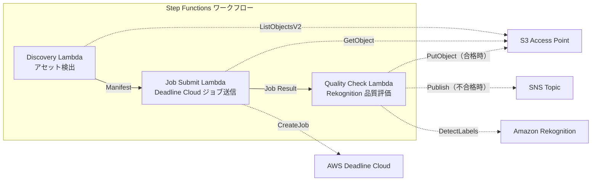

# UC4: Medios — Pipeline de Renderizado VFX

🌐 **Language / 言語**: [日本語](README.md) | [English](README.en.md) | [한국어](README.ko.md) | [简体中文](README.zh-CN.md) | [繁體中文](README.zh-TW.md) | [Français](README.fr.md) | [Deutsch](README.de.md) | Español

## Resumen
Un flujo de trabajo sin servidor que aprovecha los Puntos de Acceso S3 de FSx for NetApp ONTAP para el envío automático de trabajos de renderizado VFX, la verificación de calidad y la escritura de salidas aprobadas.
### Casos en los que este patrón es adecuado
- Utilizando FSx ONTAP como almacenamiento de renderizado en producción de VFX / animación
- Automatizar los controles de calidad tras la finalización del renderizado para reducir la carga de revisión manual
- Volver a escribir automáticamente los activos aprobados de calidad al servidor de archivos (S3 AP PutObject)
- Construir un pipeline que integre Deadline Cloud con el almacenamiento NAS existente
### Casos en los que este patrón no es adecuado
- Se requiere un inicio inmediato del trabajo de renderizado (activado por la guardación de archivos)
- Se utiliza una granja de renderizado que no sea Deadline Cloud (como Thinkbox Deadline On-Premises)
- La salida de renderizado excede los 5 GB (límite de S3 AP PutObject)
- Se necesita un modelo de evaluación de calidad de imagen propio para la verificación de calidad (la detección de etiquetas de Rekognition no es suficiente)
### Características principales
- Detección automática de activos a renderizar a través de S3 AP
- Envío automático de trabajos de renderizado a AWS Deadline Cloud
- Evaluación de calidad mediante Amazon Rekognition (resolución, artefactos, consistencia de color)
- Cuando la calidad apruebe, PutObject en FSx ONTAP a través de S3 AP; si no aprueba, notificación SNS
## Arquitectura



### Paso de flujo de trabajo
1. **Discovery**: Detectar activos aptos para renderizado desde S3 AP y generar un Manifest
2. **Job Submit**: Obtener activos a través de S3 AP y enviar trabajos de renderizado a AWS Deadline Cloud
3. **Quality Check**: Evaluar la calidad de los resultados del renderizado con Rekognition. Si pasan, colocar el objeto en S3 AP, si no, marcar la re-renderización con una notificación de SNS
## Requisitos previos
- Cuenta de AWS y permisos IAM adecuados
- Sistema de archivos FSx for NetApp ONTAP (ONTAP 9.17.1P4D3 o superior)
- Volumen con Punto de Acceso S3 habilitado
- Credenciales de API REST de ONTAP registradas en Secrets Manager
- VPC, subredes privadas
- AWS Deadline Cloud Farm / Queue configurado
- Amazon Rekognition disponible en la región
## Pasos de implementación

### 1. Preparación de parámetros
Antes de implementar, verifique los siguientes valores:

- Alias del punto de acceso S3 de FSx ONTAP
- Dirección IP de administración de ONTAP
- Nombre del secreto de Secrets Manager
- ID de granja en la nube de AWS Deadline / ID de cola
- ID de VPC, ID de subred privada
### 2. Despliegue de CloudFormation

```bash
aws cloudformation deploy \
  --template-file media-vfx/template.yaml \
  --stack-name fsxn-media-vfx \
  --parameter-overrides \
    S3AccessPointAlias=<your-volume-ext-s3alias> \
    S3AccessPointName=<your-s3ap-name> \
    S3AccessPointOutputAlias=<your-output-volume-ext-s3alias> \
    OntapSecretName=<your-ontap-secret-name> \
    OntapManagementIp=<your-ontap-management-ip> \
    ScheduleExpression="rate(1 hour)" \
    VpcId=<your-vpc-id> \
    PrivateSubnetIds=<subnet-1>,<subnet-2> \
    NotificationEmail=<your-email@example.com> \
    DeadlineFarmId=<your-deadline-farm-id> \
    DeadlineQueueId=<your-deadline-queue-id> \
    QualityThreshold=80.0 \
    EnableVpcEndpoints=false \
    EnableCloudWatchAlarms=false \
  --capabilities CAPABILITY_IAM CAPABILITY_AUTO_EXPAND \
  --region ap-northeast-1
```
> **Nota**: Reemplace los marcadores de posición `<...>` con los valores de entorno reales.
### 3. Verificación de suscripción a SNS
Después del despliegue, recibirá un correo electrónico de confirmación de suscripción de SNS en la dirección de correo electrónico especificada.

> **Nota**: Si omite `S3AccessPointName`, la política de IAM será solo basada en alias y puede generar un error `AccessDenied`. Se recomienda especificarla en el entorno de producción. Para más detalles, consulte la [Guía de resolución de problemas](../docs/guides/troubleshooting-guide.md#1-accessdenied-エラー).
## Lista de parámetros de configuración

| パラメータ | 説明 | デフォルト | 必須 |
|-----------|------|----------|------|
| `S3AccessPointAlias` | FSx ONTAP S3 AP Alias（入力用） | — | ✅ |
| `S3AccessPointName` | S3 AP 名（ARN ベースの IAM 権限付与用。省略時は Alias ベースのみ） | `""` | ⚠️ 推奨 |
| `S3AccessPointOutputAlias` | FSx ONTAP S3 AP Alias（出力用） | — | ✅ |
| `OntapSecretName` | ONTAP 認証情報の Secrets Manager シークレット名 | — | ✅ |
| `OntapManagementIp` | ONTAP クラスタ管理 IP アドレス | — | ✅ |
| `ScheduleExpression` | EventBridge Scheduler のスケジュール式 | `rate(1 hour)` | |
| `VpcId` | VPC ID | — | ✅ |
| `PrivateSubnetIds` | プライベートサブネット ID リスト | — | ✅ |
| `NotificationEmail` | SNS 通知先メールアドレス | — | ✅ |
| `DeadlineFarmId` | AWS Deadline Cloud Farm ID | — | ✅ |
| `DeadlineQueueId` | AWS Deadline Cloud Queue ID | — | ✅ |
| `QualityThreshold` | Rekognition 品質評価の閾値（0.0〜100.0） | `80.0` | |
| `EnableVpcEndpoints` | Interface VPC Endpoints の有効化 | `false` | |
| `EnableCloudWatchAlarms` | CloudWatch Alarms の有効化 | `false` | |
| `EnableSnapStart` | Habilitar Lambda SnapStart (reducción de arranque en frío) | `false` | |

## Estructura de costos

### Tarifa por solicitud

| サービス | 課金単位 | 概算（100 アセット/月） |
|---------|---------|----------------------|
| Lambda | リクエスト数 + 実行時間 | ~$0.01 |
| Step Functions | ステート遷移数 | 無料枠内 |
| S3 API | リクエスト数 | ~$0.01 |
| Rekognition | 画像数 | ~$0.10 |
| Deadline Cloud | レンダリング時間 | 別途見積もり※ |
※ El costo de AWS Deadline Cloud depende del tamaño y la duración de los trabajos de renderizado.
### Operación continua (opcional)

| サービス | パラメータ | 月額 |
|---------|-----------|------|
| Interface VPC Endpoints | `EnableVpcEndpoints=true` | ~$28.80 |
| CloudWatch Alarms | `EnableCloudWatchAlarms=true` | ~$0.20 |
> En entornos de demostración/PoC, están disponibles desde solo **~$0.12/mes** en costos variables (excluyendo Deadline Cloud).
## Limpieza

```bash
# CloudFormation スタックの削除
aws cloudformation delete-stack \
  --stack-name fsxn-media-vfx \
  --region ap-northeast-1

# 削除完了を待機
aws cloudformation wait stack-delete-complete \
  --stack-name fsxn-media-vfx \
  --region ap-northeast-1
```
> **Advertencia**: La eliminación de la pila podría fallar si quedan objetos en el bucket de S3. Vacíe el bucket con anticipación.
## Regiones compatibles
UC4 utiliza los siguientes servicios:
| サービス | リージョン制約 |
|---------|-------------|
| Amazon Rekognition | ほぼ全リージョンで利用可能 |
| AWS Deadline Cloud | 対応リージョンが限定的（[Deadline Cloud 対応リージョン](https://docs.aws.amazon.com/general/latest/gr/deadline-cloud.html)） |
| AWS X-Ray | ほぼ全リージョンで利用可能 |
| CloudWatch EMF | ほぼ全リージョンで利用可能 |
> Para más detalles, consulta la [Matriz de compatibilidad de regiones](../docs/region-compatibility.md).
## Enlaces de referencia

### Documentación oficial de AWS
- [FSx ONTAP S3 Access Points 概要](https://docs.aws.amazon.com/fsx/latest/ONTAPGuide/accessing-data-via-s3-access-points.html)
- [CloudFront でストリーミング（公式チュートリアル）](https://docs.aws.amazon.com/fsx/latest/ONTAPGuide/tutorial-stream-video-with-cloudfront.html)
- [Lambda でサーバーレス処理（公式チュートリアル）](https://docs.aws.amazon.com/fsx/latest/ONTAPGuide/tutorial-process-files-with-lambda.html)
- [Deadline Cloud API リファレンス](https://docs.aws.amazon.com/deadline-cloud/latest/APIReference/Welcome.html)
- [Rekognition DetectLabels API](https://docs.aws.amazon.com/rekognition/latest/dg/API_DetectLabels.html)
### Artículo de blog de AWS
- [Blog de anuncio de S3 AP](https://aws.amazon.com/blogs/aws/amazon-fsx-for-netapp-ontap-now-integrates-with-amazon-s3-for-seamless-data-access/)
- [3 patrones de arquitectura sin servidor](https://aws.amazon.com/blogs/storage/bridge-legacy-and-modern-applications-with-amazon-s3-access-points-for-amazon-fsx/)
### Ejemplo de GitHub
- [aws-samples/amazon-rekognition-serverless-large-scale-image-and-video-processing](https://github.com/aws-samples/amazon-rekognition-serverless-large-scale-image-and-video-processing) — Rekognition 処理大規模
- [aws-samples/dotnet-serverless-imagerecognition](https://github.com/aws-samples/dotnet-serverless-imagerecognition) — Step Functions + Rekognition
- [aws-samples/serverless-patterns](https://github.com/aws-samples/serverless-patterns) — サーバーレスパターン集
## Entornos verificados

| 項目 | 値 |
|------|-----|
| AWS リージョン | ap-northeast-1 (東京) |
| FSx ONTAP バージョン | ONTAP 9.17.1P4D3 |
| FSx 構成 | SINGLE_AZ_1 |
| Python | 3.12 |
| デプロイ方式 | CloudFormation (標準) |

## Arquitectura de configuración de VPC para Lambda
Basado en los hallazgos obtenidos en la verificación, las funciones de Lambda se han desplegado de forma aislada dentro y fuera de la VPC.

**Lambda dentro de la VPC** (solo funciones que requieren acceso a ONTAP REST API):
- Lambda de descubrimiento — S3 AP + ONTAP API

**Lambda fuera de la VPC** (solo uso de API de servicios gestionados de AWS):
- Todas las demás funciones de Lambda

> **Razón**: Para acceder a la API de servicios gestionados de AWS (Athena, Bedrock, Textract, etc.) desde Lambda dentro de la VPC, se necesita Interface VPC Endpoint (USD $7.20 por mes). Las funciones de Lambda fuera de la VPC pueden acceder directamente a la API de AWS a través de Internet, y funcionan sin costo adicional.

> **Nota**: Para las UC (UC1 Legal y Cumplimiento) que utilizan ONTAP REST API, es obligatorio `EnableVpcEndpoints=true`. Esto se debe a que las credenciales de ONTAP se obtienen a través del endpoint de VPC de Secrets Manager.