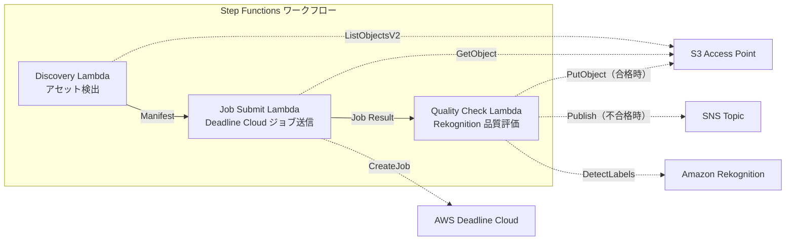

# UC4 : Médias — Pipeline de rendu VFX

🌐 **Language / 言語**: [日本語](README.md) | [English](README.en.md) | [한국어](README.ko.md) | [简体中文](README.zh-CN.md) | [繁體中文](README.zh-TW.md) | Français | [Deutsch](README.de.md) | [Español](README.es.md)

## Aperçu
Voici un workflow sans serveur qui utilise les points d'accès S3 de FSx for NetApp ONTAP pour l'envoi automatique de travaux de rendu VFX, les contrôles de qualité et l'écriture des sorties approuvées.
### Cas où ce modèle est approprié
- VFX / アニメーション制作で FSx ONTAP をレンダリングストレージとして使用している
- レンダリング完了後の品質チェックを自動化し、手動レビューの負荷を軽減したい
- 品質合格したアセットを自動的にファイルサーバーに書き戻したい（S3 AP PutObject）
- Deadline Cloud と既存の NAS ストレージを統合したパイプラインを構築したい
### Cas où ce modèle ne convient pas
- Nécessité d'un démarrage immédiat du travail de rendu (déclencheur de sauvegarde de fichier)
- Utilisation d'une ferme de rendu autre que Deadline Cloud (par exemple Thinkbox Deadline sur site)
- Sortie de rendu dépassant 5 Go (limite de S3 AP PutObject)
- Nécessité d'un modèle d'évaluation de la qualité d'image propriétaire pour le contrôle qualité (la détection d'étiquettes de Rekognition est insuffisante)
### Principales fonctionnalités
- Détection automatique des assets à rendre via S3 AP
- Envoi automatique des travaux de rendu vers AWS Deadline Cloud
- Évaluation de la qualité par Amazon Rekognition (résolution, artefacts, cohérence des couleurs)
- En cas de réussite de la qualité, utilisation de PutObject pour FSx ONTAP via S3 AP, sinon notification par SNS
## Architecture



### Étapes du flux de travail
1. **Découverte** : Détecter les assets à rendre à partir de S3 AP et générer un Manifest
2. **Soumission de tâche** : Récupérer les assets via S3 AP et envoyer un job de rendu à AWS Deadline Cloud
3. **Vérification de qualité** : Évaluer la qualité des résultats de rendu avec Rekognition. En cas de réussite, utiliser PutObject sur S3 AP, sinon déclencher une notification SNS pour un nouveau rendu
## Prérequis
- Compte AWS et permissions IAM appropriées
- Système de fichiers FSx for NetApp ONTAP (ONTAP 9.17.1P4D3 et supérieur)
- Volumes avec S3 Access Point activé
- Informations d'identification de l'API REST ONTAP enregistrées dans Secrets Manager
- VPC, sous-réseaux privés
- AWS Deadline Cloud Farm / Queue configuré
- Région où Amazon Rekognition est disponible
## Étapes de déploiement

### 1. Préparation des paramètres
Avant le déploiement, veuillez vérifier les valeurs suivantes :

- FSx ONTAP S3 Access Point Alias
- ONTAP 管理 IP アドレス
- Secrets Manager シークレット名
- AWS Deadline Cloud Farm ID / Queue ID
- VPC ID、プライベートサブネット ID
### 2. Déploiement CloudFormation

```bash
aws cloudformation deploy \
  --template-file media-vfx/template.yaml \
  --stack-name fsxn-media-vfx \
  --parameter-overrides \
    S3AccessPointAlias=<your-volume-ext-s3alias> \
    S3AccessPointName=<your-s3ap-name> \
    S3AccessPointOutputAlias=<your-output-volume-ext-s3alias> \
    OntapSecretName=<your-ontap-secret-name> \
    OntapManagementIp=<your-ontap-management-ip> \
    ScheduleExpression="rate(1 hour)" \
    VpcId=<your-vpc-id> \
    PrivateSubnetIds=<subnet-1>,<subnet-2> \
    NotificationEmail=<your-email@example.com> \
    DeadlineFarmId=<your-deadline-farm-id> \
    DeadlineQueueId=<your-deadline-queue-id> \
    QualityThreshold=80.0 \
    EnableVpcEndpoints=false \
    EnableCloudWatchAlarms=false \
  --capabilities CAPABILITY_IAM CAPABILITY_AUTO_EXPAND \
  --region ap-northeast-1
```
> **Remarque** : Remplacez les espaces réservés `<...>` par les valeurs d'environnement appropriées.
### 3. Vérification de l'abonnement SNS
Après le déploiement, un e-mail de confirmation de l'abonnement SNS sera envoyé à l'adresse e-mail spécifiée.

> **Remarque** : l'omission de `S3AccessPointName` peut entraîner une politique IAM basée uniquement sur les alias et une erreur `AccessDenied`. Il est recommandé de spécifier cela dans un environnement de production. Pour plus de détails, consultez le [guide de dépannage](../docs/guides/troubleshooting-guide.md#1-accessdenied-エラー).
## Liste des paramètres de configuration

| パラメータ | 説明 | デフォルト | 必須 |
|-----------|------|----------|------|
| `S3AccessPointAlias` | FSx ONTAP S3 AP Alias（入力用） | — | ✅ |
| `S3AccessPointName` | S3 AP 名（ARN ベースの IAM 権限付与用。省略時は Alias ベースのみ） | `""` | ⚠️ 推奨 |
| `S3AccessPointOutputAlias` | FSx ONTAP S3 AP Alias（出力用） | — | ✅ |
| `OntapSecretName` | ONTAP 認証情報の Secrets Manager シークレット名 | — | ✅ |
| `OntapManagementIp` | ONTAP クラスタ管理 IP アドレス | — | ✅ |
| `ScheduleExpression` | EventBridge Scheduler のスケジュール式 | `rate(1 hour)` | |
| `VpcId` | VPC ID | — | ✅ |
| `PrivateSubnetIds` | プライベートサブネット ID リスト | — | ✅ |
| `NotificationEmail` | SNS 通知先メールアドレス | — | ✅ |
| `DeadlineFarmId` | AWS Deadline Cloud Farm ID | — | ✅ |
| `DeadlineQueueId` | AWS Deadline Cloud Queue ID | — | ✅ |
| `QualityThreshold` | Rekognition 品質評価の閾値（0.0〜100.0） | `80.0` | |
| `EnableVpcEndpoints` | Interface VPC Endpoints の有効化 | `false` | |
| `EnableCloudWatchAlarms` | CloudWatch Alarms の有効化 | `false` | |
| `EnableSnapStart` | Activer Lambda SnapStart (réduction du démarrage à froid) | `false` | |

## Structure des coûts

### Basé sur les requêtes (facturation à l'usage)

| サービス | 課金単位 | 概算（100 アセット/月） |
|---------|---------|----------------------|
| Lambda | リクエスト数 + 実行時間 | ~$0.01 |
| Step Functions | ステート遷移数 | 無料枠内 |
| S3 API | リクエスト数 | ~$0.01 |
| Rekognition | 画像数 | ~$0.10 |
| Deadline Cloud | レンダリング時間 | 別途見積もり※ |
※ Le coût d'AWS Deadline Cloud dépend de la taille et de la durée des travaux de rendu.
### Exploitation permanente (facultatif)

| サービス | パラメータ | 月額 |
|---------|-----------|------|
| Interface VPC Endpoints | `EnableVpcEndpoints=true` | ~$28.80 |
| CloudWatch Alarms | `EnableCloudWatchAlarms=true` | ~$0.20 |
> Dans les environnements de démonstration/PoC, ils sont disponibles à un coût variable à partir de **environ 0,12 $/mois** (à l'exclusion de Deadline Cloud).
## Nettoyage

```bash
# CloudFormation スタックの削除
aws cloudformation delete-stack \
  --stack-name fsxn-media-vfx \
  --region ap-northeast-1

# 削除完了を待機
aws cloudformation wait stack-delete-complete \
  --stack-name fsxn-media-vfx \
  --region ap-northeast-1
```
> **Remarque** : La suppression de la pile peut échouer si des objets restent dans le compartiment S3. Assurez-vous de vider le compartiment au préalable.
## Régions prises en charge
UC4 utilise les services suivants :
| サービス | リージョン制約 |
|---------|-------------|
| Amazon Rekognition | ほぼ全リージョンで利用可能 |
| AWS Deadline Cloud | 対応リージョンが限定的（[Deadline Cloud 対応リージョン](https://docs.aws.amazon.com/general/latest/gr/deadline-cloud.html)） |
| AWS X-Ray | ほぼ全リージョンで利用可能 |
| CloudWatch EMF | ほぼ全リージョンで利用可能 |
> Pour plus de détails, consultez la [Matrice de compatibilité régionale](../docs/region-compatibility.md).
## Liens de référence

### Documentation officielle AWS
- [Points d'accès S3 d'Amazon FSx pour NetApp ONTAP](https://docs.aws.amazon.com/fsx/latest/ONTAPGuide/accessing-data-via-s3-access-points.html)
- [Streaming avec CloudFront (Tutoriel officiel)](https://docs.aws.amazon.com/fsx/latest/ONTAPGuide/tutorial-stream-video-with-cloudfront.html)
- [Traitement sans serveur avec Lambda (Tutoriel officiel)](https://docs.aws.amazon.com/fsx/latest/ONTAPGuide/tutorial-process-files-with-lambda.html)
- [Référence API Deadline Cloud](https://docs.aws.amazon.com/deadline-cloud/latest/APIReference/Welcome.html)
- [API DetectLabels de Rekognition](https://docs.aws.amazon.com/rekognition/latest/dg/API_DetectLabels.html)
### Article de blog AWS
- [Blog de lancement S3 AP](https://aws.amazon.com/blogs/aws/amazon-fsx-for-netapp-ontap-now-integrates-with-amazon-s3-for-seamless-data-access/)
- [3 modèles d'architecture sans serveur](https://aws.amazon.com/blogs/storage/bridge-legacy-and-modern-applications-with-amazon-s3-access-points-for-amazon-fsx/)
### Exemple GitHub
- [aws-samples/amazon-rekognition-serverless-large-scale-image-and-video-processing](https://github.com/aws-samples/amazon-rekognition-serverless-large-scale-image-and-video-processing) — Rekognition Traitement à grande échelle
- [aws-samples/dotnet-serverless-imagerecognition](https://github.com/aws-samples/dotnet-serverless-imagerecognition) — Step Functions + Rekognition
- [aws-samples/serverless-patterns](https://github.com/aws-samples/serverless-patterns) — Recueil de modèles sans serveur
## Environnements validés

| 項目 | 値 |
|------|-----|
| AWS リージョン | ap-northeast-1 (東京) |
| FSx ONTAP バージョン | ONTAP 9.17.1P4D3 |
| FSx 構成 | SINGLE_AZ_1 |
| Python | 3.12 |
| デプロイ方式 | CloudFormation (標準) |

## Architecture de configuration VPC pour Lambda
En fonction des résultats de la vérification, les fonctions Lambda sont déployées à l'intérieur/à l'extérieur du VPC.

**Lambda dans le VPC** (uniquement les fonctions nécessitant l'accès à l'API REST ONTAP) :
- Discovery Lambda — S3 AP + API ONTAP

**Lambda en dehors du VPC** (utilisant uniquement les API des services gérés par AWS) :
- Toutes les autres fonctions Lambda

> **Raison**: Pour accéder aux API des services gérés par AWS (Athena, Bedrock, Textract, etc.) à partir d'une fonction Lambda dans le VPC, il faut un point de terminaison de VPC Interface (chacun à 7,20 $/mois). Les fonctions Lambda en dehors du VPC peuvent accéder directement aux API AWS via Internet, sans frais supplémentaires.

> **Remarque**: Pour les UC (UC1 Juridique & Conformité) utilisant l'API REST ONTAP, `EnableVpcEndpoints=true` est obligatoire. Ceci est nécessaire pour obtenir les informations d'identification ONTAP via le point de terminaison VPC de Secrets Manager.