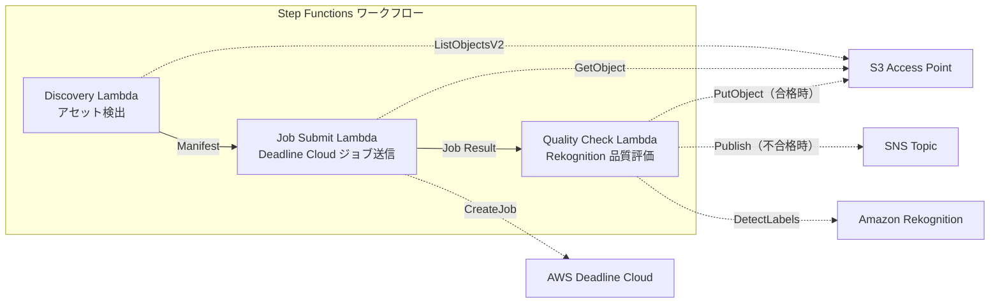

# UC4: 미디어 — VFX 렌더링 파이프라인

🌐 **Language / 言語**: [日本語](README.md) | [English](README.en.md) | 한국어 | [简体中文](README.zh-CN.md) | [繁體中文](README.zh-TW.md) | [Français](README.fr.md) | [Deutsch](README.de.md) | [Español](README.es.md)

## 개요
FSx for NetApp ONTAP의 S3 Access Points를 활용하여 VFX 렌더링 작업의 자동 제출, 품질 검사 및 승인된 출력의 반환을 수행하는 서버리스 워크플로입니다.
### 이 패턴이 적합한 경우
- VFX / 애니메이션 제작에서 FSx ONTAP를 렌더링 스토리지로 사용하고 있습니다
- 렌더링 완료 후 품질 검사를 자동화하여 수동 검토의 부담을 줄이고 싶습니다
- 품질 통과한 자산을 자동으로 파일 서버에 다시 쓰고 싶습니다 (S3 AP PutObject)
- Deadline Cloud와 기존 NAS 스토리지를 통합한 파이프라인을 구축하고 싶습니다
### 이 패턴이 적합하지 않은 경우
- 렌더링 작업의 즉시 시작(파일 저장 트리거)이 필요
- Deadline Cloud 외의 렌더링 팜(Thinkbox Deadline 온프레 등)을 사용
- 렌더링 출력이 5 GB를 초과(S3 AP PutObject의 제한)
- 품질 검사에 고유한 화질 평가 모델이 필요(Rekognition의 라벨 감지로는 부족)
### 주요 기능
- S3 AP를 통해 렌더링할 대상 자산을 자동 검출
- AWS Deadline Cloud로 렌더링 작업 자동 전송
- Amazon Rekognition을 통한 품질 평가 (해상도, 아티팩트, 색상 일관성)
- 품질 통과 시 S3 AP를 통해 FSx ONTAP에 PutObject, 불합격 시 SNS 알림
## 아키텍처



### 워크플로우 단계
1. **Discovery**: S3 AP에서 렌더링 대상 에셋을 검색하고 Manifest 생성
2. **Job Submit**: S3 AP를 통해 에셋을 가져와 AWS Deadline Cloud에 렌더링 작업 제출
3. **Quality Check**: Rekognition으로 렌더링 결과의 품질을 평가. 통과 시 S3 AP에 PutObject, 불합격 시 SNS 알림으로 재렌더링 플래그
## 전제 조건
- AWS 계정과 적절한 IAM 권한
- NetApp ONTAP용 FSx 파일 시스템(ONTAP 9.17.1P4D3 이상)
- S3 Access Point가 활성화된 볼륨
- ONTAP REST API 인증 정보가 Secrets Manager에 등록됨
- VPC, 프라이빗 서브넷
- AWS Deadline Cloud Farm / Queue가 설정됨
- Amazon Rekognition이 사용 가능한 리전
## 배포 절차

### 1. 파라미터 준비
배포 전에 다음 값을 확인하십시오:

- FSx ONTAP S3 액세스 포인트 별칭
- ONTAP 관리 IP 주소
- Secrets Manager 시크릿 이름
- AWS Deadline Cloud Farm ID / Queue ID
- VPC ID, 프라이빗 서브넷 ID
### 2. CloudFormation 배포

```bash
aws cloudformation deploy \
  --template-file media-vfx/template.yaml \
  --stack-name fsxn-media-vfx \
  --parameter-overrides \
    S3AccessPointAlias=<your-volume-ext-s3alias> \
    S3AccessPointName=<your-s3ap-name> \
    S3AccessPointOutputAlias=<your-output-volume-ext-s3alias> \
    OntapSecretName=<your-ontap-secret-name> \
    OntapManagementIp=<your-ontap-management-ip> \
    ScheduleExpression="rate(1 hour)" \
    VpcId=<your-vpc-id> \
    PrivateSubnetIds=<subnet-1>,<subnet-2> \
    NotificationEmail=<your-email@example.com> \
    DeadlineFarmId=<your-deadline-farm-id> \
    DeadlineQueueId=<your-deadline-queue-id> \
    QualityThreshold=80.0 \
    EnableVpcEndpoints=false \
    EnableCloudWatchAlarms=false \
  --capabilities CAPABILITY_IAM CAPABILITY_AUTO_EXPAND \
  --region ap-northeast-1
```
> **주의**: `<...>` 플레이스홀더를 실제 환경 값으로 바꾸어 주세요.
### 3. SNS 구독 확인
배포 후, 지정한 이메일 주소로 SNS 구독 확인 이메일이 도착합니다.

> **주의**: `S3AccessPointName`을 생략하면, IAM 정책이 별칭 기반만 되어 `AccessDenied` 오류가 발생할 수 있습니다. 운영 환경에서는 지정을 권장합니다. 자세한 내용은 [트러블슈팅 가이드](../docs/guides/troubleshooting-guide.md#1-accessdenied-에러)를 참조하세요.
## 설정 파라미터 목록

| パラメータ | 説明 | デフォルト | 必須 |
|-----------|------|----------|------|
| `S3AccessPointAlias` | FSx ONTAP S3 AP Alias（入力用） | — | ✅ |
| `S3AccessPointName` | S3 AP 名（ARN ベースの IAM 権限付与用。省略時は Alias ベースのみ） | `""` | ⚠️ 推奨 |
| `S3AccessPointOutputAlias` | FSx ONTAP S3 AP Alias（出力用） | — | ✅ |
| `OntapSecretName` | ONTAP 認証情報の Secrets Manager シークレット名 | — | ✅ |
| `OntapManagementIp` | ONTAP クラスタ管理 IP アドレス | — | ✅ |
| `ScheduleExpression` | EventBridge Scheduler のスケジュール式 | `rate(1 hour)` | |
| `VpcId` | VPC ID | — | ✅ |
| `PrivateSubnetIds` | プライベートサブネット ID リスト | — | ✅ |
| `NotificationEmail` | SNS 通知先メールアドレス | — | ✅ |
| `DeadlineFarmId` | AWS Deadline Cloud Farm ID | — | ✅ |
| `DeadlineQueueId` | AWS Deadline Cloud Queue ID | — | ✅ |
| `QualityThreshold` | Rekognition 品質評価の閾値（0.0〜100.0） | `80.0` | |
| `EnableVpcEndpoints` | Interface VPC Endpoints の有効化 | `false` | |
| `EnableCloudWatchAlarms` | CloudWatch Alarms の有効化 | `false` | |
| `EnableSnapStart` | Lambda SnapStart 활성화 (콜드 스타트 단축) | `false` | |

## 비용 구조

### 요청 기반(사용량 기반)

| サービス | 課金単位 | 概算（100 アセット/月） |
|---------|---------|----------------------|
| Lambda | リクエスト数 + 実行時間 | ~$0.01 |
| Step Functions | ステート遷移数 | 無料枠内 |
| S3 API | リクエスト数 | ~$0.01 |
| Rekognition | 画像数 | ~$0.10 |
| Deadline Cloud | レンダリング時間 | 別途見積もり※ |
※ AWS Deadline Cloud의 비용은 렌더링 작업의 규모와 시간에 따라 다릅니다.
### 상시 운영 (옵셔널)

| サービス | パラメータ | 月額 |
|---------|-----------|------|
| Interface VPC Endpoints | `EnableVpcEndpoints=true` | ~$28.80 |
| CloudWatch Alarms | `EnableCloudWatchAlarms=true` | ~$0.20 |
> 데모/PoC 환경에서는 가변 비용만으로 **월 ~0.12달러**부터 사용할 수 있습니다(Deadline Cloud 제외).
## 정리

```bash
# CloudFormation スタックの削除
aws cloudformation delete-stack \
  --stack-name fsxn-media-vfx \
  --region ap-northeast-1

# 削除完了を待機
aws cloudformation wait stack-delete-complete \
  --stack-name fsxn-media-vfx \
  --region ap-northeast-1
```
> **주의**: S3 버킷에 객체가 남아 있으면 스택 삭제가 실패할 수 있습니다. 미리 버킷을 비워주세요.
## 지원되는 리전
UC4는 다음 서비스를 사용합니다: Amazon Bedrock, AWS Step Functions, Amazon Athena, Amazon S3, AWS Lambda, Amazon FSx for NetApp ONTAP, Amazon CloudWatch, AWS CloudFormation 등.
| サービス | リージョン制約 |
|---------|-------------|
| Amazon Rekognition | ほぼ全リージョンで利用可能 |
| AWS Deadline Cloud | 対応リージョンが限定的（[Deadline Cloud 対応リージョン](https://docs.aws.amazon.com/general/latest/gr/deadline-cloud.html)） |
| AWS X-Ray | ほぼ全リージョンで利用可能 |
| CloudWatch EMF | ほぼ全リージョンで利用可能 |
> 자세한 내용은 [리전 호환성 매트릭스](../docs/region-compatibility.md)를 참조하세요.
## 참고 링크

### AWS 공식 문서
- [FSx ONTAP S3 액세스 포인트 개요](https://docs.aws.amazon.com/fsx/latest/ONTAPGuide/accessing-data-via-s3-access-points.html)
- [CloudFront으로 스트리밍(공식 튜토리얼)](https://docs.aws.amazon.com/fsx/latest/ONTAPGuide/tutorial-stream-video-with-cloudfront.html)
- [Lambda로 서버리스 처리(공식 튜토리얼)](https://docs.aws.amazon.com/fsx/latest/ONTAPGuide/tutorial-process-files-with-lambda.html)
- [Deadline Cloud API 참조](https://docs.aws.amazon.com/deadline-cloud/latest/APIReference/Welcome.html)
- [Rekognition DetectLabels API](https://docs.aws.amazon.com/rekognition/latest/dg/API_DetectLabels.html)
### AWS 블로그 게시물
- [S3 AP 발표 블로그](https://aws.amazon.com/blogs/aws/amazon-fsx-for-netapp-ontap-now-integrates-with-amazon-s3-for-seamless-data-access/)
- [3가지 서버리스 아키텍처 패턴](https://aws.amazon.com/blogs/storage/bridge-legacy-and-modern-applications-with-amazon-s3-access-points-for-amazon-fsx/)
### GitHub 샘플
- [aws-samples/amazon-rekognition-serverless-large-scale-image-and-video-processing](https://github.com/aws-samples/amazon-rekognition-serverless-large-scale-image-and-video-processing) — Rekognition 대규모 처리
- [aws-samples/dotnet-serverless-imagerecognition](https://github.com/aws-samples/dotnet-serverless-imagerecognition) — Step Functions + Rekognition
- [aws-samples/serverless-patterns](https://github.com/aws-samples/serverless-patterns) — 서버리스 패턴 모음
## 검증된 환경

| 項目 | 値 |
|------|-----|
| AWS リージョン | ap-northeast-1 (東京) |
| FSx ONTAP バージョン | ONTAP 9.17.1P4D3 |
| FSx 構成 | SINGLE_AZ_1 |
| Python | 3.12 |
| デプロイ方式 | CloudFormation (標準) |

## Lambda VPC 구성 아키텍처
검증 결과에 따라, Lambda 함수는 VPC 내부/외부로 분리하여 배치되었습니다.

**VPC 내 Lambda** (ONTAP REST API 액세스가 필요한 함수만):
- Discovery Lambda — S3 AP + ONTAP API

**VPC 외 Lambda** (AWS 관리형 서비스 API만 사용):
- 기타 모든 Lambda 함수

> **이유**: VPC 내 Lambda에서 AWS 관리형 서비스 API (Athena, Bedrock, Textract 등)에 접근하려면 Interface VPC Endpoint가 필요합니다 (월 $7.20). VPC 외 Lambda는 인터넷을 통해 AWS API에 직접 접근할 수 있으며, 추가 비용 없이 작동합니다.

> **주의**: ONTAP REST API를 사용하는 UC (UC1 법무 및 규정 준수)의 경우 `EnableVpcEndpoints=true`가 필수입니다. Secrets Manager VPC Endpoint를 통해 ONTAP 인증 정보를 가져오기 때문입니다.