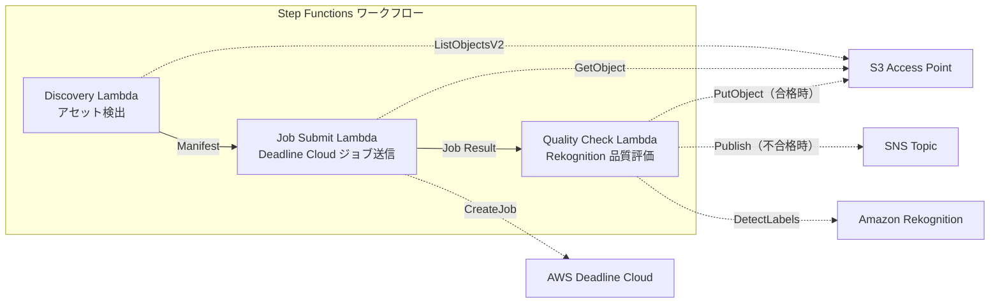

# UC4: メディア — VFX レンダリングパイプライン

## 概要

FSx for NetApp ONTAP の S3 Access Points を活用し、VFX レンダリングジョブの自動送信、品質チェック、承認済み出力の書き戻しを行うサーバーレスワークフローです。

### このパターンが適しているケース

- VFX / アニメーション制作で FSx ONTAP をレンダリングストレージとして使用している
- レンダリング完了後の品質チェックを自動化し、手動レビューの負荷を軽減したい
- 品質合格したアセットを自動的にファイルサーバーに書き戻したい（S3 AP PutObject）
- Deadline Cloud と既存の NAS ストレージを統合したパイプラインを構築したい

### このパターンが適さないケース

- レンダリングジョブの即時キック（ファイル保存トリガー）が必要
- Deadline Cloud 以外のレンダリングファーム（Thinkbox Deadline オンプレ等）を使用
- レンダリング出力が 5 GB を超える（S3 AP PutObject の上限）
- 品質チェックに独自の画質評価モデルが必要（Rekognition のラベル検出では不十分）

### 主な機能

- S3 AP 経由でレンダリング対象アセットを自動検出
- AWS Deadline Cloud へのレンダリングジョブ自動送信
- Amazon Rekognition による品質評価（解像度、アーティファクト、色一貫性）
- 品質合格時は S3 AP 経由で FSx ONTAP に PutObject、不合格時は SNS 通知

## アーキテクチャ



### ワークフローステップ

1. **Discovery**: S3 AP からレンダリング対象アセットを検出し、Manifest を生成
2. **Job Submit**: S3 AP 経由でアセットを取得し、AWS Deadline Cloud にレンダリングジョブを送信
3. **Quality Check**: Rekognition でレンダリング結果の品質を評価。合格時は S3 AP に PutObject、不合格時は SNS 通知で再レンダリングをフラグ

## 前提条件

- AWS アカウントと適切な IAM 権限
- FSx for NetApp ONTAP ファイルシステム（ONTAP 9.17.1P4D3 以上）
- S3 Access Point が有効化されたボリューム
- ONTAP REST API 認証情報が Secrets Manager に登録済み
- VPC、プライベートサブネット
- AWS Deadline Cloud Farm / Queue が設定済み
- Amazon Rekognition が利用可能なリージョン

## デプロイ手順

### 1. パラメータの準備

デプロイ前に以下の値を確認してください:

- FSx ONTAP S3 Access Point Alias
- ONTAP 管理 IP アドレス
- Secrets Manager シークレット名
- AWS Deadline Cloud Farm ID / Queue ID
- VPC ID、プライベートサブネット ID

### 2. CloudFormation デプロイ

```bash
aws cloudformation deploy \
  --template-file media-vfx/template.yaml \
  --stack-name fsxn-media-vfx \
  --parameter-overrides \
    S3AccessPointAlias=<your-volume-ext-s3alias> \
    S3AccessPointOutputAlias=<your-output-volume-ext-s3alias> \
    OntapSecretName=<your-ontap-secret-name> \
    OntapManagementIp=<your-ontap-management-ip> \
    ScheduleExpression="rate(1 hour)" \
    VpcId=<your-vpc-id> \
    PrivateSubnetIds=<subnet-1>,<subnet-2> \
    NotificationEmail=<your-email@example.com> \
    DeadlineFarmId=<your-deadline-farm-id> \
    DeadlineQueueId=<your-deadline-queue-id> \
    QualityThreshold=80.0 \
    EnableVpcEndpoints=false \
    EnableCloudWatchAlarms=false \
  --capabilities CAPABILITY_IAM CAPABILITY_AUTO_EXPAND \
  --region ap-northeast-1
```

> **注意**: `<...>` のプレースホルダーを実際の環境値に置き換えてください。

### 3. SNS サブスクリプションの確認

デプロイ後、指定したメールアドレスに SNS サブスクリプション確認メールが届きます。

## 設定パラメータ一覧

| パラメータ | 説明 | デフォルト | 必須 |
|-----------|------|----------|------|
| `S3AccessPointAlias` | FSx ONTAP S3 AP Alias（入力用） | — | ✅ |
| `S3AccessPointOutputAlias` | FSx ONTAP S3 AP Alias（出力用） | — | ✅ |
| `OntapSecretName` | ONTAP 認証情報の Secrets Manager シークレット名 | — | ✅ |
| `OntapManagementIp` | ONTAP クラスタ管理 IP アドレス | — | ✅ |
| `ScheduleExpression` | EventBridge Scheduler のスケジュール式 | `rate(1 hour)` | |
| `VpcId` | VPC ID | — | ✅ |
| `PrivateSubnetIds` | プライベートサブネット ID リスト | — | ✅ |
| `NotificationEmail` | SNS 通知先メールアドレス | — | ✅ |
| `DeadlineFarmId` | AWS Deadline Cloud Farm ID | — | ✅ |
| `DeadlineQueueId` | AWS Deadline Cloud Queue ID | — | ✅ |
| `QualityThreshold` | Rekognition 品質評価の閾値（0.0〜100.0） | `80.0` | |
| `EnableVpcEndpoints` | Interface VPC Endpoints の有効化 | `false` | |
| `EnableCloudWatchAlarms` | CloudWatch Alarms の有効化 | `false` | |

## コスト構造

### リクエストベース（従量課金）

| サービス | 課金単位 | 概算（100 アセット/月） |
|---------|---------|----------------------|
| Lambda | リクエスト数 + 実行時間 | ~$0.01 |
| Step Functions | ステート遷移数 | 無料枠内 |
| S3 API | リクエスト数 | ~$0.01 |
| Rekognition | 画像数 | ~$0.10 |
| Deadline Cloud | レンダリング時間 | 別途見積もり※ |

※ AWS Deadline Cloud のコストはレンダリングジョブの規模・時間に依存します。

### 常時稼働（オプショナル）

| サービス | パラメータ | 月額 |
|---------|-----------|------|
| Interface VPC Endpoints | `EnableVpcEndpoints=true` | ~$28.80 |
| CloudWatch Alarms | `EnableCloudWatchAlarms=true` | ~$0.20 |

> デモ/PoC 環境では変動費のみで **~$0.12/月**（Deadline Cloud 除く）から利用可能です。

## クリーンアップ

```bash
# CloudFormation スタックの削除
aws cloudformation delete-stack \
  --stack-name fsxn-media-vfx \
  --region ap-northeast-1

# 削除完了を待機
aws cloudformation wait stack-delete-complete \
  --stack-name fsxn-media-vfx \
  --region ap-northeast-1
```

> **注意**: S3 バケットにオブジェクトが残っている場合、スタック削除が失敗することがあります。事前にバケットを空にしてください。

## Supported Regions

UC4 は以下のサービスを使用します:

| サービス | リージョン制約 |
|---------|-------------|
| Amazon Rekognition | ほぼ全リージョンで利用可能 |
| AWS Deadline Cloud | 対応リージョンが限定的（[Deadline Cloud 対応リージョン](https://docs.aws.amazon.com/general/latest/gr/deadline-cloud.html)） |
| AWS X-Ray | ほぼ全リージョンで利用可能 |
| CloudWatch EMF | ほぼ全リージョンで利用可能 |

> 詳細は [リージョン互換性マトリックス](../docs/region-compatibility.md) を参照。

## 参考リンク

### AWS 公式ドキュメント

- [FSx ONTAP S3 Access Points 概要](https://docs.aws.amazon.com/fsx/latest/ONTAPGuide/accessing-data-via-s3-access-points.html)
- [CloudFront でストリーミング（公式チュートリアル）](https://docs.aws.amazon.com/fsx/latest/ONTAPGuide/tutorial-stream-video-with-cloudfront.html)
- [Lambda でサーバーレス処理（公式チュートリアル）](https://docs.aws.amazon.com/fsx/latest/ONTAPGuide/tutorial-process-files-with-lambda.html)
- [Deadline Cloud API リファレンス](https://docs.aws.amazon.com/deadline-cloud/latest/APIReference/Welcome.html)
- [Rekognition DetectLabels API](https://docs.aws.amazon.com/rekognition/latest/dg/API_DetectLabels.html)

### AWS ブログ記事

- [S3 AP 発表ブログ](https://aws.amazon.com/blogs/aws/amazon-fsx-for-netapp-ontap-now-integrates-with-amazon-s3-for-seamless-data-access/)
- [3 つのサーバーレスアーキテクチャパターン](https://aws.amazon.com/blogs/storage/bridge-legacy-and-modern-applications-with-amazon-s3-access-points-for-amazon-fsx/)

### GitHub サンプル

- [aws-samples/amazon-rekognition-serverless-large-scale-image-and-video-processing](https://github.com/aws-samples/amazon-rekognition-serverless-large-scale-image-and-video-processing) — Rekognition 大規模処理
- [aws-samples/dotnet-serverless-imagerecognition](https://github.com/aws-samples/dotnet-serverless-imagerecognition) — Step Functions + Rekognition
- [aws-samples/serverless-patterns](https://github.com/aws-samples/serverless-patterns) — サーバーレスパターン集


## 検証済み環境

| 項目 | 値 |
|------|-----|
| AWS リージョン | ap-northeast-1 (東京) |
| FSx ONTAP バージョン | ONTAP 9.17.1P4D3 |
| FSx 構成 | SINGLE_AZ_1 |
| Python | 3.12 |
| デプロイ方式 | CloudFormation (標準) |

## Lambda VPC 配置アーキテクチャ

検証で得た知見に基づき、Lambda 関数は VPC 内/外に分離配置されています。

**VPC 内 Lambda**（ONTAP REST API アクセスが必要な関数のみ）:
- Discovery Lambda — S3 AP + ONTAP API

**VPC 外 Lambda**（AWS マネージドサービス API のみ使用）:
- その他の全 Lambda 関数

> **理由**: VPC 内 Lambda から AWS マネージドサービス API（Athena, Bedrock, Textract 等）にアクセスするには Interface VPC Endpoint が必要（各 $7.20/月）。VPC 外 Lambda はインターネット経由で直接 AWS API にアクセスでき、追加コストなしで動作します。

> **注意**: ONTAP REST API を使用する UC（UC1 法務・コンプライアンス）では `EnableVpcEndpoints=true` が必須です。Secrets Manager VPC Endpoint 経由で ONTAP 認証情報を取得するためです。
