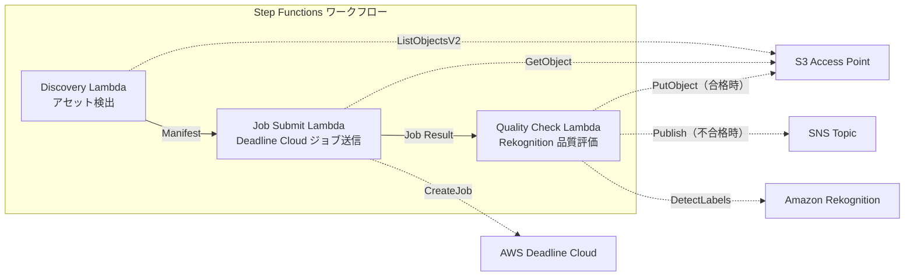

# UC4：媒体 — VFX 渲染管道

🌐 **Language / 言語**: [日本語](README.md) | [English](README.en.md) | [한국어](README.ko.md) | 简体中文 | [繁體中文](README.zh-TW.md) | [Français](README.fr.md) | [Deutsch](README.de.md) | [Español](README.es.md)

## 概述
利用 FSx for NetApp ONTAP 的 S3 Access Points，实现 VFX 渲染作业的自动提交、质量检查和已批准输出的写回的无服务器工作流。
### 适用情况

1. このパターンは、複数のAWSサービスを連携して使用する必要がある場合に適しています。
2. 特に、Amazon Bedrock、AWS Step Functions、Amazon Athena、Amazon S3、AWS Lambda、Amazon FSx for NetApp ONTAP、Amazon CloudWatch、AWS CloudFormationなどを使用している場合。
3. GDSII、DRC、OASIS、GDS、Lambda、tapeoutなどの技術术语也适用于该模式。
- 在VFX / 动画制作中，使用FSx ONTAP作为渲染存储
- 希望自动化完成渲染后的质量检查，减少手动审核的负担
- 希望将通过质量检查的资产自动写回文件服务器（S3 AP PutObject）
- 希望构建一个将Deadline Cloud与现有NAS存储集成的管道
### 不适用的情况
- 需要立即触发渲染作业（文件保存触发）
- 使用 Deadline Cloud 以外的渲染场（如 Thinkbox Deadline 本地部署）
- 渲染输出超过 5 GB（超过 S3 AP PutObject 的限制）
- 质量检查需要自定义的图像质量评估模型（Rekognition 的标签检测不够用）
### 主要功能
- 通过 S3 AP 自动检测渲染目标资产
- 自动提交渲染作业到 AWS Deadline Cloud
- 使用 Amazon Rekognition 进行质量评估（分辨率、伪影、色彩一致性）
- 质量通过时通过 S3 AP 向 FSx ONTAP 发送 PutObject 请求，不合格时发送 SNS 通知
## 架构



### 工作流程步骤

使用Amazon Bedrock、AWS Step Functions、Amazon Athena、Amazon S3、AWS Lambda、Amazon FSx for NetApp ONTAP、Amazon CloudWatch、AWS CloudFormation等AWS服务时，请遵守以下规则：

- 保持AWS服务名称为英文（例如Amazon Bedrock、AWS Step Functions、Amazon Athena、Amazon S3、AWS Lambda、Amazon FSx for NetApp ONTAP、Amazon CloudWatch、AWS CloudFormation等）。
- 技术术语保持不变（例如GDSII、DRC、OASIS、GDS、Lambda、tapeout等）。
- 内联代码（例如`...`）保持不变。
- 文件路径和URL保持不变。
- 自然翻译，不逐字翻译。
1. **发现**：从 S3 AP 发现渲染目标资产，生成 Manifest
2. **作业提交**：通过 S3 AP 获取资产，将渲染作业提交到 AWS Deadline Cloud
3. **质量检查**：使用 Rekognition 评估渲染结果的质量。如果通过则将对象放入 S3 AP，如果不通过则通过 SNS 通知标记重新渲染
## 前提条件
- AWS 账户和适当的 IAM 权限
- FSx for NetApp ONTAP 文件系统（ONTAP 9.17.1P4D3 及以上）
- 已启用 S3 访问点的卷
- ONTAP REST API 凭证已在 Secrets Manager 中注册
- VPC、私有子网
- AWS Deadline 云农场 / 队列已设置
- Amazon Rekognition 可用的区域
## 部署步骤

### 1. 准备参数
部署之前请确认以下值：

- FSx ONTAP S3 访问点别名
- ONTAP 管理 IP 地址
- Secrets Manager 秘密名称
- AWS Deadline 云农场 ID / 队列 ID
- VPC ID、私有子网 ID
### 2. CloudFormation 部署

```bash
aws cloudformation deploy \
  --template-file media-vfx/template.yaml \
  --stack-name fsxn-media-vfx \
  --parameter-overrides \
    S3AccessPointAlias=<your-volume-ext-s3alias> \
    S3AccessPointName=<your-s3ap-name> \
    S3AccessPointOutputAlias=<your-output-volume-ext-s3alias> \
    OntapSecretName=<your-ontap-secret-name> \
    OntapManagementIp=<your-ontap-management-ip> \
    ScheduleExpression="rate(1 hour)" \
    VpcId=<your-vpc-id> \
    PrivateSubnetIds=<subnet-1>,<subnet-2> \
    NotificationEmail=<your-email@example.com> \
    DeadlineFarmId=<your-deadline-farm-id> \
    DeadlineQueueId=<your-deadline-queue-id> \
    QualityThreshold=80.0 \
    EnableVpcEndpoints=false \
    EnableCloudWatchAlarms=false \
  --capabilities CAPABILITY_IAM CAPABILITY_AUTO_EXPAND \
  --region ap-northeast-1
```
> **注意**: 请将 `<...>` 中的占位符替换为实际的环境值。
### 3. 确认 SNS 订阅
部署之后，会向指定的电子邮件地址发送 SNS 订阅确认邮件。

> **注意**: 如果省略 `S3AccessPointName`，IAM 策略可能只基于别名，从而导致 `AccessDenied` 错误。强烈建议在生产环境中进行指定。详情请参见 [故障排除指南](../docs/guides/troubleshooting-guide.md#1-accessdenied-错误)。
## 设置参数列表

| パラメータ | 説明 | デフォルト | 必須 |
|-----------|------|----------|------|
| `S3AccessPointAlias` | FSx ONTAP S3 AP Alias（入力用） | — | ✅ |
| `S3AccessPointName` | S3 AP 名（ARN ベースの IAM 権限付与用。省略時は Alias ベースのみ） | `""` | ⚠️ 推奨 |
| `S3AccessPointOutputAlias` | FSx ONTAP S3 AP Alias（出力用） | — | ✅ |
| `OntapSecretName` | ONTAP 認証情報の Secrets Manager シークレット名 | — | ✅ |
| `OntapManagementIp` | ONTAP クラスタ管理 IP アドレス | — | ✅ |
| `ScheduleExpression` | EventBridge Scheduler のスケジュール式 | `rate(1 hour)` | |
| `VpcId` | VPC ID | — | ✅ |
| `PrivateSubnetIds` | プライベートサブネット ID リスト | — | ✅ |
| `NotificationEmail` | SNS 通知先メールアドレス | — | ✅ |
| `DeadlineFarmId` | AWS Deadline Cloud Farm ID | — | ✅ |
| `DeadlineQueueId` | AWS Deadline Cloud Queue ID | — | ✅ |
| `QualityThreshold` | Rekognition 品質評価の閾値（0.0〜100.0） | `80.0` | |
| `EnableVpcEndpoints` | Interface VPC Endpoints の有効化 | `false` | |
| `EnableCloudWatchAlarms` | CloudWatch Alarms の有効化 | `false` | |
| `EnableSnapStart` | 启用 Lambda SnapStart（冷启动缩短） | `false` | |

## 成本结构

规则：
- 保持AWS服务名称为英文（Amazon Bedrock、AWS Step Functions、Amazon Athena、Amazon S3、AWS Lambda、Amazon FSx for NetApp ONTAP、Amazon CloudWatch、AWS CloudFormation等）。
- 技术术语保持不变（GDSII、DRC、OASIS、GDS、Lambda、tapeout等）。
- 保持内联代码（`...`）不变
- 保持文件路径和URL不变
- 自然翻译，不是逐字翻译
- 仅返回翻译文本，不附加解释

### 按需请求（按量计费）

| サービス | 課金単位 | 概算（100 アセット/月） |
|---------|---------|----------------------|
| Lambda | リクエスト数 + 実行時間 | ~$0.01 |
| Step Functions | ステート遷移数 | 無料枠内 |
| S3 API | リクエスト数 | ~$0.01 |
| Rekognition | 画像数 | ~$0.10 |
| Deadline Cloud | レンダリング時間 | 別途見積もり※ |
※ AWS Deadline Cloud 的成本取决于渲染作业的规模和时间。
### 常时运行（可选）

| サービス | パラメータ | 月額 |
|---------|-----------|------|
| Interface VPC Endpoints | `EnableVpcEndpoints=true` | ~$28.80 |
| CloudWatch Alarms | `EnableCloudWatchAlarms=true` | ~$0.20 |
> 在演示/概念验证环境中，仅需变动费用即可从 **每月约0.12美元** 开始使用（不包括Deadline Cloud）。
## 清理

```bash
# CloudFormation スタックの削除
aws cloudformation delete-stack \
  --stack-name fsxn-media-vfx \
  --region ap-northeast-1

# 削除完了を待機
aws cloudformation wait stack-delete-complete \
  --stack-name fsxn-media-vfx \
  --region ap-northeast-1
```
> **注意**: 如果 S3 存储桶中仍有对象，则删除堆栈可能会失败。请提前清空存储桶。
## 支持的区域
UC4 使用以下服务：
| サービス | リージョン制約 |
|---------|-------------|
| Amazon Rekognition | ほぼ全リージョンで利用可能 |
| AWS Deadline Cloud | 対応リージョンが限定的（[Deadline Cloud 対応リージョン](https://docs.aws.amazon.com/general/latest/gr/deadline-cloud.html)） |
| AWS X-Ray | ほぼ全リージョンで利用可能 |
| CloudWatch EMF | ほぼ全リージョンで利用可能 |
> 详情请参阅 [区域兼容性矩阵](../docs/region-compatibility.md)。
## 参考链接

### AWS 官方文档
- [FSx ONTAP S3 访问点概述](https://docs.aws.amazon.com/fsx/latest/ONTAPGuide/accessing-data-via-s3-access-points.html)
- [使用 CloudFront 进行流媒体（官方教程）](https://docs.aws.amazon.com/fsx/latest/ONTAPGuide/tutorial-stream-video-with-cloudfront.html)
- [使用 Lambda 进行无服务器处理（官方教程）](https://docs.aws.amazon.com/fsx/latest/ONTAPGuide/tutorial-process-files-with-lambda.html)
- [Deadline Cloud API 参考](https://docs.aws.amazon.com/deadline-cloud/latest/APIReference/Welcome.html)
- [Rekognition DetectLabels API](https://docs.aws.amazon.com/rekognition/latest/dg/API_DetectLabels.html)
### AWS 博客文章
- [S3 AP 发布博客](https://aws.amazon.com/blogs/aws/amazon-fsx-for-netapp-ontap-now-integrates-with-amazon-s3-for-seamless-data-access/)
- [3 种无服务器架构模式](https://aws.amazon.com/blogs/storage/bridge-legacy-and-modern-applications-with-amazon-s3-access-points-for-amazon-fsx/)
### GitHub 示例
- [aws-samples/amazon-rekognition-serverless-large-scale-image-and-video-processing](https://github.com/aws-samples/amazon-rekognition-serverless-large-scale-image-and-video-processing) — Rekognition 大规模处理
- [aws-samples/dotnet-serverless-imagerecognition](https://github.com/aws-samples/dotnet-serverless-imagerecognition) — Step Functions + Rekognition
- [aws-samples/serverless-patterns](https://github.com/aws-samples/serverless-patterns) — 无服务器模式集
## 已验证环境

| 項目 | 値 |
|------|-----|
| AWS リージョン | ap-northeast-1 (東京) |
| FSx ONTAP バージョン | ONTAP 9.17.1P4D3 |
| FSx 構成 | SINGLE_AZ_1 |
| Python | 3.12 |
| デプロイ方式 | CloudFormation (標準) |

## Lambda VPC 配置架构
根据验证中获得的见解，Lambda 函数被分为在 VPC 内/外分别部署。

**VPC 内 Lambda**（仅需要 ONTAP REST API 访问的函数）:
- Discovery Lambda — S3 AP + ONTAP API

**VPC 外 Lambda**（仅使用 AWS 托管服务 API）:
- 其他所有 Lambda 函数

> **原因**: 从 VPC 内 Lambda 访问 AWS 托管服务 API（Athena、Bedrock、Textract 等）需要 Interface VPC Endpoint（每个每月 $7.20）。VPC 外 Lambda 可以直接通过互联网访问 AWS API，无需额外费用即可运行。

> **注意**: 使用 ONTAP REST API 的 UC（UC1 法律和合规）需要 `EnableVpcEndpoints=true`。这是因为通过 Secrets Manager VPC Endpoint 获取 ONTAP 凭证。