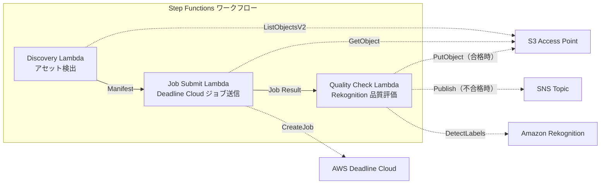

# UC4：媒體 — VFX 渲染管線

🌐 **Language / 言語**: [日本語](README.md) | [English](README.en.md) | [한국어](README.ko.md) | [简体中文](README.zh-CN.md) | 繁體中文 | [Français](README.fr.md) | [Deutsch](README.de.md) | [Español](README.es.md)

## 概述
利用 Amazon FSx for NetApp ONTAP 的 S3 Access Points，建立一個無伺服器工作流程，自動提交 VFX 渲染任務、進行質量檢查，並寫回已獲批准的輸出。
### 適用這種模式的情況
- 使用 FSx ONTAP 作為 VFX / 動畫製作的渲染儲存
- 自動化渲染完成後的品質檢查，減輕手動審查的負擔
- 將通過品質合格的資產自動寫回檔案伺服器（S3 AP PutObject）
- 希望建立一個將 Deadline Cloud 與現有 NAS 儲存整合的管線
### 此模式不適用的情況
- 需要即時啟動渲染作業（文件保存觸發）
- 使用非 Deadline Cloud 的渲染伺服器（如 Thinkbox Deadline 內部部署版）
- 渲染輸出超過 5 GB（超過 S3 AP PutObject 的上限）
- 質量檢查需要自有的影像質量評估模型（Rekognition 的標籤檢測不足）
### 主要功能
- 透過 S3 AP 自動檢測渲染目標資產
- 自動將渲染工作提交至 AWS Deadline Cloud
- 使用 Amazon Rekognition 進行品質評估（解析度、人為干擾、顏色一致性）
- 如果品質通過，透過 S3 AP 將物件放入 FSx ONTAP；如果不通過，則通知 SNS
## 架構



### 工作流程步驟
1. **發現**：從 S3 AP 發現需要渲染的資產，並生成 Manifest
2. **提交工作**：透過 S3 AP 獲取資產，然後將渲染工作提交到 AWS Deadline Cloud
3. **品質檢查**：使用 Rekognition 評估渲染結果的品質。如果合格，則將物件放入 S3 AP，不合格則使用 SNS 通知標記重新渲染
## 先決條件
- AWS 帳戶及適當的 IAM 權限
- FSx for NetApp ONTAP 文件系統（ONTAP 9.17.1P4D3 及以上）
- 已啟用 S3 Access Point 的卷
- ONTAP REST API 認證信息已在 Secrets Manager 中註冊
- VPC、私有子網
- AWS Deadline Cloud Farm / Queue 已設定
- 可用的 Amazon Rekognition 區域
## 部署步驟

### 1. 準備參數
部署前請確認以下值：

- FSx ONTAP S3 Access Point 別名
- ONTAP 管理 IP 地址
- Secrets Manager 秘密名稱
- AWS Deadline 雲端農場 ID / 佇列 ID
- VPC ID、私有子網 ID
### 2. CloudFormation 部署

```bash
aws cloudformation deploy \
  --template-file media-vfx/template.yaml \
  --stack-name fsxn-media-vfx \
  --parameter-overrides \
    S3AccessPointAlias=<your-volume-ext-s3alias> \
    S3AccessPointName=<your-s3ap-name> \
    S3AccessPointOutputAlias=<your-output-volume-ext-s3alias> \
    OntapSecretName=<your-ontap-secret-name> \
    OntapManagementIp=<your-ontap-management-ip> \
    ScheduleExpression="rate(1 hour)" \
    VpcId=<your-vpc-id> \
    PrivateSubnetIds=<subnet-1>,<subnet-2> \
    NotificationEmail=<your-email@example.com> \
    DeadlineFarmId=<your-deadline-farm-id> \
    DeadlineQueueId=<your-deadline-queue-id> \
    QualityThreshold=80.0 \
    EnableVpcEndpoints=false \
    EnableCloudWatchAlarms=false \
  --capabilities CAPABILITY_IAM CAPABILITY_AUTO_EXPAND \
  --region ap-northeast-1
```
> **注意**: 請將 `<...>` 的佔位符替換為實際的環境值。
### 3. 確認 SNS 訂閱
部署之後，您指定的電子郵件地址將會收到 SNS 訂閱確認郵件。

> **注意**: 如果省略 `S3AccessPointName`，IAM 政策可能僅基於別名，這可能會導致 `AccessDenied` 錯誤。建議在生產環境中指定。詳細資訊請參閱 [疑難排解指南](../docs/guides/troubleshooting-guide.md#1-accessdenied-錯誤)。
## 設定參數列表

| パラメータ | 説明 | デフォルト | 必須 |
|-----------|------|----------|------|
| `S3AccessPointAlias` | FSx ONTAP S3 AP Alias（入力用） | — | ✅ |
| `S3AccessPointName` | S3 AP 名（ARN ベースの IAM 権限付与用。省略時は Alias ベースのみ） | `""` | ⚠️ 推奨 |
| `S3AccessPointOutputAlias` | FSx ONTAP S3 AP Alias（出力用） | — | ✅ |
| `OntapSecretName` | ONTAP 認証情報の Secrets Manager シークレット名 | — | ✅ |
| `OntapManagementIp` | ONTAP クラスタ管理 IP アドレス | — | ✅ |
| `ScheduleExpression` | EventBridge Scheduler のスケジュール式 | `rate(1 hour)` | |
| `VpcId` | VPC ID | — | ✅ |
| `PrivateSubnetIds` | プライベートサブネット ID リスト | — | ✅ |
| `NotificationEmail` | SNS 通知先メールアドレス | — | ✅ |
| `DeadlineFarmId` | AWS Deadline Cloud Farm ID | — | ✅ |
| `DeadlineQueueId` | AWS Deadline Cloud Queue ID | — | ✅ |
| `QualityThreshold` | Rekognition 品質評価の閾値（0.0〜100.0） | `80.0` | |
| `EnableVpcEndpoints` | Interface VPC Endpoints の有効化 | `false` | |
| `EnableCloudWatchAlarms` | CloudWatch Alarms の有効化 | `false` | |

## 成本結構

### 按需求計費（隨用隨付）

| サービス | 課金単位 | 概算（100 アセット/月） |
|---------|---------|----------------------|
| Lambda | リクエスト数 + 実行時間 | ~$0.01 |
| Step Functions | ステート遷移数 | 無料枠内 |
| S3 API | リクエスト数 | ~$0.01 |
| Rekognition | 画像数 | ~$0.10 |
| Deadline Cloud | レンダリング時間 | 別途見積もり※ |
※ AWS Deadline Cloud 的成本依賴於渲染作業的規模與時間。
### 常時稼動（選用）

| サービス | パラメータ | 月額 |
|---------|-----------|------|
| Interface VPC Endpoints | `EnableVpcEndpoints=true` | ~$28.80 |
| CloudWatch Alarms | `EnableCloudWatchAlarms=true` | ~$0.20 |
> 在演示/概念验证環境中，只需支付變動費用，起價為每月 **~$0.12**（不包括Deadline Cloud）。
## 清理

```bash
# CloudFormation スタックの削除
aws cloudformation delete-stack \
  --stack-name fsxn-media-vfx \
  --region ap-northeast-1

# 削除完了を待機
aws cloudformation wait stack-delete-complete \
  --stack-name fsxn-media-vfx \
  --region ap-northeast-1
```
> **注意**: 如果 S3 儲存貯體中仍有物件，刪除堆疊可能會失敗。請提前清空儲存貯體。
## 支援的區域
UC4 使用以下服務：
| サービス | リージョン制約 |
|---------|-------------|
| Amazon Rekognition | ほぼ全リージョンで利用可能 |
| AWS Deadline Cloud | 対応リージョンが限定的（[Deadline Cloud 対応リージョン](https://docs.aws.amazon.com/general/latest/gr/deadline-cloud.html)） |
| AWS X-Ray | ほぼ全リージョンで利用可能 |
| CloudWatch EMF | ほぼ全リージョンで利用可能 |
> 詳細請參閱 [區域相容性矩陣](../docs/region-compatibility.md)。
## 參考連結

### AWS 官方文件
- [FSx ONTAP S3 存取點概覽](https://docs.aws.amazon.com/fsx/latest/ONTAPGuide/accessing-data-via-s3-access-points.html)
- [使用 CloudFront 進行串流（官方教學課程）](https://docs.aws.amazon.com/fsx/latest/ONTAPGuide/tutorial-stream-video-with-cloudfront.html)
- [使用 Lambda 進行無伺服器處理（官方教學課程）](https://docs.aws.amazon.com/fsx/latest/ONTAPGuide/tutorial-process-files-with-lambda.html)
- [Deadline Cloud API 參考](https://docs.aws.amazon.com/deadline-cloud/latest/APIReference/Welcome.html)
- [Rekognition DetectLabels API](https://docs.aws.amazon.com/rekognition/latest/dg/API_DetectLabels.html)
### AWS 部落格文章
- [S3 AP 發布部落格](https://aws.amazon.com/blogs/aws/amazon-fsx-for-netapp-ontap-now-integrates-with-amazon-s3-for-seamless-data-access/)
- [三種無伺服器架構模式](https://aws.amazon.com/blogs/storage/bridge-legacy-and-modern-applications-with-amazon-s3-access-points-for-amazon-fsx/)
### GitHub 範例
- [aws-samples/amazon-rekognition-serverless-large-scale-image-and-video-processing](https://github.com/aws-samples/amazon-rekognition-serverless-large-scale-image-and-video-processing) — Rekognition 大規模處理
- [aws-samples/dotnet-serverless-imagerecognition](https://github.com/aws-samples/dotnet-serverless-imagerecognition) — Step Functions + Rekognition
- [aws-samples/serverless-patterns](https://github.com/aws-samples/serverless-patterns) — 無伺服器模式集
## 已驗證環境

| 項目 | 値 |
|------|-----|
| AWS リージョン | ap-northeast-1 (東京) |
| FSx ONTAP バージョン | ONTAP 9.17.1P4D3 |
| FSx 構成 | SINGLE_AZ_1 |
| Python | 3.12 |
| デプロイ方式 | CloudFormation (標準) |

## Lambda VPC 配置架構
根據驗證結果，Lambda 函數被分為 VPC 內部/外部的配置。

**VPC 內部 Lambda**（僅需要 ONTAP REST API 存取的函數）：
- Discovery Lambda — S3 AP + ONTAP API

**VPC 外部 Lambda**（僅使用 AWS 管理服務 API）：
- 其他所有 Lambda 函數

> **原因**：從 VPC 內部的 Lambda 存取 AWS 管理服務 API（Athena、Bedrock、Textract 等）需要 Interface VPC Endpoint（每月 $7.20）。VPC 外部的 Lambda 可以直接通過互聯網存取 AWS API，且不會產生額外的成本。

> **注意**：使用 ONTAP REST API 的 UC（UC1 法律與合規）必須設定 `EnableVpcEndpoints=true`。這是因為通過 Secrets Manager VPC Endpoint 取得 ONTAP 認證資料。