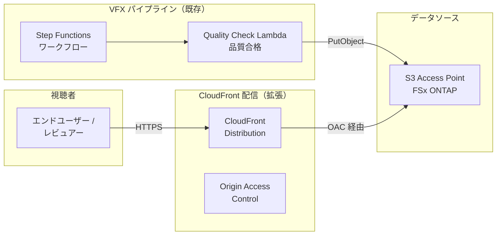

# CloudFront ストリーミング統合パターン

## 概要

AWS CloudFront を使用して、FSx for NetApp ONTAP S3 Access Points 上のレンダリング済みメディアコンテンツを低レイテンシーで配信するパターンです。VFX レンダリングパイプライン（UC4）の拡張として、品質チェック合格後のコンテンツを CloudFront 経由でストリーミング配信します。

本パターンは AWS 公式チュートリアル「[Stream video using CloudFront](https://docs.aws.amazon.com/fsx/latest/ONTAPGuide/tutorial-stream-video-with-cloudfront.html)」に準拠しています。

## アーキテクチャ



### 配信フロー

1. **レンダリング完了**: VFX パイプラインで品質チェック合格後、レンダリング結果を S3 AP に PutObject
2. **CloudFront 配信**: CloudFront Distribution が S3 AP をオリジンとして設定
3. **OAC 認証**: Origin Access Control (OAC) により CloudFront のみが S3 AP にアクセス可能
4. **エッジ配信**: CloudFront エッジロケーションからキャッシュ配信（低レイテンシー）

## 前提条件

- AWS アカウントと適切な IAM 権限
- FSx for NetApp ONTAP ファイルシステム（ONTAP 9.17.1P4D3 以上）
- S3 Access Point が有効化されたボリューム（**internet** network origin 必須）
- UC4 VFX パイプラインがデプロイ済み

> **重要**: CloudFront は AWS マネージドインフラからオリジンにアクセスするため、S3 AP は **internet** network origin で作成する必要があります。VPC origin の S3 AP にはアクセスできません。

## デプロイ手順

### 1. CloudFront の有効化

CloudFormation デプロイ時に `EnableCloudFront=true` パラメータを指定します:

```bash
aws cloudformation deploy \
  --template-file media-vfx/template.yaml \
  --stack-name fsxn-media-vfx \
  --parameter-overrides \
    S3AccessPointAlias=<your-volume-ext-s3alias> \
    S3AccessPointOutputAlias=<your-output-volume-ext-s3alias> \
    OntapSecretName=<your-ontap-secret-name> \
    OntapManagementIp=<your-ontap-management-ip> \
    VpcId=<your-vpc-id> \
    PrivateSubnetIds=<subnet-1>,<subnet-2> \
    NotificationEmail=<your-email@example.com> \
    DeadlineFarmId=<your-deadline-farm-id> \
    DeadlineQueueId=<your-deadline-queue-id> \
    EnableCloudFront=true \
  --capabilities CAPABILITY_IAM CAPABILITY_AUTO_EXPAND \
  --region ap-northeast-1
```

### 2. CloudFront ドメインの確認

```bash
aws cloudformation describe-stacks \
  --stack-name fsxn-media-vfx \
  --query "Stacks[0].Outputs[?OutputKey=='CloudFrontDomainName'].OutputValue" \
  --output text \
  --region ap-northeast-1
```

### 3. コンテンツへのアクセス

レンダリング済みコンテンツは以下の URL パターンでアクセスできます:

```
https://<cloudfront-domain-name>/rendered/<asset-name>.mp4
https://<cloudfront-domain-name>/rendered/<asset-name>/playlist.m3u8
```

## 設定パラメータ

| パラメータ | 説明 | デフォルト |
|-----------|------|----------|
| `EnableCloudFront` | CloudFront Distribution の有効化 | `false` |

## コスト

| サービス | 課金単位 | 概算 |
|---------|---------|------|
| CloudFront | データ転送量 + リクエスト数 | 転送量に依存 |
| S3 API | オリジンリクエスト数 | ~$0.01 |

> CloudFront は 1 TB/月の無料枠があります。PoC/デモ環境では無料枠内で利用可能です。

## セキュリティ

- **Origin Access Control (OAC)**: CloudFront のみが S3 AP にアクセス可能
- **HTTPS 強制**: ViewerProtocolPolicy で HTTPS リダイレクトを設定
- **キャッシュ制御**: デフォルト TTL 86400 秒（24 時間）

## 制約事項

- FSx ONTAP S3 AP は Presigned URL 非対応のため、CloudFront Signed URL/Cookie は使用不可
- S3 AP の PutObject 最大サイズは 5 GB（大容量ファイルはマルチパートアップロードを使用）
- CloudFront は internet network origin の S3 AP のみアクセス可能

## 参考リンク

- [AWS 公式: Stream video using CloudFront](https://docs.aws.amazon.com/fsx/latest/ONTAPGuide/tutorial-stream-video-with-cloudfront.html)
- [CloudFront + S3 Origin Access Control](https://docs.aws.amazon.com/AmazonCloudFront/latest/DeveloperGuide/private-content-restricting-access-to-s3.html)
- [CloudFront 料金](https://aws.amazon.com/cloudfront/pricing/)
