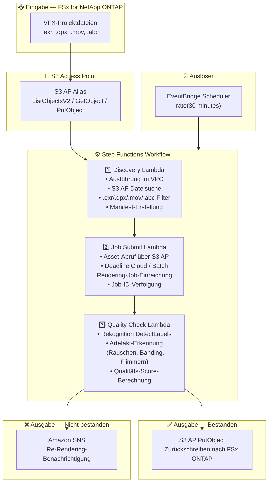

# UC4: Medien — VFX-Rendering-Pipeline

🌐 **Language / 言語**: [日本語](architecture.md) | [English](architecture.en.md) | [한국어](architecture.ko.md) | [简体中文](architecture.zh-CN.md) | [繁體中文](architecture.zh-TW.md) | [Français](architecture.fr.md) | Deutsch | [Español](architecture.es.md)

## End-to-End-Architektur (Eingabe → Ausgabe)

---

## Übergeordneter Ablauf

```
┌─────────────────────────────────────────────────────────────────────────────┐
│                         FSx for NetApp ONTAP                                 │
│                                                                              │
│  /vol/vfx_projects/                                                          │
│  ├── shots/SH010/comp_v003.exr       (OpenEXR composite)                     │
│  ├── shots/SH010/plate_v001.dpx      (DPX plate)                             │
│  ├── shots/SH020/anim_v002.mov       (QuickTime preview)                     │
│  └── assets/character_rig.abc        (Alembic cache)                         │
│                                                                              │
└──────────────────────────────────┬───────────────────────────────────────────┘
                                   │
                                   ▼
┌──────────────────────────────────────────────────────────────────────────────┐
│                      S3 Access Point (Data Path)                              │
│                                                                              │
│  Alias: fsxn-vfx-vol-ext-s3alias                                             │
│  • ListObjectsV2 (VFX asset discovery)                                       │
│  • GetObject (EXR/DPX/MOV/ABC retrieval)                                     │
│  • PutObject (write back quality-approved assets)                            │
│                                                                              │
└──────────────────────────────────┬───────────────────────────────────────────┘
                                   │
                                   ▼
┌──────────────────────────────────────────────────────────────────────────────┐
│                    EventBridge Scheduler (Trigger)                            │
│                                                                              │
│  Schedule: rate(30 minutes) — configurable                                   │
│  Target: Step Functions State Machine                                        │
│                                                                              │
└──────────────────────────────────┬───────────────────────────────────────────┘
                                   │
                                   ▼
┌──────────────────────────────────────────────────────────────────────────────┐
│                    AWS Step Functions (Orchestration)                         │
│                                                                              │
│  ┌─────────────┐    ┌──────────────────────┐    ┌────────────────┐          │
│  │  Discovery   │───▶│  Job Submit           │───▶│ Quality Check  │         │
│  │  Lambda      │    │  Lambda              │    │  Lambda        │          │
│  │             │    │                      │    │               │          │
│  │  • VPC内     │    │  • S3 AP GetObject   │    │  • Rekognition │          │
│  │  • S3 AP List│    │  • Deadline Cloud    │    │  • Artifact    │          │
│  │  • EXR/DPX  │    │    job submission    │    │    detection   │          │
│  └─────────────┘    └──────────────────────┘    └───────┬────────┘          │
│                                                          │                   │
│                                                          ▼                   │
│                                                 ┌────────────────┐          │
│                                                 │  Pass: PutObject │          │
│                                                 │  Fail: SNS notify│          │
│                                                 └────────────────┘          │
│                                                                              │
└──────────────────────────────────────────────────────────────────────────────┘
                                   │
                                   ▼
┌──────────────────────────────────────────────────────────────────────────────┐
│                         Output                                                │
│                                                                              │
│  [Pass] S3 AP PutObject → Write back to FSx ONTAP                           │
│  /vol/vfx_approved/                                                          │
│  └── shots/SH010/comp_v003_approved.exr                                      │
│                                                                              │
│  [Fail] SNS notification → Artist re-render                                 │
│  • Artifact type, detection location, confidence score                       │
│                                                                              │
└──────────────────────────────────────────────────────────────────────────────┘
```

---

## Mermaid-Diagramm



---

## Datenfluss-Details

### Eingabe
| Element | Beschreibung |
|---------|--------------|
| **Quelle** | FSx for NetApp ONTAP Volume |
| **Dateitypen** | .exr, .dpx, .mov, .abc (VFX-Projektdateien) |
| **Zugriffsmethode** | S3 Access Point (ListObjectsV2 + GetObject) |
| **Lesestrategie** | Vollständiger Asset-Abruf für Rendering-Ziele |

### Verarbeitung
| Schritt | Service | Funktion |
|---------|---------|----------|
| Discovery | Lambda (VPC) | VFX-Assets über S3 AP entdecken, Manifest erstellen |
| Job Submit | Lambda + Deadline Cloud/Batch | Rendering-Jobs einreichen, Job-Status verfolgen |
| Quality Check | Lambda + Rekognition | Rendering-Qualitätsbewertung (Artefakt-Erkennung) |

### Ausgabe
| Artefakt | Format | Beschreibung |
|----------|--------|--------------|
| Genehmigtes Asset | S3 AP PutObject → FSx ONTAP | Qualitätsgenehmigte Assets zurückschreiben |
| QC-Bericht | `qc-results/YYYY/MM/DD/{shot}_{version}.json` | Qualitätsprüfungsergebnisse |
| SNS-Benachrichtigung | Email / Slack | Re-Rendering-Benachrichtigung bei Nichtbestehen |

---

## Wichtige Designentscheidungen

1. **Bidirektionaler S3 AP-Zugriff** — GetObject für Asset-Abruf, PutObject für das Zurückschreiben genehmigter Assets (kein NFS-Mount erforderlich)
2. **Deadline Cloud / Batch Integration** — Skalierbare Job-Ausführung auf verwalteten Rendering-Farmen
3. **Rekognition-basierte Qualitätsprüfung** — Automatische Erkennung von Artefakten (Rauschen, Banding, Flimmern) zur Reduzierung des manuellen Überprüfungsaufwands
4. **Bestanden/Nicht-bestanden-Verzweigungsfluss** — Automatisches Zurückschreiben bei Qualitätsbestehen, SNS-Benachrichtigung an Künstler bei Nichtbestehen
5. **Verarbeitung pro Shot** — Folgt den Standard-VFX-Pipeline-Shot/Versions-Verwaltungskonventionen
6. **Polling (nicht ereignisgesteuert)** — S3 AP unterstützt keine Ereignisbenachrichtigungen, daher wird eine periodische geplante Ausführung verwendet

---

## Verwendete AWS-Services

| Service | Rolle |
|---------|-------|
| FSx for NetApp ONTAP | VFX-Projektspeicher (EXR/DPX/MOV/ABC) |
| S3 Access Points | Bidirektionaler serverloser Zugriff auf ONTAP-Volumes |
| EventBridge Scheduler | Periodischer Auslöser |
| Step Functions | Workflow-Orchestrierung |
| Lambda | Compute (Discovery, Job Submit, Quality Check) |
| AWS Deadline Cloud / Batch | Rendering-Job-Ausführung |
| Amazon Rekognition | Rendering-Qualitätsbewertung (Artefakt-Erkennung) |
| SNS | Re-Rendering-Benachrichtigung bei Nichtbestehen |
| Secrets Manager | ONTAP REST API-Anmeldeinformationsverwaltung |
| CloudWatch + X-Ray | Observability |
