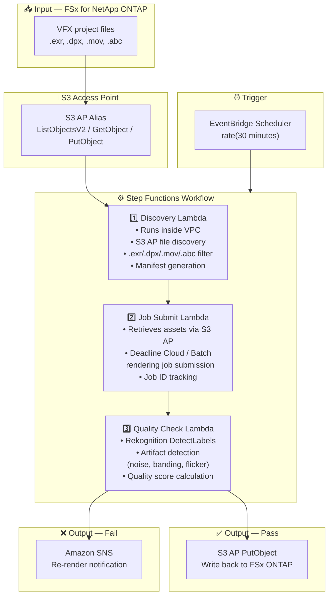

# UC4: Media — VFX Rendering Pipeline

🌐 **Language / 言語**: [日本語](architecture.md) | English | [한국어](architecture.ko.md) | [简体中文](architecture.zh-CN.md) | [繁體中文](architecture.zh-TW.md) | [Français](architecture.fr.md) | [Deutsch](architecture.de.md) | [Español](architecture.es.md)

## End-to-End Architecture (Input → Output)

---

## Architecture Diagram

---

## Data Flow Detail

### Input
| Item | Description |
|------|-------------|
| **Source** | FSx for NetApp ONTAP volume |
| **File Types** | .exr, .dpx, .mov, .abc (VFX project files) |
| **Access Method** | S3 Access Point (ListObjectsV2 + GetObject) |
| **Read Strategy** | Full asset retrieval for rendering targets |

### Processing
| Step | Service | Function |
|------|---------|----------|
| Discovery | Lambda (VPC) | Discover VFX assets via S3 AP, generate manifest |
| Job Submit | Lambda + Deadline Cloud/Batch | Submit rendering jobs, track job status |
| Quality Check | Lambda + Rekognition | Rendering quality evaluation (artifact detection) |

### Output
| Artifact | Format | Description |
|----------|--------|-------------|
| Approved Asset | S3 AP PutObject → FSx ONTAP | Write back quality-approved assets |
| QC Report | `qc-results/YYYY/MM/DD/{shot}_{version}.json` | Quality check results |
| SNS Notification | Email / Slack | Re-render notification on failure |

---

## Key Design Decisions

1. **S3 AP bidirectional access** — GetObject for asset retrieval, PutObject for writing back approved assets (no NFS mount required)
2. **Deadline Cloud / Batch integration** — Scalable job execution on managed rendering farms
3. **Rekognition-based quality check** — Automatic detection of artifacts (noise, banding, flicker) to reduce manual review burden
4. **Pass/fail branching flow** — Auto write-back on quality pass, SNS notification to artists on failure
5. **Per-shot processing** — Follows standard VFX pipeline shot/version management conventions
6. **Polling (not event-driven)** — S3 AP does not support event notifications, so periodic scheduled execution is used

---

## AWS Services Used

| Service | Role |
|---------|------|
| FSx for NetApp ONTAP | VFX project storage (EXR/DPX/MOV/ABC) |
| S3 Access Points | Bidirectional serverless access to ONTAP volumes |
| EventBridge Scheduler | Periodic trigger |
| Step Functions | Workflow orchestration |
| Lambda | Compute (Discovery, Job Submit, Quality Check) |
| AWS Deadline Cloud / Batch | Rendering job execution |
| Amazon Rekognition | Rendering quality evaluation (artifact detection) |
| SNS | Re-render notification on failure |
| Secrets Manager | ONTAP REST API credential management |
| CloudWatch + X-Ray | Observability |
