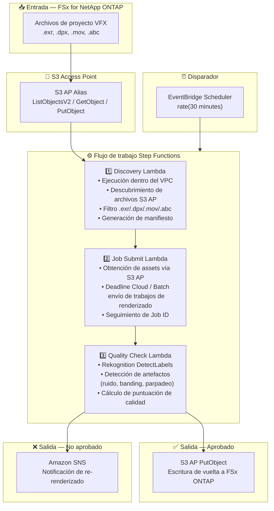

# UC4: Medios — Pipeline de renderizado VFX

🌐 **Language / 言語**: [日本語](architecture.md) | [English](architecture.en.md) | [한국어](architecture.ko.md) | [简体中文](architecture.zh-CN.md) | [繁體中文](architecture.zh-TW.md) | [Français](architecture.fr.md) | [Deutsch](architecture.de.md) | Español

## Arquitectura de extremo a extremo (Entrada → Salida)

---

## Flujo de alto nivel

```
┌─────────────────────────────────────────────────────────────────────────────┐
│                         FSx for NetApp ONTAP                                 │
│                                                                              │
│  /vol/vfx_projects/                                                          │
│  ├── shots/SH010/comp_v003.exr       (OpenEXR composite)                     │
│  ├── shots/SH010/plate_v001.dpx      (DPX plate)                             │
│  ├── shots/SH020/anim_v002.mov       (QuickTime preview)                     │
│  └── assets/character_rig.abc        (Alembic cache)                         │
│                                                                              │
└──────────────────────────────────┬───────────────────────────────────────────┘
                                   │
                                   ▼
┌──────────────────────────────────────────────────────────────────────────────┐
│                      S3 Access Point (Data Path)                              │
│                                                                              │
│  Alias: fsxn-vfx-vol-ext-s3alias                                             │
│  • ListObjectsV2 (VFX asset discovery)                                       │
│  • GetObject (EXR/DPX/MOV/ABC retrieval)                                     │
│  • PutObject (write back quality-approved assets)                            │
│                                                                              │
└──────────────────────────────────┬───────────────────────────────────────────┘
                                   │
                                   ▼
┌──────────────────────────────────────────────────────────────────────────────┐
│                    EventBridge Scheduler (Trigger)                            │
│                                                                              │
│  Schedule: rate(30 minutes) — configurable                                   │
│  Target: Step Functions State Machine                                        │
│                                                                              │
└──────────────────────────────────┬───────────────────────────────────────────┘
                                   │
                                   ▼
┌──────────────────────────────────────────────────────────────────────────────┐
│                    AWS Step Functions (Orchestration)                         │
│                                                                              │
│  ┌─────────────┐    ┌──────────────────────┐    ┌────────────────┐          │
│  │  Discovery   │───▶│  Job Submit           │───▶│ Quality Check  │         │
│  │  Lambda      │    │  Lambda              │    │  Lambda        │          │
│  │             │    │                      │    │               │          │
│  │  • VPC内     │    │  • S3 AP GetObject   │    │  • Rekognition │          │
│  │  • S3 AP List│    │  • Deadline Cloud    │    │  • Artifact    │          │
│  │  • EXR/DPX  │    │    job submission    │    │    detection   │          │
│  └─────────────┘    └──────────────────────┘    └───────┬────────┘          │
│                                                          │                   │
│                                                          ▼                   │
│                                                 ┌────────────────┐          │
│                                                 │  Pass: PutObject │          │
│                                                 │  Fail: SNS notify│          │
│                                                 └────────────────┘          │
│                                                                              │
└──────────────────────────────────────────────────────────────────────────────┘
                                   │
                                   ▼
┌──────────────────────────────────────────────────────────────────────────────┐
│                         Output                                                │
│                                                                              │
│  [Pass] S3 AP PutObject → Write back to FSx ONTAP                           │
│  /vol/vfx_approved/                                                          │
│  └── shots/SH010/comp_v003_approved.exr                                      │
│                                                                              │
│  [Fail] SNS notification → Artist re-render                                 │
│  • Artifact type, detection location, confidence score                       │
│                                                                              │
└──────────────────────────────────────────────────────────────────────────────┘
```

---

## Diagrama Mermaid



---

## Detalle del flujo de datos

### Entrada
| Elemento | Descripción |
|----------|-------------|
| **Origen** | Volumen FSx for NetApp ONTAP |
| **Tipos de archivo** | .exr, .dpx, .mov, .abc (archivos de proyecto VFX) |
| **Método de acceso** | S3 Access Point (ListObjectsV2 + GetObject) |
| **Estrategia de lectura** | Obtención completa de assets para objetivos de renderizado |

### Procesamiento
| Paso | Servicio | Función |
|------|----------|---------|
| Discovery | Lambda (VPC) | Descubrir assets VFX vía S3 AP, generar manifiesto |
| Job Submit | Lambda + Deadline Cloud/Batch | Enviar trabajos de renderizado, rastrear estado de trabajos |
| Quality Check | Lambda + Rekognition | Evaluación de calidad de renderizado (detección de artefactos) |

### Salida
| Artefacto | Formato | Descripción |
|-----------|---------|-------------|
| Asset aprobado | S3 AP PutObject → FSx ONTAP | Escritura de vuelta de assets aprobados en calidad |
| Informe QC | `qc-results/YYYY/MM/DD/{shot}_{version}.json` | Resultados de control de calidad |
| Notificación SNS | Email / Slack | Notificación de re-renderizado en caso de fallo |

---

## Decisiones de diseño clave

1. **Acceso bidireccional S3 AP** — GetObject para obtención de assets, PutObject para escritura de vuelta de assets aprobados (sin necesidad de montaje NFS)
2. **Integración Deadline Cloud / Batch** — Ejecución escalable de trabajos en granjas de renderizado gestionadas
3. **Control de calidad basado en Rekognition** — Detección automática de artefactos (ruido, banding, parpadeo) para reducir la carga de revisión manual
4. **Flujo de ramificación aprobado/no aprobado** — Escritura automática de vuelta al aprobar calidad, notificación SNS a artistas en caso de fallo
5. **Procesamiento por toma** — Sigue las convenciones estándar de gestión de tomas/versiones del pipeline VFX
6. **Sondeo periódico (no basado en eventos)** — S3 AP no admite notificaciones de eventos, por lo que se utiliza ejecución programada periódica

---

## Servicios AWS utilizados

| Servicio | Rol |
|----------|-----|
| FSx for NetApp ONTAP | Almacenamiento de proyectos VFX (EXR/DPX/MOV/ABC) |
| S3 Access Points | Acceso serverless bidireccional a volúmenes ONTAP |
| EventBridge Scheduler | Disparador periódico |
| Step Functions | Orquestación de flujo de trabajo |
| Lambda | Cómputo (Discovery, Job Submit, Quality Check) |
| AWS Deadline Cloud / Batch | Ejecución de trabajos de renderizado |
| Amazon Rekognition | Evaluación de calidad de renderizado (detección de artefactos) |
| SNS | Notificación de re-renderizado en caso de fallo |
| Secrets Manager | Gestión de credenciales ONTAP REST API |
| CloudWatch + X-Ray | Observabilidad |
