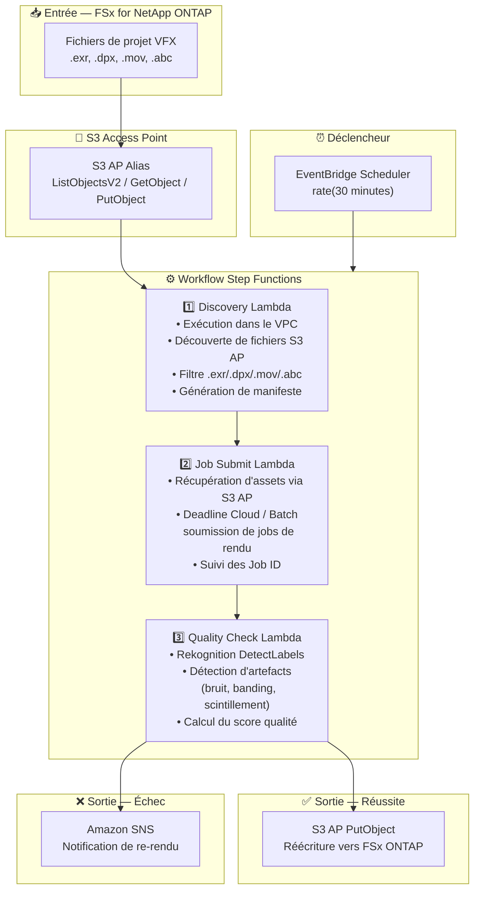

# UC4: Médias — Pipeline de rendu VFX

🌐 **Language / 言語**: [日本語](architecture.md) | [English](architecture.en.md) | [한국어](architecture.ko.md) | [简体中文](architecture.zh-CN.md) | [繁體中文](architecture.zh-TW.md) | Français | [Deutsch](architecture.de.md) | [Español](architecture.es.md)

## Architecture de bout en bout (Entrée → Sortie)

---

## Flux de haut niveau

```
┌─────────────────────────────────────────────────────────────────────────────┐
│                         FSx for NetApp ONTAP                                 │
│                                                                              │
│  /vol/vfx_projects/                                                          │
│  ├── shots/SH010/comp_v003.exr       (OpenEXR composite)                     │
│  ├── shots/SH010/plate_v001.dpx      (DPX plate)                             │
│  ├── shots/SH020/anim_v002.mov       (QuickTime preview)                     │
│  └── assets/character_rig.abc        (Alembic cache)                         │
│                                                                              │
└──────────────────────────────────┬───────────────────────────────────────────┘
                                   │
                                   ▼
┌──────────────────────────────────────────────────────────────────────────────┐
│                      S3 Access Point (Data Path)                              │
│                                                                              │
│  Alias: fsxn-vfx-vol-ext-s3alias                                             │
│  • ListObjectsV2 (VFX asset discovery)                                       │
│  • GetObject (EXR/DPX/MOV/ABC retrieval)                                     │
│  • PutObject (write back quality-approved assets)                            │
│                                                                              │
└──────────────────────────────────┬───────────────────────────────────────────┘
                                   │
                                   ▼
┌──────────────────────────────────────────────────────────────────────────────┐
│                    EventBridge Scheduler (Trigger)                            │
│                                                                              │
│  Schedule: rate(30 minutes) — configurable                                   │
│  Target: Step Functions State Machine                                        │
│                                                                              │
└──────────────────────────────────┬───────────────────────────────────────────┘
                                   │
                                   ▼
┌──────────────────────────────────────────────────────────────────────────────┐
│                    AWS Step Functions (Orchestration)                         │
│                                                                              │
│  ┌─────────────┐    ┌──────────────────────┐    ┌────────────────┐          │
│  │  Discovery   │───▶│  Job Submit           │───▶│ Quality Check  │         │
│  │  Lambda      │    │  Lambda              │    │  Lambda        │          │
│  │             │    │                      │    │               │          │
│  │  • VPC内     │    │  • S3 AP GetObject   │    │  • Rekognition │          │
│  │  • S3 AP List│    │  • Deadline Cloud    │    │  • Artifact    │          │
│  │  • EXR/DPX  │    │    job submission    │    │    detection   │          │
│  └─────────────┘    └──────────────────────┘    └───────┬────────┘          │
│                                                          │                   │
│                                                          ▼                   │
│                                                 ┌────────────────┐          │
│                                                 │  Pass: PutObject │          │
│                                                 │  Fail: SNS notify│          │
│                                                 └────────────────┘          │
│                                                                              │
└──────────────────────────────────────────────────────────────────────────────┘
                                   │
                                   ▼
┌──────────────────────────────────────────────────────────────────────────────┐
│                         Output                                                │
│                                                                              │
│  [Pass] S3 AP PutObject → Write back to FSx ONTAP                           │
│  /vol/vfx_approved/                                                          │
│  └── shots/SH010/comp_v003_approved.exr                                      │
│                                                                              │
│  [Fail] SNS notification → Artist re-render                                 │
│  • Artifact type, detection location, confidence score                       │
│                                                                              │
└──────────────────────────────────────────────────────────────────────────────┘
```

---

## Diagramme Mermaid



---

## Détail du flux de données

### Entrée
| Élément | Description |
|---------|-------------|
| **Source** | Volume FSx for NetApp ONTAP |
| **Types de fichiers** | .exr, .dpx, .mov, .abc (fichiers de projet VFX) |
| **Méthode d'accès** | S3 Access Point (ListObjectsV2 + GetObject) |
| **Stratégie de lecture** | Récupération complète des assets pour les cibles de rendu |

### Traitement
| Étape | Service | Fonction |
|-------|---------|----------|
| Discovery | Lambda (VPC) | Découvrir les assets VFX via S3 AP, générer le manifeste |
| Job Submit | Lambda + Deadline Cloud/Batch | Soumettre les jobs de rendu, suivre l'état des jobs |
| Quality Check | Lambda + Rekognition | Évaluation de la qualité de rendu (détection d'artefacts) |

### Sortie
| Artefact | Format | Description |
|----------|--------|-------------|
| Asset approuvé | S3 AP PutObject → FSx ONTAP | Réécriture des assets approuvés en qualité |
| Rapport QC | `qc-results/YYYY/MM/DD/{shot}_{version}.json` | Résultats du contrôle qualité |
| Notification SNS | Email / Slack | Notification de re-rendu en cas d'échec |

---

## Décisions de conception clés

1. **Accès bidirectionnel S3 AP** — GetObject pour la récupération d'assets, PutObject pour la réécriture des assets approuvés (pas de montage NFS nécessaire)
2. **Intégration Deadline Cloud / Batch** — Exécution de jobs évolutive sur des fermes de rendu gérées
3. **Contrôle qualité basé sur Rekognition** — Détection automatique d'artefacts (bruit, banding, scintillement) pour réduire la charge de révision manuelle
4. **Flux de branchement réussite/échec** — Réécriture automatique en cas de réussite qualité, notification SNS aux artistes en cas d'échec
5. **Traitement par plan** — Suit les conventions standard de gestion plan/version du pipeline VFX
6. **Interrogation périodique (non événementielle)** — S3 AP ne prend pas en charge les notifications d'événements, donc une exécution planifiée périodique est utilisée

---

## Services AWS utilisés

| Service | Rôle |
|---------|------|
| FSx for NetApp ONTAP | Stockage de projets VFX (EXR/DPX/MOV/ABC) |
| S3 Access Points | Accès serverless bidirectionnel aux volumes ONTAP |
| EventBridge Scheduler | Déclencheur périodique |
| Step Functions | Orchestration de workflow |
| Lambda | Calcul (Discovery, Job Submit, Quality Check) |
| AWS Deadline Cloud / Batch | Exécution de jobs de rendu |
| Amazon Rekognition | Évaluation de la qualité de rendu (détection d'artefacts) |
| SNS | Notification de re-rendu en cas d'échec |
| Secrets Manager | Gestion des identifiants ONTAP REST API |
| CloudWatch + X-Ray | Observabilité |
