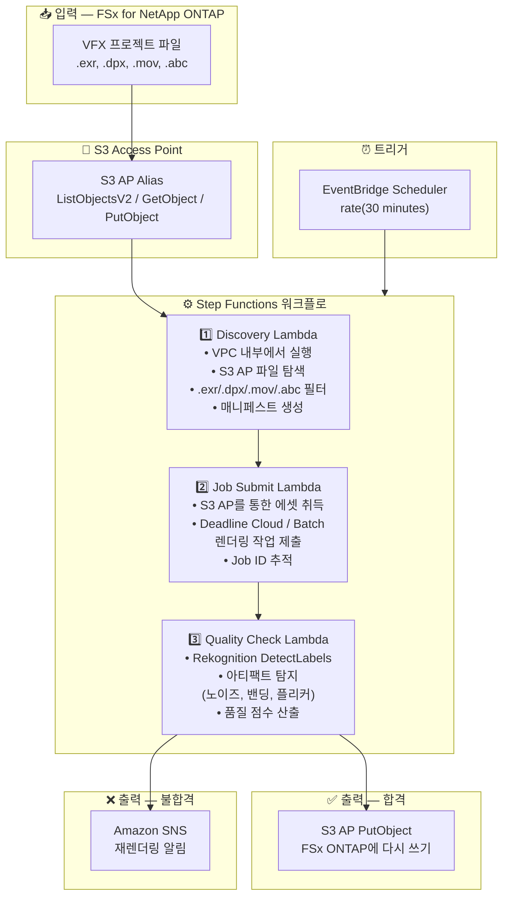

# UC4: 미디어 — VFX 렌더링 파이프라인

🌐 **Language / 言語**: [日本語](architecture.md) | [English](architecture.en.md) | 한국어 | [简体中文](architecture.zh-CN.md) | [繁體中文](architecture.zh-TW.md) | [Français](architecture.fr.md) | [Deutsch](architecture.de.md) | [Español](architecture.es.md)

## 엔드투엔드 아키텍처 (입력 → 출력)

---

## 아키텍처 다이어그램

---

## 데이터 흐름 상세

### 입력
| 항목 | 설명 |
|------|------|
| **소스** | FSx for NetApp ONTAP 볼륨 |
| **파일 유형** | .exr, .dpx, .mov, .abc (VFX 프로젝트 파일) |
| **접근 방식** | S3 Access Point (ListObjectsV2 + GetObject) |
| **읽기 전략** | 렌더링 대상의 전체 에셋 취득 |

### 처리
| 단계 | 서비스 | 기능 |
|------|--------|------|
| Discovery | Lambda (VPC) | S3 AP를 통한 VFX 에셋 탐색, 매니페스트 생성 |
| Job Submit | Lambda + Deadline Cloud/Batch | 렌더링 작업 제출, 작업 상태 추적 |
| Quality Check | Lambda + Rekognition | 렌더링 품질 평가 (아티팩트 탐지) |

### 출력
| 산출물 | 형식 | 설명 |
|--------|------|------|
| 승인된 에셋 | S3 AP PutObject → FSx ONTAP | 품질 승인된 에셋 다시 쓰기 |
| QC 보고서 | `qc-results/YYYY/MM/DD/{shot}_{version}.json` | 품질 검사 결과 |
| SNS 알림 | Email / Slack | 불합격 시 재렌더링 알림 |

---

## 주요 설계 결정

1. **S3 AP 양방향 접근** — GetObject로 에셋 취득, PutObject로 승인된 에셋 다시 쓰기 (NFS 마운트 불필요)
2. **Deadline Cloud / Batch 통합** — 관리형 렌더링 팜에서의 확장 가능한 작업 실행
3. **Rekognition 기반 품질 검사** — 아티팩트 (노이즈, 밴딩, 플리커) 자동 탐지로 수동 검토 부담 경감
4. **합격/불합격 분기 흐름** — 품질 합격 시 자동 다시 쓰기, 불합격 시 아티스트에게 SNS 알림
5. **샷 단위 처리** — 표준 VFX 파이프라인 샷/버전 관리 규칙 준수
6. **폴링 (이벤트 드리븐 아님)** — S3 AP는 이벤트 알림을 지원하지 않으므로 정기 스케줄 실행 사용

---

## 사용 AWS 서비스

| 서비스 | 역할 |
|--------|------|
| FSx for NetApp ONTAP | VFX 프로젝트 스토리지 (EXR/DPX/MOV/ABC) |
| S3 Access Points | ONTAP 볼륨에 대한 양방향 서버리스 접근 |
| EventBridge Scheduler | 정기 트리거 |
| Step Functions | 워크플로 오케스트레이션 |
| Lambda | 컴퓨팅 (Discovery, Job Submit, Quality Check) |
| AWS Deadline Cloud / Batch | 렌더링 작업 실행 |
| Amazon Rekognition | 렌더링 품질 평가 (아티팩트 탐지) |
| SNS | 불합격 시 재렌더링 알림 |
| Secrets Manager | ONTAP REST API 자격 증명 관리 |
| CloudWatch + X-Ray | 관측성 |
