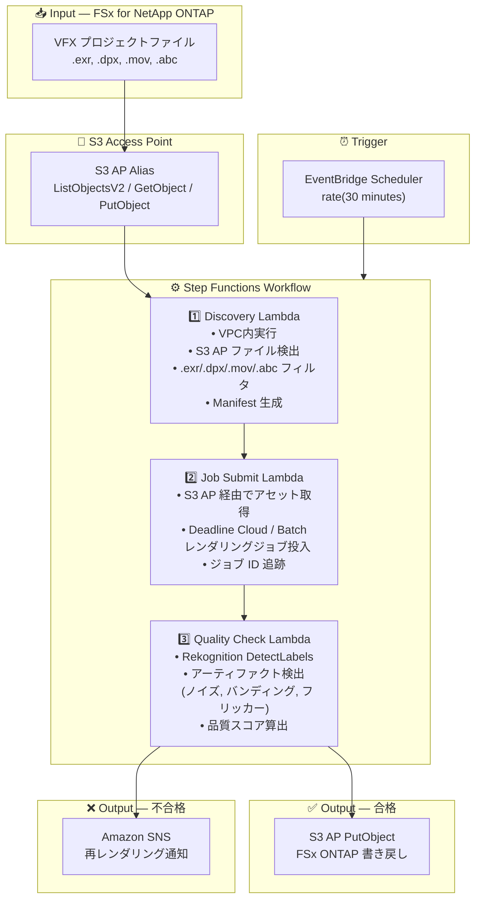

# UC4: メディア — VFX レンダリングパイプライン

🌐 **Language / 言語**: 日本語 | [English](architecture.en.md) | [한국어](architecture.ko.md) | [简体中文](architecture.zh-CN.md) | [繁體中文](architecture.zh-TW.md) | [Français](architecture.fr.md) | [Deutsch](architecture.de.md) | [Español](architecture.es.md)

## End-to-End Architecture (Input → Output)

---

## Architecture Diagram

---

## Data Flow Detail

### Input
| Item | Description |
|------|-------------|
| **Source** | FSx for NetApp ONTAP volume |
| **File Types** | .exr, .dpx, .mov, .abc (VFX プロジェクトファイル) |
| **Access Method** | S3 Access Point (ListObjectsV2 + GetObject) |
| **Read Strategy** | レンダリング対象アセット全体を取得 |

### Processing
| Step | Service | Function |
|------|---------|----------|
| Discovery | Lambda (VPC) | S3 AP で VFX アセット検出、Manifest 生成 |
| Job Submit | Lambda + Deadline Cloud/Batch | レンダリングジョブ投入、ジョブステータス追跡 |
| Quality Check | Lambda + Rekognition | レンダリング品質評価（アーティファクト検出） |

### Output
| Artifact | Format | Description |
|----------|--------|-------------|
| Approved Asset | S3 AP PutObject → FSx ONTAP | 品質合格アセットの書き戻し |
| QC Report | `qc-results/YYYY/MM/DD/{shot}_{version}.json` | 品質チェック結果 |
| SNS Notification | Email / Slack | 不合格時の再レンダリング通知 |

---

## Key Design Decisions

1. **S3 AP 双方向アクセス** — GetObject でアセット取得、PutObject で合格アセット書き戻し（NFS マウント不要）
2. **Deadline Cloud / Batch 統合** — マネージドレンダリングファームでスケーラブルなジョブ実行
3. **Rekognition ベースの品質チェック** — アーティファクト（ノイズ、バンディング、フリッカー）を自動検出し、手動レビュー負荷を軽減
4. **合格/不合格の分岐フロー** — 品質合格時は自動書き戻し、不合格時は SNS 通知でアーティストにフィードバック
5. **ショット単位の処理** — VFX パイプラインの標準的なショット/バージョン管理に準拠
6. **ポーリングベース** — S3 AP はイベント通知非対応のため、定期スケジュール実行

---

## AWS Services Used

| Service | Role |
|---------|------|
| FSx for NetApp ONTAP | VFX プロジェクトストレージ（EXR/DPX/MOV/ABC 保管） |
| S3 Access Points | ONTAP ボリュームへのサーバーレスアクセス（双方向） |
| EventBridge Scheduler | 定期トリガー |
| Step Functions | ワークフローオーケストレーション |
| Lambda | コンピュート（Discovery, Job Submit, Quality Check） |
| AWS Deadline Cloud / Batch | レンダリングジョブ実行 |
| Amazon Rekognition | レンダリング品質評価（アーティファクト検出） |
| SNS | 不合格時の再レンダリング通知 |
| Secrets Manager | ONTAP REST API 認証情報管理 |
| CloudWatch + X-Ray | オブザーバビリティ |
