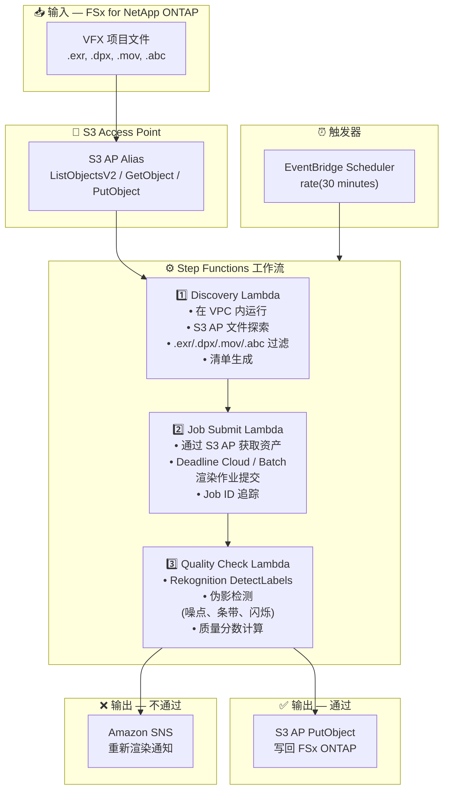

# UC4: 媒体 — VFX 渲染管线

🌐 **Language / 言語**: [日本語](architecture.md) | [English](architecture.en.md) | [한국어](architecture.ko.md) | 简体中文 | [繁體中文](architecture.zh-TW.md) | [Français](architecture.fr.md) | [Deutsch](architecture.de.md) | [Español](architecture.es.md)

## 端到端架构 (输入 → 输出)

---

## 高层级流程

```
┌─────────────────────────────────────────────────────────────────────────────┐
│                         FSx for NetApp ONTAP                                 │
│                                                                              │
│  /vol/vfx_projects/                                                          │
│  ├── shots/SH010/comp_v003.exr       (OpenEXR composite)                     │
│  ├── shots/SH010/plate_v001.dpx      (DPX plate)                             │
│  ├── shots/SH020/anim_v002.mov       (QuickTime preview)                     │
│  └── assets/character_rig.abc        (Alembic cache)                         │
│                                                                              │
└──────────────────────────────────┬───────────────────────────────────────────┘
                                   │
                                   ▼
┌──────────────────────────────────────────────────────────────────────────────┐
│                      S3 Access Point (Data Path)                              │
│                                                                              │
│  Alias: fsxn-vfx-vol-ext-s3alias                                             │
│  • ListObjectsV2 (VFX asset discovery)                                       │
│  • GetObject (EXR/DPX/MOV/ABC retrieval)                                     │
│  • PutObject (write back quality-approved assets)                            │
│                                                                              │
└──────────────────────────────────┬───────────────────────────────────────────┘
                                   │
                                   ▼
┌──────────────────────────────────────────────────────────────────────────────┐
│                    EventBridge Scheduler (Trigger)                            │
│                                                                              │
│  Schedule: rate(30 minutes) — configurable                                   │
│  Target: Step Functions State Machine                                        │
│                                                                              │
└──────────────────────────────────┬───────────────────────────────────────────┘
                                   │
                                   ▼
┌──────────────────────────────────────────────────────────────────────────────┐
│                    AWS Step Functions (Orchestration)                         │
│                                                                              │
│  ┌─────────────┐    ┌──────────────────────┐    ┌────────────────┐          │
│  │  Discovery   │───▶│  Job Submit           │───▶│ Quality Check  │         │
│  │  Lambda      │    │  Lambda              │    │  Lambda        │          │
│  │             │    │                      │    │               │          │
│  │  • VPC内     │    │  • S3 AP GetObject   │    │  • Rekognition │          │
│  │  • S3 AP List│    │  • Deadline Cloud    │    │  • Artifact    │          │
│  │  • EXR/DPX  │    │    job submission    │    │    detection   │          │
│  └─────────────┘    └──────────────────────┘    └───────┬────────┘          │
│                                                          │                   │
│                                                          ▼                   │
│                                                 ┌────────────────┐          │
│                                                 │  Pass: PutObject │          │
│                                                 │  Fail: SNS notify│          │
│                                                 └────────────────┘          │
│                                                                              │
└──────────────────────────────────────────────────────────────────────────────┘
                                   │
                                   ▼
┌──────────────────────────────────────────────────────────────────────────────┐
│                         Output                                                │
│                                                                              │
│  [Pass] S3 AP PutObject → Write back to FSx ONTAP                           │
│  /vol/vfx_approved/                                                          │
│  └── shots/SH010/comp_v003_approved.exr                                      │
│                                                                              │
│  [Fail] SNS notification → Artist re-render                                 │
│  • Artifact type, detection location, confidence score                       │
│                                                                              │
└──────────────────────────────────────────────────────────────────────────────┘
```

---

## Mermaid 图表



---

## 数据流详情

### 输入
| 项目 | 说明 |
|------|------|
| **来源** | FSx for NetApp ONTAP 卷 |
| **文件类型** | .exr, .dpx, .mov, .abc (VFX 项目文件) |
| **访问方式** | S3 Access Point (ListObjectsV2 + GetObject) |
| **读取策略** | 渲染目标的全资产获取 |

### 处理
| 步骤 | 服务 | 功能 |
|------|------|------|
| Discovery | Lambda (VPC) | 通过 S3 AP 探索 VFX 资产，生成清单 |
| Job Submit | Lambda + Deadline Cloud/Batch | 提交渲染作业，追踪作业状态 |
| Quality Check | Lambda + Rekognition | 渲染质量评估 (伪影检测) |

### 输出
| 产出物 | 格式 | 说明 |
|--------|------|------|
| 已批准资产 | S3 AP PutObject → FSx ONTAP | 写回质量批准的资产 |
| QC 报告 | `qc-results/YYYY/MM/DD/{shot}_{version}.json` | 质量检查结果 |
| SNS 通知 | Email / Slack | 不通过时的重新渲染通知 |

---

## 关键设计决策

1. **S3 AP 双向访问** — GetObject 获取资产，PutObject 写回已批准资产 (无需 NFS 挂载)
2. **Deadline Cloud / Batch 集成** — 在托管渲染农场上的可扩展作业执行
3. **Rekognition 基于品质检查** — 自动检测伪影 (噪点、条带、闪烁) 以减少人工审核负担
4. **通过/不通过分支流程** — 质量通过时自动写回，不通过时向艺术家发送 SNS 通知
5. **按镜头处理** — 遵循标准 VFX 管线镜头/版本管理规范
6. **轮询 (非事件驱动)** — S3 AP 不支持事件通知，因此使用定期调度执行

---

## 使用的 AWS 服务

| 服务 | 角色 |
|------|------|
| FSx for NetApp ONTAP | VFX 项目存储 (EXR/DPX/MOV/ABC) |
| S3 Access Points | 对 ONTAP 卷的双向无服务器访问 |
| EventBridge Scheduler | 定期触发 |
| Step Functions | 工作流编排 |
| Lambda | 计算 (Discovery, Job Submit, Quality Check) |
| AWS Deadline Cloud / Batch | 渲染作业执行 |
| Amazon Rekognition | 渲染质量评估 (伪影检测) |
| SNS | 不通过时的重新渲染通知 |
| Secrets Manager | ONTAP REST API 凭证管理 |
| CloudWatch + X-Ray | 可观测性 |
