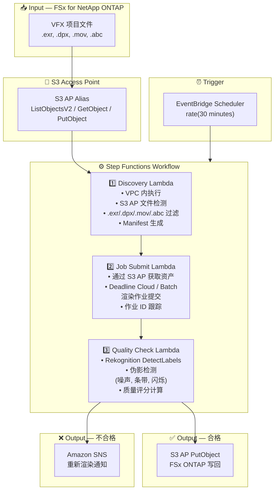

# UC4: 媒体 — VFX 渲染管道

🌐 **Language / 언어 / 语言 / 語言 / Langue / Sprache / Idioma**: [日本語](architecture.md) | [English](architecture.en.md) | [한국어](architecture.ko.md) | 简体中文 | [繁體中文](architecture.zh-TW.md) | [Français](architecture.fr.md) | [Deutsch](architecture.de.md) | [Español](architecture.es.md)

> 注意：此翻译由 Amazon Bedrock Claude 生成。欢迎对翻译质量提出改进建议。

## End-to-End Architecture (Input → Output)

---

## Architecture Diagram

---

## Data Flow Detail

### Input
| Item | Description |
|------|-------------|
| **Source** | FSx for NetApp ONTAP volume |
| **File Types** | .exr, .dpx, .mov, .abc (VFX 项目文件) |
| **Access Method** | S3 Access Point (ListObjectsV2 + GetObject) |
| **Read Strategy** | 获取全部渲染目标资产 |

### Processing
| Step | Service | Function |
|------|---------|----------|
| Discovery | Lambda (VPC) | 通过 S3 AP 检测 VFX 资产，生成 Manifest |
| Job Submit | Lambda + Deadline Cloud/Batch | 提交渲染作业，跟踪作业状态 |
| Quality Check | Lambda + Rekognition | 渲染质量评估（伪影检测） |

### Output
| Artifact | Format | Description |
|----------|--------|-------------|
| Approved Asset | S3 AP PutObject → FSx ONTAP | 质量合格资产的写回 |
| QC Report | `qc-results/YYYY/MM/DD/{shot}_{version}.json` | 质量检查结果 |
| SNS Notification | Email / Slack | 不合格时的重新渲染通知 |

---

## Key Design Decisions

1. **S3 AP 双向访问** — 通过 GetObject 获取资产，通过 PutObject 写回合格资产（无需 NFS 挂载）
2. **Deadline Cloud / Batch 集成** — 使用托管渲染场实现可扩展的作业执行
3. **基于 Rekognition 的质量检查** — 自动检测伪影（噪声、条带、闪烁），减轻手动审查负担
4. **合格/不合格分支流程** — 质量合格时自动写回，不合格时通过 SNS 通知向艺术家反馈
5. **按镜头处理** — 符合 VFX 流水线的标准镜头/版本管理
6. **基于轮询** — 由于 S3 AP 不支持事件通知，采用定期调度执行

---

## AWS Services Used

| Service | Role |
|---------|------|
| FSx for NetApp ONTAP | VFX 项目存储（EXR/DPX/MOV/ABC 保存） |
| S3 Access Points | 对 ONTAP 卷的无服务器访问（双向） |
| EventBridge Scheduler | 定期触发器 |
| Step Functions | 工作流编排 |
| Lambda | 计算（Discovery、Job Submit、Quality Check） |
| AWS Deadline Cloud / Batch | 渲染作业执行 |
| Amazon Rekognition | 渲染质量评估（伪影检测） |
| SNS | 不合格时的重新渲染通知 |
| Secrets Manager | ONTAP REST API 凭证管理 |
| CloudWatch + X-Ray | 可观测性 |
