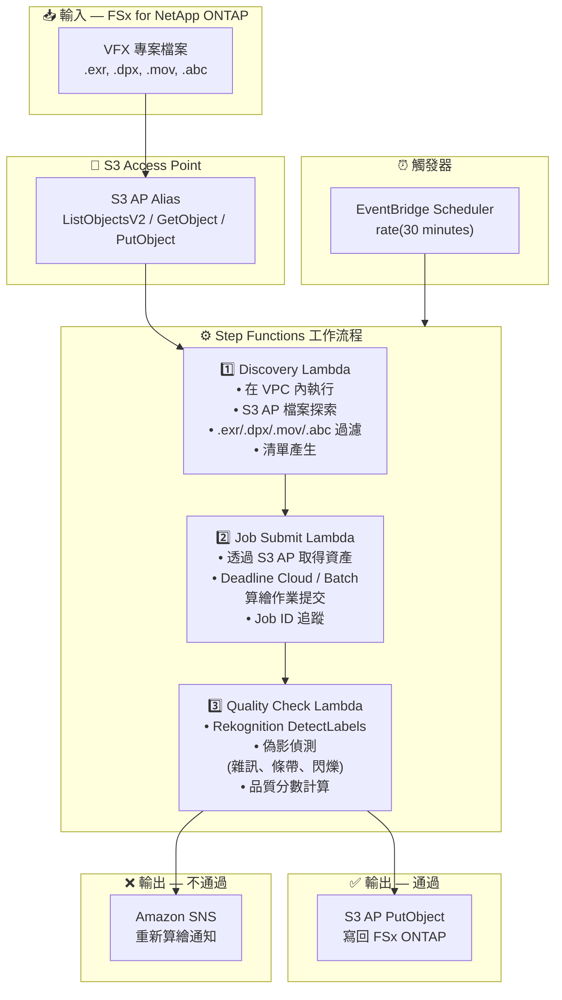

# UC4: 媒體 — VFX 算繪管線

🌐 **Language / 言語**: [日本語](architecture.md) | [English](architecture.en.md) | [한국어](architecture.ko.md) | [简体中文](architecture.zh-CN.md) | 繁體中文 | [Français](architecture.fr.md) | [Deutsch](architecture.de.md) | [Español](architecture.es.md)

## 端對端架構 (輸入 → 輸出)

---

## 架構圖

---

## 資料流詳情

### 輸入
| 項目 | 說明 |
|------|------|
| **來源** | FSx for NetApp ONTAP 磁碟區 |
| **檔案類型** | .exr, .dpx, .mov, .abc (VFX 專案檔案) |
| **存取方式** | S3 Access Point (ListObjectsV2 + GetObject) |
| **讀取策略** | 算繪目標的全資產取得 |

### 處理
| 步驟 | 服務 | 功能 |
|------|------|------|
| Discovery | Lambda (VPC) | 透過 S3 AP 探索 VFX 資產，產生清單 |
| Job Submit | Lambda + Deadline Cloud/Batch | 提交算繪作業，追蹤作業狀態 |
| Quality Check | Lambda + Rekognition | 算繪品質評估 (偽影偵測) |

### 輸出
| 產出物 | 格式 | 說明 |
|--------|------|------|
| 已核准資產 | S3 AP PutObject → FSx ONTAP | 寫回品質核准的資產 |
| QC 報告 | `qc-results/YYYY/MM/DD/{shot}_{version}.json` | 品質檢查結果 |
| SNS 通知 | Email / Slack | 不通過時的重新算繪通知 |

---

## 關鍵設計決策

1. **S3 AP 雙向存取** — GetObject 取得資產，PutObject 寫回已核准資產 (無需 NFS 掛載)
2. **Deadline Cloud / Batch 整合** — 在託管算繪農場上的可擴展作業執行
3. **Rekognition 基於品質檢查** — 自動偵測偽影 (雜訊、條帶、閃爍) 以減少人工審核負擔
4. **通過/不通過分支流程** — 品質通過時自動寫回，不通過時向藝術家發送 SNS 通知
5. **按鏡頭處理** — 遵循標準 VFX 管線鏡頭/版本管理規範
6. **輪詢 (非事件驅動)** — S3 AP 不支援事件通知，因此使用定期排程執行

---

## 使用的 AWS 服務

| 服務 | 角色 |
|------|------|
| FSx for NetApp ONTAP | VFX 專案儲存 (EXR/DPX/MOV/ABC) |
| S3 Access Points | 對 ONTAP 磁碟區的雙向無伺服器存取 |
| EventBridge Scheduler | 定期觸發 |
| Step Functions | 工作流程編排 |
| Lambda | 運算 (Discovery, Job Submit, Quality Check) |
| AWS Deadline Cloud / Batch | 算繪作業執行 |
| Amazon Rekognition | 算繪品質評估 (偽影偵測) |
| SNS | 不通過時的重新算繪通知 |
| Secrets Manager | ONTAP REST API 憑證管理 |
| CloudWatch + X-Ray | 可觀測性 |
