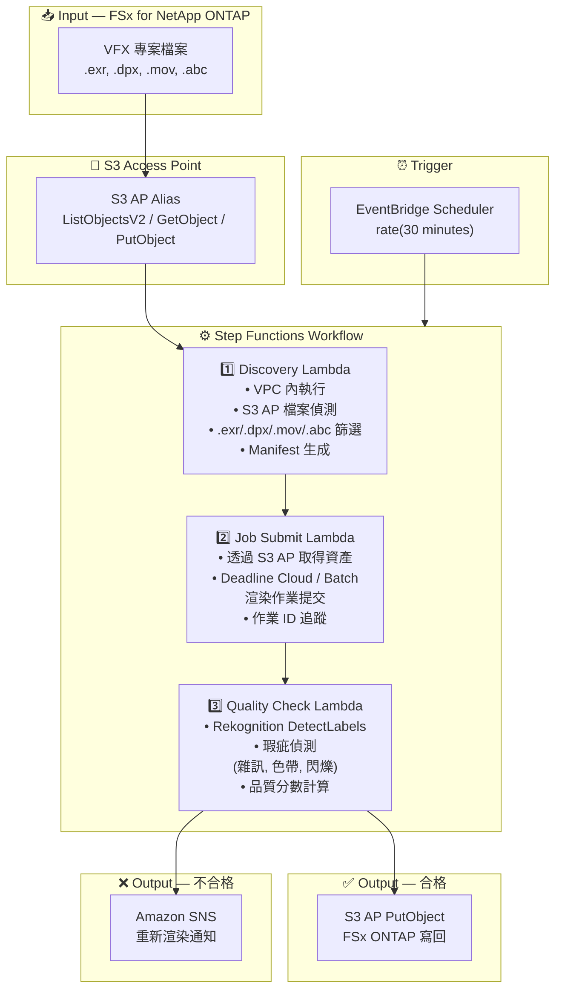

# UC4: 媒體 — VFX 渲染管線

🌐 **Language / 언어 / 语言 / 語言 / Langue / Sprache / Idioma**: [日本語](architecture.md) | [English](architecture.en.md) | [한국어](architecture.ko.md) | [简体中文](architecture.zh-CN.md) | 繁體中文 | [Français](architecture.fr.md) | [Deutsch](architecture.de.md) | [Español](architecture.es.md)

> 注意：此翻譯由 Amazon Bedrock Claude 產生。歡迎對翻譯品質提出改進建議。

## End-to-End Architecture (Input → Output)

---

## Architecture Diagram

---

## Data Flow Detail

### Input
| Item | Description |
|------|-------------|
| **Source** | FSx for NetApp ONTAP volume |
| **File Types** | .exr, .dpx, .mov, .abc (VFX 專案檔案) |
| **Access Method** | S3 Access Point (ListObjectsV2 + GetObject) |
| **Read Strategy** | 取得渲染目標資產全體 |

### Processing
| Step | Service | Function |
|------|---------|----------|
| Discovery | Lambda (VPC) | 透過 S3 AP 偵測 VFX 資產，生成 Manifest |
| Job Submit | Lambda + Deadline Cloud/Batch | 提交渲染作業，追蹤作業狀態 |
| Quality Check | Lambda + Rekognition | 渲染品質評估（瑕疵偵測） |

### Output
| Artifact | Format | Description |
|----------|--------|-------------|
| Approved Asset | S3 AP PutObject → FSx ONTAP | 品質合格資產的寫回 |
| QC Report | `qc-results/YYYY/MM/DD/{shot}_{version}.json` | 品質檢查結果 |
| SNS Notification | Email / Slack | 不合格時的重新渲染通知 |

---

## Key Design Decisions

1. **S3 AP 雙向存取** — 透過 GetObject 取得資產，透過 PutObject 寫回合格資產（無需 NFS 掛載）
2. **Deadline Cloud / Batch 整合** — 使用託管渲染農場執行可擴展的作業
3. **基於 Rekognition 的品質檢查** — 自動偵測瑕疵（雜訊、色帶、閃爍），減輕手動審查負擔
4. **合格/不合格的分支流程** — 品質合格時自動寫回，不合格時透過 SNS 通知回饋給藝術家
5. **以鏡頭為單位的處理** — 符合 VFX 管線的標準鏡頭/版本管理
6. **基於輪詢** — 由於 S3 AP 不支援事件通知，採用定期排程執行

---

## AWS Services Used

| Service | Role |
|---------|------|
| FSx for NetApp ONTAP | VFX 專案儲存（EXR/DPX/MOV/ABC 保管） |
| S3 Access Points | 對 ONTAP 磁碟區的無伺服器存取（雙向） |
| EventBridge Scheduler | 定期觸發器 |
| Step Functions | 工作流程編排 |
| Lambda | 運算（Discovery, Job Submit, Quality Check） |
| AWS Deadline Cloud / Batch | 渲染作業執行 |
| Amazon Rekognition | 渲染品質評估（瑕疵偵測） |
| SNS | 不合格時的重新渲染通知 |
| Secrets Manager | ONTAP REST API 認證資訊管理 |
| CloudWatch + X-Ray | 可觀測性 |
