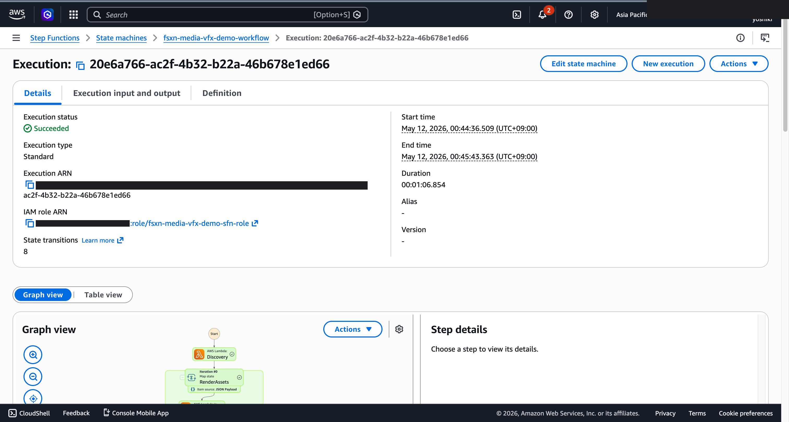
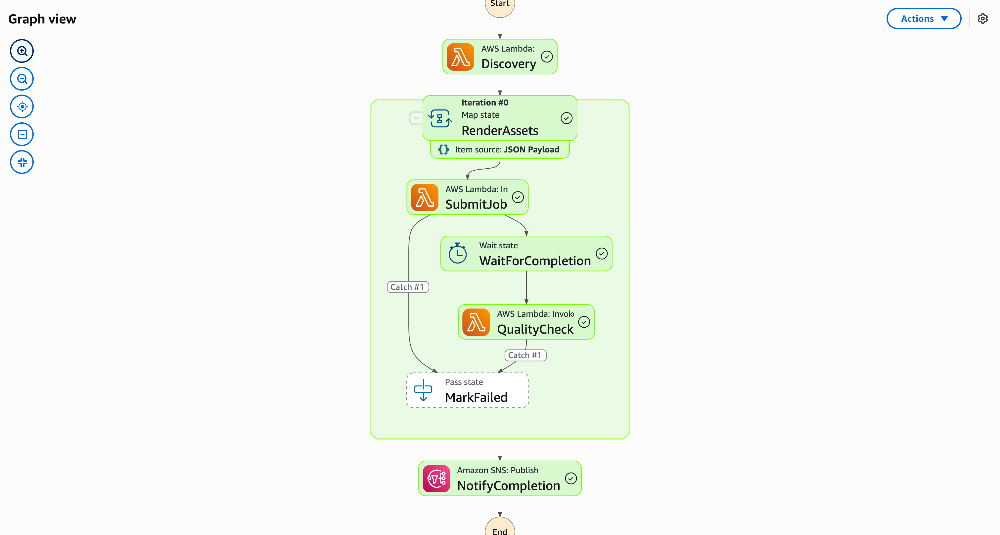

# VFX 渲染品質檢查 — Demo Guide

🌐 **Language / 언어 / 语言 / 語言 / Langue / Sprache / Idioma**: [日本語](demo-guide.md) | [English](demo-guide.en.md) | [한국어](demo-guide.ko.md) | [简体中文](demo-guide.zh-CN.md) | 繁體中文 | [Français](demo-guide.fr.md) | [Deutsch](demo-guide.de.md) | [Español](demo-guide.es.md)

> 注意：此翻譯由 Amazon Bedrock Claude 產生。歡迎對翻譯品質提出改進建議。

## Executive Summary

本示範展示 VFX 渲染輸出的品質檢查流程。透過自動驗證渲染幀，及早偵測瑕疵或錯誤幀。

**示範核心訊息**：自動驗證大量渲染幀，即時偵測品質問題。加速重新渲染的決策。

**預估時間**：3〜5 分鐘

---

## Target Audience & Persona

| 項目 | 詳細 |
|------|------|
| **職位** | VFX 總監 / 渲染 TD |
| **日常業務** | 渲染作業管理、品質確認、鏡頭審批 |
| **課題** | 目視確認數千幀需要耗費大量時間 |
| **期待成果** | 自動偵測問題幀並加速重新渲染決策 |

### Persona：中村先生（VFX 總監）

- 1 個專案有 50+ 鏡頭，每個鏡頭 100〜500 幀
- 渲染完成後的品質確認成為瓶頸
- 「希望自動偵測黑幀、過多雜訊、材質缺失」

---

## Demo Scenario：渲染批次品質驗證

### 工作流程全貌

```
渲染輸出          幀分析        品質判定          QC 報告
(EXR/PNG)     →   中繼資料    →   異常偵測    →    鏡頭別
                   擷取             (統計分析)        摘要
```

---

## Storyboard（5 個區段 / 3〜5 分鐘）

### Section 1: Problem Statement（0:00–0:45）

**旁白要旨**：
> 從渲染農場輸出的數千幀。目視確認黑幀、雜訊、材質缺失等問題並不實際。

**Key Visual**：渲染輸出資料夾（大量 EXR 檔案）

### Section 2: Pipeline Trigger（0:45–1:30）

**旁白要旨**：
> 渲染作業完成後，品質檢查流程自動啟動。以鏡頭為單位進行平行處理。

**Key Visual**：工作流程啟動、鏡頭清單

### Section 3: Frame Analysis（1:30–2:30）

**旁白要旨**：
> 計算每幀的像素統計（平均亮度、變異數、直方圖）。也檢查幀間的一致性。

**Key Visual**：幀分析處理中、像素統計圖表

### Section 4: Quality Assessment（2:30–3:45）

**旁白要旨**：
> 偵測統計離群值，識別問題幀。分類黑幀（亮度為零）、過多雜訊（變異數異常）等。

**Key Visual**：問題幀清單、依類別分類

### Section 5: QC Report（3:45–5:00）

**旁白要旨**：
> 生成鏡頭別的 QC 報告。提示需要重新渲染的幀範圍與推測原因。

**Key Visual**：AI 生成 QC 報告（鏡頭別摘要 + 建議對應）

---

## Screen Capture Plan

| # | 畫面 | 區段 |
|---|------|-----------|
| 1 | 渲染輸出資料夾 | Section 1 |
| 2 | 流程啟動畫面 | Section 2 |
| 3 | 幀分析進度 | Section 3 |
| 4 | 問題幀偵測結果 | Section 4 |
| 5 | QC 報告 | Section 5 |

---

## Narration Outline

| 區段 | 時間 | 關鍵訊息 |
|-----------|------|--------------|
| Problem | 0:00–0:45 | 「目視確認數千幀並不實際」 |
| Trigger | 0:45–1:30 | 「渲染完成後自動開始 QC」 |
| Analysis | 1:30–2:30 | 「透過像素統計定量評估幀品質」 |
| Assessment | 2:30–3:45 | 「自動分類・識別問題幀」 |
| Report | 3:45–5:00 | 「即時支援重新渲染決策」 |

---

## Sample Data Requirements

| # | 資料 | 用途 |
|---|--------|------|
| 1 | 正常幀（100 張） | 基準線 |
| 2 | 黑幀（3 張） | 異常偵測示範 |
| 3 | 過多雜訊幀（5 張） | 品質判定示範 |
| 4 | 材質缺失幀（2 張） | 分類示範 |

---

## Timeline

### 1 週內可達成

| 任務 | 所需時間 |
|--------|---------|
| 準備樣本幀資料 | 3 小時 |
| 確認流程執行 | 2 小時 |
| 取得畫面截圖 | 2 小時 |
| 撰寫旁白稿 | 2 小時 |
| 影片編輯 | 4 小時 |

### Future Enhancements

- 透過深度學習偵測瑕疵
- 渲染農場整合（自動重新渲染）
- 鏡頭追蹤系統整合

---

## Technical Notes

| 元件 | 角色 |
|--------------|------|
| Step Functions | 工作流程編排 |
| Lambda (Frame Analyzer) | 幀中繼資料・像素統計擷取 |
| Lambda (Quality Checker) | 統計品質判定 |
| Lambda (Report Generator) | 透過 Bedrock 生成 QC 報告 |
| Amazon Athena | 幀統計的彙總分析 |

### 備援方案

| 情境 | 對應 |
|---------|------|
| 大容量幀處理延遲 | 切換至縮圖分析 |
| Bedrock 延遲 | 顯示預先生成的報告 |

---

*本文件為技術簡報用示範影片的製作指南。*

---

## 關於輸出目的地：FSxN S3 Access Point (Pattern A)

UC4 media-vfx 分類為 **Pattern A: Native S3AP Output**
（參照 `docs/output-destination-patterns.md`）。

**設計**：渲染中繼資料、幀品質評估全部透過 FSxN S3 Access Point
寫回至與原始渲染資產**相同的 FSx ONTAP 磁碟區**。不會建立標準 S3 儲存貯體
（"no data movement" 模式）。

**CloudFormation 參數**：
- `S3AccessPointAlias`：用於讀取輸入資料的 S3 AP Alias
- `S3AccessPointOutputAlias`：用於寫入輸出的 S3 AP Alias（可與輸入相同）

**部署範例**：
```bash
aws cloudformation deploy \
  --template-file media-vfx/template-deploy.yaml \
  --stack-name fsxn-media-vfx-demo \
  --parameter-overrides \
    S3AccessPointAlias=eda-demo-s3ap-XYZ-ext-s3alias \
    S3AccessPointOutputAlias=eda-demo-s3ap-XYZ-ext-s3alias \
    ... (其他必要參數)
```

**從 SMB/NFS 使用者的視角**：
```
/vol/renders/
  ├── shot_001/frame_0001.exr         # 原始渲染幀
  └── qc/shot_001/                     # 幀品質評估（同一磁碟區內）
      └── frame_0001_qc.json
```

關於 AWS 規格限制，請參照
[專案 README 的「AWS 規格限制與因應對策」章節](../../README.md#aws-仕様上の制約と回避策)
以及 [`docs/output-destination-patterns.md`](../../docs/output-destination-patterns.md)。

---

## 已驗證的 UI/UX 截圖

與 Phase 7 UC15/16/17 及 UC6/11/14 的示範相同方針，以**終端使用者在日常業務中實際
看到的 UI/UX 畫面**為對象。技術人員視圖（Step Functions 圖表、CloudFormation
堆疊事件等）彙整於 `docs/verification-results-*.md`。

### 此使用案例的驗證狀態

- ⚠️ **E2E 驗證**：僅部分功能（正式環境建議追加驗證）
- 📸 **UI/UX 拍攝**：✅ SFN Graph 完成（Phase 8 Theme D, commit 3c90042）

### 既有截圖（來自 Phase 1-6 的相關部分）





### 重新驗證時的 UI/UX 目標畫面（建議拍攝清單）

- （重新驗證時定義）

### 拍攝指南

1. **事前準備**：
   - 執行 `bash scripts/verify_phase7_prerequisites.sh` 確認前提（共用 VPC/S3 AP 是否存在）
   - 執行 `UC=media-vfx bash scripts/package_generic_uc.sh` 打包 Lambda
   - 執行 `bash scripts/deploy_generic_ucs.sh UC4` 進行部署

2. **配置樣本資料**：
   - 透過 S3 AP Alias 將樣本檔案上傳至 `renders/` 前綴
   - 啟動 Step Functions `fsxn-media-vfx-demo-workflow`（輸入 `{}`）

3. **拍攝**（關閉 CloudShell・終端機，將瀏覽器右上角的使用者名稱塗黑）：
   - S3 輸出儲存貯體 `fsxn-media-vfx-demo-output-<account>` 的概覽
   - AI/ML 輸出 JSON 的預覽（參考 `build/preview_*.html` 格式）
   - SNS 電子郵件通知（如適用）

4. **遮罩處理**：
   - 執行 `python3 scripts/mask_uc_demos.py media-vfx-demo` 進行自動遮罩
   - 依照 `docs/screenshots/MASK_GUIDE.md` 進行額外遮罩（如需要）

5. **清理**：
   - 執行 `bash scripts/cleanup_generic_ucs.sh UC4` 進行刪除
   - VPC Lambda ENI 釋放需 15-30 分鐘（AWS 規格）
