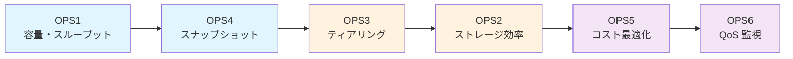

# Operations / 運用最適化パターン

🌐 **Language / 言語**: 日本語 | [English](README.en.md)

---

## 概要

Amazon FSx for NetApp ONTAP の運用最適化を実現するサーバーレスパターン集です。
ONTAP REST API + CloudWatch + Lambda/Step Functions による**ネイティブ AWS メカニズム**で、
容量管理・コスト最適化・ティアリング・スナップショットライフサイクルなどを自動化します。

> **`solutions/` との違い**: `solutions/` は FSx for ONTAP S3 Access Point を使ったデータ処理パターン。
> `operations/` は FS 自体の運用管理・最適化パターンです。一部パターンでは S3 AP のパフォーマンス監視も含みます。

---

## パターン一覧

| ID | ディレクトリ | 機能 | 導入優先度 |
|----|-------------|------|:----------:|
| OPS1 | [`capacity-rightsizing/`](capacity-rightsizing/) | 容量+スループット使用率監視 → ティア推奨 + What-If + コスト差分 | 1st |
| OPS2 | [`storage-efficiency/`](storage-efficiency/) | 重複排除/圧縮効率追跡 → 有効化/チューニング推奨 | 4th |
| OPS3 | [`tiering-optimizer/`](tiering-optimizer/) | コールドデータ分析 → ポリシー/クーリング期間推奨 + コスト試算 | 3rd |
| OPS4 | [`snapshot-lifecycle/`](snapshot-lifecycle/) | 保持ポリシー準拠チェック + Snapshot Policy 乖離検出 + Human Review 削除 | 2nd |
| OPS5 | [`cost-optimization/`](cost-optimization/) | 横断コスト可視化 + 単位経済 + 配賦 + 予測 + Anomaly Detection + AI サマリ | 5th |
| OPS6 | [`qos-monitoring/`](qos-monitoring/) | QoS ポリシー遵守率 + 帯域争奪検出 + ワークロード分離推奨 | 6th |

---

## 設計原則

### 1. Hybrid Metrics

CloudWatch (FS レベル集計) と ONTAP REST API (Volume/Aggregate レベル詳細) を組み合わせて、
AWS コンソールだけでは得られないボリューム粒度の可視性を提供します。

### 2. 段階的自動化 (AutomationLevel)

| Level | 動作 | ユースケース |
|:-----:|------|-------------|
| 0 | レポート生成のみ (S3 + Dashboard) | 導入初期、現状把握 |
| 1 | アラート + 推奨通知 (SNS) | 運用チームへの通知 |
| 2 | 承認ベース実行 (Human Review + SSM Change Calendar) | 変更管理プロセスあり |
| 3 | 全自動 (ガードレール範囲内) | 運用成熟組織 |

### 3. DemoMode

`DemoMode=true` でモックデータを使用し、FSx for ONTAP 実機なしでデモ・検証可能。

### 4. マルチ FS 横断

`FileSystemIds` パラメータで複数ファイルシステムを 1 スタックから横断監視。

### 5. Gen1/Gen2 自動判別

ファイルシステムのデプロイタイプを検出し、利用可能な CloudWatch メトリクスを自動選択。

### 6. AI 推奨 (Bedrock)

数値レポートに加え、Bedrock (Nova) による自然言語のアクション推奨を生成。
「次に何をすべきか」を明確に示します。

---

## 推奨導入順序



- **Phase 1** (基本): OPS1 → OPS4
- **Phase 2** (コスト最適化): OPS3 → OPS2
- **Phase 3** (FinOps / マルチワークロード): OPS5 → OPS6

---

## 共通パラメータ

全 OPS パターンで共通のパラメータ:

| パラメータ | 型 | デフォルト | 説明 |
|-----------|-----|----------|------|
| `FileSystemIds` | CommaDelimitedList | (必須) | 監視対象 FS ID リスト |
| `OntapSecretArn` | String | (必須) | ONTAP REST API 認証情報 (Secrets Manager) |
| `AutomationLevel` | String | `0` | 自動化レベル (0-3) |
| `ThresholdPercent` | Number | `80` | アラート閾値 (%) |
| `DemoMode` | String | `false` | デモモード有効化 |
| `NotificationEmail` | String | `""` | アラート通知先 |
| `ScheduleExpression` | String | `rate(1 day)` | 実行スケジュール |
| `EnableBedrockSummary` | String | `true` | AI 推奨生成 |
| `ReportFormat` | String | `BOTH` | レポート形式 (JSON/HTML/BOTH) |
| `OutputDestination` | String | `STANDARD_S3` | 出力先 (STANDARD_S3 / FSXN_S3AP) |
| `S3AccessPointAlias` | String | `""` | S3 AP alias (FSXN_S3AP 時に必須) |

---

## レポート出力先 (OutputDestination)

| 設定 | 出力先 | ユースケース |
|------|-------|-------------|
| `STANDARD_S3` (デフォルト) | 専用 S3 バケット | 最もシンプル。S3 コンソールや Athena で分析 |
| `FSXN_S3AP` | FSx for ONTAP ボリューム (S3 AP 経由) | NFS/SMB ユーザが Windows Explorer や `ls` でレポートを直接閲覧 |

### FSXN_S3AP 利用時の考慮事項

1. **S3 Access Point の事前作成が必要**: 対象ボリュームに Internet-origin の S3 AP をアタッチしておく
2. **Lambda のネットワーク要件**: 
   - Internet-origin AP → Report Lambda は VPC-external (VpcConfig なし) であること
   - VPC-origin AP → NAT Gateway or S3 Interface Endpoint が必要
3. **書き込み権限**: S3 AP の FileSystemIdentity (UNIX UID) がボリューム上のレポートディレクトリに書き込み権限を持つこと
4. **PutObject サイズ上限**: 最大 5 GB (レポートは通常 < 1 MB のため問題なし)
5. **NFS/SMB からの閲覧**: レポートは `reports/YYYY/MM/DD/{fs-id}/` パスに書き込まれ、NFS/SMB マウントポイント配下に即座に出現

```bash
# 例: FSXN_S3AP モードでデプロイ
sam deploy --parameter-overrides \
  OutputDestination=FSXN_S3AP \
  S3AccessPointAlias=my-ops-reports-ab1cd2ef3g-s3alias \
  FileSystemIds=fs-0123456789abcdef0 \
  ...
```

---

## 共通アーキテクチャ

```
EventBridge Scheduler ──→ Step Functions
  (rate/cron)               │
                            ├──→ Lambda: Collect (VPC)
                            │         └──→ ONTAP REST API + CloudWatch
                            │
                            ├──→ Lambda: Analyze + Recommend
                            │         └──→ Bedrock Nova (optional)
                            │
                            ├──→ Lambda: Report → S3 (JSON/HTML)
                            │
                            ├──→ [Level 1+] SNS Alert
                            │
                            ├──→ [Level 2] Human Review → SSM Automation
                            │
                            └──→ [Level 3] Auto-Execute (with guardrails)
```

---

## `solutions/` との共有モジュール

| モジュール | 用途 |
|-----------|------|
| `shared/ontap_client.py` | ONTAP REST API クライアント (SVM スコープ) |
| `shared/ontap_metrics.py` | ONTAP メトリクス収集 (Cluster スコープ) — **OPS 用に新規追加** |
| `shared/fsx_helper.py` | AWS FSx API ヘルパー |
| `shared/observability.py` | EMF メトリクス + 構造化ロギング |
| `shared/exceptions.py` | 共通例外 + エラーハンドラ |
| `shared/demo_data_loader.py` | DemoMode モックデータ — **OPS 用に新規追加** |
| `shared/schemas/ops_events.py` | OPS TypedDict 定義 — **OPS 用に新規追加** |

---

## クイックスタート

### 前提条件 (Prerequisites)

1. **FSx for ONTAP ファイルシステム** が作成済み (DemoMode 利用時は不要)
2. **Secrets Manager シークレット** に fsxadmin 認証情報を格納:
   ```json
   {"username": "fsxadmin", "password": "<your-password>"}
   ```
   作成コマンド:
   ```bash
   aws secretsmanager create-secret \
     --name fsxn/admin-credentials \
     --secret-string '{"username":"fsxadmin","password":"<password>"}'
   ```
3. **VPC サブネット** が FSx for ONTAP 管理エンドポイント (TCP 443) に疎通できること
4. **AWS SAM CLI** がインストール済み ([インストールガイド](https://docs.aws.amazon.com/serverless-application-model/latest/developerguide/install-sam-cli.html))

### デプロイ手順

```bash
# OPS1 (capacity-rightsizing) をデプロイ
cd operations/capacity-rightsizing

# 1. samconfig.toml を準備
cp samconfig.toml.example samconfig.toml
# samconfig.toml を自環境に合わせて編集 (後述のパラメータ取得方法を参照)

# 2. shared/ モジュールを Lambda 関数にコピー (SAM build 前に必須)
./build.sh

# 3. ビルド & デプロイ
sam build
sam deploy

# DemoMode でテスト (ONTAP 実機不要、build.sh 実行後)
./build.sh && sam build
sam deploy --parameter-overrides DemoMode=true FileSystemIds=fs-demo01
```

### パラメータの取得方法

| パラメータ | 取得コマンド |
|-----------|------------|
| `FileSystemIds` | `aws fsx describe-file-systems --query "FileSystems[?FileSystemType=='ONTAP'].FileSystemId"` |
| `OntapSecretArn` | `aws secretsmanager list-secrets --query "SecretList[?contains(Name,'fsxn')].ARN"` |
| `VpcSubnetIds` | `aws fsx describe-file-systems --file-system-ids <FS_ID> --query "FileSystems[0].SubnetIds"` |
| `VpcSecurityGroupIds` | VPC の default SG or FSx ENI と同じ SG を使用 |
| `S3AccessPointAlias` | `aws fsx describe-s3-access-point-attachments --query "S3AccessPointAttachments[].S3AccessPoint.Alias"` |

---

## トラブルシューティング

| 問題 | 原因 | 対処 |
|------|------|------|
| `sam build` で shared/ が見つからない | `./build.sh` 未実行 | デプロイ前に必ず `./build.sh` を実行 |
| Collect Lambda タイムアウト | VPC Lambda から ONTAP 管理 IP に到達不可 | SG のアウトバウンド TCP 443 を確認 |
| `Syntax errors in policy` (デプロイ失敗) | Bedrock 無効時の IAM ポリシー問題 | template.yaml の `IsBedrockEnabled` 条件を確認 (修正済み) |
| DemoMode でレポートが空 | `test-data/ops/` がコピーされていない | `./build.sh` を再実行 |
| S3 AP 書き込みで `AccessDenied` | FileSystemIdentity に書き込み権限なし | S3 AP の UNIX UID がボリュームで rw 権限を持つか確認 |
| Step Functions `FAILED` (AnalyzeRetention) | スナップショットの `create_time` パース失敗 | ONTAP REST API レスポンスのタイムゾーン形式を確認 |

---

## ドキュメント

| ドキュメント | 内容 |
|------------|------|
| [metrics-mapping.md](docs/metrics-mapping.md) | CloudWatch ↔ ONTAP REST ↔ CLI 対応表 |
| [ops-migration-from-gui.md](docs/ops-migration-from-gui.md) | GUI → API 移行ガイド |
| [ops-adoption-roadmap.md](docs/ops-adoption-roadmap.md) | 段階的導入ロードマップ |
| [slo-definitions.md](docs/slo-definitions.md) | SLO/SLI 定義 |
| [finops-maturity-mapping.md](docs/finops-maturity-mapping.md) | FinOps 成熟度マッピング |
| [multi-account-deployment.md](docs/multi-account-deployment.md) | マルチアカウント展開 |
| [gameday-scenarios.md](docs/gameday-scenarios.md) | GameDay テストシナリオ |

---

## Governance Note

本パターン群はコスト最適化・運用効率化を目的としますが、
データ保持に関する法的要件 (FISC / HIPAA / NARA 等) を上書きするものではありません。
規制業種でご利用の際は、各パターンの `RetentionPolicy` パラメータを適切に設定し、
削除操作には必ず Human Review (AutomationLevel=2) を適用してください。

---

## 運用コスト概算

OPS パターン自体の実行コスト (FSx for ONTAP のストレージコストは含まず):

| コンポーネント | 日次実行 × FS 1台 | 月額概算 |
|:-------------|:----------------:|:-------:|
| Lambda (3 関数 × ~2秒) | ~6 invocations | ~$0.01 |
| Step Functions (3 transitions) | 3 transitions | ~$0.01 |
| S3 (レポート保存) | ~5 KB/day | ~$0.01 |
| CloudWatch (カスタムメトリクス) | 4 metrics | ~$1.20 |
| SNS (Level 1+ のみ) | ~1 notification | ~$0.01 |
| **合計** | | **~$1-5/月** |

> DemoMode ではコストは同等 (ONTAP REST API 呼び出しがモックに置き換わるだけ)。
