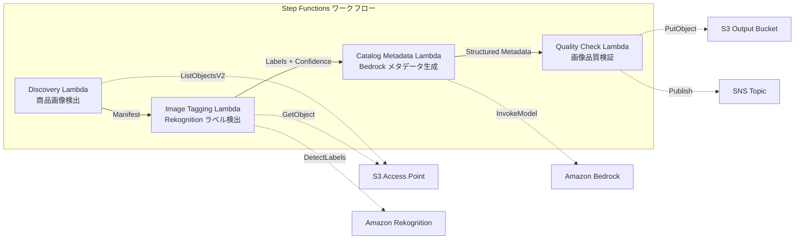

# UC11: Einzelhandel / EC — Automatische Bild-Tagging und Generierung von Katalog-Metadaten

🌐 **Language / 言語**: [日本語](README.md) | [English](README.en.md) | [한국어](README.ko.md) | [简体中文](README.zh-CN.md) | [繁體中文](README.zh-TW.md) | [Français](README.fr.md) | Deutsch | [Español](README.es.md)

## Übersicht
Dies ist ein serverloser Workflow, der S3 Access Points von FSx for NetApp ONTAP nutzt, um die automatische Bildkennzeichnung, die Generierung von Katalogmetadaten und die Bildqualitätsüberprüfung zu automatisieren.
### Fälle, in denen dieses Muster geeignet ist
- Produktbilder werden massiv auf FSx ONTAP gespeichert
- Ich möchte die automatische Kennzeichnung von Produktbildern (Kategorie, Farbe, Material) mit Rekognition durchführen
- Ich möchte strukturierte Katalogmetadaten (product_category, color, material, style_attributes) automatisch generieren
- Eine automatische Überprüfung der Bildqualitätsmetriken (Auflösung, Dateigröße, Seitenverhältnis) ist erforderlich
- Ich möchte die Verwaltung manueller Überprüfungsflags für Labels mit niedriger Zuverlässigkeit automatisieren
### Fälle, in denen dieses Muster nicht geeignet ist
- Echtzeit-Produktbildverarbeitung (API Gateway + Lambda ist geeignet)
- Großflächige Bildumwandlung und -verkleinerung (MediaConvert / EC2 ist geeignet)
- Direkte Integration mit bestehenden PIM (Product Information Management) Systemen erforderlich
- Umgebungen, in denen keine Netzwerkverbindung zur ONTAP REST API hergestellt werden kann
### Hauptfunktionen
- Automatische Erkennung von Produktbildern (.jpg,.jpeg,.png,.webp) über S3 AP
- Erkennung von Labels und Abrufen von Vertrauensbewertungen mit Rekognition DetectLabels
- Setzen eines manuellen Überprüfungsflags, falls die Vertrauensbewertung unter dem Schwellenwert (Standard: 70%) liegt
- Generierung von strukturierten Katalogmetadaten mit Bedrock
- Überprüfung der Bildqualitätsmetriken (minimale Auflösung, Dateigrößenbereich, Seitenverhältnis)
## Architektur



### Workflow-Schritte
1. **Erkennung**:.jpg-,.jpeg-,.png- und.webp-Dateien von S3 AP erkennen
2. **Bild-Tagging**: Labelerkennung mit Rekognition, manueller Überprüfungsflag bei unterer Vertrauensschwelle
3. **Katalog-Metadaten**: Strukturierte Katalog-Metadaten mit Bedrock generieren
4. **Qualitätsprüfung**: Bildqualitätsmetriken überprüfen und Bilder unter Schwelle flaggen
## Voraussetzungen
- AWS-Konto und geeignete IAM-Berechtigungen
- FSx for NetApp ONTAP-Dateisystem (ONTAP 9.17.1P4D3 oder höher)
- S3 Access Point aktivierte Volumes (zur Speicherung von Produktbildern)
- VPC, private Subnetz
- Amazon Bedrock Modellzugriff aktiviert (Claude / Nova)
## Bereitstellungsschritte

### 1. CloudFormation-Bereitstellung

```bash
aws cloudformation deploy \
  --template-file retail-catalog/template.yaml \
  --stack-name fsxn-retail-catalog \
  --parameter-overrides \
    S3AccessPointAlias=<your-volume-ext-s3alias> \
    S3AccessPointName=<your-s3ap-name> \
    VpcId=<your-vpc-id> \
    PrivateSubnetIds=<subnet-1>,<subnet-2> \
    ScheduleExpression="rate(1 hour)" \
    NotificationEmail=<your-email@example.com> \
    EnableVpcEndpoints=false \
    EnableCloudWatchAlarms=false \
  --capabilities CAPABILITY_IAM CAPABILITY_AUTO_EXPAND \
  --region ap-northeast-1
```

## Liste der Konfigurationsparameter

| パラメータ | 説明 | デフォルト | 必須 |
|-----------|------|----------|------|
| `S3AccessPointAlias` | FSx ONTAP S3 AP Alias（入力用） | — | ✅ |
| `S3AccessPointName` | S3 AP 名（ARN ベースの IAM 権限付与用。省略時は Alias ベースのみ） | `""` | ⚠️ 推奨 |
| `ScheduleExpression` | EventBridge Scheduler のスケジュール式 | `rate(1 hour)` | |
| `VpcId` | VPC ID | — | ✅ |
| `PrivateSubnetIds` | プライベートサブネット ID リスト | — | ✅ |
| `NotificationEmail` | SNS 通知先メールアドレス | — | ✅ |
| `ConfidenceThreshold` | Rekognition ラベル信頼度閾値 (%) | `70` | |
| `MapConcurrency` | Map ステートの並列実行数 | `10` | |
| `LambdaMemorySize` | Lambda メモリサイズ (MB) | `512` | |
| `LambdaTimeout` | Lambda タイムアウト (秒) | `300` | |
| `EnableVpcEndpoints` | Interface VPC Endpoints の有効化 | `false` | |
| `EnableCloudWatchAlarms` | CloudWatch Alarms の有効化 | `false` | |
| `EnableSnapStart` | Lambda SnapStart aktivieren (Kaltstart-Reduzierung) | `false` | |

## Bereinigung

```bash
aws s3 rm s3://fsxn-retail-catalog-output-${AWS_ACCOUNT_ID} --recursive

aws cloudformation delete-stack \
  --stack-name fsxn-retail-catalog \
  --region ap-northeast-1

aws cloudformation wait stack-delete-complete \
  --stack-name fsxn-retail-catalog \
  --region ap-northeast-1
```

## Referenzlinks
- [FSx ONTAP S3 Access Points 概要](https://docs.aws.amazon.com/fsx/latest/ONTAPGuide/accessing-data-via-s3-access-points.html)
- [Amazon Rekognition DetectLabels](https://docs.aws.amazon.com/rekognition/latest/dg/labels-detect-labels-image.html)
- [Amazon Bedrock API Referenz](https://docs.aws.amazon.com/bedrock/latest/APIReference/API_runtime_InvokeModel.html)
- [Streaming vs Polling Auswahlleitfaden](../docs/streaming-vs-polling-guide.md)
## Kinesis-Streamingmodus (Phase 3)
In Phase 3 kann zusätzlich zur EventBridge-Polling eine **nahezu echtzeitige Verarbeitung durch Kinesis Data Streams** optional genutzt werden.
### Aktivierung

```bash
aws cloudformation deploy \
  --template-file retail-catalog/template.yaml \
  --stack-name fsxn-retail-catalog \
  --parameter-overrides \
    EnableStreamingMode=true \
    ... # 他のパラメータ
  --capabilities CAPABILITY_IAM CAPABILITY_AUTO_EXPAND
```

### Architektur des Streaming-Modus

```
EventBridge (rate(1 min)) → Stream Producer Lambda
  → DynamoDB 状態テーブルと比較 → 変更検知
  → Kinesis Data Stream → Stream Consumer Lambda
  → 既存 ImageTagging + CatalogMetadata パイプライン
```

### Hauptfunktionen
- **Änderungserkennung**: Vergleichen der S3 AP-Objektliste und der DynamoDB-Statustabelle im Minutentakt, um neue, geänderte und gelöschte Dateien zu erkennen
- **Idempotente Verarbeitung**: Vermeidung von Doppelverarbeitung mit DynamoDB bedingten Schreibvorgängen
- **Fehlerbehandlung**: Sicherung fehlgeschlagener Datensätze mit bisect-on-error und der DynamoDB Dead-Letter-Tabelle
- **Koexistenz mit bestehendem Pfad**: Die Polling-Pfade (EventBridge + Step Functions) bleiben unverändert. Hybridbetrieb ist möglich.
### Musterauswahl
Welches Muster Sie wählen sollten, erfahren Sie im [Streaming vs. Polling-Auswahlleitfaden](../docs/streaming-vs-polling-guide.md).
## Unterstützte Regionen
UC11 verwendet die folgenden Dienste:
| サービス | リージョン制約 |
|---------|-------------|
| Amazon Rekognition | ほぼ全リージョンで利用可能 |
| Amazon Bedrock | 対応リージョンを確認（[Bedrock 対応リージョン](https://docs.aws.amazon.com/general/latest/gr/bedrock.html)） |
| Kinesis Data Streams | ほぼ全リージョンで利用可能（シャード料金はリージョンにより異なる） |
| AWS X-Ray | ほぼ全リージョンで利用可能 |
| CloudWatch EMF | ほぼ全リージョンで利用可能 |
> Beachten Sie, dass die Shard-Gebühren je nach Region variieren, wenn Sie den Kinesis-Streamingmodus aktivieren. Weitere Informationen finden Sie in der [Regionskompatibilitätsmatrix](../docs/region-compatibility.md).