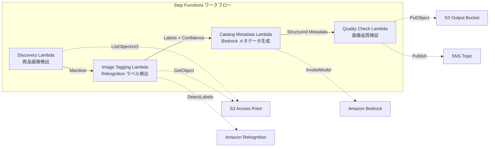

# UC11: Retail / E-commerce — Automatic Product Image Tagging and Catalog Metadata Generation

🌐 **Language / 言語**: [日本語](README.md) | English | [한국어](README.ko.md) | [简体中文](README.zh-CN.md) | [繁體中文](README.zh-TW.md) | [Français](README.fr.md) | [Deutsch](README.de.md) | [Español](README.es.md)

📚 **Documentation**: [Architecture Diagram](docs/architecture.en.md) | [Demo Guide](docs/demo-guide.en.md)

## Overview
Leveraging S3 Access Points in FSx for NetApp ONTAP, this is a serverless workflow to automate tagging of product images, generation of catalog metadata, and image quality checks.
### When this pattern is suitable
- A large number of product images are accumulated on FSx for NetApp ONTAP
- We want to implement automatic labeling of product images (category, color, material) with Rekognition
- We want to automatically generate structured catalog metadata (product_category, color, material, style_attributes)
- Automatic verification of image quality metrics (resolution, file size, aspect ratio) is required
- We want to automate the management of manual review flags for low-confidence labels
### Cases where this pattern is not suitable
- Real-time product image processing (API Gateway + Lambda is suitable)
- Large-scale image conversion and resizing processing (MediaConvert / EC2 is suitable)
- Direct integration with existing PIM (Product Information Management) systems is required
- Environments where network reachability to the ONTAP REST API cannot be ensured
### Main Features
- Automatically detect product images (.jpg,.jpeg,.png, .webp) via S3 AP
- Detect labels and obtain confidence scores using Rekognition DetectLabels
- Set a manual review flag if confidence is below the threshold (default: 70%)
- Generate structured catalog metadata with Bedrock
- Validate image quality metrics (minimum resolution, file size range, aspect ratio)
## Architecture



### Workflow Step
1. **Discovery**: Detect.jpg,.jpeg, .png, .webp files from S3 AP
2. **Image Tagging**: Detect labels with Rekognition, set manual review flags for those below the confidence threshold
3. **Catalog Metadata**: Generate structured catalog metadata with Bedrock
4. **Quality Check**: Validate image quality metrics and flag images below the threshold
## Prerequisites
- AWS account and appropriate IAM permissions
- FSx for NetApp ONTAP file systems (ONTAP 9.17.1P4D3 or later)
- S3 Access Point-enabled volume (to store product images)
- VPC, private subnets
- Amazon Bedrock model access enabled (Claude / Nova)
## Deployment Steps

### 1. CloudFormation Deployment

```bash
aws cloudformation deploy \
  --template-file retail-catalog/template.yaml \
  --stack-name fsxn-retail-catalog \
  --parameter-overrides \
    S3AccessPointAlias=<your-volume-ext-s3alias> \
    S3AccessPointName=<your-s3ap-name> \
    VpcId=<your-vpc-id> \
    PrivateSubnetIds=<subnet-1>,<subnet-2> \
    ScheduleExpression="rate(1 hour)" \
    NotificationEmail=<your-email@example.com> \
    EnableVpcEndpoints=false \
    EnableCloudWatchAlarms=false \
  --capabilities CAPABILITY_IAM CAPABILITY_AUTO_EXPAND \
  --region ap-northeast-1
```

## List of Configuration Parameters

| パラメータ | 説明 | デフォルト | 必須 |
|-----------|------|----------|------|
| `S3AccessPointAlias` | FSx ONTAP S3 AP Alias（入力用） | — | ✅ |
| `S3AccessPointName` | S3 AP 名（ARN ベースの IAM 権限付与用。省略時は Alias ベースのみ） | `""` | ⚠️ 推奨 |
| `ScheduleExpression` | EventBridge Scheduler のスケジュール式 | `rate(1 hour)` | |
| `VpcId` | VPC ID | — | ✅ |
| `PrivateSubnetIds` | プライベートサブネット ID リスト | — | ✅ |
| `NotificationEmail` | SNS 通知先メールアドレス | — | ✅ |
| `ConfidenceThreshold` | Rekognition ラベル信頼度閾値 (%) | `70` | |
| `MapConcurrency` | Map ステートの並列実行数 | `10` | |
| `LambdaMemorySize` | Lambda メモリサイズ (MB) | `512` | |
| `LambdaTimeout` | Lambda タイムアウト (秒) | `300` | |
| `EnableVpcEndpoints` | Interface VPC Endpoints の有効化 | `false` | |
| `EnableCloudWatchAlarms` | CloudWatch Alarms の有効化 | `false` | |
| `EnableSnapStart` | Enable Lambda SnapStart (cold start reduction) | `false` | |

## Clean up

```bash
aws s3 rm s3://fsxn-retail-catalog-output-${AWS_ACCOUNT_ID} --recursive

aws cloudformation delete-stack \
  --stack-name fsxn-retail-catalog \
  --region ap-northeast-1

aws cloudformation wait stack-delete-complete \
  --stack-name fsxn-retail-catalog \
  --region ap-northeast-1
```

## References
- [FSx for NetApp ONTAP S3 Access Points Overview](https://docs.aws.amazon.com/fsx/latest/ONTAPGuide/accessing-data-via-s3-access-points.html)
- [Amazon Rekognition DetectLabels](https://docs.aws.amazon.com/rekognition/latest/dg/labels-detect-labels-image.html)
- [Amazon Bedrock API Reference](https://docs.aws.amazon.com/bedrock/latest/APIReference/API_runtime_InvokeModel.html)
- [Streaming vs Polling Selection Guide](../docs/streaming-vs-polling-guide.md)
## Kinesis Streaming Mode (Phase 3)
In Phase 3, in addition to EventBridge polling, **near real-time processing with Kinesis Data Streams** can be opted-in for.
### Activation

```bash
aws cloudformation deploy \
  --template-file retail-catalog/template.yaml \
  --stack-name fsxn-retail-catalog \
  --parameter-overrides \
    EnableStreamingMode=true \
    ... # 他のパラメータ
  --capabilities CAPABILITY_IAM CAPABILITY_AUTO_EXPAND
```

### Streaming Mode Architecture

```
EventBridge (rate(1 min)) → Stream Producer Lambda
  → DynamoDB 状態テーブルと比較 → 変更検知
  → Kinesis Data Stream → Stream Consumer Lambda
  → 既存 ImageTagging + CatalogMetadata パイプライン
```

### Main Features
- **Change Detection**: Compare the S3 AP object list and the DynamoDB state table every minute to detect new, modified, and deleted files
- **Idempotent Processing**: Prevent duplicate processing with DynamoDB conditional writes
- **Failure Handling**: Back up failed records using bisect-on-error + DynamoDB dead-letter table
- **Coexistence with Existing Paths**: The polling path (EventBridge + Step Functions) remains unchanged. Hybrid operation is possible
### Pattern Selection
Which pattern to choose can be found in the [Streaming vs Polling Selection Guide](../docs/streaming-vs-polling-guide.md).
## Supported Regions
UC11 uses the following services:
| サービス | リージョン制約 |
|---------|-------------|
| Amazon Rekognition | ほぼ全リージョンで利用可能 |
| Amazon Bedrock | 対応リージョンを確認（[Bedrock 対応リージョン](https://docs.aws.amazon.com/general/latest/gr/bedrock.html)） |
| Kinesis Data Streams | ほぼ全リージョンで利用可能（シャード料金はリージョンにより異なる） |
| AWS X-Ray | ほぼ全リージョンで利用可能 |
| CloudWatch EMF | ほぼ全リージョンで利用可能 |
> When enabling Kinesis streaming mode, note that shard charges may vary by region. For more details, refer to the [Region Compatibility Matrix](../docs/region-compatibility.md).