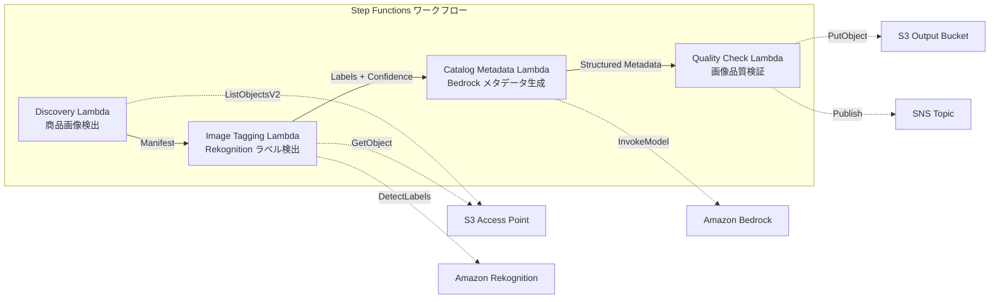

# UC11: Minorista / EC — Etiquetado automático de imágenes de productos y generación de metadatos de catálogo

🌐 **Language / 言語**: [日本語](README.md) | [English](README.en.md) | [한국어](README.ko.md) | [简体中文](README.zh-CN.md) | [繁體中文](README.zh-TW.md) | [Français](README.fr.md) | [Deutsch](README.de.md) | Español

## Resumen
Un flujo de trabajo sin servidor que aprovecha los Puntos de Acceso S3 de FSx for NetApp ONTAP para automatizar el etiquetado automático de imágenes de productos, la generación de metadatos de catálogo y la verificación de calidad de imagen.
### Casos en los que este patrón es adecuado
- Las imágenes de productos se están acumulando en gran cantidad en FSx ONTAP
- Quiero realizar el etiquetado automático de imágenes de productos (categoría, color, material) mediante Rekognition
- Deseo generar automáticamente metadatos de catálogo estructurado (product_category, color, material, style_attributes)
- Se necesita la verificación automática de métricas de calidad de imagen (resolución, tamaño de archivo, relación de aspecto)
- Quiero automatizar la gestión de la bandera de revisión manual de etiquetas de baja confiabilidad
### Casos donde este patrón no es adecuado
- Procesamiento de imágenes de productos en tiempo real (API Gateway + Lambda es adecuado)
- Procesamiento de conversión y redimensionamiento de imágenes a gran escala (MediaConvert / EC2 es adecuado)
- Se requiere integración directa con el sistema PIM (Product Information Management) existente
- Entornos donde no se puede garantizar el acceso a la red para la API REST de ONTAP
### Características principales
- Detección automática de imágenes de productos (.jpg,.jpeg,.png,.webp) a través de S3 AP
- Detección de etiquetas y obtención de puntajes de confianza con Rekognition DetectLabels
- Configuración de una bandera de revisión manual si la confianza es menor que el umbral (predeterminado: 70%)
- Generación de metadatos de catálogo estructurado con Bedrock
- Verificación de métricas de calidad de imagen (resolución mínima, rango de tamaño de archivo, relación de aspecto)
## Arquitectura



### Paso del flujo de trabajo
1. **Descubrimiento**: Detectar archivos.jpg,.jpeg,.png,.webp desde S3 AP
2. **Etiquetado de imágenes**: Detectar etiquetas con Rekognition, establecer la bandera de revisión manual para confianzas por debajo del umbral
3. **Metadatos de catálogo**: Generar metadatos de catálogo estructurados con Bedrock
4. **Control de calidad**: Verificar métricas de calidad de imagen, marcar imágenes por debajo del umbral
## Requisitos previos
- Cuenta de AWS y permisos IAM adecuados
- Sistema de archivos FSx for NetApp ONTAP (ONTAP 9.17.1P4D3 o superior)
- Punto de acceso S3 habilitado para volúmenes (almacenamiento de imágenes de productos)
- VPC, subredes privadas
- Acceso a modelos de Amazon Bedrock habilitado (Claude / Nova)
## Pasos de implementación

### 1. Despliegue de CloudFormation

```bash
aws cloudformation deploy \
  --template-file retail-catalog/template.yaml \
  --stack-name fsxn-retail-catalog \
  --parameter-overrides \
    S3AccessPointAlias=<your-volume-ext-s3alias> \
    S3AccessPointName=<your-s3ap-name> \
    VpcId=<your-vpc-id> \
    PrivateSubnetIds=<subnet-1>,<subnet-2> \
    ScheduleExpression="rate(1 hour)" \
    NotificationEmail=<your-email@example.com> \
    EnableVpcEndpoints=false \
    EnableCloudWatchAlarms=false \
  --capabilities CAPABILITY_IAM CAPABILITY_AUTO_EXPAND \
  --region ap-northeast-1
```

## Lista de parámetros de configuración

| パラメータ | 説明 | デフォルト | 必須 |
|-----------|------|----------|------|
| `S3AccessPointAlias` | FSx ONTAP S3 AP Alias（入力用） | — | ✅ |
| `S3AccessPointName` | S3 AP 名（ARN ベースの IAM 権限付与用。省略時は Alias ベースのみ） | `""` | ⚠️ 推奨 |
| `ScheduleExpression` | EventBridge Scheduler のスケジュール式 | `rate(1 hour)` | |
| `VpcId` | VPC ID | — | ✅ |
| `PrivateSubnetIds` | プライベートサブネット ID リスト | — | ✅ |
| `NotificationEmail` | SNS 通知先メールアドレス | — | ✅ |
| `ConfidenceThreshold` | Rekognition ラベル信頼度閾値 (%) | `70` | |
| `MapConcurrency` | Map ステートの並列実行数 | `10` | |
| `LambdaMemorySize` | Lambda メモリサイズ (MB) | `512` | |
| `LambdaTimeout` | Lambda タイムアウト (秒) | `300` | |
| `EnableVpcEndpoints` | Interface VPC Endpoints の有効化 | `false` | |
| `EnableCloudWatchAlarms` | CloudWatch Alarms の有効化 | `false` | |
| `EnableSnapStart` | Habilitar Lambda SnapStart (reducción de arranque en frío) | `false` | |

## Limpieza

```bash
aws s3 rm s3://fsxn-retail-catalog-output-${AWS_ACCOUNT_ID} --recursive

aws cloudformation delete-stack \
  --stack-name fsxn-retail-catalog \
  --region ap-northeast-1

aws cloudformation wait stack-delete-complete \
  --stack-name fsxn-retail-catalog \
  --region ap-northeast-1
```

## Enlaces de referencia
- [Puntos de Acceso a S3 de FSx ONTAP 概要](https://docs.aws.amazon.com/fsx/latest/ONTAPGuide/accessing-data-via-s3-access-points.html)
- [Amazon Rekognition DetectLabels](https://docs.aws.amazon.com/rekognition/latest/dg/labels-detect-labels-image.html)
- [Referencia de la API de Amazon Bedrock](https://docs.aws.amazon.com/bedrock/latest/APIReference/API_runtime_InvokeModel.html)
- [Guía de Selección de Streaming vs  Polling](../docs/streaming-vs-polling-guide.md)
## Modo de transmisión Kinesis (Fase 3)
En la fase 3, además del sondeo de EventBridge, está disponible de manera opcional el **procesamiento casi en tiempo real con Kinesis Data Streams**.
### Activación

```bash
aws cloudformation deploy \
  --template-file retail-catalog/template.yaml \
  --stack-name fsxn-retail-catalog \
  --parameter-overrides \
    EnableStreamingMode=true \
    ... # 他のパラメータ
  --capabilities CAPABILITY_IAM CAPABILITY_AUTO_EXPAND
```

### Arquitectura del modo de streaming

```
EventBridge (rate(1 min)) → Stream Producer Lambda
  → DynamoDB 状態テーブルと比較 → 変更検知
  → Kinesis Data Stream → Stream Consumer Lambda
  → 既存 ImageTagging + CatalogMetadata パイプライン
```

### Características principales
- **Detectar cambios**: Compara la lista de objetos S3 AP y la tabla de estado de DynamoDB a intervalos de 1 minuto para detectar archivos nuevos, modificados y eliminados
- **Procesamiento idempotente**: Evita la duplicación de procesamiento con escrituras condicionales de DynamoDB
- **Manejo de fallos**: Bisectar en caso de error + tabla de cartas muertas de DynamoDB para almacenar registros fallidos
- **Coexistencia con rutas existentes**: La ruta de sondeo (EventBridge + Step Functions) permanece sin cambios. Operación híbrida posible
### Selección de patrón
¿Qué patrón debe elegir? Consulte la [Guía de selección entre streaming y polling](../docs/streaming-vs-polling-guide.md).
## Regiones compatibles
UC11 utiliza los siguientes servicios:
| サービス | リージョン制約 |
|---------|-------------|
| Amazon Rekognition | ほぼ全リージョンで利用可能 |
| Amazon Bedrock | 対応リージョンを確認（[Bedrock 対応リージョン](https://docs.aws.amazon.com/general/latest/gr/bedrock.html)） |
| Kinesis Data Streams | ほぼ全リージョンで利用可能（シャード料金はリージョンにより異なる） |
| AWS X-Ray | ほぼ全リージョンで利用可能 |
| CloudWatch EMF | ほぼ全リージョンで利用可能 |
> Tenga en cuenta que los precios de los shards varían según la región al habilitar el modo de transmisión de Kinesis. Para más detalles, consulte la [matriz de compatibilidad de regiones](../docs/region-compatibility.md).