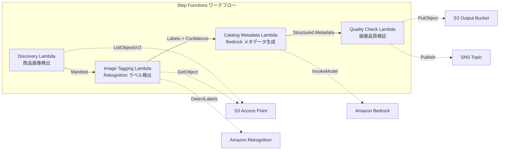

# UC11 : Détail / EC — Balisage automatique des images de produits et génération de métadonnées de catalogue

🌐 **Language / 言語**: [日本語](README.md) | [English](README.en.md) | [한국어](README.ko.md) | [简体中文](README.zh-CN.md) | [繁體中文](README.zh-TW.md) | Français | [Deutsch](README.de.md) | [Español](README.es.md)

## Aperçu
Voici un workflow sans serveur qui utilise les Amazon S3 Access Points de FSx for NetApp ONTAP pour automatiser le tagging des images de produits, la génération des métadonnées de catalogue et les vérifications de qualité d'image.
### Cas où ce motif est approprié
- Les images de produits s'accumulent en grand nombre sur FSx ONTAP
- Je souhaite effectuer l'étiquetage automatique des images de produits (catégorie, couleur, matériau) avec Rekognition
- Je souhaite générer automatiquement des métadonnées de catalogue structurées (product_category, color, material, style_attributes)
- Une vérification automatique des métriques de qualité d'image (résolution, taille de fichier, rapport d'aspect) est nécessaire
- Je souhaite automatiser la gestion des indicateurs de révision manuelle pour les étiquettes de faible fiabilité
### Cas où ce modèle ne convient pas
- Traitement d'images de produits en temps réel (API Gateway + Lambda est approprié)
- Traitement d'image et redimensionnement à grande échelle (MediaConvert / EC2 est approprié)
- Intégration directe requise avec un système PIM (Product Information Management) existant
- Environnements où la connectivité réseau vers l'ONTAP REST API n'est pas garantie
### Principales fonctionnalités
- Détection automatique des images de produits (.jpg, .jpeg,.png, .webp) via S3 AP
- Détection des étiquettes et obtention des scores de confiance avec Rekognition DetectLabels
- Définir un drapeau de révision manuelle si le score de confiance est inférieur au seuil (par défaut : 70 %)
- Génération de métadonnées de catalogue structuré avec Bedrock
- Validation des métriques de qualité d'image (résolution minimale, plage de taille de fichier, rapport d'aspect)
## Architecture



### Étapes du flux de travail
1. **Découverte** : Détection de fichiers .jpg,.jpeg,.png, .webp depuis S3 AP
2. **Balisation d'images** : Détection de labels avec Rekognition, images en dessous du seuil de confiance marquées pour révision manuelle
3. **Métadonnées de catalogue** : Génération de métadonnées de catalogue structurées avec Bedrock
4. **Vérification de qualité** : Vérification des métriques de qualité d'image, images en dessous du seuil marquées
## Conditions préalables
- Compte AWS et permissions IAM appropriées
- Système de fichiers FSx for NetApp ONTAP (ONTAP 9.17.1P4D3 ou supérieur)
- Point d'accès S3 activé pour les volumes (stockage des images de produits)
- VPC, sous-réseaux privés
- Accès aux modèles Amazon Bedrock activé (Claude / Nova)
## Étapes de déploiement

### 1. Déploiement CloudFormation

```bash
aws cloudformation deploy \
  --template-file retail-catalog/template.yaml \
  --stack-name fsxn-retail-catalog \
  --parameter-overrides \
    S3AccessPointAlias=<your-volume-ext-s3alias> \
    S3AccessPointName=<your-s3ap-name> \
    VpcId=<your-vpc-id> \
    PrivateSubnetIds=<subnet-1>,<subnet-2> \
    ScheduleExpression="rate(1 hour)" \
    NotificationEmail=<your-email@example.com> \
    EnableVpcEndpoints=false \
    EnableCloudWatchAlarms=false \
  --capabilities CAPABILITY_IAM CAPABILITY_AUTO_EXPAND \
  --region ap-northeast-1
```

## Liste des paramètres de configuration

| パラメータ | 説明 | デフォルト | 必須 |
|-----------|------|----------|------|
| `S3AccessPointAlias` | FSx ONTAP S3 AP Alias（入力用） | — | ✅ |
| `S3AccessPointName` | S3 AP 名（ARN ベースの IAM 権限付与用。省略時は Alias ベースのみ） | `""` | ⚠️ 推奨 |
| `ScheduleExpression` | EventBridge Scheduler のスケジュール式 | `rate(1 hour)` | |
| `VpcId` | VPC ID | — | ✅ |
| `PrivateSubnetIds` | プライベートサブネット ID リスト | — | ✅ |
| `NotificationEmail` | SNS 通知先メールアドレス | — | ✅ |
| `ConfidenceThreshold` | Rekognition ラベル信頼度閾値 (%) | `70` | |
| `MapConcurrency` | Map ステートの並列実行数 | `10` | |
| `LambdaMemorySize` | Lambda メモリサイズ (MB) | `512` | |
| `LambdaTimeout` | Lambda タイムアウト (秒) | `300` | |
| `EnableVpcEndpoints` | Interface VPC Endpoints の有効化 | `false` | |
| `EnableCloudWatchAlarms` | CloudWatch Alarms の有効化 | `false` | |
| `EnableSnapStart` | Activer Lambda SnapStart (réduction du démarrage à froid) | `false` | |

## Nettoyage

```bash
aws s3 rm s3://fsxn-retail-catalog-output-${AWS_ACCOUNT_ID} --recursive

aws cloudformation delete-stack \
  --stack-name fsxn-retail-catalog \
  --region ap-northeast-1

aws cloudformation wait stack-delete-complete \
  --stack-name fsxn-retail-catalog \
  --region ap-northeast-1
```

## Liens utiles
- [FSx ONTAP S3 Access Points 概要](https://docs.aws.amazon.com/fsx/latest/ONTAPGuide/accessing-data-via-s3-access-points.html)
- [Amazon Rekognition DetectLabels](https://docs.aws.amazon.com/rekognition/latest/dg/labels-detect-labels-image.html)
- [Amazon Bedrock API リファレンス](https://docs.aws.amazon.com/bedrock/latest/APIReference/API_runtime_InvokeModel.html)
- [Guide de choix : Streaming vs  Polling](../docs/streaming-vs-polling-guide.md)
## Mode de diffusion Kinesis (Phase 3)
Phase 3 : en plus du sondage EventBridge, le traitement quasi en temps réel avec Kinesis Data Streams est disponible en option.
### Activation

```bash
aws cloudformation deploy \
  --template-file retail-catalog/template.yaml \
  --stack-name fsxn-retail-catalog \
  --parameter-overrides \
    EnableStreamingMode=true \
    ... # 他のパラメータ
  --capabilities CAPABILITY_IAM CAPABILITY_AUTO_EXPAND
```

### Architecture du mode streaming

```
EventBridge (rate(1 min)) → Stream Producer Lambda
  → DynamoDB 状態テーブルと比較 → 変更検知
  → Kinesis Data Stream → Stream Consumer Lambda
  → 既存 ImageTagging + CatalogMetadata パイプライン
```

### Principales caractéristiques
- **Détection de changements** : Comparaison des listes d'objets S3 AP et de la table d'état DynamoDB toutes les minutes pour détecter les fichiers nouveaux, modifiés ou supprimés
- **Traitement idempotent** : Éviter les traitements en double grâce aux écritures conditionnelles DynamoDB
- **Gestion des incidents** : Bisecter les erreurs et sauvegarder les enregistrements défaillants dans une table de lettres mortes DynamoDB
- **Coexistence avec des chemins existants** : Le chemin de sondage (EventBridge + Step Functions) reste inchangé, permettant une exploitation hybride
### Sélection de motif
Lequel des deux modèles choisir dépend du [guide de choix entre le streaming et le polling](../docs/streaming-vs-polling-guide.md).
## Régions prises en charge
UC11 utilise les services suivants :
| サービス | リージョン制約 |
|---------|-------------|
| Amazon Rekognition | ほぼ全リージョンで利用可能 |
| Amazon Bedrock | 対応リージョンを確認（[Bedrock 対応リージョン](https://docs.aws.amazon.com/general/latest/gr/bedrock.html)） |
| Kinesis Data Streams | ほぼ全リージョンで利用可能（シャード料金はリージョンにより異なる） |
| AWS X-Ray | ほぼ全リージョンで利用可能 |
| CloudWatch EMF | ほぼ全リージョンで利用可能 |
> Si vous activez le mode de streaming Kinesis, notez que les frais de shard varient selon la région. Pour plus de détails, consultez la [Matrice de compatibilité régionale](../docs/region-compatibility.md).