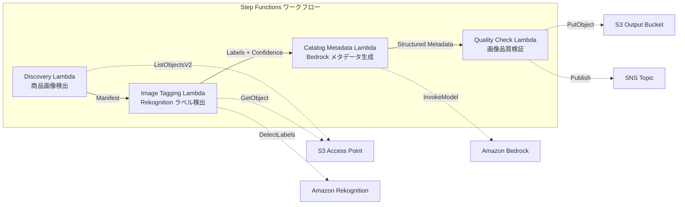

# UC11: 소매 / EC — 제품 이미지 자동 태깅 및 카탈로그 메타데이터 생성

🌐 **Language / 言語**: [日本語](README.md) | [English](README.en.md) | 한국어 | [简体中文](README.zh-CN.md) | [繁體中文](README.zh-TW.md) | [Français](README.fr.md) | [Deutsch](README.de.md) | [Español](README.es.md)

## 개요
FSx for NetApp ONTAP의 S3 액세스 포인트를 활용하여 제품 이미지의 자동 태깅, 카탈로그 메타데이터 생성, 이미지 품질 검사를 자동화하는 서버리스 워크플로입니다.
### 이 패턴이 적합한 경우
- 상품 이미지가 FSx ONTAP에 대량으로 저장되어 있습니다.
- Rekognition을 사용하여 상품 이미지에 대한 자동 라벨링(카테고리, 색상, 소재)을 구현하고 싶습니다.
- 구조화된 카탈로그 메타데이터(product_category, color, material, style_attributes)를 자동 생성하고 싶습니다.
- 이미지 품질 메트릭스(해상도, 파일 크기, 종횡비)의 자동 검증이 필요합니다.
- 신뢰도가 낮은 라벨의 수동 검토 플래그 관리를 자동화하고 싶습니다.
### 이 패턴이 적합하지 않은 경우
- 실시간 제품 이미지 처리 (API Gateway + Lambda가 적합)
- 대규모 이미지 변환 및 리사이징 처리 (MediaConvert / EC2가 적합)
- 기존 PIM(Product Information Management) 시스템과의 직접 통합 필요
- ONTAP REST API에 대한 네트워크 도달성을 보장할 수 없는 환경
### 주요 기능
- S3 AP 경로를 통한 제품 이미지(.jpg,.jpeg,.png,.webp) 자동 감지
- Rekognition DetectLabels를 통한 라벨 감지 및 신뢰도 점수 획득
- 신뢰도 임계값(기본값: 70%) 미만일 경우 수동 검토 플래그 설정
- Bedrock을 통한 구조화된 카탈로그 메타데이터 생성
- 이미지 품질 메트릭스 검증(최소 해상도, 파일 크기 범위, 종횡비)
## 아키텍처



### 워크플로 단계
1. **Discovery**: S3 AP에서.jpg,.jpeg,.png,.webp 파일 검색
2. **Image Tagging**: Rekognition으로 레이블 검출, 신뢰도 임계값 미만은 수동 검토 플래그 설정
3. **Catalog Metadata**: Bedrock으로 구조화된 카탈로그 메타데이터 생성
4. **Quality Check**: 이미지 품질 메트릭스 검증, 임계값 미만의 이미지 플래그
## 전제 조건
- AWS 계정 및 적절한 IAM 권한
- NetApp ONTAP용 FSx 파일 시스템(ONTAP 9.17.1P4D3 이상)
- S3 액세스 포인트가 활성화된 볼륨(상품 이미지 저장)
- VPC, 프라이빗 서브넷
- Amazon Bedrock 모델 액세스 활성화(Claude / Nova)
## 배포 절차

### 1. CloudFormation 배포

규칙:
- AWS 서비스 이름은 영어로 유지(Amazon Bedrock, AWS Step Functions, Amazon Athena, Amazon S3, AWS Lambda, Amazon FSx for NetApp ONTAP, Amazon CloudWatch, AWS CloudFormation 등)
- 기술 용어는 번역하지 않음(GDSII, DRC, OASIS, GDS, Lambda, tapeout 등)
- 인라인 코드(`...`)는 번역하지 않음
- 파일 경로 및 URL은 번역하지 않음
- 자연스럽게 번역하고, 그대로 번역하지 않음
- 설명은 반환하지 않음, 번역된 텍스트만 반환

```bash
aws cloudformation deploy \
  --template-file retail-catalog/template.yaml \
  --stack-name fsxn-retail-catalog \
  --parameter-overrides \
    S3AccessPointAlias=<your-volume-ext-s3alias> \
    S3AccessPointName=<your-s3ap-name> \
    VpcId=<your-vpc-id> \
    PrivateSubnetIds=<subnet-1>,<subnet-2> \
    ScheduleExpression="rate(1 hour)" \
    NotificationEmail=<your-email@example.com> \
    EnableVpcEndpoints=false \
    EnableCloudWatchAlarms=false \
  --capabilities CAPABILITY_IAM CAPABILITY_AUTO_EXPAND \
  --region ap-northeast-1
```

## 설정 파라미터 목록

| パラメータ | 説明 | デフォルト | 必須 |
|-----------|------|----------|------|
| `S3AccessPointAlias` | FSx ONTAP S3 AP Alias（入力用） | — | ✅ |
| `S3AccessPointName` | S3 AP 名（ARN ベースの IAM 権限付与用。省略時は Alias ベースのみ） | `""` | ⚠️ 推奨 |
| `ScheduleExpression` | EventBridge Scheduler のスケジュール式 | `rate(1 hour)` | |
| `VpcId` | VPC ID | — | ✅ |
| `PrivateSubnetIds` | プライベートサブネット ID リスト | — | ✅ |
| `NotificationEmail` | SNS 通知先メールアドレス | — | ✅ |
| `ConfidenceThreshold` | Rekognition ラベル信頼度閾値 (%) | `70` | |
| `MapConcurrency` | Map ステートの並列実行数 | `10` | |
| `LambdaMemorySize` | Lambda メモリサイズ (MB) | `512` | |
| `LambdaTimeout` | Lambda タイムアウト (秒) | `300` | |
| `EnableVpcEndpoints` | Interface VPC Endpoints の有効化 | `false` | |
| `EnableCloudWatchAlarms` | CloudWatch Alarms の有効化 | `false` | |
| `EnableSnapStart` | Lambda SnapStart 활성화 (콜드 스타트 단축) | `false` | |

## 정리

```bash
aws s3 rm s3://fsxn-retail-catalog-output-${AWS_ACCOUNT_ID} --recursive

aws cloudformation delete-stack \
  --stack-name fsxn-retail-catalog \
  --region ap-northeast-1

aws cloudformation wait stack-delete-complete \
  --stack-name fsxn-retail-catalog \
  --region ap-northeast-1
```

## 참조 링크
- [FSx ONTAP S3 액세스 포인트 개요](https://docs.aws.amazon.com/fsx/latest/ONTAPGuide/accessing-data-via-s3-access-points.html)
- [Amazon Rekognition DetectLabels](https://docs.aws.amazon.com/rekognition/latest/dg/labels-detect-labels-image.html)
- [Amazon Bedrock API 참조](https://docs.aws.amazon.com/bedrock/latest/APIReference/API_runtime_InvokeModel.html)
- [스트리밍 vs 폴링 선택 가이드](../docs/streaming-vs-polling-guide.md)
## Kinesis 스트리밍 모드(Phase 3)
페이즈 3에서는 EventBridge 폴링 외에도 **Kinesis Data Streams를 통한 거의 실시간 처리**를 선택적으로 사용할 수 있습니다.
### 활성화

```bash
aws cloudformation deploy \
  --template-file retail-catalog/template.yaml \
  --stack-name fsxn-retail-catalog \
  --parameter-overrides \
    EnableStreamingMode=true \
    ... # 他のパラメータ
  --capabilities CAPABILITY_IAM CAPABILITY_AUTO_EXPAND
```

### 스트리밍 모드의 아키텍처

```
EventBridge (rate(1 min)) → Stream Producer Lambda
  → DynamoDB 状態テーブルと比較 → 変更検知
  → Kinesis Data Stream → Stream Consumer Lambda
  → 既存 ImageTagging + CatalogMetadata パイプライン
```

### 주요 특징
- **변경 감지**: S3 AP 객체 목록과 DynamoDB 상태 테이블을 1분 간격으로 비교하여 새, 수정된, 삭제된 파일 감지
- **아이디언트 처리**: DynamoDB 조건부 쓰기를 통한 중복 처리 방지
- **장애 처리**: bisect-on-error + DynamoDB 데드레터 테이블을 사용하여 실패 레코드 보관
- **기존 경로와 공존**: 폴링 경로(EventBridge + Step Functions)는 변경 없음. 하이브리드 운영 가능
### 패턴 선택
어떤 패턴을 선택해야 하는지는 [스트리밍 vs 폴링 선택 가이드](../docs/streaming-vs-polling-guide.md)를 참조하세요.
## 지원되는 리전
UC11은 다음 서비스를 사용합니다:
| サービス | リージョン制約 |
|---------|-------------|
| Amazon Rekognition | ほぼ全リージョンで利用可能 |
| Amazon Bedrock | 対応リージョンを確認（[Bedrock 対応リージョン](https://docs.aws.amazon.com/general/latest/gr/bedrock.html)） |
| Kinesis Data Streams | ほぼ全リージョンで利用可能（シャード料金はリージョンにより異なる） |
| AWS X-Ray | ほぼ全リージョンで利用可能 |
| CloudWatch EMF | ほぼ全リージョンで利用可能 |
> Kinesis 스트리밍 모드를 활성화할 때는 리전에 따라 샤드 요금이 다르다는 점에 유의하세요. 자세한 내용은 [리전 호환성 매트릭스](../docs/region-compatibility.md)를 참조하세요.