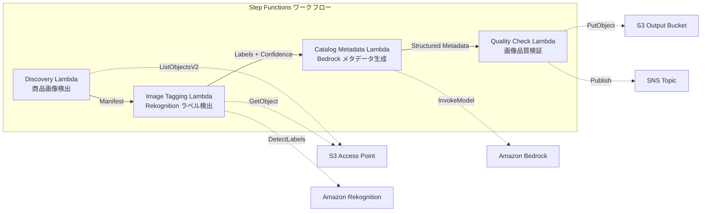

# UC11: 小売 / EC — 商品画像自動タグ付け・カタログメタデータ生成

🌐 **Language / 言語**: 日本語 | [English](README.en.md) | [한국어](README.ko.md) | [简体中文](README.zh-CN.md) | [繁體中文](README.zh-TW.md) | [Français](README.fr.md) | [Deutsch](README.de.md) | [Español](README.es.md)

📚 **ドキュメント**: [アーキテクチャ図](docs/architecture.md) | [デモガイド](docs/demo-guide.md)

## 概要

FSx for NetApp ONTAP の S3 Access Points を活用し、商品画像の自動タグ付け、カタログメタデータ生成、画像品質チェックを自動化するサーバーレスワークフローです。

### このパターンが適しているケース

- 商品画像が FSx ONTAP 上に大量に蓄積されている
- Rekognition による商品画像の自動ラベル付け（カテゴリ、色、素材）を実施したい
- 構造化カタログメタデータ（product_category, color, material, style_attributes）を自動生成したい
- 画像品質メトリクス（解像度、ファイルサイズ、アスペクト比）の自動検証が必要
- 低信頼度ラベルの手動レビューフラグ管理を自動化したい

### このパターンが適さないケース

- リアルタイムの商品画像処理（API Gateway + Lambda が適切）
- 大規模な画像変換・リサイズ処理（MediaConvert / EC2 が適切）
- 既存の PIM（Product Information Management）システムとの直接統合が必要
- ONTAP REST API へのネットワーク到達性が確保できない環境

### 主な機能

- S3 AP 経由で商品画像（.jpg, .jpeg, .png, .webp）を自動検出
- Rekognition DetectLabels によるラベル検出と信頼度スコア取得
- 信頼度閾値（デフォルト: 70%）未満の場合に手動レビューフラグを設定
- Bedrock による構造化カタログメタデータ生成
- 画像品質メトリクス検証（最小解像度、ファイルサイズ範囲、アスペクト比）


## Success Metrics

### Outcome
商品画像タグ付け・カタログメタデータ生成の自動化により、EC サイト更新工数を削減する。

### Metrics
| メトリクス | 目標値（例） |
|-----------|------------|
| 処理済み画像数 / 実行 | > 500 images |
| ラベル検出精度 | > 90% |
| メタデータ生成成功率 | > 95% |
| 処理時間 / 画像 | < 10 秒 |
| コスト / 実行 | < $5 |
| Human Review 対象率 | < 10%（低信頼度ラベル） |

### Measurement Method
Step Functions 実行履歴、Rekognition label confidence、S3 出力メタデータ、CloudWatch Metrics。

## アーキテクチャ



### ワークフローステップ

1. **Discovery**: S3 AP から .jpg, .jpeg, .png, .webp ファイルを検出
2. **Image Tagging**: Rekognition でラベル検出、信頼度閾値未満は手動レビューフラグ設定
3. **Catalog Metadata**: Bedrock で構造化カタログメタデータを生成
4. **Quality Check**: 画像品質メトリクスを検証し、閾値未満の画像をフラグ

## 前提条件

- AWS アカウントと適切な IAM 権限
- FSx for NetApp ONTAP ファイルシステム（ONTAP 9.17.1P4D3 以上）
- S3 Access Point が有効化されたボリューム（商品画像を格納）
- VPC、プライベートサブネット
- Amazon Bedrock モデルアクセスが有効（Claude / Nova）

## デプロイ手順

### 1. CloudFormation デプロイ

```bash
aws cloudformation deploy \
  --template-file retail-catalog/template.yaml \
  --stack-name fsxn-retail-catalog \
  --parameter-overrides \
    S3AccessPointAlias=<your-volume-ext-s3alias> \
    S3AccessPointName=<your-s3ap-name> \
    VpcId=<your-vpc-id> \
    PrivateSubnetIds=<subnet-1>,<subnet-2> \
    ScheduleExpression="rate(1 hour)" \
    NotificationEmail=<your-email@example.com> \
    EnableVpcEndpoints=false \
    EnableCloudWatchAlarms=false \
  --capabilities CAPABILITY_IAM CAPABILITY_AUTO_EXPAND \
  --region ap-northeast-1
```

## 設定パラメータ一覧

| パラメータ | 説明 | デフォルト | 必須 |
|-----------|------|----------|------|
| `S3AccessPointAlias` | FSx ONTAP S3 AP Alias（入力用） | — | ✅ |
| `S3AccessPointName` | S3 AP 名（ARN ベースの IAM 権限付与用。省略時は Alias ベースのみ） | `""` | ⚠️ 推奨 |
| `ScheduleExpression` | EventBridge Scheduler のスケジュール式 | `rate(1 hour)` | |
| `VpcId` | VPC ID | — | ✅ |
| `PrivateSubnetIds` | プライベートサブネット ID リスト | — | ✅ |
| `NotificationEmail` | SNS 通知先メールアドレス | — | ✅ |
| `ConfidenceThreshold` | Rekognition ラベル信頼度閾値 (%) | `70` | |
| `MapConcurrency` | Map ステートの並列実行数 | `10` | |
| `LambdaMemorySize` | Lambda メモリサイズ (MB) | `512` | |
| `LambdaTimeout` | Lambda タイムアウト (秒) | `300` | |
| `EnableVpcEndpoints` | Interface VPC Endpoints の有効化 | `false` | |
| `EnableCloudWatchAlarms` | CloudWatch Alarms の有効化 | `false` | |

## クリーンアップ

```bash
aws s3 rm s3://fsxn-retail-catalog-output-${AWS_ACCOUNT_ID} --recursive

aws cloudformation delete-stack \
  --stack-name fsxn-retail-catalog \
  --region ap-northeast-1

aws cloudformation wait stack-delete-complete \
  --stack-name fsxn-retail-catalog \
  --region ap-northeast-1
```

## 参考リンク

- [FSx ONTAP S3 Access Points 概要](https://docs.aws.amazon.com/fsx/latest/ONTAPGuide/accessing-data-via-s3-access-points.html)
- [Amazon Rekognition DetectLabels](https://docs.aws.amazon.com/rekognition/latest/dg/labels-detect-labels-image.html)
- [Amazon Bedrock API リファレンス](https://docs.aws.amazon.com/bedrock/latest/APIReference/API_runtime_InvokeModel.html)
- [ストリーミング vs ポーリング選択ガイド](../docs/streaming-vs-polling-guide.md)

## Kinesis ストリーミングモード（Phase 3）

Phase 3 では、EventBridge ポーリングに加えて **Kinesis Data Streams によるニアリアルタイム処理** をオプトインで利用できます。

### 有効化

```bash
aws cloudformation deploy \
  --template-file retail-catalog/template.yaml \
  --stack-name fsxn-retail-catalog \
  --parameter-overrides \
    EnableStreamingMode=true \
    ... # 他のパラメータ
  --capabilities CAPABILITY_IAM CAPABILITY_AUTO_EXPAND
```

### ストリーミングモードのアーキテクチャ

```
EventBridge (rate(1 min)) → Stream Producer Lambda
  → DynamoDB 状態テーブルと比較 → 変更検知
  → Kinesis Data Stream → Stream Consumer Lambda
  → 既存 ImageTagging + CatalogMetadata パイプライン
```

### 主な特徴

- **変更検知**: 1 分間隔で S3 AP オブジェクト一覧と DynamoDB 状態テーブルを比較し、新規・変更・削除ファイルを検出
- **冪等処理**: DynamoDB conditional writes による重複処理防止
- **障害ハンドリング**: bisect-on-error + DynamoDB dead-letter テーブルで失敗レコードを退避
- **既存パスとの共存**: ポーリングパス（EventBridge + Step Functions）は変更なし。ハイブリッド運用が可能

### パターン選択

どちらのパターンを選択すべきかは [ストリーミング vs ポーリング選択ガイド](../docs/streaming-vs-polling-guide.md) を参照してください。

## Supported Regions

UC11 は以下のサービスを使用します:

| サービス | リージョン制約 |
|---------|-------------|
| Amazon Rekognition | ほぼ全リージョンで利用可能 |
| Amazon Bedrock | 対応リージョンを確認（[Bedrock 対応リージョン](https://docs.aws.amazon.com/general/latest/gr/bedrock.html)） |
| Kinesis Data Streams | ほぼ全リージョンで利用可能（シャード料金はリージョンにより異なる） |
| AWS X-Ray | ほぼ全リージョンで利用可能 |
| CloudWatch EMF | ほぼ全リージョンで利用可能 |

> Kinesis ストリーミングモードを有効化する場合、シャード料金がリージョンにより異なる点に注意してください。詳細は [リージョン互換性マトリックス](../docs/region-compatibility.md) を参照。


---

## AWS ドキュメントリンク

| サービス | ドキュメント |
|---------|------------|
| FSx for NetApp ONTAP | [ユーザーガイド](https://docs.aws.amazon.com/fsx/latest/ONTAPGuide/what-is-fsx-ontap.html) |
| S3 Access Points | [S3 AP for FSx ONTAP](https://docs.aws.amazon.com/fsx/latest/ONTAPGuide/s3-access-points.html) |
| Step Functions | [開発者ガイド](https://docs.aws.amazon.com/step-functions/latest/dg/welcome.html) |
| Amazon Rekognition | [開発者ガイド](https://docs.aws.amazon.com/rekognition/latest/dg/what-is.html) |
| Amazon Kinesis | [開発者ガイド](https://docs.aws.amazon.com/streams/latest/dev/introduction.html) |
| Amazon Bedrock | [ユーザーガイド](https://docs.aws.amazon.com/bedrock/latest/userguide/what-is-bedrock.html) |

### Well-Architected Framework 対応

| 柱 | 対応 |
|----|------|
| 運用上の優秀性 | X-Ray、EMF、Kinesis メトリクス、DLQ 監視 |
| セキュリティ | 最小権限 IAM、KMS 暗号化、商品データアクセス制御 |
| 信頼性 | Kinesis bisect-on-error、DLQ、Step Functions Retry |
| パフォーマンス効率 | ストリーミング処理、並列画像タグ付け |
| コスト最適化 | サーバーレス、Kinesis On-Demand モード |
| 持続可能性 | 差分処理（変更画像のみ）、DynamoDB 状態管理 |


---

## コスト見積もり（月額概算）

> **注記**: 以下は ap-northeast-1 リージョンの概算であり、実際のコストは使用量により異なります。最新の料金は [AWS Pricing Calculator](https://calculator.aws/) で確認してください。

### サーバーレスコンポーネント（従量課金）

| サービス | 単価 | 想定使用量 | 月額概算 |
|---------|------|-----------|---------|
| Lambda | $0.0000166667/GB-sec | 6 関数 × 500 images/日 | ~$1-5 |
| S3 API (GetObject/ListObjects) | $0.0047/10K requests | ~10K requests/日 | ~$1.5 |
| Step Functions | $0.025/1K state transitions | ~1K transitions/日 | ~$0.75 |
| Bedrock (Nova Lite) | $0.00006/1K input tokens | ~50K tokens/実行 | ~$3-10 |
| Athena | $5/TB scanned | ~10 MB/クエリ | ~$0.5-2 |
| SNS | $0.50/100K notifications | ~100 notifications/日 | ~$0.15 |
| CloudWatch Logs | $0.76/GB ingested | ~1 GB/月 | ~$0.76 |
| Kinesis Data Stream (オプション) | $0.015/shard-hour |


### 固定コスト（FSx for ONTAP — 既存環境前提）

| コンポーネント | 月額 |
|--------------|------|
| FSx ONTAP (128 MBps, 1 TB) | ~$230 (既存環境を共有) |
| S3 Access Point | 追加料金なし（S3 API 料金のみ） |

### 合計概算

| 構成 | 月額概算 |
|------|---------|
| 最小構成（日次 1 回実行） | ~$5-15 |
| 標準構成（時次実行） | ~$15-50 |
| 大規模構成（高頻度 + アラーム） | ~$50-150 |

> **Governance Caveat**: コスト見積もりは概算であり、保証値ではありません。実際の請求額は使用パターン、データ量、リージョンにより異なります。

---

## ローカルテスト

### Prerequisites チェック

```bash
# 前提条件の確認
aws --version          # AWS CLI v2
sam --version          # SAM CLI
python3 --version      # Python 3.9+
docker --version       # Docker (sam local 用)
aws sts get-caller-identity  # AWS 認証情報
```

### sam local invoke

```bash
# ビルド
sam build

# Discovery Lambda のローカル実行
sam local invoke DiscoveryFunction --event events/discovery-event.json

# 環境変数オーバーライド付き
sam local invoke DiscoveryFunction \
  --event events/discovery-event.json \
  --env-vars env.json
```

### ユニットテスト

```bash
python3 -m pytest tests/ -v
```

詳細は [ローカルテスト クイックスタート](../docs/local-testing-quick-start.md) を参照してください。

---

## 出力サンプル (Output Sample)

商品画像タグ付けパイプラインの出力例:

```json
{
  "discovery": {
    "status": "completed",
    "object_count": 50,
    "prefix": "product-images/"
  },
  "tagging_results": [
    {
      "key": "product-images/SKU-12345.jpg",
      "labels": [
        {"name": "Dress", "confidence": 0.98},
        {"name": "Red", "confidence": 0.95},
        {"name": "Summer", "confidence": 0.87}
      ],
      "category": "Apparel/Dresses",
      "catalog_metadata": {
        "color": "red",
        "season": "summer",
        "style": "casual"
      }
    }
  ],
  "report": {
    "total_processed": 50,
    "auto_tagged": 47,
    "requires_review": 3,
    "output_prefix": "s3://output-bucket/catalog-metadata/"
  }
}
```

> **注記**: 上記はサンプル出力であり、実際の値は環境・入力データにより異なります。ベンチマーク数値は sizing reference であり、service limit ではありません。

---

## Governance Note

> 本パターンは技術アーキテクチャガイダンスを提供します。法的・コンプライアンス・規制上の助言ではありません。組織は適格な専門家に相談してください。

---

## S3AP Compatibility

S3 Access Points for FSx for ONTAP の互換性制約、トラブルシューティング、トリガーパターンについては [S3AP Compatibility Notes](../docs/s3ap-compatibility-notes.md) を参照してください。