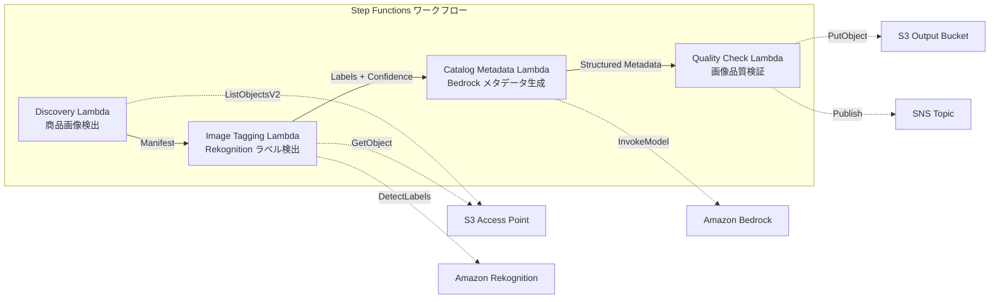

# UC11: 零售 / 电子商务 — 商品图片自动标签和目录元数据生成

🌐 **Language / 言語**: [日本語](README.md) | [English](README.en.md) | [한국어](README.ko.md) | 简体中文 | [繁體中文](README.zh-TW.md) | [Français](README.fr.md) | [Deutsch](README.de.md) | [Español](README.es.md)

## 概述
利用 FSx for NetApp ONTAP 的 S3 Access Points，实现商品图片的自动标记、目录元数据生成和图片质量检查的无服务器工作流。
### 适用场景
- 商品画像在 FSx ONTAP 上大量累积
- 希望通过 Rekognition 实现商品图像的自动标签（类别、颜色、材质）
- 希望自动生成结构化目录元数据（product_category, color, material, style_attributes）
- 需要自动验证图像质量指标（分辨率、文件大小、纵横比）
- 希望自动化低可靠性标签的手动审查标记管理
### 不适用的情况

对于以下情况，该模式不适用：

- 使用 Amazon Bedrock 时
- 使用 AWS Step Functions 时
- 使用 Amazon Athena 时
- 使用 Amazon S3 时
- 使用 AWS Lambda 时
- 使用 Amazon FSx for NetApp ONTAP 时
- 使用 Amazon CloudWatch 时
- 使用 AWS CloudFormation 时

当涉及到 GDSII、DRC、OASIS、GDS、Lambda、tapeout 等技术术语时，请注意这些术语在这里保持不变。

以下代码示例中的 `...` 部分应保持不变：

```python
def example_function():
   ...
```

同样，文件路径和 URL 也应保持不变。
- 实时商品图像处理（API Gateway + Lambda 很合适）
- 大规模图像转换和调整大小处理（MediaConvert / EC2 很合适）
- 需要与现有的 PIM（产品信息管理）系统直接集成
- 环境无法确保对 ONTAP REST API 的网络访问
### 主要功能
- 通过 S3 AP 自动检测商品图片（.jpg,.jpeg,.png,.webp）
- 使用 Rekognition DetectLabels 进行标签检测和获取信任分数
- 如果信任阈值（默认为 70%）以下，则设置手动审核标志
- 使用 Bedrock 生成结构化的目录元数据
- 验证图片质量指标（最小分辨率、文件大小范围、宽高比）
## 架构



### 工作流程步骤

在工作流程中，使用 Amazon Bedrock 和 AWS Step Functions 可以创建和管理复杂的工作流程。Amazon Athena 可以用于查询数据，而 Amazon S3 提供存储。AWS Lambda 用于无服务器计算，Amazon FSx for NetApp ONTAP 提供企业级存储解决方案。通过 Amazon CloudWatch 和 AWS CloudFormation，可以监控和管理资源。确保所有技术术语如 GDSII、DRC、OASIS、GDS、Lambda、tapeout 等保持不变。行内代码 (`...`)、文件路径和 URL 也保持不变。
1. **发现**：从 S3 AP 中检测.jpg、.jpeg、.png、.webp 文件
2. **图像标签**：使用 Rekognition 进行标签检测，置信度低于阈值的设置手动审核标记
3. **目录元数据**：使用 Bedrock 生成结构化目录元数据
4. **质量检查**：验证图像质量指标，低于阈值的图像标记
## 前提条件
- AWS 账户和适当的 IAM 权限
- FSx for NetApp ONTAP 文件系统（ONTAP 9.17.1P4D3 以上）
- 已启用 S3 Access Point 的卷（存储商品图片）
- VPC、私有子网
- 已启用 Amazon Bedrock 模型访问（Claude / Nova）
## 部署步骤

### 1. CloudFormation 部署

```bash
aws cloudformation deploy \
  --template-file retail-catalog/template.yaml \
  --stack-name fsxn-retail-catalog \
  --parameter-overrides \
    S3AccessPointAlias=<your-volume-ext-s3alias> \
    S3AccessPointName=<your-s3ap-name> \
    VpcId=<your-vpc-id> \
    PrivateSubnetIds=<subnet-1>,<subnet-2> \
    ScheduleExpression="rate(1 hour)" \
    NotificationEmail=<your-email@example.com> \
    EnableVpcEndpoints=false \
    EnableCloudWatchAlarms=false \
  --capabilities CAPABILITY_IAM CAPABILITY_AUTO_EXPAND \
  --region ap-northeast-1
```

## 配置参数列表

| パラメータ | 説明 | デフォルト | 必須 |
|-----------|------|----------|------|
| `S3AccessPointAlias` | FSx ONTAP S3 AP Alias（入力用） | — | ✅ |
| `S3AccessPointName` | S3 AP 名（ARN ベースの IAM 権限付与用。省略時は Alias ベースのみ） | `""` | ⚠️ 推奨 |
| `ScheduleExpression` | EventBridge Scheduler のスケジュール式 | `rate(1 hour)` | |
| `VpcId` | VPC ID | — | ✅ |
| `PrivateSubnetIds` | プライベートサブネット ID リスト | — | ✅ |
| `NotificationEmail` | SNS 通知先メールアドレス | — | ✅ |
| `ConfidenceThreshold` | Rekognition ラベル信頼度閾値 (%) | `70` | |
| `MapConcurrency` | Map ステートの並列実行数 | `10` | |
| `LambdaMemorySize` | Lambda メモリサイズ (MB) | `512` | |
| `LambdaTimeout` | Lambda タイムアウト (秒) | `300` | |
| `EnableVpcEndpoints` | Interface VPC Endpoints の有効化 | `false` | |
| `EnableCloudWatchAlarms` | CloudWatch Alarms の有効化 | `false` | |
| `EnableSnapStart` | 启用 Lambda SnapStart（冷启动缩短） | `false` | |

## 清理

```bash
aws s3 rm s3://fsxn-retail-catalog-output-${AWS_ACCOUNT_ID} --recursive

aws cloudformation delete-stack \
  --stack-name fsxn-retail-catalog \
  --region ap-northeast-1

aws cloudformation wait stack-delete-complete \
  --stack-name fsxn-retail-catalog \
  --region ap-northeast-1
```

## 参考链接
- [FSx ONTAP S3 访问点概述](https://docs.aws.amazon.com/fsx/latest/ONTAPGuide/accessing-data-via-s3-access-points.html)
- [Amazon Rekognition DetectLabels](https://docs.aws.amazon.com/rekognition/latest/dg/labels-detect-labels-image.html)
- [Amazon Bedrock API 参考](https://docs.aws.amazon.com/bedrock/latest/APIReference/API_runtime_InvokeModel.html)
- [流式传输 vs 轮询选择指南](../docs/streaming-vs-polling-guide.md)
## Kinesis 流式处理模式（第 3 阶段）
在第 3 阶段，除了 EventBridge 轮询之外，可以选择启用 **Kinesis Data Streams 进行接近实时的处理**。
### 启用

```bash
aws cloudformation deploy \
  --template-file retail-catalog/template.yaml \
  --stack-name fsxn-retail-catalog \
  --parameter-overrides \
    EnableStreamingMode=true \
    ... # 他のパラメータ
  --capabilities CAPABILITY_IAM CAPABILITY_AUTO_EXPAND
```

### 流式模式架构

```
EventBridge (rate(1 min)) → Stream Producer Lambda
  → DynamoDB 状態テーブルと比較 → 変更検知
  → Kinesis Data Stream → Stream Consumer Lambda
  → 既存 ImageTagging + CatalogMetadata パイプライン
```

### 主要功能
- **变更检测**: 每分钟比较 S3 AP 对象列表和 DynamoDB 状态表，检测新增、修改和删除的文件
- **幂等处理**: 使用 DynamoDB 条件写入来防止重复处理
- **故障处理**: 通过 bisect-on-error 和 DynamoDB 死信表来存储失败记录
- **与现有路径共存**: 轮询路径（EventBridge + Step Functions）保持不变，可以实现混合运营
### 模式选择
请参考 [流式处理 vs 轮询选择指南](../docs/streaming-vs-polling-guide.md) 来选择哪种模式。
## 支持的地区
UC11 使用以下服务：
| サービス | リージョン制約 |
|---------|-------------|
| Amazon Rekognition | ほぼ全リージョンで利用可能 |
| Amazon Bedrock | 対応リージョンを確認（[Bedrock 対応リージョン](https://docs.aws.amazon.com/general/latest/gr/bedrock.html)） |
| Kinesis Data Streams | ほぼ全リージョンで利用可能（シャード料金はリージョンにより異なる） |
| AWS X-Ray | ほぼ全リージョンで利用可能 |
| CloudWatch EMF | ほぼ全リージョンで利用可能 |
> 启用 Kinesis 流式模式时，请注意不同区域的分片费用不同。详情请参阅 [区域兼容性矩阵](../docs/region-compatibility.md)。