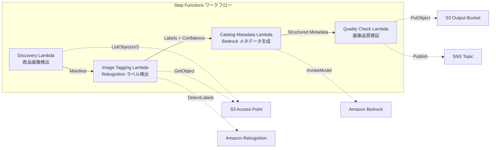

# UC11：零售 / 電子商務 — 商品圖像自動標籤及目錄元數據生成

🌐 **Language / 言語**: [日本語](README.md) | [English](README.en.md) | [한국어](README.ko.md) | [简体中文](README.zh-CN.md) | 繁體中文 | [Français](README.fr.md) | [Deutsch](README.de.md) | [Español](README.es.md)

## 概觀
利用 FSx for NetApp ONTAP 的 S3 Access Points，構建一個自動化的無伺服器工作流程，以自動標記產品圖片、生成目錄中繼數據和執行圖片質量檢查。
### 適用此模式的情況
- 商品圖像大量儲存於 FSx ONTAP 上
- 希望使用 Rekognition 自動標註商品圖像（類別、顏色、材質）
- 希望自動生成結構化目錄中繼資料（product_category, color, material, style_attributes）
- 需要自動驗證圖像品質指標（解析度、檔案大小、長寬比）
- 希望自動化低可信度標籤的人工審核標記管理
### 不适合此模式的情况
- 實時商品影像處理（API Gateway + Lambda 最適）
- 大規模影像轉換與調整大小處理（MediaConvert / EC2 最適）
- 需要與現有的 PIM（產品資訊管理）系統直接整合
- 無法確保對 ONTAP REST API 的網路訪問環境
### 主要功能
- 透過 S3 AP 自動檢測商品圖片（.jpg,.jpeg,.png,.webp）
- 使用 Rekognition DetectLabels 進行標籤檢測並獲取信任分數
- 若信任分數低於閾值（預設：70%），設置手動審核旗標
- 使用 Bedrock 生成結構化目錄元數據
- 檢查圖片品質指標（最小解析度、文件大小範圍、縱橫比）
## 架構



### 工作流程步驟
1. **探索**：從 S3 AP 探索 .jpg、.jpeg、.png、.webp 檔案
2. **影像標籤**：使用 Rekognition 進行標籤檢測，置信度低於閾值的設置手動審查標記
3. **目錄中繼資料**：使用 Bedrock 生成結構化目錄中繼資料
4. **品質檢查**：檢查影像品質指標，並標記低於閾值的影像
## 前提條件
- AWS帳戶和適當的IAM權限
- FSx for NetApp ONTAP文件系統（ONTAP 9.17.1P4D3以上）
- 已啟用S3存取點的卷（用於存儲商品圖片）
- VPC、私人子網
- 已啟用Amazon Bedrock模型存取（Claude / Nova）
## 部署步驟

### 1. CloudFormation 部署

```bash
aws cloudformation deploy \
  --template-file retail-catalog/template.yaml \
  --stack-name fsxn-retail-catalog \
  --parameter-overrides \
    S3AccessPointAlias=<your-volume-ext-s3alias> \
    S3AccessPointName=<your-s3ap-name> \
    VpcId=<your-vpc-id> \
    PrivateSubnetIds=<subnet-1>,<subnet-2> \
    ScheduleExpression="rate(1 hour)" \
    NotificationEmail=<your-email@example.com> \
    EnableVpcEndpoints=false \
    EnableCloudWatchAlarms=false \
  --capabilities CAPABILITY_IAM CAPABILITY_AUTO_EXPAND \
  --region ap-northeast-1
```

## 設定參數列表

| パラメータ | 説明 | デフォルト | 必須 |
|-----------|------|----------|------|
| `S3AccessPointAlias` | FSx ONTAP S3 AP Alias（入力用） | — | ✅ |
| `S3AccessPointName` | S3 AP 名（ARN ベースの IAM 権限付与用。省略時は Alias ベースのみ） | `""` | ⚠️ 推奨 |
| `ScheduleExpression` | EventBridge Scheduler のスケジュール式 | `rate(1 hour)` | |
| `VpcId` | VPC ID | — | ✅ |
| `PrivateSubnetIds` | プライベートサブネット ID リスト | — | ✅ |
| `NotificationEmail` | SNS 通知先メールアドレス | — | ✅ |
| `ConfidenceThreshold` | Rekognition ラベル信頼度閾値 (%) | `70` | |
| `MapConcurrency` | Map ステートの並列実行数 | `10` | |
| `LambdaMemorySize` | Lambda メモリサイズ (MB) | `512` | |
| `LambdaTimeout` | Lambda タイムアウト (秒) | `300` | |
| `EnableVpcEndpoints` | Interface VPC Endpoints の有効化 | `false` | |
| `EnableCloudWatchAlarms` | CloudWatch Alarms の有効化 | `false` | |

## 清理

```bash
aws s3 rm s3://fsxn-retail-catalog-output-${AWS_ACCOUNT_ID} --recursive

aws cloudformation delete-stack \
  --stack-name fsxn-retail-catalog \
  --region ap-northeast-1

aws cloudformation wait stack-delete-complete \
  --stack-name fsxn-retail-catalog \
  --region ap-northeast-1
```

## 參考連結
- [FSx for NetApp ONTAP S3 存取點概覽](https://docs.aws.amazon.com/fsx/latest/ONTAPGuide/accessing-data-via-s3-access-points.html)
- [Amazon Rekognition DetectLabels](https://docs.aws.amazon.com/rekognition/latest/dg/labels-detect-labels-image.html)
- [Amazon Bedrock API 參考](https://docs.aws.amazon.com/bedrock/latest/APIReference/API_runtime_InvokeModel.html)
- [串流 vs 輪詢選擇指南](../docs/streaming-vs-polling-guide.md)
## Kinesis 串流模式（第 3 階段）
在第 3 階段中，除了 EventBridge 轉輪外，您還可以選擇使用 **Kinesis Data Streams 提供的接近即時處理**。
### 啟用

```bash
aws cloudformation deploy \
  --template-file retail-catalog/template.yaml \
  --stack-name fsxn-retail-catalog \
  --parameter-overrides \
    EnableStreamingMode=true \
    ... # 他のパラメータ
  --capabilities CAPABILITY_IAM CAPABILITY_AUTO_EXPAND
```

### 串流模式的架構

```
EventBridge (rate(1 min)) → Stream Producer Lambda
  → DynamoDB 状態テーブルと比較 → 変更検知
  → Kinesis Data Stream → Stream Consumer Lambda
  → 既存 ImageTagging + CatalogMetadata パイプライン
```

### 主要功能
- **變更偵測**: 每分鐘比較 S3 AP 物件清單和 DynamoDB 狀態表，偵測新增、修改和刪除的檔案
- **幂等處理**: 使用 DynamoDB 條件寫入防止重複處理
- **故障處理**: 使用 bisect-on-error 和 DynamoDB 死信表格備份失敗記錄
- **與現有路徑共存**: 轉接路徑（EventBridge + Step Functions）保持不變。混合運營可行
### 模式選擇
請參閱 [串流 vs 輪詢選擇指南](../docs/streaming-vs-polling-guide.md) 以了解應該選擇哪種模式。
## 支援的區域
UC11 使用以下服務：
| サービス | リージョン制約 |
|---------|-------------|
| Amazon Rekognition | ほぼ全リージョンで利用可能 |
| Amazon Bedrock | 対応リージョンを確認（[Bedrock 対応リージョン](https://docs.aws.amazon.com/general/latest/gr/bedrock.html)） |
| Kinesis Data Streams | ほぼ全リージョンで利用可能（シャード料金はリージョンにより異なる） |
| AWS X-Ray | ほぼ全リージョンで利用可能 |
| CloudWatch EMF | ほぼ全リージョンで利用可能 |
> 當啟用 Kinesis 串流模式時，請注意不同區域的分片費用可能不同。詳情請參閱 [區域互通性矩陣](../docs/region-compatibility.md)。