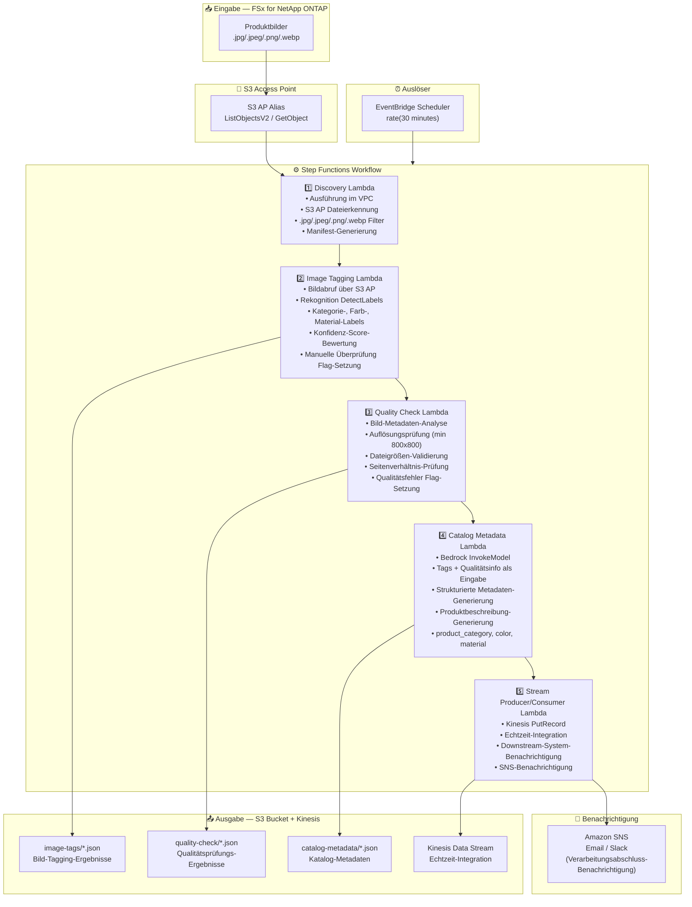

# UC11: Einzelhandel/E-Commerce — Automatisches Produkt-Tagging und Katalog-Metadaten-Generierung

🌐 **Language / 言語**: [日本語](architecture.md) | [English](architecture.en.md) | [한국어](architecture.ko.md) | [简体中文](architecture.zh-CN.md) | [繁體中文](architecture.zh-TW.md) | [Français](architecture.fr.md) | Deutsch | [Español](architecture.es.md)

## End-to-End-Architektur (Eingabe → Ausgabe)

---

## Architekturdiagramm

---

## Datenfluss-Details

### Eingabe
| Element | Beschreibung |
|---------|--------------|
| **Quelle** | FSx for NetApp ONTAP Volume |
| **Dateitypen** | .jpg/.jpeg/.png/.webp (Produktbilder) |
| **Zugriffsmethode** | S3 Access Point (ListObjectsV2 + GetObject) |
| **Lesestrategie** | Vollständiger Bildabruf (erforderlich für Rekognition / Qualitätsprüfung) |

### Verarbeitung
| Schritt | Service | Funktion |
|---------|---------|----------|
| Discovery | Lambda (VPC) | Produktbilder über S3 AP erkennen, Manifest generieren |
| Image Tagging | Lambda + Rekognition | DetectLabels zur Label-Erkennung (Kategorie, Farbe, Material), Konfidenz-Schwellenwert-Bewertung |
| Quality Check | Lambda | Bildqualitätsmetriken-Validierung (Auflösung, Dateigröße, Seitenverhältnis) |
| Catalog Metadata | Lambda + Bedrock | Strukturierte Katalog-Metadaten-Generierung (product_category, color, material, Produktbeschreibung) |
| Stream Producer/Consumer | Lambda + Kinesis | Echtzeit-Integration, Datenlieferung an Downstream-Systeme |

### Ausgabe
| Artefakt | Format | Beschreibung |
|----------|--------|--------------|
| Bild-Tags | `image-tags/YYYY/MM/DD/{sku}_{view}_tags.json` | Rekognition Label-Erkennungsergebnisse (mit Konfidenz-Scores) |
| Qualitätsprüfung | `quality-check/YYYY/MM/DD/{sku}_{view}_quality.json` | Qualitätsprüfungsergebnisse (Auflösung, Größe, Seitenverhältnis, Bestanden/Nicht bestanden) |
| Katalog-Metadaten | `catalog-metadata/YYYY/MM/DD/{sku}_metadata.json` | Strukturierte Metadaten (product_category, color, material, description) |
| Kinesis Stream | `retail-catalog-stream` | Echtzeit-Integrationsdatensätze (für Downstream PIM/EC-Systeme) |
| SNS-Benachrichtigung | Email | Verarbeitungsabschluss-Benachrichtigung und Qualitätswarnungen |

---

## Wichtige Designentscheidungen

1. **Rekognition Auto-Tagging** — DetectLabels zur automatischen Kategorie-/Farb-/Material-Erkennung. Manuelle Überprüfung Flag wird gesetzt, wenn die Konfidenz unter dem Schwellenwert liegt (Standard: 70%)
2. **Bildqualitäts-Gate** — Auflösung (min 800x800), Dateigröße und Seitenverhältnis-Validierung zur automatischen Prüfung der E-Commerce-Listing-Standards
3. **Bedrock für Metadaten-Generierung** — Tags + Qualitätsinfo als Eingabe zur automatischen Generierung strukturierter Katalog-Metadaten und Produktbeschreibungen
4. **Kinesis Echtzeit-Integration** — PutRecord an Kinesis Data Streams nach der Verarbeitung für Echtzeit-Integration mit Downstream PIM/EC-Systemen
5. **Sequenzielle Pipeline** — Step Functions verwaltet Reihenfolge-Abhängigkeiten: Tagging → Qualitätsprüfung → Metadaten-Generierung → Stream-Lieferung
6. **Polling (nicht ereignisgesteuert)** — S3 AP unterstützt keine Ereignisbenachrichtigungen; 30-Minuten-Intervall für schnelle Verarbeitung neuer Produkte

---

## Verwendete AWS-Services

| Service | Rolle |
|---------|-------|
| FSx for NetApp ONTAP | Produktbild-Speicherung |
| S3 Access Points | Serverloser Zugriff auf ONTAP-Volumes |
| EventBridge Scheduler | Periodischer Auslöser (30-Minuten-Intervall) |
| Step Functions | Workflow-Orchestrierung (sequenziell) |
| Lambda | Compute (Discovery, Image Tagging, Quality Check, Catalog Metadata, Stream Producer/Consumer) |
| Amazon Rekognition | Produktbild-Label-Erkennung (DetectLabels) |
| Amazon Bedrock | Katalog-Metadaten- und Produktbeschreibung-Generierung (Claude / Nova) |
| Kinesis Data Streams | Echtzeit-Integration (für Downstream PIM/EC-Systeme) |
| SNS | Verarbeitungsabschluss-Benachrichtigung und Qualitätswarnungen |
| Secrets Manager | ONTAP REST API Anmeldedaten-Verwaltung |
| CloudWatch + X-Ray | Observability |
