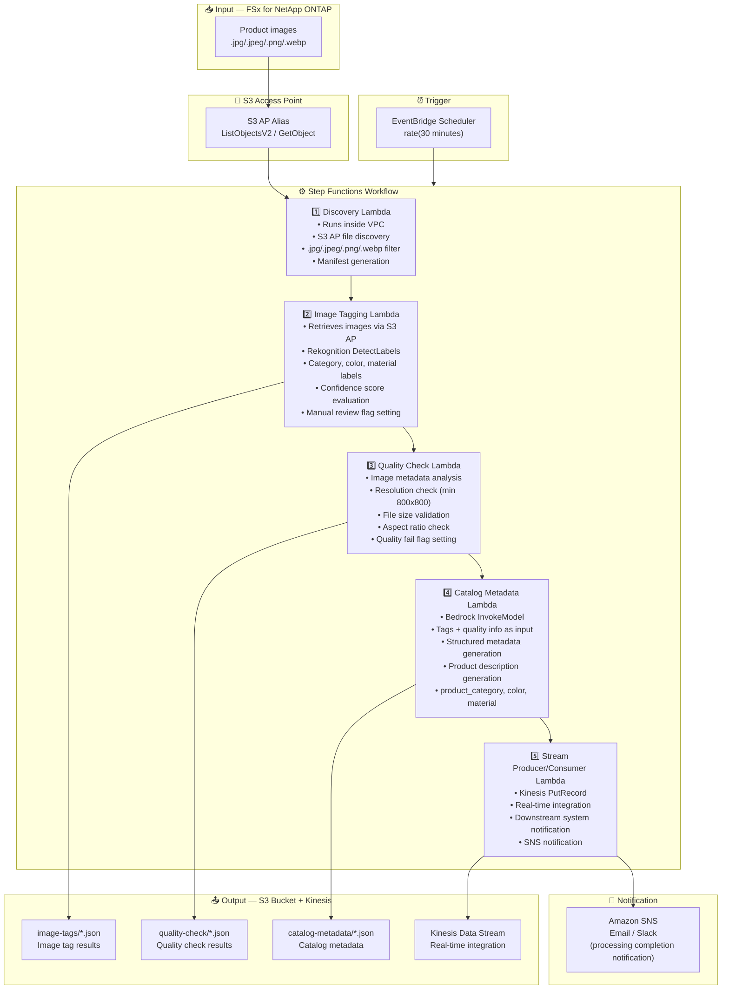

# UC11: Retail / E-Commerce — Product Image Auto-Tagging & Catalog Metadata Generation

🌐 **Language / 言語**: [日本語](architecture.md) | English | [한국어](architecture.ko.md) | [简体中文](architecture.zh-CN.md) | [繁體中文](architecture.zh-TW.md) | [Français](architecture.fr.md) | [Deutsch](architecture.de.md) | [Español](architecture.es.md)

## End-to-End Architecture (Input → Output)

---

## High-Level Flow

```
┌─────────────────────────────────────────────────────────────────────────────┐
│                         FSx for NetApp ONTAP                                 │
│                                                                              │
│  /vol/product_images/                                                        │
│  ├── new_arrivals/SKU_001/front.jpg        (Product image — front)           │
│  ├── new_arrivals/SKU_001/side.png         (Product image — side)            │
│  ├── new_arrivals/SKU_002/main.jpeg        (Product image — main)            │
│  ├── seasonal/summer/SKU_003/hero.webp     (Product image — hero)            │
│  └── seasonal/summer/SKU_004/detail.jpg    (Product image — detail)          │
│                                                                              │
└──────────────────────────────────┬───────────────────────────────────────────┘
                                   │
                                   ▼
┌──────────────────────────────────────────────────────────────────────────────┐
│                      S3 Access Point (Data Path)                              │
│                                                                              │
│  Alias: fsxn-retail-vol-ext-s3alias                                          │
│  • ListObjectsV2 (product image discovery)                                   │
│  • GetObject (image retrieval)                                               │
│  • No NFS/SMB mount required from Lambda                                     │
│                                                                              │
└──────────────────────────────────┬───────────────────────────────────────────┘
                                   │
                                   ▼
┌──────────────────────────────────────────────────────────────────────────────┐
│                    EventBridge Scheduler (Trigger)                            │
│                                                                              │
│  Schedule: rate(30 minutes) — configurable                                   │
│  Target: Step Functions State Machine                                        │
│                                                                              │
└──────────────────────────────────┬───────────────────────────────────────────┘
                                   │
                                   ▼
┌──────────────────────────────────────────────────────────────────────────────┐
│                    AWS Step Functions (Orchestration)                         │
│                                                                              │
│  ┌─────────────┐    ┌──────────────────────┐    ┌────────────────────┐      │
│  │  Discovery   │───▶│  Image Tagging       │───▶│  Quality Check     │      │
│  │  Lambda      │    │  Lambda              │    │  Lambda            │      │
│  │             │    │                      │    │                   │      │
│  │  • VPC内     │    │  • Rekognition       │    │  • Resolution check│      │
│  │  • S3 AP List│    │  • Label detection   │    │  • File size       │      │
│  │  • Product   │    │  • Confidence score  │    │  • Aspect ratio    │      │
│  │    images   │    │                      │    │                   │      │
│  └─────────────┘    └──────────────────────┘    └────────────────────┘      │
│                                                         │                    │
│                                                         ▼                    │
│                      ┌──────────────────────┐    ┌────────────────────┐      │
│                      │  Stream Producer/    │◀───│  Catalog Metadata  │      │
│                      │  Consumer Lambda     │    │  Lambda            │      │
│                      │                      │    │                   │      │
│                      │  • Kinesis PutRecord │    │  • Bedrock         │      │
│                      │  • Real-time integr  │    │  • Metadata gen    │      │
│                      │  • Downstream notify │    │  • Product desc    │      │
│                      └──────────────────────┘    └────────────────────┘      │
│                                                                              │
└──────────────────────────────────────────────────────────────────────────────┘
                                   │
                                   ▼
┌──────────────────────────────────────────────────────────────────────────────┐
│                         Output (S3 Bucket + Kinesis)                          │
│                                                                              │
│  s3://{stack}-output-{account}/                                              │
│  ├── image-tags/YYYY/MM/DD/                                                  │
│  │   ├── SKU_001_front_tags.json           ← Image tag results              │
│  │   └── SKU_002_main_tags.json                                              │
│  ├── quality-check/YYYY/MM/DD/                                               │
│  │   ├── SKU_001_front_quality.json        ← Quality check results          │
│  │   └── SKU_002_main_quality.json                                           │
│  ├── catalog-metadata/YYYY/MM/DD/                                            │
│  │   ├── SKU_001_metadata.json             ← Catalog metadata               │
│  │   └── SKU_002_metadata.json                                               │
│  └── Kinesis Data Stream                                                     │
│      └── retail-catalog-stream             ← Real-time integration           │
│                                                                              │
└──────────────────────────────────────────────────────────────────────────────┘
```

---

## Mermaid Diagram



---

## Data Flow Detail

### Input
| Item | Description |
|------|-------------|
| **Source** | FSx for NetApp ONTAP volume |
| **File Types** | .jpg/.jpeg/.png/.webp (product images) |
| **Access Method** | S3 Access Point (ListObjectsV2 + GetObject) |
| **Read Strategy** | Full image retrieval (required for Rekognition / quality check) |

### Processing
| Step | Service | Function |
|------|---------|----------|
| Discovery | Lambda (VPC) | Discover product images via S3 AP, generate manifest |
| Image Tagging | Lambda + Rekognition | DetectLabels for label detection (category, color, material), confidence threshold evaluation |
| Quality Check | Lambda | Image quality metrics validation (resolution, file size, aspect ratio) |
| Catalog Metadata | Lambda + Bedrock | Structured catalog metadata generation (product_category, color, material, product description) |
| Stream Producer/Consumer | Lambda + Kinesis | Real-time integration, data delivery to downstream systems |

### Output
| Artifact | Format | Description |
|----------|--------|-------------|
| Image Tags | `image-tags/YYYY/MM/DD/{sku}_{view}_tags.json` | Rekognition label detection results (with confidence scores) |
| Quality Check | `quality-check/YYYY/MM/DD/{sku}_{view}_quality.json` | Quality check results (resolution, size, aspect ratio, pass/fail) |
| Catalog Metadata | `catalog-metadata/YYYY/MM/DD/{sku}_metadata.json` | Structured metadata (product_category, color, material, description) |
| Kinesis Stream | `retail-catalog-stream` | Real-time integration records (for downstream PIM/EC systems) |
| SNS Notification | Email | Processing completion notification & quality alerts |

---

## Key Design Decisions

1. **Rekognition auto-tagging** — DetectLabels for automatic category/color/material detection. Manual review flag set when confidence below threshold (default: 70%)
2. **Image quality gate** — Resolution (min 800x800), file size, and aspect ratio validation for automatic e-commerce listing standards check
3. **Bedrock for metadata generation** — Tags + quality info as input to auto-generate structured catalog metadata and product descriptions
4. **Kinesis real-time integration** — PutRecord to Kinesis Data Streams after processing for real-time integration with downstream PIM/EC systems
5. **Sequential pipeline** — Step Functions manages order dependencies: tagging → quality check → metadata generation → stream delivery
6. **Polling (not event-driven)** — S3 AP does not support event notifications; 30-minute interval for rapid new product processing

---

## AWS Services Used

| Service | Role |
|---------|------|
| FSx for NetApp ONTAP | Product image storage |
| S3 Access Points | Serverless access to ONTAP volumes |
| EventBridge Scheduler | Periodic trigger (30-minute interval) |
| Step Functions | Workflow orchestration (sequential) |
| Lambda | Compute (Discovery, Image Tagging, Quality Check, Catalog Metadata, Stream Producer/Consumer) |
| Amazon Rekognition | Product image label detection (DetectLabels) |
| Amazon Bedrock | Catalog metadata & product description generation (Claude / Nova) |
| Kinesis Data Streams | Real-time integration (for downstream PIM/EC systems) |
| SNS | Processing completion notification & quality alerts |
| Secrets Manager | ONTAP REST API credential management |
| CloudWatch + X-Ray | Observability |
