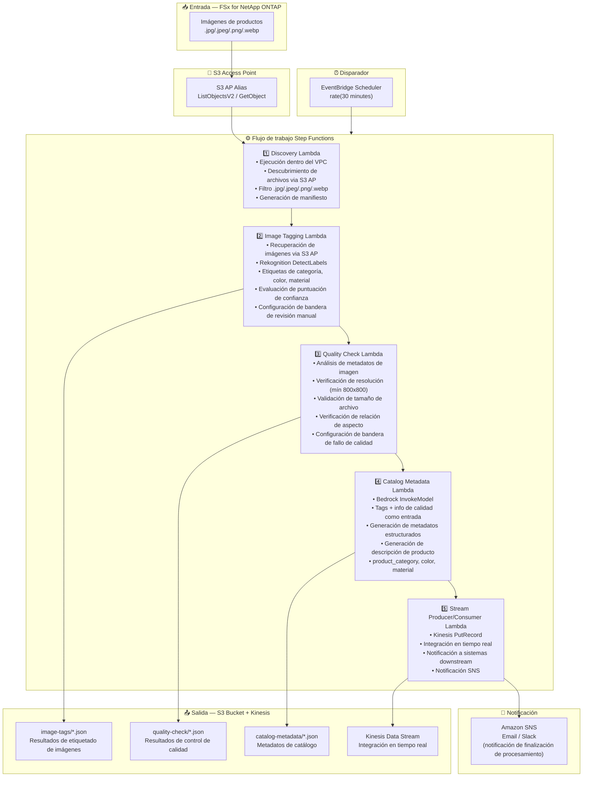

# UC11: Retail/Comercio electrónico — Etiquetado automático de imágenes y generación de metadatos de catálogo

🌐 **Language / 言語**: [日本語](architecture.md) | [English](architecture.en.md) | [한국어](architecture.ko.md) | [简体中文](architecture.zh-CN.md) | [繁體中文](architecture.zh-TW.md) | [Français](architecture.fr.md) | [Deutsch](architecture.de.md) | Español

## Arquitectura de extremo a extremo (Entrada → Salida)

---

## Flujo de alto nivel

```
┌─────────────────────────────────────────────────────────────────────────────┐
│                         FSx for NetApp ONTAP                                 │
│                                                                              │
│  /vol/product_images/                                                        │
│  ├── new_arrivals/SKU_001/front.jpg        (Product image — front)           │
│  ├── new_arrivals/SKU_001/side.png         (Product image — side)            │
│  ├── new_arrivals/SKU_002/main.jpeg        (Product image — main)            │
│  ├── seasonal/summer/SKU_003/hero.webp     (Product image — hero)            │
│  └── seasonal/summer/SKU_004/detail.jpg    (Product image — detail)          │
│                                                                              │
└──────────────────────────────────┬───────────────────────────────────────────┘
                                   │
                                   ▼
┌──────────────────────────────────────────────────────────────────────────────┐
│                      S3 Access Point (Data Path)                              │
│                                                                              │
│  Alias: fsxn-retail-vol-ext-s3alias                                          │
│  • ListObjectsV2 (product image discovery)                                   │
│  • GetObject (image retrieval)                                               │
│  • No NFS/SMB mount required from Lambda                                     │
│                                                                              │
└──────────────────────────────────┬───────────────────────────────────────────┘
                                   │
                                   ▼
┌──────────────────────────────────────────────────────────────────────────────┐
│                    EventBridge Scheduler (Trigger)                            │
│                                                                              │
│  Schedule: rate(30 minutes) — configurable                                   │
│  Target: Step Functions State Machine                                        │
│                                                                              │
└──────────────────────────────────┬───────────────────────────────────────────┘
                                   │
                                   ▼
┌──────────────────────────────────────────────────────────────────────────────┐
│                    AWS Step Functions (Orchestration)                         │
│                                                                              │
│  ┌─────────────┐    ┌──────────────────────┐    ┌────────────────────┐      │
│  │  Discovery   │───▶│  Image Tagging       │───▶│  Quality Check     │      │
│  │  Lambda      │    │  Lambda              │    │  Lambda            │      │
│  │             │    │                      │    │                   │      │
│  │  • VPC内     │    │  • Rekognition       │    │  • Resolution check│      │
│  │  • S3 AP List│    │  • Label detection   │    │  • File size       │      │
│  │  • Product   │    │  • Confidence score  │    │  • Aspect ratio    │      │
│  │    images   │    │                      │    │                   │      │
│  └─────────────┘    └──────────────────────┘    └────────────────────┘      │
│                                                         │                    │
│                                                         ▼                    │
│                      ┌──────────────────────┐    ┌────────────────────┐      │
│                      │  Stream Producer/    │◀───│  Catalog Metadata  │      │
│                      │  Consumer Lambda     │    │  Lambda            │      │
│                      │                      │    │                   │      │
│                      │  • Kinesis PutRecord │    │  • Bedrock         │      │
│                      │  • Real-time integr  │    │  • Metadata gen    │      │
│                      │  • Downstream notify │    │  • Product desc    │      │
│                      └──────────────────────┘    └────────────────────┘      │
│                                                                              │
└──────────────────────────────────────────────────────────────────────────────┘
                                   │
                                   ▼
┌──────────────────────────────────────────────────────────────────────────────┐
│                         Output (S3 Bucket + Kinesis)                          │
│                                                                              │
│  s3://{stack}-output-{account}/                                              │
│  ├── image-tags/YYYY/MM/DD/                                                  │
│  │   ├── SKU_001_front_tags.json           ← Image tag results              │
│  │   └── SKU_002_main_tags.json                                              │
│  ├── quality-check/YYYY/MM/DD/                                               │
│  │   ├── SKU_001_front_quality.json        ← Quality check results          │
│  │   └── SKU_002_main_quality.json                                           │
│  ├── catalog-metadata/YYYY/MM/DD/                                            │
│  │   ├── SKU_001_metadata.json             ← Catalog metadata               │
│  │   └── SKU_002_metadata.json                                               │
│  └── Kinesis Data Stream                                                     │
│      └── retail-catalog-stream             ← Real-time integration           │
│                                                                              │
└──────────────────────────────────────────────────────────────────────────────┘
```

---

## Diagrama Mermaid



---

## Detalle del flujo de datos

### Entrada
| Elemento | Descripción |
|----------|-------------|
| **Origen** | Volumen FSx for NetApp ONTAP |
| **Tipos de archivo** | .jpg/.jpeg/.png/.webp (imágenes de productos) |
| **Método de acceso** | S3 Access Point (ListObjectsV2 + GetObject) |
| **Estrategia de lectura** | Recuperación completa de imagen (requerida para Rekognition / control de calidad) |

### Procesamiento
| Paso | Servicio | Función |
|------|----------|---------|
| Discovery | Lambda (VPC) | Descubrir imágenes de productos via S3 AP, generar manifiesto |
| Image Tagging | Lambda + Rekognition | DetectLabels para detección de etiquetas (categoría, color, material), evaluación de umbral de confianza |
| Quality Check | Lambda | Validación de métricas de calidad de imagen (resolución, tamaño de archivo, relación de aspecto) |
| Catalog Metadata | Lambda + Bedrock | Generación de metadatos de catálogo estructurados (product_category, color, material, descripción de producto) |
| Stream Producer/Consumer | Lambda + Kinesis | Integración en tiempo real, entrega de datos a sistemas downstream |

### Salida
| Artefacto | Formato | Descripción |
|-----------|---------|-------------|
| Tags de imágenes | `image-tags/YYYY/MM/DD/{sku}_{view}_tags.json` | Resultados de detección de etiquetas Rekognition (con puntuaciones de confianza) |
| Control de calidad | `quality-check/YYYY/MM/DD/{sku}_{view}_quality.json` | Resultados de control de calidad (resolución, tamaño, relación de aspecto, aprobado/rechazado) |
| Metadatos de catálogo | `catalog-metadata/YYYY/MM/DD/{sku}_metadata.json` | Metadatos estructurados (product_category, color, material, description) |
| Kinesis Stream | `retail-catalog-stream` | Registros de integración en tiempo real (para sistemas PIM/EC downstream) |
| Notificación SNS | Email | Notificación de finalización de procesamiento y alertas de calidad |

---

## Decisiones de diseño clave

1. **Etiquetado automático con Rekognition** — DetectLabels para detección automática de categoría/color/material. Se establece bandera de revisión manual cuando la confianza está por debajo del umbral (predeterminado: 70%)
2. **Puerta de calidad de imagen** — Validación de resolución (mín 800x800), tamaño de archivo y relación de aspecto para verificación automática de estándares de listado en e-commerce
3. **Bedrock para generación de metadatos** — Tags + info de calidad como entrada para generar automáticamente metadatos de catálogo estructurados y descripciones de productos
4. **Integración en tiempo real con Kinesis** — PutRecord a Kinesis Data Streams después del procesamiento para integración en tiempo real con sistemas PIM/EC downstream
5. **Pipeline secuencial** — Step Functions gestiona las dependencias de orden: etiquetado → control de calidad → generación de metadatos → entrega al stream
6. **Sondeo (no basado en eventos)** — S3 AP no soporta notificaciones de eventos; intervalo de 30 minutos para procesamiento rápido de nuevos productos

---

## Servicios AWS utilizados

| Servicio | Rol |
|----------|-----|
| FSx for NetApp ONTAP | Almacenamiento de imágenes de productos |
| S3 Access Points | Acceso serverless a volúmenes ONTAP |
| EventBridge Scheduler | Disparador periódico (intervalo de 30 minutos) |
| Step Functions | Orquestación de flujo de trabajo (secuencial) |
| Lambda | Cómputo (Discovery, Image Tagging, Quality Check, Catalog Metadata, Stream Producer/Consumer) |
| Amazon Rekognition | Detección de etiquetas de imágenes de productos (DetectLabels) |
| Amazon Bedrock | Generación de metadatos de catálogo y descripciones de productos (Claude / Nova) |
| Kinesis Data Streams | Integración en tiempo real (para sistemas PIM/EC downstream) |
| SNS | Notificación de finalización de procesamiento y alertas de calidad |
| Secrets Manager | Gestión de credenciales ONTAP REST API |
| CloudWatch + X-Ray | Observabilidad |
