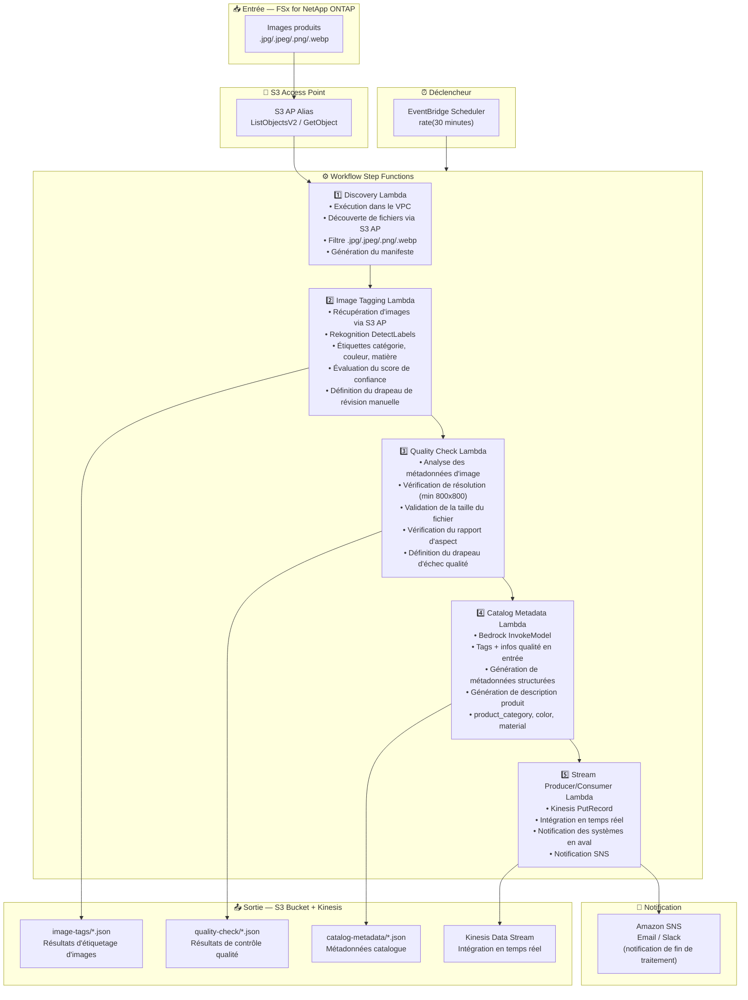

# UC11: Commerce/E-commerce — Étiquetage automatique d'images et génération de métadonnées catalogue

🌐 **Language / 言語**: [日本語](architecture.md) | [English](architecture.en.md) | [한국어](architecture.ko.md) | [简体中文](architecture.zh-CN.md) | [繁體中文](architecture.zh-TW.md) | Français | [Deutsch](architecture.de.md) | [Español](architecture.es.md)

## Architecture de bout en bout (Entrée → Sortie)

---

## Diagramme d'architecture

---

## Détail du flux de données

### Entrée
| Élément | Description |
|---------|-------------|
| **Source** | Volume FSx for NetApp ONTAP |
| **Types de fichiers** | .jpg/.jpeg/.png/.webp (images produits) |
| **Méthode d'accès** | S3 Access Point (ListObjectsV2 + GetObject) |
| **Stratégie de lecture** | Récupération complète de l'image (requise pour Rekognition / contrôle qualité) |

### Traitement
| Étape | Service | Fonction |
|-------|---------|----------|
| Discovery | Lambda (VPC) | Découverte des images produits via S3 AP, génération du manifeste |
| Image Tagging | Lambda + Rekognition | DetectLabels pour la détection d'étiquettes (catégorie, couleur, matière), évaluation du seuil de confiance |
| Quality Check | Lambda | Validation des métriques de qualité d'image (résolution, taille de fichier, rapport d'aspect) |
| Catalog Metadata | Lambda + Bedrock | Génération de métadonnées catalogue structurées (product_category, color, material, description produit) |
| Stream Producer/Consumer | Lambda + Kinesis | Intégration en temps réel, livraison de données aux systèmes en aval |

### Sortie
| Artefact | Format | Description |
|----------|--------|-------------|
| Tags d'images | `image-tags/YYYY/MM/DD/{sku}_{view}_tags.json` | Résultats de détection d'étiquettes Rekognition (avec scores de confiance) |
| Contrôle qualité | `quality-check/YYYY/MM/DD/{sku}_{view}_quality.json` | Résultats du contrôle qualité (résolution, taille, rapport d'aspect, réussite/échec) |
| Métadonnées catalogue | `catalog-metadata/YYYY/MM/DD/{sku}_metadata.json` | Métadonnées structurées (product_category, color, material, description) |
| Kinesis Stream | `retail-catalog-stream` | Enregistrements d'intégration en temps réel (pour systèmes PIM/EC en aval) |
| Notification SNS | Email | Notification de fin de traitement et alertes qualité |

---

## Décisions de conception clés

1. **Étiquetage automatique Rekognition** — DetectLabels pour la détection automatique de catégorie/couleur/matière. Drapeau de révision manuelle défini lorsque la confiance est inférieure au seuil (par défaut : 70%)
2. **Porte de qualité d'image** — Validation de la résolution (min 800x800), de la taille de fichier et du rapport d'aspect pour la vérification automatique des standards de mise en ligne e-commerce
3. **Bedrock pour la génération de métadonnées** — Tags + infos qualité en entrée pour générer automatiquement des métadonnées catalogue structurées et des descriptions produits
4. **Intégration temps réel Kinesis** — PutRecord vers Kinesis Data Streams après traitement pour l'intégration en temps réel avec les systèmes PIM/EC en aval
5. **Pipeline séquentiel** — Step Functions gère les dépendances d'ordre : étiquetage → contrôle qualité → génération de métadonnées → livraison au flux
6. **Interrogation (non événementiel)** — S3 AP ne prend pas en charge les notifications d'événements ; intervalle de 30 minutes pour le traitement rapide des nouveaux produits

---

## Services AWS utilisés

| Service | Rôle |
|---------|------|
| FSx for NetApp ONTAP | Stockage des images produits |
| S3 Access Points | Accès serverless aux volumes ONTAP |
| EventBridge Scheduler | Déclencheur périodique (intervalle de 30 minutes) |
| Step Functions | Orchestration du workflow (séquentiel) |
| Lambda | Calcul (Discovery, Image Tagging, Quality Check, Catalog Metadata, Stream Producer/Consumer) |
| Amazon Rekognition | Détection d'étiquettes d'images produits (DetectLabels) |
| Amazon Bedrock | Génération de métadonnées catalogue et descriptions produits (Claude / Nova) |
| Kinesis Data Streams | Intégration en temps réel (pour systèmes PIM/EC en aval) |
| SNS | Notification de fin de traitement et alertes qualité |
| Secrets Manager | Gestion des identifiants ONTAP REST API |
| CloudWatch + X-Ray | Observabilité |
