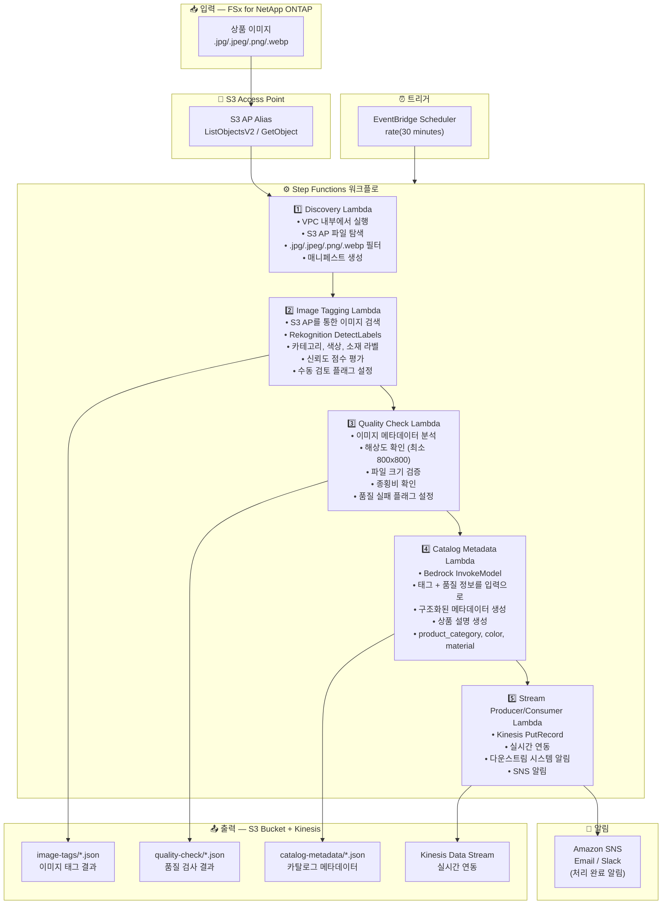

# UC11: 소매/전자상거래 — 상품 이미지 자동 태깅 및 카탈로그 메타데이터 생성

🌐 **Language / 言語**: [日本語](architecture.md) | [English](architecture.en.md) | 한국어 | [简体中文](architecture.zh-CN.md) | [繁體中文](architecture.zh-TW.md) | [Français](architecture.fr.md) | [Deutsch](architecture.de.md) | [Español](architecture.es.md)

## 엔드투엔드 아키텍처 (입력 → 출력)

---

## 상위 수준 흐름

```
┌─────────────────────────────────────────────────────────────────────────────┐
│                         FSx for NetApp ONTAP                                 │
│                                                                              │
│  /vol/product_images/                                                        │
│  ├── new_arrivals/SKU_001/front.jpg        (Product image — front)           │
│  ├── new_arrivals/SKU_001/side.png         (Product image — side)            │
│  ├── new_arrivals/SKU_002/main.jpeg        (Product image — main)            │
│  ├── seasonal/summer/SKU_003/hero.webp     (Product image — hero)            │
│  └── seasonal/summer/SKU_004/detail.jpg    (Product image — detail)          │
│                                                                              │
└──────────────────────────────────┬───────────────────────────────────────────┘
                                   │
                                   ▼
┌──────────────────────────────────────────────────────────────────────────────┐
│                      S3 Access Point (Data Path)                              │
│                                                                              │
│  Alias: fsxn-retail-vol-ext-s3alias                                          │
│  • ListObjectsV2 (product image discovery)                                   │
│  • GetObject (image retrieval)                                               │
│  • No NFS/SMB mount required from Lambda                                     │
│                                                                              │
└──────────────────────────────────┬───────────────────────────────────────────┘
                                   │
                                   ▼
┌──────────────────────────────────────────────────────────────────────────────┐
│                    EventBridge Scheduler (Trigger)                            │
│                                                                              │
│  Schedule: rate(30 minutes) — configurable                                   │
│  Target: Step Functions State Machine                                        │
│                                                                              │
└──────────────────────────────────┬───────────────────────────────────────────┘
                                   │
                                   ▼
┌──────────────────────────────────────────────────────────────────────────────┐
│                    AWS Step Functions (Orchestration)                         │
│                                                                              │
│  ┌─────────────┐    ┌──────────────────────┐    ┌────────────────────┐      │
│  │  Discovery   │───▶│  Image Tagging       │───▶│  Quality Check     │      │
│  │  Lambda      │    │  Lambda              │    │  Lambda            │      │
│  │             │    │                      │    │                   │      │
│  │  • VPC内     │    │  • Rekognition       │    │  • Resolution check│      │
│  │  • S3 AP List│    │  • Label detection   │    │  • File size       │      │
│  │  • Product   │    │  • Confidence score  │    │  • Aspect ratio    │      │
│  │    images   │    │                      │    │                   │      │
│  └─────────────┘    └──────────────────────┘    └────────────────────┘      │
│                                                         │                    │
│                                                         ▼                    │
│                      ┌──────────────────────┐    ┌────────────────────┐      │
│                      │  Stream Producer/    │◀───│  Catalog Metadata  │      │
│                      │  Consumer Lambda     │    │  Lambda            │      │
│                      │                      │    │                   │      │
│                      │  • Kinesis PutRecord │    │  • Bedrock         │      │
│                      │  • Real-time integr  │    │  • Metadata gen    │      │
│                      │  • Downstream notify │    │  • Product desc    │      │
│                      └──────────────────────┘    └────────────────────┘      │
│                                                                              │
└──────────────────────────────────────────────────────────────────────────────┘
                                   │
                                   ▼
┌──────────────────────────────────────────────────────────────────────────────┐
│                         Output (S3 Bucket + Kinesis)                          │
│                                                                              │
│  s3://{stack}-output-{account}/                                              │
│  ├── image-tags/YYYY/MM/DD/                                                  │
│  │   ├── SKU_001_front_tags.json           ← Image tag results              │
│  │   └── SKU_002_main_tags.json                                              │
│  ├── quality-check/YYYY/MM/DD/                                               │
│  │   ├── SKU_001_front_quality.json        ← Quality check results          │
│  │   └── SKU_002_main_quality.json                                           │
│  ├── catalog-metadata/YYYY/MM/DD/                                            │
│  │   ├── SKU_001_metadata.json             ← Catalog metadata               │
│  │   └── SKU_002_metadata.json                                               │
│  └── Kinesis Data Stream                                                     │
│      └── retail-catalog-stream             ← Real-time integration           │
│                                                                              │
└──────────────────────────────────────────────────────────────────────────────┘
```

---

## Mermaid 다이어그램



---

## 데이터 흐름 상세

### 입력
| 항목 | 설명 |
|------|------|
| **소스** | FSx for NetApp ONTAP 볼륨 |
| **파일 유형** | .jpg/.jpeg/.png/.webp (상품 이미지) |
| **접근 방식** | S3 Access Point (ListObjectsV2 + GetObject) |
| **읽기 전략** | 전체 이미지 검색 (Rekognition / 품질 검사에 필요) |

### 처리
| 단계 | 서비스 | 기능 |
|------|--------|------|
| Discovery | Lambda (VPC) | S3 AP를 통한 상품 이미지 탐색, 매니페스트 생성 |
| Image Tagging | Lambda + Rekognition | DetectLabels를 통한 라벨 감지 (카테고리, 색상, 소재), 신뢰도 임계값 평가 |
| Quality Check | Lambda | 이미지 품질 메트릭 검증 (해상도, 파일 크기, 종횡비) |
| Catalog Metadata | Lambda + Bedrock | 구조화된 카탈로그 메타데이터 생성 (product_category, color, material, 상품 설명) |
| Stream Producer/Consumer | Lambda + Kinesis | 실시간 연동, 다운스트림 시스템으로 데이터 전달 |

### 출력
| 산출물 | 형식 | 설명 |
|--------|------|------|
| 이미지 태그 | `image-tags/YYYY/MM/DD/{sku}_{view}_tags.json` | Rekognition 라벨 감지 결과 (신뢰도 점수 포함) |
| 품질 검사 | `quality-check/YYYY/MM/DD/{sku}_{view}_quality.json` | 품질 검사 결과 (해상도, 크기, 종횡비, 합격/불합격) |
| 카탈로그 메타데이터 | `catalog-metadata/YYYY/MM/DD/{sku}_metadata.json` | 구조화된 메타데이터 (product_category, color, material, description) |
| Kinesis Stream | `retail-catalog-stream` | 실시간 연동 레코드 (다운스트림 PIM/EC 시스템용) |
| SNS 알림 | Email | 처리 완료 알림 및 품질 경고 |

---

## 주요 설계 결정

1. **Rekognition 자동 태깅** — DetectLabels를 통한 자동 카테고리/색상/소재 감지. 신뢰도가 임계값(기본값: 70%) 미만일 때 수동 검토 플래그 설정
2. **이미지 품질 게이트** — 해상도 (최소 800x800), 파일 크기, 종횡비 검증을 통한 전자상거래 등록 표준 자동 확인
3. **Bedrock 메타데이터 생성** — 태그 + 품질 정보를 입력으로 구조화된 카탈로그 메타데이터 및 상품 설명 자동 생성
4. **Kinesis 실시간 연동** — 처리 후 Kinesis Data Streams에 PutRecord를 통해 다운스트림 PIM/EC 시스템과 실시간 연동
5. **순차 파이프라인** — Step Functions가 순서 의존성 관리: 태깅 → 품질 검사 → 메타데이터 생성 → 스트림 전달
6. **폴링 (이벤트 기반 아님)** — S3 AP는 이벤트 알림을 지원하지 않음; 신속한 신상품 처리를 위한 30분 간격

---

## 사용된 AWS 서비스

| 서비스 | 역할 |
|--------|------|
| FSx for NetApp ONTAP | 상품 이미지 저장소 |
| S3 Access Points | ONTAP 볼륨에 대한 서버리스 접근 |
| EventBridge Scheduler | 주기적 트리거 (30분 간격) |
| Step Functions | 워크플로 오케스트레이션 (순차) |
| Lambda | 컴퓨팅 (Discovery, Image Tagging, Quality Check, Catalog Metadata, Stream Producer/Consumer) |
| Amazon Rekognition | 상품 이미지 라벨 감지 (DetectLabels) |
| Amazon Bedrock | 카탈로그 메타데이터 및 상품 설명 생성 (Claude / Nova) |
| Kinesis Data Streams | 실시간 연동 (다운스트림 PIM/EC 시스템용) |
| SNS | 처리 완료 알림 및 품질 경고 |
| Secrets Manager | ONTAP REST API 자격 증명 관리 |
| CloudWatch + X-Ray | 관측성 |
