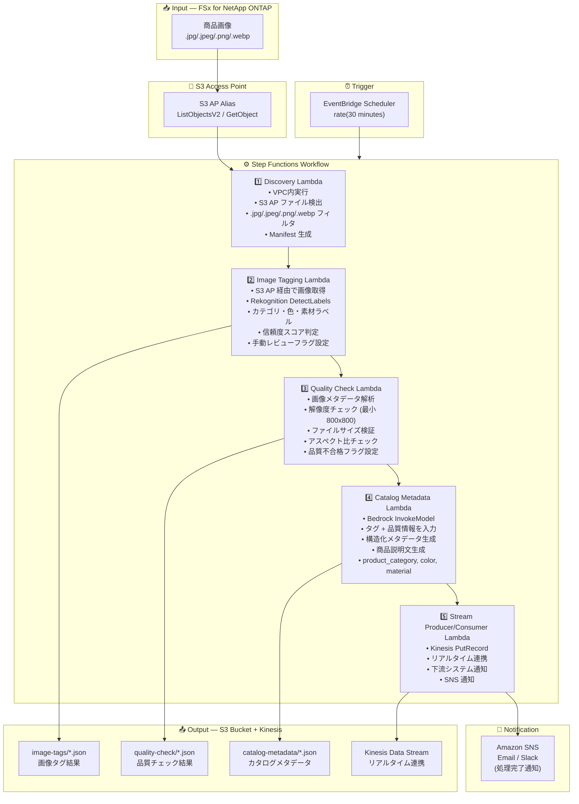

# UC11: 小売 / EC — 商品画像自動タグ付け・カタログメタデータ生成

🌐 **Language / 言語**: 日本語 | [English](architecture.en.md) | [한국어](architecture.ko.md) | [简体中文](architecture.zh-CN.md) | [繁體中文](architecture.zh-TW.md) | [Français](architecture.fr.md) | [Deutsch](architecture.de.md) | [Español](architecture.es.md)

## End-to-End Architecture (Input → Output)

---

## High-Level Flow

```
┌─────────────────────────────────────────────────────────────────────────────┐
│                         FSx for NetApp ONTAP                                 │
│                                                                              │
│  /vol/product_images/                                                        │
│  ├── new_arrivals/SKU_001/front.jpg        (商品画像 — 正面)                 │
│  ├── new_arrivals/SKU_001/side.png         (商品画像 — 側面)                 │
│  ├── new_arrivals/SKU_002/main.jpeg        (商品画像 — メイン)               │
│  ├── seasonal/summer/SKU_003/hero.webp     (商品画像 — ヒーロー)             │
│  └── seasonal/summer/SKU_004/detail.jpg    (商品画像 — ディテール)            │
│                                                                              │
└──────────────────────────────────┬───────────────────────────────────────────┘
                                   │
                                   ▼
┌──────────────────────────────────────────────────────────────────────────────┐
│                      S3 Access Point (Data Path)                              │
│                                                                              │
│  Alias: fsxn-retail-vol-ext-s3alias                                          │
│  • ListObjectsV2 (商品画像検出)                                              │
│  • GetObject (画像取得)                                                      │
│  • No NFS/SMB mount required from Lambda                                     │
│                                                                              │
└──────────────────────────────────┬───────────────────────────────────────────┘
                                   │
                                   ▼
┌──────────────────────────────────────────────────────────────────────────────┐
│                    EventBridge Scheduler (Trigger)                            │
│                                                                              │
│  Schedule: rate(30 minutes) — configurable                                   │
│  Target: Step Functions State Machine                                        │
│                                                                              │
└──────────────────────────────────┬───────────────────────────────────────────┘
                                   │
                                   ▼
┌──────────────────────────────────────────────────────────────────────────────┐
│                    AWS Step Functions (Orchestration)                         │
│                                                                              │
│  ┌─────────────┐    ┌──────────────────────┐    ┌────────────────────┐      │
│  │  Discovery   │───▶│  Image Tagging       │───▶│  Quality Check     │      │
│  │  Lambda      │    │  Lambda              │    │  Lambda            │      │
│  │             │    │                      │    │                   │      │
│  │  • VPC内     │    │  • Rekognition       │    │  • 解像度チェック  │      │
│  │  • S3 AP List│    │  • ラベル検出        │    │  • ファイルサイズ  │      │
│  │  • 商品画像  │    │  • 信頼度スコア      │    │  • アスペクト比    │      │
│  └─────────────┘    └──────────────────────┘    └────────────────────┘      │
│                                                         │                    │
│                                                         ▼                    │
│                      ┌──────────────────────┐    ┌────────────────────┐      │
│                      │  Stream Producer/    │◀───│  Catalog Metadata  │      │
│                      │  Consumer Lambda     │    │  Lambda            │      │
│                      │                      │    │                   │      │
│                      │  • Kinesis PutRecord │    │  • Bedrock         │      │
│                      │  • リアルタイム連携  │    │  • メタデータ生成  │      │
│                      │  • 下流システム通知  │    │  • 商品説明文      │      │
│                      └──────────────────────┘    └────────────────────┘      │
│                                                                              │
└──────────────────────────────────────────────────────────────────────────────┘
                                   │
                                   ▼
┌──────────────────────────────────────────────────────────────────────────────┐
│                         Output (S3 Bucket + Kinesis)                          │
│                                                                              │
│  s3://{stack}-output-{account}/                                              │
│  ├── image-tags/YYYY/MM/DD/                                                  │
│  │   ├── SKU_001_front_tags.json           ← 画像タグ結果                   │
│  │   └── SKU_002_main_tags.json                                              │
│  ├── quality-check/YYYY/MM/DD/                                               │
│  │   ├── SKU_001_front_quality.json        ← 品質チェック結果               │
│  │   └── SKU_002_main_quality.json                                           │
│  ├── catalog-metadata/YYYY/MM/DD/                                            │
│  │   ├── SKU_001_metadata.json             ← カタログメタデータ             │
│  │   └── SKU_002_metadata.json                                               │
│  └── Kinesis Data Stream                                                     │
│      └── retail-catalog-stream             ← リアルタイム連携               │
│                                                                              │
└──────────────────────────────────────────────────────────────────────────────┘
```

---

## Mermaid Diagram



---

## Data Flow Detail

### Input
| Item | Description |
|------|-------------|
| **Source** | FSx for NetApp ONTAP volume |
| **File Types** | .jpg/.jpeg/.png/.webp (商品画像) |
| **Access Method** | S3 Access Point (ListObjectsV2 + GetObject) |
| **Read Strategy** | 画像全体を取得 (Rekognition / 品質チェックに必要) |

### Processing
| Step | Service | Function |
|------|---------|----------|
| Discovery | Lambda (VPC) | S3 AP で商品画像検出、Manifest 生成 |
| Image Tagging | Lambda + Rekognition | DetectLabels でラベル検出 (カテゴリ、色、素材)、信頼度閾値判定 |
| Quality Check | Lambda | 画像品質メトリクス検証 (解像度、ファイルサイズ、アスペクト比) |
| Catalog Metadata | Lambda + Bedrock | 構造化カタログメタデータ生成 (product_category, color, material, 商品説明文) |
| Stream Producer/Consumer | Lambda + Kinesis | リアルタイム連携、下流システムへのデータ配信 |

### Output
| Artifact | Format | Description |
|----------|--------|-------------|
| Image Tags | `image-tags/YYYY/MM/DD/{sku}_{view}_tags.json` | Rekognition ラベル検出結果 (信頼度スコア付き) |
| Quality Check | `quality-check/YYYY/MM/DD/{sku}_{view}_quality.json` | 品質チェック結果 (解像度、サイズ、アスペクト比、合否) |
| Catalog Metadata | `catalog-metadata/YYYY/MM/DD/{sku}_metadata.json` | 構造化メタデータ (product_category, color, material, description) |
| Kinesis Stream | `retail-catalog-stream` | リアルタイム連携レコード (下流 PIM/EC システム向け) |
| SNS Notification | Email | 処理完了通知・品質アラート |

---

## Key Design Decisions

1. **Rekognition による自動タグ付け** — DetectLabels でカテゴリ・色・素材を自動検出。信頼度閾値 (デフォルト: 70%) 未満は手動レビューフラグ設定
2. **画像品質ゲート** — 解像度 (最小 800x800)、ファイルサイズ、アスペクト比の検証により、EC サイト掲載基準を自動チェック
3. **Bedrock によるメタデータ生成** — タグ + 品質情報を入力として、構造化カタログメタデータと商品説明文を自動生成
4. **Kinesis によるリアルタイム連携** — 処理完了後に Kinesis Data Streams へ PutRecord し、下流の PIM/EC システムとリアルタイム連携
5. **シーケンシャルパイプライン** — タグ付け → 品質チェック → メタデータ生成 → ストリーム配信の順序依存性を Step Functions で管理
6. **ポーリングベース** — S3 AP はイベント通知非対応のため、定期スケジュール実行 (30分間隔で新商品を迅速に処理)

---

## AWS Services Used

| Service | Role |
|---------|------|
| FSx for NetApp ONTAP | 商品画像ストレージ |
| S3 Access Points | ONTAP ボリュームへのサーバーレスアクセス |
| EventBridge Scheduler | 定期トリガー (30分間隔) |
| Step Functions | ワークフローオーケストレーション (シーケンシャル) |
| Lambda | コンピュート (Discovery, Image Tagging, Quality Check, Catalog Metadata, Stream Producer/Consumer) |
| Amazon Rekognition | 商品画像ラベル検出 (DetectLabels) |
| Amazon Bedrock | カタログメタデータ・商品説明文生成 (Claude / Nova) |
| Kinesis Data Streams | リアルタイム連携 (下流 PIM/EC システム向け) |
| SNS | 処理完了通知・品質アラート |
| Secrets Manager | ONTAP REST API 認証情報管理 |
| CloudWatch + X-Ray | オブザーバビリティ |
