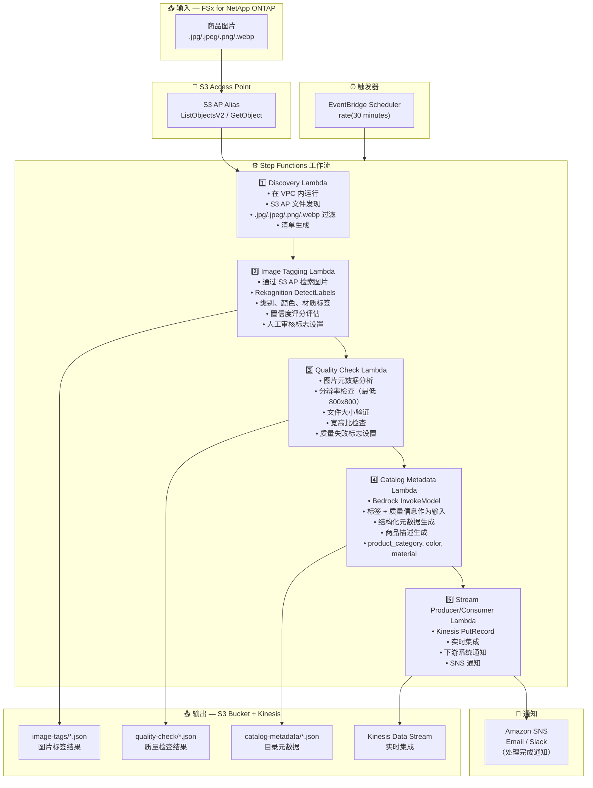

# UC11: 零售/电商 — 商品图片自动标签与目录元数据生成

🌐 **Language / 言語**: [日本語](architecture.md) | [English](architecture.en.md) | [한국어](architecture.ko.md) | 简体中文 | [繁體中文](architecture.zh-TW.md) | [Français](architecture.fr.md) | [Deutsch](architecture.de.md) | [Español](architecture.es.md)

## 端到端架构（输入 → 输出）

---

## 高层级流程

```
┌─────────────────────────────────────────────────────────────────────────────┐
│                         FSx for NetApp ONTAP                                 │
│                                                                              │
│  /vol/product_images/                                                        │
│  ├── new_arrivals/SKU_001/front.jpg        (Product image — front)           │
│  ├── new_arrivals/SKU_001/side.png         (Product image — side)            │
│  ├── new_arrivals/SKU_002/main.jpeg        (Product image — main)            │
│  ├── seasonal/summer/SKU_003/hero.webp     (Product image — hero)            │
│  └── seasonal/summer/SKU_004/detail.jpg    (Product image — detail)          │
│                                                                              │
└──────────────────────────────────┬───────────────────────────────────────────┘
                                   │
                                   ▼
┌──────────────────────────────────────────────────────────────────────────────┐
│                      S3 Access Point (Data Path)                              │
│                                                                              │
│  Alias: fsxn-retail-vol-ext-s3alias                                          │
│  • ListObjectsV2 (product image discovery)                                   │
│  • GetObject (image retrieval)                                               │
│  • No NFS/SMB mount required from Lambda                                     │
│                                                                              │
└──────────────────────────────────┬───────────────────────────────────────────┘
                                   │
                                   ▼
┌──────────────────────────────────────────────────────────────────────────────┐
│                    EventBridge Scheduler (Trigger)                            │
│                                                                              │
│  Schedule: rate(30 minutes) — configurable                                   │
│  Target: Step Functions State Machine                                        │
│                                                                              │
└──────────────────────────────────┬───────────────────────────────────────────┘
                                   │
                                   ▼
┌──────────────────────────────────────────────────────────────────────────────┐
│                    AWS Step Functions (Orchestration)                         │
│                                                                              │
│  ┌─────────────┐    ┌──────────────────────┐    ┌────────────────────┐      │
│  │  Discovery   │───▶│  Image Tagging       │───▶│  Quality Check     │      │
│  │  Lambda      │    │  Lambda              │    │  Lambda            │      │
│  │             │    │                      │    │                   │      │
│  │  • VPC内     │    │  • Rekognition       │    │  • Resolution check│      │
│  │  • S3 AP List│    │  • Label detection   │    │  • File size       │      │
│  │  • Product   │    │  • Confidence score  │    │  • Aspect ratio    │      │
│  │    images   │    │                      │    │                   │      │
│  └─────────────┘    └──────────────────────┘    └────────────────────┘      │
│                                                         │                    │
│                                                         ▼                    │
│                      ┌──────────────────────┐    ┌────────────────────┐      │
│                      │  Stream Producer/    │◀───│  Catalog Metadata  │      │
│                      │  Consumer Lambda     │    │  Lambda            │      │
│                      │                      │    │                   │      │
│                      │  • Kinesis PutRecord │    │  • Bedrock         │      │
│                      │  • Real-time integr  │    │  • Metadata gen    │      │
│                      │  • Downstream notify │    │  • Product desc    │      │
│                      └──────────────────────┘    └────────────────────┘      │
│                                                                              │
└──────────────────────────────────────────────────────────────────────────────┘
                                   │
                                   ▼
┌──────────────────────────────────────────────────────────────────────────────┐
│                         Output (S3 Bucket + Kinesis)                          │
│                                                                              │
│  s3://{stack}-output-{account}/                                              │
│  ├── image-tags/YYYY/MM/DD/                                                  │
│  │   ├── SKU_001_front_tags.json           ← Image tag results              │
│  │   └── SKU_002_main_tags.json                                              │
│  ├── quality-check/YYYY/MM/DD/                                               │
│  │   ├── SKU_001_front_quality.json        ← Quality check results          │
│  │   └── SKU_002_main_quality.json                                           │
│  ├── catalog-metadata/YYYY/MM/DD/                                            │
│  │   ├── SKU_001_metadata.json             ← Catalog metadata               │
│  │   └── SKU_002_metadata.json                                               │
│  └── Kinesis Data Stream                                                     │
│      └── retail-catalog-stream             ← Real-time integration           │
│                                                                              │
└──────────────────────────────────────────────────────────────────────────────┘
```

---

## Mermaid 图表



---

## 数据流详情

### 输入
| 项目 | 说明 |
|------|------|
| **来源** | FSx for NetApp ONTAP 卷 |
| **文件类型** | .jpg/.jpeg/.png/.webp（商品图片） |
| **访问方式** | S3 Access Point (ListObjectsV2 + GetObject) |
| **读取策略** | 完整图片检索（Rekognition / 质量检查所需） |

### 处理
| 步骤 | 服务 | 功能 |
|------|------|------|
| Discovery | Lambda (VPC) | 通过 S3 AP 发现商品图片，生成清单 |
| Image Tagging | Lambda + Rekognition | DetectLabels 进行标签检测（类别、颜色、材质），置信度阈值评估 |
| Quality Check | Lambda | 图片质量指标验证（分辨率、文件大小、宽高比） |
| Catalog Metadata | Lambda + Bedrock | 结构化目录元数据生成（product_category, color, material, 商品描述） |
| Stream Producer/Consumer | Lambda + Kinesis | 实时集成，向下游系统传递数据 |

### 输出
| 产出物 | 格式 | 说明 |
|--------|------|------|
| 图片标签 | `image-tags/YYYY/MM/DD/{sku}_{view}_tags.json` | Rekognition 标签检测结果（含置信度评分） |
| 质量检查 | `quality-check/YYYY/MM/DD/{sku}_{view}_quality.json` | 质量检查结果（分辨率、大小、宽高比、通过/失败） |
| 目录元数据 | `catalog-metadata/YYYY/MM/DD/{sku}_metadata.json` | 结构化元数据（product_category, color, material, description） |
| Kinesis Stream | `retail-catalog-stream` | 实时集成记录（用于下游 PIM/EC 系统） |
| SNS 通知 | Email | 处理完成通知及质量警报 |

---

## 关键设计决策

1. **Rekognition 自动标签** — 通过 DetectLabels 自动检测类别/颜色/材质。置信度低于阈值（默认：70%）时设置人工审核标志
2. **图片质量门控** — 分辨率（最低 800x800）、文件大小和宽高比验证，自动检查电商上架标准
3. **Bedrock 元数据生成** — 以标签 + 质量信息为输入，自动生成结构化目录元数据和商品描述
4. **Kinesis 实时集成** — 处理后通过 PutRecord 写入 Kinesis Data Streams，与下游 PIM/EC 系统实时集成
5. **顺序管道** — Step Functions 管理顺序依赖：标签 → 质量检查 → 元数据生成 → 流传递
6. **轮询（非事件驱动）** — S3 AP 不支持事件通知；30 分钟间隔用于快速处理新商品

---

## 使用的 AWS 服务

| 服务 | 角色 |
|------|------|
| FSx for NetApp ONTAP | 商品图片存储 |
| S3 Access Points | 对 ONTAP 卷的无服务器访问 |
| EventBridge Scheduler | 定期触发（30 分钟间隔） |
| Step Functions | 工作流编排（顺序） |
| Lambda | 计算（Discovery, Image Tagging, Quality Check, Catalog Metadata, Stream Producer/Consumer） |
| Amazon Rekognition | 商品图片标签检测 (DetectLabels) |
| Amazon Bedrock | 目录元数据及商品描述生成 (Claude / Nova) |
| Kinesis Data Streams | 实时集成（用于下游 PIM/EC 系统） |
| SNS | 处理完成通知及质量警报 |
| Secrets Manager | ONTAP REST API 凭证管理 |
| CloudWatch + X-Ray | 可观测性 |
