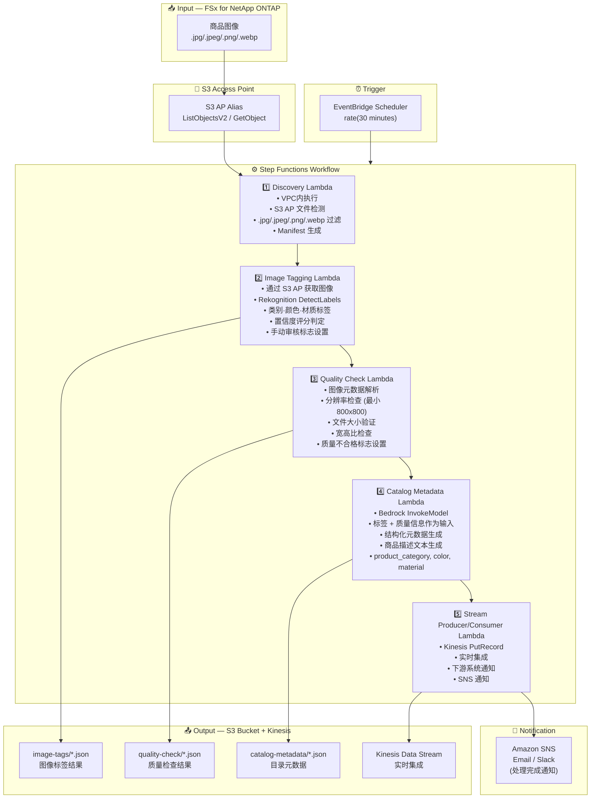

# UC11: 零售 / 电商 — 商品图像自动标签和目录元数据生成

🌐 **Language / 언어 / 语言 / 語言 / Langue / Sprache / Idioma**: [日本語](architecture.md) | [English](architecture.en.md) | [한국어](architecture.ko.md) | 简体中文 | [繁體中文](architecture.zh-TW.md) | [Français](architecture.fr.md) | [Deutsch](architecture.de.md) | [Español](architecture.es.md)

> 注意：此翻译由 Amazon Bedrock Claude 生成。欢迎对翻译质量提出改进建议。

## End-to-End Architecture (Input → Output)

---

## Architecture Diagram

---

## Data Flow Detail

### Input
| Item | Description |
|------|-------------|
| **Source** | FSx for NetApp ONTAP volume |
| **File Types** | .jpg/.jpeg/.png/.webp (商品图像) |
| **Access Method** | S3 Access Point (ListObjectsV2 + GetObject) |
| **Read Strategy** | 获取完整图像 (Rekognition / 质量检查所需) |

### Processing
| Step | Service | Function |
|------|---------|----------|
| Discovery | Lambda (VPC) | 通过 S3 AP 检测商品图像，生成 Manifest |
| Image Tagging | Lambda + Rekognition | 使用 DetectLabels 检测标签 (类别、颜色、材质)，置信度阈值判定 |
| Quality Check | Lambda | 验证图像质量指标 (分辨率、文件大小、宽高比) |
| Catalog Metadata | Lambda + Bedrock | 生成结构化目录元数据 (product_category, color, material, 商品描述文本) |
| Stream Producer/Consumer | Lambda + Kinesis | 实时集成，向下游系统分发数据 |

### Output
| Artifact | Format | Description |
|----------|--------|-------------|
| Image Tags | `image-tags/YYYY/MM/DD/{sku}_{view}_tags.json` | Rekognition 标签检测结果 (带置信度评分) |
| Quality Check | `quality-check/YYYY/MM/DD/{sku}_{view}_quality.json` | 质量检查结果 (分辨率、大小、宽高比、合格/不合格) |
| Catalog Metadata | `catalog-metadata/YYYY/MM/DD/{sku}_metadata.json` | 结构化元数据 (product_category, color, material, description) |
| Kinesis Stream | `retail-catalog-stream` | 实时集成记录 (面向下游 PIM/电商系统) |
| SNS Notification | Email | 处理完成通知·质量告警 |

---

## Key Design Decisions

1. **通过 Rekognition 自动标记** — 使用 DetectLabels 自动检测类别·颜色·材质。置信度低于阈值 (默认: 70%) 时设置手动审核标志
2. **图像质量门控** — 通过验证分辨率 (最小 800x800)、文件大小、宽高比，自动检查电商网站发布标准
3. **通过 Bedrock 生成元数据** — 以标签 + 质量信息作为输入，自动生成结构化目录元数据和商品描述文本
4. **通过 Kinesis 实时集成** — 处理完成后向 Kinesis Data Streams 执行 PutRecord，与下游 PIM/电商系统实时集成
5. **顺序流水线** — 通过 Step Functions 管理标记 → 质量检查 → 元数据生成 → 流分发的顺序依赖关系
6. **基于轮询** — 由于 S3 AP 不支持事件通知，采用定期调度执行 (30分钟间隔快速处理新商品)

---

## AWS Services Used

| Service | Role |
|---------|------|
| FSx for NetApp ONTAP | 商品图像存储 |
| S3 Access Points | 对 ONTAP 卷的无服务器访问 |
| EventBridge Scheduler | 定期触发器 (30分钟间隔) |
| Step Functions | 工作流编排 (顺序) |
| Lambda | 计算 (Discovery, Image Tagging, Quality Check, Catalog Metadata, Stream Producer/Consumer) |
| Amazon Rekognition | 商品图像标签检测 (DetectLabels) |
| Amazon Bedrock | 目录元数据·商品描述文本生成 (Claude / Nova) |
| Kinesis Data Streams | 实时集成 (面向下游 PIM/电商系统) |
| SNS | 处理完成通知·质量告警 |
| Secrets Manager | ONTAP REST API 凭证管理 |
| CloudWatch + X-Ray | 可观测性 |
