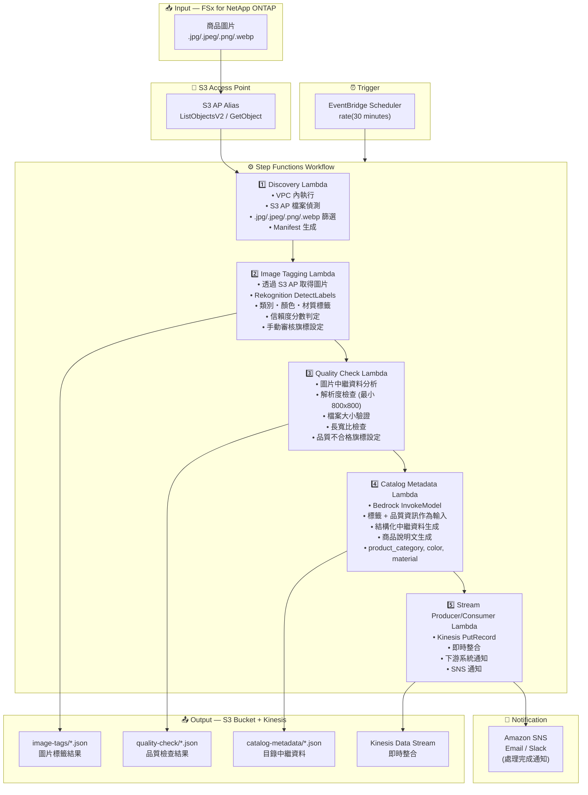

# UC11: 小售 / 電商 — 商品圖像自動標記・目錄元資料生成

🌐 **Language / 언어 / 语言 / 語言 / Langue / Sprache / Idioma**: [日本語](architecture.md) | [English](architecture.en.md) | [한국어](architecture.ko.md) | [简体中文](architecture.zh-CN.md) | 繁體中文 | [Français](architecture.fr.md) | [Deutsch](architecture.de.md) | [Español](architecture.es.md)

> 注意：此翻譯由 Amazon Bedrock Claude 產生。歡迎對翻譯品質提出改進建議。

## End-to-End Architecture (Input → Output)

---

## Architecture Diagram

---

## Data Flow Detail

### Input
| Item | Description |
|------|-------------|
| **Source** | FSx for NetApp ONTAP volume |
| **File Types** | .jpg/.jpeg/.png/.webp (商品圖片) |
| **Access Method** | S3 Access Point (ListObjectsV2 + GetObject) |
| **Read Strategy** | 取得完整圖片 (Rekognition / 品質檢查所需) |

### Processing
| Step | Service | Function |
|------|---------|----------|
| Discovery | Lambda (VPC) | 透過 S3 AP 偵測商品圖片，生成 Manifest |
| Image Tagging | Lambda + Rekognition | 使用 DetectLabels 偵測標籤 (類別、顏色、材質)，信賴度閾值判定 |
| Quality Check | Lambda | 驗證圖片品質指標 (解析度、檔案大小、長寬比) |
| Catalog Metadata | Lambda + Bedrock | 生成結構化目錄中繼資料 (product_category, color, material, 商品說明文) |
| Stream Producer/Consumer | Lambda + Kinesis | 即時整合，向下游系統配送資料 |

### Output
| Artifact | Format | Description |
|----------|--------|-------------|
| Image Tags | `image-tags/YYYY/MM/DD/{sku}_{view}_tags.json` | Rekognition 標籤偵測結果 (附信賴度分數) |
| Quality Check | `quality-check/YYYY/MM/DD/{sku}_{view}_quality.json` | 品質檢查結果 (解析度、大小、長寬比、合格與否) |
| Catalog Metadata | `catalog-metadata/YYYY/MM/DD/{sku}_metadata.json` | 結構化中繼資料 (product_category, color, material, description) |
| Kinesis Stream | `retail-catalog-stream` | 即時整合記錄 (供下游 PIM/EC 系統使用) |
| SNS Notification | Email | 處理完成通知・品質警示 |

---

## Key Design Decisions

1. **Rekognition 自動標籤** — 使用 DetectLabels 自動偵測類別・顏色・材質。信賴度低於閾值 (預設: 70%) 時設定手動審核旗標
2. **圖片品質閘門** — 透過驗證解析度 (最小 800x800)、檔案大小、長寬比，自動檢查 EC 網站刊登標準
3. **Bedrock 中繼資料生成** — 以標籤 + 品質資訊作為輸入，自動生成結構化目錄中繼資料與商品說明文
4. **Kinesis 即時整合** — 處理完成後透過 Kinesis Data Streams 執行 PutRecord，與下游 PIM/EC 系統進行即時整合
5. **循序管線** — 透過 Step Functions 管理標籤 → 品質檢查 → 中繼資料生成 → 串流配送的順序相依性
6. **輪詢基礎** — 由於 S3 AP 不支援事件通知，採用定期排程執行 (30 分鐘間隔以快速處理新商品)

---

## AWS Services Used

| Service | Role |
|---------|------|
| FSx for NetApp ONTAP | 商品圖片儲存 |
| S3 Access Points | 對 ONTAP 磁碟區的無伺服器存取 |
| EventBridge Scheduler | 定期觸發器 (30 分鐘間隔) |
| Step Functions | 工作流程編排 (循序) |
| Lambda | 運算 (Discovery, Image Tagging, Quality Check, Catalog Metadata, Stream Producer/Consumer) |
| Amazon Rekognition | 商品圖片標籤偵測 (DetectLabels) |
| Amazon Bedrock | 目錄中繼資料・商品說明文生成 (Claude / Nova) |
| Kinesis Data Streams | 即時整合 (供下游 PIM/EC 系統使用) |
| SNS | 處理完成通知・品質警示 |
| Secrets Manager | ONTAP REST API 認證資訊管理 |
| CloudWatch + X-Ray | 可觀測性 |
