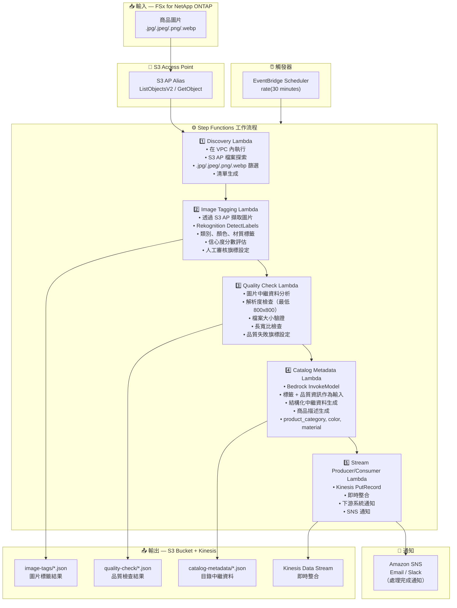

# UC11: 零售/電商 — 商品圖片自動標籤與目錄中繼資料生成

🌐 **Language / 言語**: [日本語](architecture.md) | [English](architecture.en.md) | [한국어](architecture.ko.md) | [简体中文](architecture.zh-CN.md) | 繁體中文 | [Français](architecture.fr.md) | [Deutsch](architecture.de.md) | [Español](architecture.es.md)

## 端對端架構（輸入 → 輸出）

---

## 架構圖

---

## 資料流程詳情

### 輸入
| 項目 | 說明 |
|------|------|
| **來源** | FSx for NetApp ONTAP 磁碟區 |
| **檔案類型** | .jpg/.jpeg/.png/.webp（商品圖片） |
| **存取方式** | S3 Access Point (ListObjectsV2 + GetObject) |
| **讀取策略** | 完整圖片擷取（Rekognition / 品質檢查所需） |

### 處理
| 步驟 | 服務 | 功能 |
|------|------|------|
| Discovery | Lambda (VPC) | 透過 S3 AP 探索商品圖片，生成清單 |
| Image Tagging | Lambda + Rekognition | DetectLabels 進行標籤偵測（類別、顏色、材質），信心度閾值評估 |
| Quality Check | Lambda | 圖片品質指標驗證（解析度、檔案大小、長寬比） |
| Catalog Metadata | Lambda + Bedrock | 結構化目錄中繼資料生成（product_category, color, material, 商品描述） |
| Stream Producer/Consumer | Lambda + Kinesis | 即時整合，向下游系統傳遞資料 |

### 輸出
| 產出物 | 格式 | 說明 |
|--------|------|------|
| 圖片標籤 | `image-tags/YYYY/MM/DD/{sku}_{view}_tags.json` | Rekognition 標籤偵測結果（含信心度分數） |
| 品質檢查 | `quality-check/YYYY/MM/DD/{sku}_{view}_quality.json` | 品質檢查結果（解析度、大小、長寬比、通過/失敗） |
| 目錄中繼資料 | `catalog-metadata/YYYY/MM/DD/{sku}_metadata.json` | 結構化中繼資料（product_category, color, material, description） |
| Kinesis Stream | `retail-catalog-stream` | 即時整合記錄（用於下游 PIM/EC 系統） |
| SNS 通知 | Email | 處理完成通知及品質警報 |

---

## 關鍵設計決策

1. **Rekognition 自動標籤** — 透過 DetectLabels 自動偵測類別/顏色/材質。信心度低於閾值（預設：70%）時設定人工審核旗標
2. **圖片品質閘門** — 解析度（最低 800x800）、檔案大小和長寬比驗證，自動檢查電商上架標準
3. **Bedrock 中繼資料生成** — 以標籤 + 品質資訊為輸入，自動生成結構化目錄中繼資料和商品描述
4. **Kinesis 即時整合** — 處理後透過 PutRecord 寫入 Kinesis Data Streams，與下游 PIM/EC 系統即時整合
5. **循序管線** — Step Functions 管理順序相依性：標籤 → 品質檢查 → 中繼資料生成 → 串流傳遞
6. **輪詢（非事件驅動）** — S3 AP 不支援事件通知；30 分鐘間隔用於快速處理新商品

---

## 使用的 AWS 服務

| 服務 | 角色 |
|------|------|
| FSx for NetApp ONTAP | 商品圖片儲存 |
| S3 Access Points | 對 ONTAP 磁碟區的無伺服器存取 |
| EventBridge Scheduler | 定期觸發（30 分鐘間隔） |
| Step Functions | 工作流程編排（循序） |
| Lambda | 運算（Discovery, Image Tagging, Quality Check, Catalog Metadata, Stream Producer/Consumer） |
| Amazon Rekognition | 商品圖片標籤偵測 (DetectLabels) |
| Amazon Bedrock | 目錄中繼資料及商品描述生成 (Claude / Nova) |
| Kinesis Data Streams | 即時整合（用於下游 PIM/EC 系統） |
| SNS | 處理完成通知及品質警報 |
| Secrets Manager | ONTAP REST API 憑證管理 |
| CloudWatch + X-Ray | 可觀測性 |
