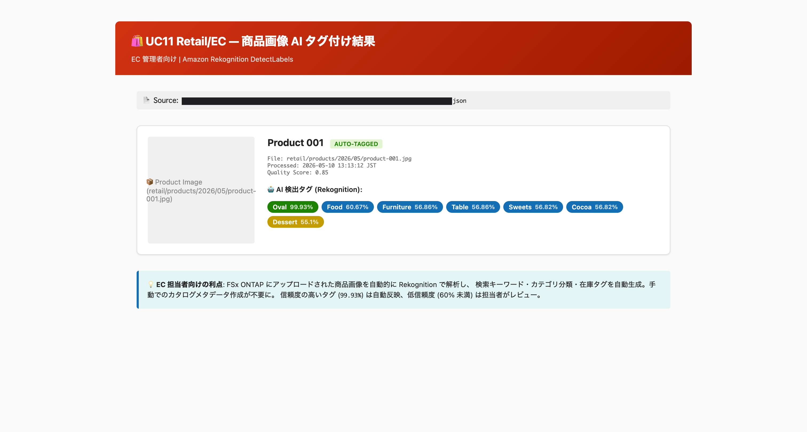
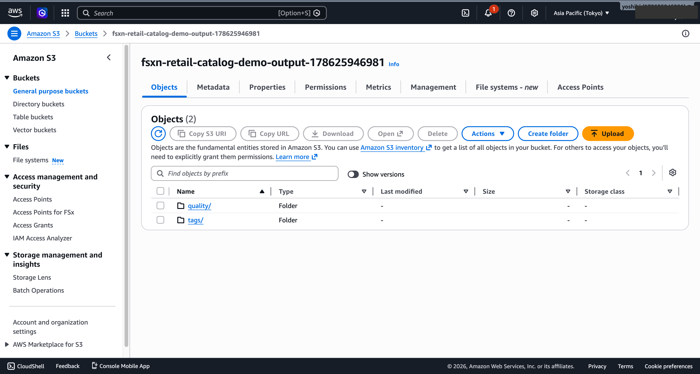

# Étiquetage d'images de produits et génération de métadonnées de catalogue — Demo Guide

🌐 **Language / 언어 / 语言 / 語言 / Langue / Sprache / Idioma**: [日本語](demo-guide.md) | [English](demo-guide.en.md) | [한국어](demo-guide.ko.md) | [简体中文](demo-guide.zh-CN.md) | [繁體中文](demo-guide.zh-TW.md) | Français | [Deutsch](demo-guide.de.md) | [Español](demo-guide.es.md)

> Note : Cette traduction est produite par Amazon Bedrock Claude. Les contributions pour améliorer la qualité de la traduction sont les bienvenues.

## Executive Summary

Cette démo illustre un pipeline automatisé de balisage d'images de produits et de génération de métadonnées de catalogue. L'analyse d'images par IA extrait automatiquement les attributs des produits et construit un catalogue interrogeable.

**Message clé de la démo** : L'IA extrait automatiquement les attributs (couleur, matériau, catégorie, etc.) à partir des images de produits et génère instantanément les métadonnées du catalogue.

**Durée estimée** : 3 à 5 minutes

---

## Target Audience & Persona

| Élément | Détails |
|------|------|
| **Poste** | Gestionnaire de site e-commerce / Gestionnaire de catalogue / Responsable merchandising |
| **Tâches quotidiennes** | Enregistrement de produits, gestion d'images, mise à jour de catalogue |
| **Défis** | La saisie des attributs et le balisage des nouveaux produits prennent du temps |
| **Résultats attendus** | Automatisation de l'enregistrement des produits et amélioration de la recherche |

### Persona : Yoshida-san (Gestionnaire de catalogue e-commerce)

- Enregistre plus de 200 nouveaux produits par semaine
- Saisit manuellement plus de 10 balises d'attributs par produit
- « Je veux générer automatiquement les balises simplement en téléchargeant les images de produits »

---

## Demo Scenario : Enregistrement de lots de nouveaux produits

### Vue d'ensemble du workflow

```
Image produit      Analyse image    Extraction        Mise à jour
(JPEG/PNG)    →    Analyse IA   →   attributs    →    catalogue
                   Détection        Génération        Métadonnées
                   d'objets         balises           enregistrées
```

---

## Storyboard (5 sections / 3 à 5 minutes)

### Section 1 : Problem Statement (0:00–0:45)

**Résumé de la narration** :
> Plus de 200 nouveaux produits par semaine. La saisie manuelle des balises de couleur, matériau, catégorie, style, etc. pour chaque produit représente un travail considérable. Des erreurs de saisie et des incohérences se produisent également.

**Visuel clé** : Dossier d'images de produits, écran de saisie manuelle des balises

### Section 2 : Image Upload (0:45–1:30)

**Résumé de la narration** :
> Il suffit de placer les images de produits dans un dossier pour déclencher automatiquement le pipeline de balisage.

**Visuel clé** : Téléchargement d'images → Déclenchement automatique du workflow

### Section 3 : AI Analysis (1:30–2:30)

**Résumé de la narration** :
> L'IA analyse chaque image et détermine automatiquement la catégorie du produit, la couleur, le matériau, le motif et le style. Extraction simultanée de plusieurs attributs.

**Visuel clé** : Traitement de l'analyse d'images, résultats d'extraction d'attributs

### Section 4 : Tag Generation (2:30–3:45)

**Résumé de la narration** :
> Les attributs extraits sont convertis en balises standardisées. Assure la cohérence avec le système de balises existant.

**Visuel clé** : Liste des balises générées, répartition par catégorie

### Section 5 : Catalog Update (3:45–5:00)

**Résumé de la narration** :
> Les métadonnées sont automatiquement enregistrées dans le catalogue. Contribue à l'amélioration de la recherche et de la précision des recommandations de produits. Génère un rapport récapitulatif du traitement.

**Visuel clé** : Résultats de mise à jour du catalogue, rapport récapitulatif IA

---

## Screen Capture Plan

| # | Écran | Section |
|---|------|-----------|
| 1 | Dossier d'images de produits | Section 1 |
| 2 | Écran de lancement du pipeline | Section 2 |
| 3 | Résultats d'analyse d'images IA | Section 3 |
| 4 | Liste des résultats de génération de balises | Section 4 |
| 5 | Récapitulatif de mise à jour du catalogue | Section 5 |

---

## Narration Outline

| Section | Durée | Message clé |
|-----------|------|--------------|
| Problem | 0:00–0:45 | « Le balisage manuel de 200 produits par semaine représente un travail considérable » |
| Upload | 0:45–1:30 | « Le balisage automatique commence simplement en plaçant les images » |
| Analysis | 1:30–2:30 | « L'IA détermine automatiquement la couleur, le matériau et la catégorie » |
| Tags | 2:30–3:45 | « Génération automatique de balises standardisées » |
| Catalog | 3:45–5:00 | « Enregistrement automatique dans le catalogue, amélioration de la recherche » |

---

## Sample Data Requirements

| # | Données | Utilisation |
|---|--------|------|
| 1 | Images de produits vestimentaires (10 images) | Objet de traitement principal |
| 2 | Images de produits d'ameublement (5 images) | Démo de classification par catégorie |
| 3 | Images d'accessoires (5 images) | Démo d'extraction multi-attributs |
| 4 | Référentiel du système de balises existant | Démo de standardisation |

---

## Timeline

### Réalisable en 1 semaine

| Tâche | Durée |
|--------|---------|
| Préparation des images de produits échantillons | 2 heures |
| Vérification de l'exécution du pipeline | 2 heures |
| Capture d'écrans | 2 heures |
| Rédaction du script de narration | 2 heures |
| Montage vidéo | 4 heures |

### Future Enhancements

- Recherche de produits similaires
- Génération automatique de descriptions de produits
- Intégration d'analyse des tendances

---

## Technical Notes

| Composant | Rôle |
|--------------|------|
| Step Functions | Orchestration du workflow |
| Lambda (Image Analyzer) | Analyse d'images via Bedrock/Rekognition |
| Lambda (Tag Generator) | Génération et standardisation des balises d'attributs |
| Lambda (Catalog Updater) | Enregistrement des métadonnées du catalogue |
| Lambda (Report Generator) | Génération du rapport récapitulatif du traitement |

### Fallback

| Scénario | Réponse |
|---------|------|
| Précision d'analyse d'images insuffisante | Utiliser les résultats pré-analysés |
| Latence Bedrock | Afficher les balises pré-générées |

---

*Ce document est un guide de production de vidéo de démonstration pour présentation technique.*

---

## Captures d'écran UI/UX vérifiées (Validation AWS 2026-05-10)

Même approche que Phase 7 : capture des **écrans UI/UX réellement utilisés par les responsables e-commerce dans leurs tâches quotidiennes**.
Les écrans destinés aux techniciens (graphes Step Functions, etc.) sont exclus.

### Choix de la destination de sortie : S3 standard vs FSxN S3AP

UC11 prend en charge le paramètre `OutputDestination` depuis la mise à jour du 2026-05-10.
**En réécrivant les résultats IA sur le même volume FSx**, les utilisateurs SMB/NFS peuvent
consulter les JSON de balises générées automatiquement dans la structure de répertoires des images de produits
(modèle « no data movement »).

```bash
# Mode STANDARD_S3 (par défaut, comportement traditionnel)
--parameter-overrides OutputDestination=STANDARD_S3 ...

# Mode FSXN_S3AP (réécriture des résultats IA sur le volume FSx ONTAP)
--parameter-overrides \
  OutputDestination=FSXN_S3AP \
  OutputS3APPrefix=ai-outputs/ \
  ...
```

Pour les contraintes des spécifications AWS et les solutions de contournement, consultez la [section « Contraintes des spécifications AWS et solutions de contournement » du README du projet](../../README.md#aws-仕様上の制約と回避策).

### 1. Résultats de balisage automatique des images de produits

Résultats d'analyse IA reçus par le gestionnaire e-commerce lors de l'enregistrement de nouveaux produits. Rekognition a détecté 7 étiquettes à partir de l'image réelle
(`Oval` 99,93 %, `Food`, `Furniture`, `Table`, `Sweets`, `Cocoa`, `Dessert`).

<!-- SCREENSHOT: uc11-product-tags.png
     Contenu : Image produit + Liste des balises détectées par IA (avec niveau de confiance)
     Masqué : ID de compte, nom du bucket -->


### 2. Bucket de sortie S3 — Vue d'ensemble des résultats de balises et de contrôle qualité

Écran où le responsable des opérations e-commerce vérifie les résultats du traitement par lots.
Des JSON sont générés pour chaque produit sous 2 préfixes : `tags/` et `quality/`.

<!-- SCREENSHOT: uc11-s3-output-bucket.png
     Contenu : Console S3 avec préfixes tags/, quality/
     Masqué : ID de compte -->


### Valeurs mesurées (Validation de déploiement AWS 2026-05-10)

- **Exécution Step Functions** : SUCCEEDED, traitement parallèle de 4 images de produits
- **Rekognition** : 7 étiquettes détectées sur image réelle (confiance maximale 99,93 %)
- **JSON générés** : tags/*.json (~750 octets), quality/*.json (~420 octets)
- **Stack réelle** : `fsxn-retail-catalog-demo` (ap-northeast-1, validation du 2026-05-10)
