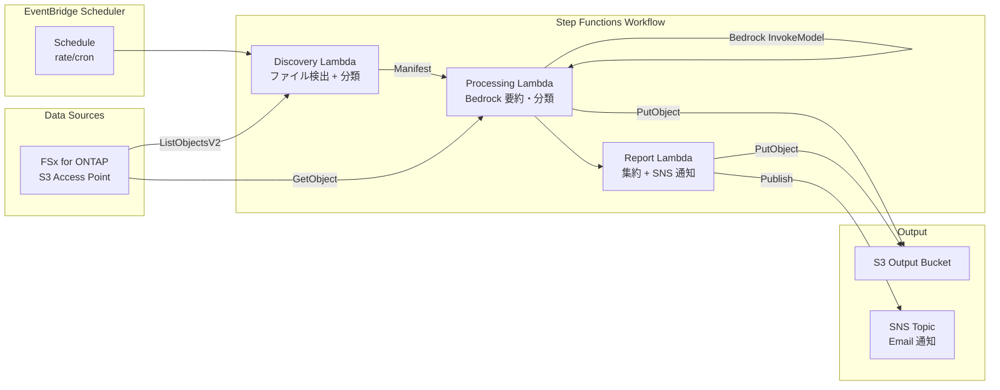

# SAP/ERP Adjacent — アーキテクチャ

## 概要

SAP IDoc エクスポート、HULFT 転送ファイル、EDI ランディングゾーン、バッチジョブ出力を
FSx for ONTAP S3 Access Points 経由で処理するサーバーレスワークフロー。

## アーキテクチャ図

## コンポーネント

| コンポーネント | 役割 | 技術 |
|--------------|------|------|
| Discovery Lambda | S3 AP 経由でファイル一覧取得、SAP/ERP カテゴリ分類 | Python 3.12, boto3 |
| Processing Lambda | ファイル読み取り + Bedrock 要約・構造化 | Python 3.12, Bedrock |
| Report Lambda | 結果集約 + SNS 通知 | Python 3.12, SNS |
| Step Functions | ワークフローオーケストレーション | ASL, Map state |
| EventBridge Scheduler | 定期実行トリガー | rate/cron 式 |

## ファイルカテゴリ

| カテゴリ | 拡張子 | 説明 |
|---------|--------|------|
| sap_idoc | .idoc, .xml | SAP IDoc エクスポート (ORDERS, INVOIC, DESADV 等) |
| hulft_transfer | - | HULFT/DataSpider 転送ファイル |
| edi_document | .edi, .x12, .edifact | EDI ドキュメント |
| batch_output | - | バッチジョブ出力 |
| data_extract | .csv, .tsv | ERP データ抽出 |
| sap_xml | .xml | SAP XML メッセージ |

## スコープノート

本パターンは SAP 認定統合（RFC/BAPI 直接接続）ではなく、SAP が出力したファイルの
**後処理・分析** に特化しています。

- ✅ SAP が NFS/SMB 経由で FSx for ONTAP に出力したファイルの読み取り・分析
- ✅ IDoc、EDI、CSV 等のフォーマット解析と Bedrock による要約
- ❌ SAP システムへの直接接続（RFC/BAPI）
- ❌ SAP トランザクション実行
- ❌ SAP 認定コネクタの代替

## AWS ドキュメントリンク

| サービス | ドキュメント |
|---------|------------|
| FSx for ONTAP | [ユーザーガイド](https://docs.aws.amazon.com/fsx/latest/ONTAPGuide/what-is-fsx-ontap.html) |
| S3 Access Points for FSx for ONTAP | [S3 AP ガイド](https://docs.aws.amazon.com/fsx/latest/ONTAPGuide/s3-access-points.html) |
| Amazon Bedrock | [ユーザーガイド](https://docs.aws.amazon.com/bedrock/latest/userguide/what-is-bedrock.html) |
| Step Functions | [開発者ガイド](https://docs.aws.amazon.com/step-functions/latest/dg/welcome.html) |
| SAP on AWS | [SAP on AWS ガイド](https://docs.aws.amazon.com/sap/latest/general/welcome.html) |
| AWS SAP Lens | [Well-Architected SAP Lens](https://docs.aws.amazon.com/wellarchitected/latest/sap-lens/sap-lens.html) |

## Well-Architected Framework 対応

| 柱 | 対応 |
|----|------|
| 運用上の優秀性 | 構造化ログ、CloudWatch Metrics、SNS 通知 |
| セキュリティ | 最小権限 IAM、Secrets Manager、S3 暗号化 |
| 信頼性 | Step Functions Retry/Catch、Map state MaxConcurrency |
| パフォーマンス効率 | Lambda ARM64、Range GET（先頭 50KB のみ読み取り） |
| コスト最適化 | サーバーレス（使用時のみ課金）、スケジュール実行 |
| 持続可能性 | オンデマンド実行、不要リソースの自動停止 |
