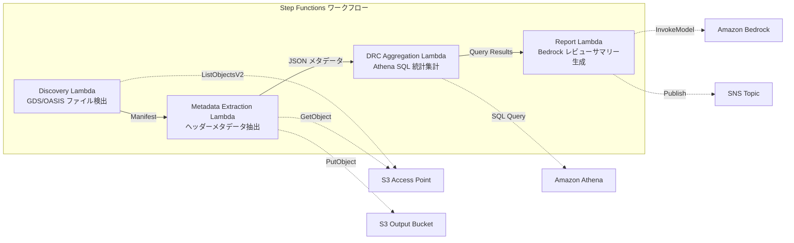

# UC6: Halbleiter / EDA — Validierung der Entwurfsdateien und Extraktion von Metadaten

🌐 **Language / 言語**: [日本語](README.md) | [English](README.en.md) | [한국어](README.ko.md) | [简体中文](README.zh-CN.md) | [繁體中文](README.zh-TW.md) | [Français](README.fr.md) | Deutsch | [Español](README.es.md)

## Überblick

In diesem Artikel lernen Sie, wie Sie mithilfe von AWS-Diensten einen End-to-End-Workflow zum Entwerfen und Herstellen von integrierten Schaltkreisen (ICs) aufbauen. Wir werden beschreiben, wie Sie Amazon Bedrock, AWS Step Functions, Amazon Athena, Amazon S3, AWS Lambda und andere AWS-Dienste verwenden können, um einen sicheren und skalierbaren Fertigungsprozess für ICs zu entwickeln.

Der Workflow umfasst die folgenden Schritte:

1. Entwicklung des IC-Designs mit GDSII-Dateien
2. Durchführung der Layoutüberprüfung (DRC) und Konvertierung in OASIS-Formate
3. Hochladen der Designdaten in Amazon S3
4. Automatisieren des Fertigungsprozesses mit AWS Step Functions
5. Überwachung des Fortschritts und der Leistung mit Amazon CloudWatch
6. Bereitstellen des fertigen ICs mit AWS CloudFormation

Lassen Sie uns nun in die Details gehen und sehen, wie Sie diesen End-to-End-Workflow mit AWS-Diensten aufbauen können.
FSx for NetApp ONTAP S3 Access Points können genutzt werden, um eine serverlose Workflow-Automatisierung für die Validierung, Metadatenextraktion und DRC-Statistiken (Design Rule Check) von GDS/OASIS-Halbleiterdesigndateien durchzuführen.
### Dies sind Anwendungsfälle für dieses Muster:
- GDS/OASIS-Designdateien haben sich auf dem FSx ONTAP stark angehäuft
- Die Metadaten der Designdateien (Bibliotheksname, Zellenzahl, Bounding-Box usw.) sollen automatisch katalogisiert werden
- DRC-Statistiken sollen regelmäßig zusammengefasst werden, um Trends in der Designqualität zu erkennen
- Übergreifende Analyse der Designmetadaten mithilfe von Athena SQL ist erforderlich
- Automatische Erstellung von Zusammenfassungen der Design-Reviews in natürlicher Sprache
### Diese Fälle eignen sich möglicherweise nicht für dieses Muster

- Wenn die zu bearbeitenden Daten sehr groß sind und nicht effizient in Amazon S3 gespeichert oder von Amazon Athena oder AWS Lambda-Funktionen verarbeitet werden können. In solchen Fällen könnte Amazon FSx für NetApp ONTAP eine bessere Wahl sein.
- Wenn der Kostenabrechnungsanforderungen haben, die über die Möglichkeiten von AWS CloudFormation hinausgehen. In diesem Fall wäre möglicherweise ein benutzerdefinierter AWS-Dienst wie Amazon CloudWatch besser geeignet.
- Wenn die Anwendung eine nahtlose Integration mit anderen AWS-Diensten wie AWS Step Functions erfordert.
- Echtzeitausführung von DRC erforderlich (Voraussetzung: Integration in EDA-Tools)
- Physikalische Validierung der Entwurfsdateien (vollständige Überprüfung der Fertigungsregel-Konformität) erforderlich
- EC2-basierte EDA-Toolchain ist bereits in Betrieb, Migrationskosten nicht gerechtfertigt
- Keine Netzwerkkonnektivität zum ONTAP REST API verfügbar
### Wichtige Funktionen

- Amazon Bedrock unterstützt die Erstellung von benutzerdefinierten KI-Modellen mit einer breiten Palette von ML-Frameworks, einschließlich TensorFlow, PyTorch und Hugging Face.
- Mit AWS Step Functions können Sie komplexe Workflows erstellen und verwalten, die verschiedene AWS-Services wie Amazon Athena, Amazon S3 und AWS Lambda einbeziehen.
- Amazon Athena ermöglicht das einfache Abfragen und Analysieren von Daten in Amazon S3.
- Amazon FSx for NetApp ONTAP bietet leistungsfähige Dateidaten-Dienste für Ihre Workloads.
- Amazon CloudWatch hilft Ihnen, die Leistung Ihrer Anwendungen zu überwachen und zu optimieren.
- AWS CloudFormation vereinfacht die Bereitstellung und Verwaltung Ihrer AWS-Ressourcen.
- Automatische Erkennung von GDS/OASIS-Dateien (.gds, .gds2, .oas, .oasis) über Amazon S3
- Extraktion von Headermeta-Daten (library_name, units, cell_count, bounding_box, creation_date)
- Statistische Aggregation von DRC-Daten mit Amazon Athena SQL (Zellverteilung, Ausreißer bei Bounding-Boxen, Verstoß gegen Namenskonventionen)
- Erstellung von Zusammenfassungen zu Design-Reviews in natürlicher Sprache mit Amazon Bedrock
- Sofortiges Teilen der Ergebnisse per Amazon SNS-Benachrichtigung
## Architektur

Amazon Bedrock ist eine vollständig verwaltete Plattform, die Entwicklern den Zugriff auf Large Language Models (LLMs) vereinfacht. Mit AWS Step Functions können Sie komplexe, serverlose Anwendungen aufbauen. Amazon Athena ist ein serverloser, interaktiver Analysedienst, der es Ihnen ermöglicht, direkt in Amazon S3 gespeicherte Daten ohne vorherige Aufbereitung oder Laden der Daten abzufragen. AWS Lambda ist ein serverloser Computedienst, der es Ihnen ermöglicht, Ihre Anwendungen ohne Verwaltung von Servern auszuführen. Amazon FSx für NetApp ONTAP bietet den Zugriff auf einen vollständig verwalteten Dateispeicherdienst. Amazon CloudWatch ist ein Überwachungsdienst für Metriken und Protokolle, der Ihnen die Erfassung und Analyse betrieblicher Daten ermöglicht. Mit AWS CloudFormation können Sie Ihre Cloudressourcen und -infrastruktur in einer JSON- oder YAML-Datei definieren und bereitstellen.



### Workflowstufen

Die Hauptschritte der Beispielworkflow sehen wie folgt aus:

1. Der Benutzer startet den Workflow über Amazon Bedrock.
2. AWS Step Functions koordiniert die Ausführung der nachfolgenden Schritte.
3. Amazon Athena wird verwendet, um Abfragen auf Amazon S3-Daten auszuführen.
4. Die Ergebnisse werden an AWS Lambda-Funktionen übergeben, die die Daten weiter verarbeiten.
5. Die verarbeiteten Daten werden in Amazon FSx for NetApp ONTAP gespeichert.
6. Amazon CloudWatch überwacht den gesamten Workflow.
7. AWS CloudFormation wird genutzt, um die Infrastruktur zu verwalten.
1. **Entdeckung**: Erkennen von .gds-, .gds2-, .oas- und .oasis-Dateien aus S3 AP und Generieren eines Manifests
2. **Metadatenextraktion**: Extrahieren von Metadaten aus den Headern der einzelnen Entwurfsdateien und Ausgabe in JSON mit Datumsteilpartitionierung in S3
3. **DRC-Aggregation**: Analyse des Metadatenkatalogs über Athena SQL und Aggregieren von DRC-Statistiken
4. **Berichterstellung**: Generieren einer Zusammenfassung der Entwurfsüberprüfung mit Bedrock und Ausgabe in S3 + SNS-Benachrichtigung
## Voraussetzungen

- Eine AWS-Konto, mit Zugriff auf die erforderlichen Dienste (Amazon Bedrock, AWS Step Functions, Amazon Athena, Amazon S3, AWS Lambda, Amazon FSx for NetApp ONTAP, Amazon CloudWatch, AWS CloudFormation, etc.)
- Grundkenntnisse in `GDSII`, `DRC`, `OASIS`, `GDS`, `Lambda`, `tapeout` und ähnlichen technischen Begriffen
- Zugriff auf eine Git-Ablage für Ihre HDL-Dateien (Hardware Description Language)
- AWS-Konto und geeignete IAM-Berechtigungen
- FSx für NetApp ONTAP-Dateisystem (ONTAP 9.17.1P4D3 oder höher)
- S3-Zugangspunkt mit aktiviertem Volume (zum Speichern von GDS/OASIS-Dateien)
- VPC, private Subnets
- **NAT-Gateway oder VPC-Endpunkte** (erforderlich, damit die Discovery-Lambda von innerhalb des VPC auf AWS-Dienste zugreifen kann)
- Amazon Bedrock-Modelzugriff aktiviert (Claude / Nova)
- ONTAP REST API-Anmeldeinformationen in Secrets Manager gespeichert
## Bereitstellungsverfahren

- Erstellen Sie Amazon Bedrock-Ressourcen mithilfe von AWS Step Functions.
- Verwenden Sie Amazon Athena, um Daten aus Amazon S3 abzufragen.
- Nutzen Sie AWS Lambda-Funktionen, um benutzerdefinierte Logik auszuführen.
- Verwenden Sie Amazon FSx für NetApp ONTAP zur Datenspeicherung.
- Überwachen Sie den Gesamtprozess mithilfe von Amazon CloudWatch.
- Verwalten Sie Infrastrukturkomponenten mit AWS CloudFormation.

### 1. Erstellung eines S3-Zugangspunkts

Verwenden Sie Amazon S3, um einen S3-Zugangspunkt zu erstellen. S3-Zugangspunkte ermöglichen Ihnen, den Zugriff auf Ihre Buckets besser zu verwalten. Führen Sie dazu folgende Schritte durch:

1. Navigieren Sie zur Amazon S3-Konsole.
2. Wählen Sie den Bucket aus, für den Sie einen Zugangspunkt erstellen möchten.
3. Klicken Sie auf `Zugangspunkt erstellen`.
4. Geben Sie einen Namen für den Zugangspunkt an.
5. Konfigurieren Sie die Zugriffsberechtigungen für den Zugangspunkt.
6. Speichern Sie den Zugangspunkt.
Erstellen Sie einen S3-Zugriffspunkt für den Volume, der GDS/OASIS-Dateien speichert.
#### Erstellung mit AWS CLI

AWS Bedrock, AWS Step Functions, Amazon Athena, Amazon S3, AWS Lambda, Amazon FSx für NetApp ONTAP, Amazon CloudWatch, AWS CloudFormation

GDSII, DRC, OASIS, GDS, Lambda, Tapeout

`...`

/some/file/path.txt
https://example.com

```bash
aws fsx create-and-attach-s3-access-point \
  --name <your-s3ap-name> \
  --type ONTAP \
  --ontap-configuration '{
    "VolumeId": "<your-volume-id>",
    "FileSystemIdentity": {
      "Type": "UNIX",
      "UnixUser": {
        "Name": "root"
      }
    }
  }' \
  --region <your-region>
```
Nach der Erstellung notieren Sie bitte den Wert von `S3AccessPoint.Alias` in der Antwort (im Format `xxx-ext-s3alias`).
#### Erstellen in der AWS Management Console
1. [Amazon FSx-Konsole](https://console.aws.amazon.com/fsx/) öffnen
2. Wählen Sie das entsprechende Dateisystem aus
3. Wählen Sie auf der Registerkarte "Volumes" das entsprechende Volume aus
4. Wählen Sie die Registerkarte "S3-Zugriffspunkte"
5. Klicken Sie auf "S3-Zugriffspunkt erstellen und anhängen"
6. Geben Sie einen Zugriffspunktnamen ein und geben Sie den Dateisystem-ID-Typ (UNIX/WINDOWS) und den Benutzer an
7. Klicken Sie auf "Erstellen"

> Weitere Informationen finden Sie unter [Erstellen von S3-Zugriffspunkten für FSx for ONTAP](https://docs.aws.amazon.com/fsx/latest/ONTAPGuide/s3-access-points-create-fsxn.html).
#### Amazon S3 Zustandsprüfung

```bash
aws fsx describe-s3-access-point-attachments --region <your-region> \
  --query 'S3AccessPointAttachments[*].{Name:Name,Lifecycle:Lifecycle,Alias:S3AccessPoint.Alias}' \
  --output table
```
Bitte warten Sie, bis der `Lifecycle` den Status `AVAILABLE` erreicht hat (normalerweise 1-2 Minuten).
### 2. Hochladen von Beispieldateien (optional)

AWS Step Functions wird zum Orchestrieren einer komplexen Workflowsequenz verwendet. Amazon Athena kann verwendet werden, um Abfragen auf Amazon S3-Daten auszuführen. AWS Lambda kann verwendet werden, um benutzerdefinierte Logik auszuführen. Amazon FSx für NetApp ONTAP bietet Dateidienste für die Verwendung in Ihren Anwendungen. Amazon CloudWatch kann zum Überwachen Ihrer Ressourcen verwendet werden. AWS CloudFormation kann verwendet werden, um Ihre Infrastruktur als Code zu verwalten.
Laden Sie die GDS-Testdatei in den Volume hoch:
```bash
S3AP_ALIAS="<your-s3ap-alias>"

aws s3 cp test-data/semiconductor-eda/eda-designs/test_chip.gds \
  "s3://${S3AP_ALIAS}/eda-designs/test_chip.gds" --region <your-region>

aws s3 cp test-data/semiconductor-eda/eda-designs/test_chip_v2.gds2 \
  "s3://${S3AP_ALIAS}/eda-designs/test_chip_v2.gds2" --region <your-region>
```

### 3. Erstellung des Lambda-Bereitstellungspakets
Bei Verwendung von `template-deploy.yaml` müssen Sie den Code der Lambda-Funktion als Zip-Paket in Amazon S3 hochladen.
```bash
# デプロイ用 S3 バケットの作成
DEPLOY_BUCKET="<your-deploy-bucket-name>"
aws s3 mb "s3://${DEPLOY_BUCKET}" --region <your-region>

# 各 Lambda 関数をパッケージング
for func in discovery metadata_extraction drc_aggregation report_generation; do
  TMPDIR=$(mktemp -d)
  cp semiconductor-eda/functions/${func}/handler.py "${TMPDIR}/"
  cp -r shared "${TMPDIR}/shared"
  (cd "${TMPDIR}" && zip -r "/tmp/semiconductor-eda-${func}.zip" . \
    -x "*.pyc" "__pycache__/*" "shared/tests/*" "shared/cfn/*")
  aws s3 cp "/tmp/semiconductor-eda-${func}.zip" \
    "s3://${DEPLOY_BUCKET}/lambda/semiconductor-eda-${func}.zip" --region <your-region>
  rm -rf "${TMPDIR}"
done
```

### 4. CloudFormation-Bereitstellung

Die Schlüsselkomponenten für die Bereitstellung in AWS sind:

- Amazon Bedrock: eine Plattform für das Design integrierter Schaltkreise
- AWS Step Functions: ein serverloses Workflow-Service
- Amazon Athena: ein serverloses, interaktives SQL-Analyse-Service
- Amazon S3: ein sicherer, skalierbarer Objektspeicher
- AWS Lambda: ein serverloses, ereignisgesteuertes Rechenprogramm
- Amazon FSx for NetApp ONTAP: ein vollständig verwalteter Dateidienst
- Amazon CloudWatch: ein Beobachtungs- und Verwaltungsservice

Diese Dienste können über AWS CloudFormation, eine Infrastruktur-als-Code-Plattform, bereitgestellt werden. Mit CloudFormation können Entwickler komplexe Anwendungen in AWS schnell und konsistent bereitstellen.

```bash
aws cloudformation deploy \
  --template-file semiconductor-eda/template-deploy.yaml \
  --stack-name fsxn-semiconductor-eda \
  --parameter-overrides \
    DeployBucket=<your-deploy-bucket> \
    S3AccessPointAlias=<your-s3ap-alias> \
    S3AccessPointName=<your-s3ap-name> \
    OntapSecretName=<your-secret-name> \
    OntapManagementIp=<ontap-mgmt-ip> \
    SvmUuid=<your-svm-uuid> \
    VpcId=<your-vpc-id> \
    PrivateSubnetIds=<subnet-1>,<subnet-2> \
    PrivateRouteTableIds=<rtb-1>,<rtb-2> \
    NotificationEmail=<your-email@example.com> \
    BedrockModelId=amazon.nova-lite-v1:0 \
    EnableVpcEndpoints=true \
    MapConcurrency=10 \
    LambdaMemorySize=512 \
    LambdaTimeout=300 \
  --capabilities CAPABILITY_NAMED_IAM \
  --region <your-region>
```
**Wichtig**: `S3AccessPointName` ist der Name (nicht der Alias) des S3-Zugangspunkts, der bei der Erstellung angegeben wurde. Dieser wird in IAM-Richtlinien für ARN-basierte Berechtigungen verwendet. Wenn dieser Wert nicht angegeben wird, kann ein `AccessDenied`-Fehler auftreten.
### 5. Überprüfung der SNS-Abonnements

Amazon SNS-Themen können Nachrichten an HTTP, HTTPS, Amazon SQS-Warteschlangen, AWS Lambda-Funktionen, SMS, E-Mails und mehr senden. Überprüfen Sie, ob die erwarteten Abonnements für Ihre Amazon SNS-Themen vorhanden sind.

1. Wechseln Sie zur Amazon SNS-Konsole.
2. Wählen Sie das Thema aus, für das Sie die Abonnements überprüfen möchten.
3. Überprüfen Sie die Liste der Abonnements auf der Registerkarte "Abonnements".
4. Stellen Sie sicher, dass alle erwarteten Endpunkte aufgeführt sind.

Wenn ein erwartetes Abonnement fehlt, fügen Sie es hinzu oder korrigieren Sie die Konfiguration, damit Benachrichtigungen an den richtigen Ort gesendet werden.
Nach der Bereitstellung erhalten Sie eine Bestätigungsmail an die angegebene E-Mail-Adresse. Bitte klicken Sie auf den Link, um die Überprüfung abzuschließen.
### 6. Funktionsüberprüfung

- Starten Sie den Amazon Bedrock-Dienst und überwachen Sie den Ausführungsstatus mithilfe von AWS Step Functions.
- Führen Sie eine Abfrage auf Amazon Athena durch, um die Daten in Amazon S3 zu analysieren.
- Testen Sie das AWS Lambda-basierte Transformationsmodul und überprüfen Sie die Ausgabe in Amazon FSx for NetApp ONTAP.
- Überwachen Sie den Fortschritt und eventuelle Fehler in Amazon CloudWatch.
- Verwalten Sie die Infrastruktur mit AWS CloudFormation.
- Führen Sie ein GDSII-Taped out durch und überprüfen Sie die DRC- und OASIS-Konformität.
Führen Sie Step Functions manuell aus, um das Verhalten zu überprüfen:
```bash
aws stepfunctions start-execution \
  --state-machine-arn "arn:aws:states:<region>:<account-id>:stateMachine:fsxn-semiconductor-eda-workflow" \
  --input '{}' \
  --region <your-region>
```
**Hinweis**: Beim ersten Ausführen können die DRC-Aggregationsergebnisse von Amazon Athena null sein. Dies liegt an der Zeitverzögerung bei der Aktualisierung der Metadaten in der Amazon Glue-Tabelle. Bei darauffolgenden Ausführungen werden die korrekten Statistiken angezeigt.
### Auswahl der richtigen Vorlage

Hier sind einige Beispiele dafür, wie Sie die verschiedenen AWS-Ressourcen wie Amazon Bedrock, AWS Step Functions, Amazon Athena, Amazon S3, AWS Lambda, Amazon FSx for NetApp ONTAP, Amazon CloudWatch und AWS CloudFormation in Ihren Projekten einsetzen können:

- Verwenden Sie Amazon Bedrock, um GDSII, DRC und OASIS-Dateien zu verarbeiten und GDS-Dateien zu generieren.
- Nutzen Sie AWS Step Functions, um einen Workflow mit Amazon Athena, Amazon S3 und AWS Lambda zu orchestrieren.
- Speichern Sie Ihre Daten in Amazon S3 und analysieren Sie sie mit Amazon Athena.
- Führen Sie serverlose Berechnungen mit AWS Lambda durch.
- Verwenden Sie Amazon FSx for NetApp ONTAP, um Ihre Dateisysteme zu verwalten.
- Überwachen Sie Ihre Ressourcen mit Amazon CloudWatch.
- Verwalten Sie Ihre Infrastruktur mit AWS CloudFormation.
- Führen Sie den tapeout-Prozess mit den richtigen Tools durch.

| テンプレート | 用途 | Lambda コード |
|-------------|------|--------------|
| `template.yaml` | SAM CLI でのローカル開発・テスト | インラインパス参照（`sam build` が必要） |
| `template-deploy.yaml` | 本番デプロイ | S3 バケットから zip 取得 |
`template.yaml` muss für die direkte Verwendung mit `aws cloudformation deploy` zunächst mit SAM Transform verarbeitet werden. Für die Produktionsbereitstellung sollten Sie stattdessen `template-deploy.yaml` verwenden.
## Parameterliste

| パラメータ | 説明 | デフォルト | 必須 |
|-----------|------|----------|------|
| `DeployBucket` | Lambda zip を格納する S3 バケット名 | — | ✅ |
| `S3AccessPointAlias` | FSx ONTAP S3 AP Alias（入力用） | — | ✅ |
| `S3AccessPointName` | S3 AP 名（ARN ベースの IAM 権限付与用） | `""` | ⚠️ 推奨 |
| `OntapSecretName` | ONTAP REST API 認証情報の Secrets Manager シークレット名 | — | ✅ |
| `OntapManagementIp` | ONTAP クラスタ管理 IP アドレス | — | ✅ |
| `SvmUuid` | ONTAP SVM UUID | — | ✅ |
| `ScheduleExpression` | EventBridge Scheduler のスケジュール式 | `rate(1 hour)` | |
| `VpcId` | VPC ID | — | ✅ |
| `PrivateSubnetIds` | プライベートサブネット ID リスト | — | ✅ |
| `PrivateRouteTableIds` | プライベートサブネットのルートテーブル ID リスト（S3 Gateway Endpoint 用） | `""` | |
| `NotificationEmail` | SNS 通知先メールアドレス | — | ✅ |
| `BedrockModelId` | Bedrock モデル ID | `amazon.nova-lite-v1:0` | |
| `MapConcurrency` | Map ステートの並列実行数 | `10` | |
| `LambdaMemorySize` | Lambda メモリサイズ (MB) | `256` | |
| `LambdaTimeout` | Lambda タイムアウト (秒) | `300` | |
| `EnableVpcEndpoints` | Interface VPC Endpoints の有効化 | `false` | |
| `EnableCloudWatchAlarms` | CloudWatch Alarms の有効化 | `false` | |
| `EnableXRayTracing` | X-Ray トレーシングの有効化 | `true` | |
⚠️ **`S3AccessPointName`**: Optional, aber wenn nicht angegeben, basiert die IAM-Richtlinie nur auf Alias, was in einigen Umgebungen zu einem `AccessDenied`-Fehler führen kann. In Produktionsumgebungen wird die Angabe empfohlen.
## Fehlerbehebung

This is a test workflow that creates a new Amazon Bedrock environment and runs a serverless workflow using AWS Step Functions. It then queries the data in Amazon Athena, stores it in Amazon S3, and triggers an AWS Lambda function to perform additional processing. The workflow also integrates with Amazon FSx for NetApp ONTAP for file storage and Amazon CloudWatch for monitoring and alerting. AWS CloudFormation is used to provision the necessary infrastructure.

Some common issues you may encounter include GDSII format errors, DRC violations, and issues with OASIS file generation. You can use GDS viewer tools to inspect the layout and debug any problems. If you run into issues during tapeout, check the logs in Amazon CloudWatch for more information.

### Discovery Lambda geht in Timeout
**Grund**: Das Lambda-Programm in einem VPC kann keine AWS-Dienste (Secrets Manager, S3, CloudWatch) erreichen.

**Lösung**: Bitte überprüfen Sie eine der folgenden Optionen:
1. Stellen Sie sicher, dass `EnableVpcEndpoints=true` konfiguriert ist und `PrivateRouteTableIds` angegeben sind.
2. Vergewissern Sie sich, dass ein NAT-Gateway im VPC vorhanden ist und in der Routingtabelle der privaten Subnetze eine Route zum NAT-Gateway existiert.
### AccessDenied-Fehler (ListObjectsV2)

Amazon S3-Bucket-Zugriffsberechtigungen konfigurieren
1. Überprüfen Sie die Berechtigungen für Ihren IAM-Benutzer, der Zugriff auf den Amazon S3-Bucket benötigt.
2. Stellen Sie sicher, dass der IAM-Benutzer über die erforderlichen Berechtigungen zum Auflisten von Objekten im Bucket verfügt.
3. Wenn Sie AWS Lambda verwenden, überprüfen Sie die Berechtigungen des Lambda-Ausführungsrollen-Profils.
4. Testen Sie den Zugriff, indem Sie die AWS CLI oder das AWS Management Console verwenden.
**Ursache**: Der IAM-Richtlinie fehlt die ARN-basierte Berechtigung für den S3-Zugangspunkt.

**Lösung**: Aktualisieren Sie den Stack, indem Sie den Parameter `S3AccessPointName` auf den Namen (nicht den Alias) des S3-Zugangspunkts setzen.
### Die Ergebnisse des Amazon Athena DRC-Aggregats sind 0
**Grund**: Es kann vorkommen, dass der `metadata_prefix`-Filter, der vom DRC-Aggregation-Lambda verwendet wird, nicht mit dem Wert von `file_key` im tatsächlichen Metadaten-JSON übereinstimmt. Außerdem gibt es beim ersten Lauf keine Metadaten in der Glue-Tabelle, daher werden 0 Datensätze zurückgegeben.

**Lösung**:
1. Führen Sie die Step Functions zweimal aus (beim ersten Mal werden die Metadaten in S3 geschrieben, beim zweiten Mal kann Athena die Aggregation durchführen).
2. Führen Sie in der Athena-Konsole direkt `SELECT * FROM "<db>"."<table>" LIMIT 10` aus und überprüfen Sie, ob die Daten gelesen werden können.
3. Wenn die Daten gelesen werden können, aber die Aggregation 0 Datensätze zurückgibt, überprüfen Sie die Konsistenz zwischen dem Wert von `file_key` und dem `prefix`-Filter.
## Bereinigung

Stellen Sie sicher, dass alle von Ihnen bereitgestellten AWS-Ressourcen ordnungsgemäß bereinigt werden, um unnötige Kosten zu vermeiden. Hierzu gehören:

- Amazon Bedrock-Modelle
- AWS Step Functions-Workflows
- Amazon Athena-Abfragen
- Amazon S3-Buckets
- AWS Lambda-Funktionen
- Amazon FSx for NetApp ONTAP-Dateisysteme
- Amazon CloudWatch-Alarme
- AWS CloudFormation-Stapel

Löschen oder deaktivieren Sie alle Ressourcen, die Sie nicht mehr benötigen. Überprüfen Sie regelmäßig Ihre Nutzung und Kosten, um sicherzustellen, dass Ihre Umgebung effizient ist.

```bash
# S3 バケットを空にする
aws s3 rm s3://fsxn-semiconductor-eda-output-${AWS_ACCOUNT_ID} --recursive

# CloudFormation スタックの削除
aws cloudformation delete-stack \
  --stack-name fsxn-semiconductor-eda \
  --region ap-northeast-1

# 削除完了を待機
aws cloudformation wait stack-delete-complete \
  --stack-name fsxn-semiconductor-eda \
  --region ap-northeast-1
```

## Unterstützte Regionen

Amazon Bedrock unterstützt die folgenden Regionen:

- USA Ost (Virginia)
- USA West (Oregon)
- Europa (Irland)
- Asien-Pazifik (Singapur)

AWS Step Functions, Amazon Athena und Amazon S3 sind ebenfalls in diesen Regionen verfügbar.

AWS Lambda ist zusätzlich in der Region Europa (Frankfurt) verfügbar.

Amazon FSx for NetApp ONTAP ist in den Regionen USA Ost (Virginia), USA West (Oregon) und Europa (Irland) verfügbar.

Amazon CloudWatch und AWS CloudFormation sind in allen genannten Regionen nutzbar.
UC6 verwendet folgende Services:

- Amazon Bedrock
- AWS Step Functions
- Amazon Athena
- Amazon S3
- AWS Lambda
- Amazon FSx for NetApp ONTAP
- Amazon CloudWatch
- AWS CloudFormation
| サービス | リージョン制約 |
|---------|-------------|
| Amazon Athena | ほぼ全リージョンで利用可能 |
| Amazon Bedrock | 対応リージョンを確認（[Bedrock 対応リージョン](https://docs.aws.amazon.com/general/latest/gr/bedrock.html)） |
| AWS X-Ray | ほぼ全リージョンで利用可能 |
| CloudWatch EMF | ほぼ全リージョンで利用可能 |
Die detaillierten Informationen finden Sie in der [Region Compatibility Matrix](../docs/region-compatibility.md).
## Referenzlinks

AWS Step Functions kann verwendet werden, um komplexe Serverless-Anwendungen mit koordinierten Workflows zu erstellen. Amazon Athena ist ein interaktiver Abfragedienst, der es einfach macht, große Datenmengen in Amazon S3 direkt zu analysieren. AWS Lambda ermöglicht das Erstellen und Ausführen von Funktionen ohne Server verwalten zu müssen. Amazon FSx for NetApp ONTAP bietet ein vollständig verwaltetes Datei-Storage-Service. Amazon CloudWatch ist ein Überwachungsdienst, der Metriken und Protokolle sammelt. AWS CloudFormation ist ein Dienst, mit dem man Infrastruktur als Code erstellen und verwalten kann.
- [Übersicht über den S3-Zugriff über FSx ONTAP-Zugriffspunkte](https://docs.aws.amazon.com/fsx/latest/ONTAPGuide/accessing-data-via-s3-access-points.html)
- [Erstellen und Anhängen von S3-Zugriffspunkten](https://docs.aws.amazon.com/fsx/latest/ONTAPGuide/s3-access-points-create-fsxn.html)
- [Verwaltung des Zugriffs auf S3-Zugriffspunkte](https://docs.aws.amazon.com/fsx/latest/ONTAPGuide/s3-ap-manage-access-fsxn.html)
- [Amazon Athena Benutzerhandbuch](https://docs.aws.amazon.com/athena/latest/ug/what-is.html)
- [Amazon Bedrock API-Referenz](https://docs.aws.amazon.com/bedrock/latest/APIReference/API_runtime_InvokeModel.html)
- [GDSII-Formatspezifikation](https://boolean.klaasholwerda.nl/interface/bnf/gdsformat.html)