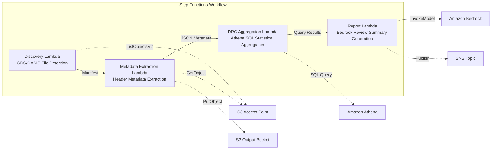

# UC6: Semiconductor / EDA — Design File Validation & Metadata Extraction

## Overview

A serverless workflow that leverages S3 Access Points for FSx for NetApp ONTAP to automate validation, metadata extraction, and DRC (Design Rule Check) statistical aggregation of GDS/OASIS semiconductor design files.

### When This Pattern Is a Good Fit

- Large volumes of GDS/OASIS design files are stored on FSx ONTAP
- You want to automatically catalog design file metadata (library name, cell count, bounding box, etc.)
- You need periodic DRC statistics aggregation to track design quality trends
- Cross-cutting design metadata analysis via Athena SQL is required
- You want to auto-generate natural language design review summaries

### When This Pattern Is Not a Good Fit

- Real-time DRC execution is required (assumes EDA tool integration)
- Physical validation of design files (full manufacturing rule compliance verification) is needed
- An EC2-based EDA toolchain is already running and migration costs are not justified
- Network reachability to the ONTAP REST API cannot be ensured

### Key Features

- Automatic detection of GDS/OASIS files via S3 AP (.gds, .gds2, .oas, .oasis)
- Header metadata extraction (library_name, units, cell_count, bounding_box, creation_date)
- DRC statistical aggregation via Athena SQL (cell count distribution, bounding box outliers, naming convention violations)
- Natural language design review summary generation via Amazon Bedrock
- Immediate result sharing via SNS notifications

## Architecture



### Workflow Steps

1. **Discovery**: Detects .gds, .gds2, .oas, .oasis files from the S3 AP and generates a Manifest
2. **Metadata Extraction**: Extracts metadata from each design file's header and outputs date-partitioned JSON to S3
3. **DRC Aggregation**: Performs cross-cutting analysis of the metadata catalog via Athena SQL and aggregates DRC statistics
4. **Report Generation**: Generates a design review summary via Bedrock and outputs to S3 + SNS notification

## Prerequisites

- AWS account with appropriate IAM permissions
- FSx for NetApp ONTAP file system (ONTAP 9.17.1P4D3 or later)
- A volume with S3 Access Point enabled (containing GDS/OASIS files)
- VPC with private subnets
- **NAT Gateway or VPC Endpoints** (required for Discovery Lambda to access AWS services from within the VPC)
- Amazon Bedrock model access enabled (Claude / Nova)
- ONTAP REST API credentials stored in Secrets Manager

## Deployment Steps

### 1. Create the S3 Access Point

Create an S3 Access Point on the volume that stores GDS/OASIS files.

#### Creating via AWS CLI

```bash
aws fsx create-and-attach-s3-access-point \
  --name <your-s3ap-name> \
  --type ONTAP \
  --ontap-configuration '{
    "VolumeId": "<your-volume-id>",
    "FileSystemIdentity": {
      "Type": "UNIX",
      "UnixUser": {
        "Name": "root"
      }
    }
  }' \
  --region <your-region>
```

After creation, note the `S3AccessPoint.Alias` from the response (in the format `xxx-ext-s3alias`).

#### Creating via AWS Management Console

1. Open the [Amazon FSx console](https://console.aws.amazon.com/fsx/)
2. Select the target file system
3. Select the target volume from the "Volumes" tab
4. Select the "S3 access points" tab
5. Click "Create and attach S3 access point"
6. Enter the access point name and specify the file system identity type (UNIX/WINDOWS) and user
7. Click "Create"

> For details, see [Creating S3 Access Points for FSx for ONTAP](https://docs.aws.amazon.com/fsx/latest/ONTAPGuide/s3-access-points-create-fsxn.html).

#### Checking S3 AP Status

```bash
aws fsx describe-s3-access-point-attachments --region <your-region> \
  --query 'S3AccessPointAttachments[*].{Name:Name,Lifecycle:Lifecycle,Alias:S3AccessPoint.Alias}' \
  --output table
```

Wait until `Lifecycle` becomes `AVAILABLE` (typically 1–2 minutes).

### 2. Upload Sample Files (Optional)

Upload test GDS files to the volume:

```bash
S3AP_ALIAS="<your-s3ap-alias>"

aws s3 cp test-data/semiconductor-eda/eda-designs/test_chip.gds \
  "s3://${S3AP_ALIAS}/eda-designs/test_chip.gds" --region <your-region>

aws s3 cp test-data/semiconductor-eda/eda-designs/test_chip_v2.gds2 \
  "s3://${S3AP_ALIAS}/eda-designs/test_chip_v2.gds2" --region <your-region>
```

### 3. Create Lambda Deployment Packages

When using `template-deploy.yaml`, you need to upload the Lambda function code as zip packages to S3.

```bash
# Create a deployment S3 bucket
DEPLOY_BUCKET="<your-deploy-bucket-name>"
aws s3 mb "s3://${DEPLOY_BUCKET}" --region <your-region>

# Package each Lambda function
for func in discovery metadata_extraction drc_aggregation report_generation; do
  TMPDIR=$(mktemp -d)
  cp semiconductor-eda/functions/${func}/handler.py "${TMPDIR}/"
  cp -r shared "${TMPDIR}/shared"
  (cd "${TMPDIR}" && zip -r "/tmp/semiconductor-eda-${func}.zip" . \
    -x "*.pyc" "__pycache__/*" "shared/tests/*" "shared/cfn/*")
  aws s3 cp "/tmp/semiconductor-eda-${func}.zip" \
    "s3://${DEPLOY_BUCKET}/lambda/semiconductor-eda-${func}.zip" --region <your-region>
  rm -rf "${TMPDIR}"
done
```

### 4. CloudFormation Deployment

```bash
aws cloudformation deploy \
  --template-file semiconductor-eda/template-deploy.yaml \
  --stack-name fsxn-semiconductor-eda \
  --parameter-overrides \
    DeployBucket=<your-deploy-bucket> \
    S3AccessPointAlias=<your-s3ap-alias> \
    S3AccessPointName=<your-s3ap-name> \
    OntapSecretName=<your-secret-name> \
    OntapManagementIp=<ontap-mgmt-ip> \
    SvmUuid=<your-svm-uuid> \
    VpcId=<your-vpc-id> \
    PrivateSubnetIds=<subnet-1>,<subnet-2> \
    PrivateRouteTableIds=<rtb-1>,<rtb-2> \
    NotificationEmail=<your-email@example.com> \
    BedrockModelId=amazon.nova-lite-v1:0 \
    EnableVpcEndpoints=true \
    MapConcurrency=10 \
    LambdaMemorySize=512 \
    LambdaTimeout=300 \
  --capabilities CAPABILITY_NAMED_IAM \
  --region <your-region>
```

> **Important**: `S3AccessPointName` is the name of the S3 AP (the name specified at creation time, not the Alias). It is used for ARN-based permission grants in IAM policies. Omitting it may result in `AccessDenied` errors.

### 5. Confirm SNS Subscription

After deployment, a confirmation email will be sent to the specified email address. Click the link to confirm.

### 6. Verify Operation

Manually execute the Step Functions state machine to verify operation:

```bash
aws stepfunctions start-execution \
  --state-machine-arn "arn:aws:states:<region>:<account-id>:stateMachine:fsxn-semiconductor-eda-workflow" \
  --input '{}' \
  --region <your-region>
```

> **Note**: On the first execution, the Athena DRC aggregation results may return 0 rows. This is because there is a time lag before metadata is reflected in the Glue table. Correct statistics will be obtained from the second execution onward.

### Template Selection Guide

| Template | Use Case | Lambda Code |
|----------|----------|-------------|
| `template.yaml` | Local development and testing with SAM CLI | Inline path references (requires `sam build`) |
| `template-deploy.yaml` | Production deployment | Fetched as zip from S3 bucket |

If using `template.yaml` directly with `aws cloudformation deploy`, SAM Transform processing is required. Use `template-deploy.yaml` for production deployments.

## Configuration Parameters

| Parameter | Description | Default | Required |
|-----------|-------------|---------|----------|
| `DeployBucket` | S3 bucket name for Lambda zip packages | — | ✅ |
| `S3AccessPointAlias` | FSx ONTAP S3 AP Alias (for input) | — | ✅ |
| `S3AccessPointName` | S3 AP name (for ARN-based IAM permission grants) | `""` | ⚠️ Recommended |
| `OntapSecretName` | Secrets Manager secret name for ONTAP REST API credentials | — | ✅ |
| `OntapManagementIp` | ONTAP cluster management IP address | — | ✅ |
| `SvmUuid` | ONTAP SVM UUID | — | ✅ |
| `ScheduleExpression` | EventBridge Scheduler schedule expression | `rate(1 hour)` | |
| `VpcId` | VPC ID | — | ✅ |
| `PrivateSubnetIds` | List of private subnet IDs | — | ✅ |
| `PrivateRouteTableIds` | Route table IDs for private subnets (for S3 Gateway Endpoint) | `""` | |
| `NotificationEmail` | SNS notification email address | — | ✅ |
| `BedrockModelId` | Bedrock model ID | `amazon.nova-lite-v1:0` | |
| `MapConcurrency` | Map state parallel execution count | `10` | |
| `LambdaMemorySize` | Lambda memory size (MB) | `256` | |
| `LambdaTimeout` | Lambda timeout (seconds) | `300` | |
| `EnableVpcEndpoints` | Enable Interface VPC Endpoints | `false` | |
| `EnableCloudWatchAlarms` | Enable CloudWatch Alarms | `false` | |
| `EnableXRayTracing` | Enable X-Ray tracing | `true` | |

> ⚠️ **`S3AccessPointName`**: Optional, but if omitted the IAM policy will be Alias-based only, which may cause `AccessDenied` errors in some environments. Specifying this parameter is recommended for production environments.

## Troubleshooting

### Discovery Lambda Times Out

**Cause**: Lambda running in the VPC cannot reach AWS services (Secrets Manager, S3, CloudWatch).

**Solution**: Verify one of the following:
1. Deploy with `EnableVpcEndpoints=true` and specify `PrivateRouteTableIds`
2. A NAT Gateway exists in the VPC and the private subnet route tables have a route to the NAT Gateway

### AccessDenied Error (ListObjectsV2)

**Cause**: The IAM policy is missing ARN-based permissions for the S3 Access Point.

**Solution**: Specify the S3 AP name (the name given at creation time, not the Alias) in the `S3AccessPointName` parameter and update the stack.

### Athena DRC Aggregation Returns 0 Results

**Cause**: The `metadata_prefix` filter used by the DRC Aggregation Lambda may not match the actual `file_key` values in the metadata JSON. Additionally, on the first execution, no metadata exists in the Glue table, resulting in 0 rows.

**Solution**:
1. Execute the Step Functions workflow twice (the first run writes metadata to S3, and the second run allows Athena to aggregate it)
2. Run `SELECT * FROM "<db>"."<table>" LIMIT 10` directly in the Athena console to confirm data is readable
3. If data is readable but aggregation returns 0 results, check the consistency between `file_key` values and the `prefix` filter

## Cleanup

```bash
# Empty the S3 bucket
aws s3 rm s3://fsxn-semiconductor-eda-output-${AWS_ACCOUNT_ID} --recursive

# Delete the CloudFormation stack
aws cloudformation delete-stack \
  --stack-name fsxn-semiconductor-eda \
  --region ap-northeast-1

# Wait for deletion to complete
aws cloudformation wait stack-delete-complete \
  --stack-name fsxn-semiconductor-eda \
  --region ap-northeast-1
```

## Supported Regions

UC6 uses the following services:

| Service | Regional Constraints |
|---------|---------------------|
| Amazon Athena | Available in most regions |
| Amazon Bedrock | Check supported regions ([Bedrock supported regions](https://docs.aws.amazon.com/general/latest/gr/bedrock.html)) |
| AWS X-Ray | Available in most regions |
| CloudWatch EMF | Available in most regions |

> For details, see the [Region Compatibility Matrix](../docs/region-compatibility.md).

## References

- [FSx ONTAP S3 Access Points Overview](https://docs.aws.amazon.com/fsx/latest/ONTAPGuide/accessing-data-via-s3-access-points.html)
- [Creating and Attaching S3 Access Points](https://docs.aws.amazon.com/fsx/latest/ONTAPGuide/s3-access-points-create-fsxn.html)
- [Managing Access for S3 Access Points](https://docs.aws.amazon.com/fsx/latest/ONTAPGuide/s3-ap-manage-access-fsxn.html)
- [Amazon Athena User Guide](https://docs.aws.amazon.com/athena/latest/ug/what-is.html)
- [Amazon Bedrock API Reference](https://docs.aws.amazon.com/bedrock/latest/APIReference/API_runtime_InvokeModel.html)
- [GDSII Format Specification](https://boolean.klaasholwerda.nl/interface/bnf/gdsformat.html)
