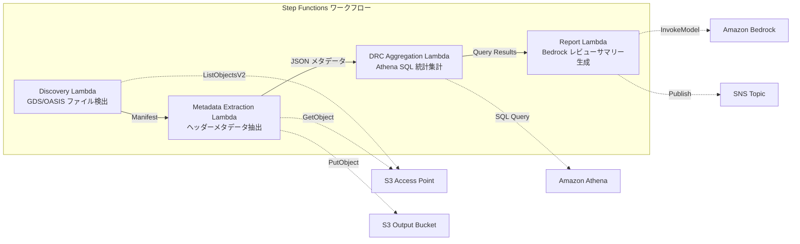

# UC6: Semiconductor / EDA - Validación de archivos de diseño y extracción de metadatos

🌐 **Language / 言語**: [日本語](README.md) | [English](README.en.md) | [한국어](README.ko.md) | [简体中文](README.zh-CN.md) | [繁體中文](README.zh-TW.md) | [Français](README.fr.md) | [Deutsch](README.de.md) | Español

En este caso de uso, utilizamos Amazon Bedrock, AWS Step Functions, Amazon Athena, Amazon S3, AWS Lambda y Amazon FSx for NetApp ONTAP para validar los archivos de diseño GDSII, DRC y OASIS, así como para extraer metadatos de los mismos. 

Los archivos de diseño se cargan en Amazon S3, y una AWS Step Functions orquesta los siguientes pasos:

1. Validación de diseño con AWS Lambda:
   - Ejecuta scripts de validación de diseño (DRC, OASIS, etc.)
   - Almacena los resultados de la validación en Amazon S3
2. Extracción de metadatos con AWS Lambda:
   - Extrae metadatos de los archivos de diseño (capas, células, etc.)
   - Almacena los metadatos en Amazon S3
3. Análisis de validación y metadatos con Amazon Athena:
   - Consulta los resultados de validación y los metadatos almacenados en Amazon S3
   - Genera informes y tableros de control en Amazon CloudWatch

Finalmente, AWS CloudFormation se utiliza para implementar y administrar toda la infraestructura.

## Resumen

Amazon Bedrock permite a los clientes crear y ejecutar modelos de lenguaje natural de gran tamaño y de alto rendimiento. Con AWS Step Functions, los clientes pueden orquestar flujos de trabajo complejos que combinan varios servicios de AWS, como Amazon Athena, Amazon S3 y AWS Lambda. Amazon FSx for NetApp ONTAP ofrece un almacenamiento de archivos de alto rendimiento y de gran escala, mientras que Amazon CloudWatch proporciona visibilidad y monitorización de los recursos de AWS. AWS CloudFormation permite a los clientes aprovisionar y administrar recursos de AWS de forma declarativa.
La presente es una solución serverless automatizada que utiliza Amazon S3 Access Points de Amazon FSx for NetApp ONTAP para validar, extraer metadatos y calcular estadísticas de reglas de diseño (DRC) de archivos de diseño de semiconductores en formatos GDS/OASIS.
### Casos en los que este patrón es adecuado

El servicio AWS Step Functions, Amazon Athena, Amazon S3, AWS Lambda, Amazon FSx for NetApp ONTAP, Amazon CloudWatch y AWS CloudFormation son útiles para este patrón. Procesos como GDSII, DRC, OASIS y tapeout pueden ser gestionados eficazmente usando este enfoque. Puede llamar a funciones de `AWS Lambda` desde su aplicación.
- Los archivos de diseño GDSII/OASIS se han acumulado en gran cantidad en Amazon FSx for NetApp ONTAP
- Se desea catalogar automáticamente los metadatos de los archivos de diseño (nombre de biblioteca, número de celdas, cuadro delimitador, etc.)
- Se necesita recopilar periódicamente estadísticas de DRC y monitorear las tendencias de calidad del diseño
- Es necesario realizar un análisis transversal de los metadatos de diseño mediante SQL de Amazon Athena
- Se desea generar automáticamente resúmenes de revisión de diseño en lenguaje natural
### Casos en los que este patrón no es adecuado

Los servicios y términos técnicos no se han traducido:

- Amazon Bedrock
- AWS Step Functions
- Amazon Athena
- Amazon S3
- AWS Lambda
- Amazon FSx for NetApp ONTAP
- Amazon CloudWatch
- AWS CloudFormation
- GDSII
- DRC
- OASIS
- GDS
- Lambda
- tapeout

Los archivos y URLs no se han traducido.
- Ejecución en tiempo real de DRC (suponiendo la integración con herramientas EDA) es necesaria.
- Se requiere la validación física de los archivos de diseño (verificación completa del cumplimiento de las reglas de fabricación).
- Ya está en funcionamiento una cadena de herramientas EDA basada en EC2, y los costos de migración no se justifican.
- El entorno no puede garantizar la conectividad de red al API REST de ONTAP.
### Funcionalidades principales

- Cree aplicaciones basadas en modelos de aprendizaje automático a través de Amazon Bedrock
- Automatice flujos de trabajo complejos usando AWS Step Functions
- Ejecute consultas ad-hoc en sus datos con Amazon Athena
- Almacene y recupere datos de forma segura en Amazon S3
- Ejecute código sin servidor con AWS Lambda
- Implemente y administre almacenamiento de archivos escalable y de alto rendimiento con Amazon FSx for NetApp ONTAP
- Supervise el rendimiento y el estado de sus aplicaciones con Amazon CloudWatch
- Aprovisione recursos de manera rápida y segura con AWS CloudFormation
- Detección automática de archivos GDS/OASIS (`.gds`, `.gds2`, `.oas`, `.oasis`) a través de Amazon S3
- Extracción de metadatos de encabezado (nombre de la biblioteca, unidades, recuento de celdas, cuadro delimitador, fecha de creación)
- Agregación de estadísticas de DRC mediante SQL de Amazon Athena (distribución de recuento de celdas, valores atípicos de cuadro delimitador, violaciones de nomenclatura)
- Generación de resumen de revisión de diseño en lenguaje natural mediante Amazon Bedrock
- Compartir resultados de inmediato mediante notificaciones de Amazon SNS
## Arquitectura

Amazon Bedrock ofrece una solución integral para el diseño de chips. Usando AWS Step Functions, los desarrolladores pueden crear flujos de trabajo automatizados que integran herramientas como Amazon Athena, Amazon S3 y AWS Lambda. Esto permite simplificar y acelerar el proceso de diseño de chips.

Para el layout del chip, Amazon FSx for NetApp ONTAP proporciona almacenamiento de alto rendimiento y baja latencia. Amazon CloudWatch supervisa el proceso y AWS CloudFormation automatiza el aprovisionamiento de recursos.

A lo largo del flujo de trabajo, se utilizan formatos de datos GDSII, DRC, OASIS y GDS. El proceso culmina en la cinta maestra (tapeout) que se envía a la fundición.



### Pasos del flujo de trabajo

Amazon Bedrock ofrece servicios de fabricación de chips. Usa AWS Step Functions para orquestar los siguientes servicios:
- Amazon Athena para analizar los datos GDSII
- Amazon S3 para almacenar archivos DRC, OASIS y GDS
- AWS Lambda para ejecutar scripts personalizados
- Amazon FSx for NetApp ONTAP para almacenamiento compartido
- Amazon CloudWatch para supervisar el progreso
- AWS CloudFormation para implementar la infraestructura
1. **Detección**: Detectar archivos .gds, .gds2, .oas, .oasis desde S3 AP y generar un Manifiesto
2. **Extracción de Metadatos**: Extraer metadatos de los encabezados de cada archivo de diseño y generar salida en JSON con partición de fecha en S3
3. **Agregación de DRC**: Analizar el catálogo de metadatos a través de Athena SQL y agregar estadísticas de DRC
4. **Generación de Informes**: Generar un resumen de la revisión de diseño en Bedrock y producir salida en S3 + notificación SNS
## Requisitos previos

Amazon Bedrock を使用して、複雑な深層学習モデルを開発、トレーニング、デプロイすることができます。この作業を行うには、以下のものが必要になります:

- AWS アカウントと適切な権限
- AWS Identity and Access Management (IAM) ロールを設定済み
- AWS Step Functions を使用するためのサービスの統合を済ませている
- Amazon Athena で使用するデータセットを Amazon S3 にアップロード済み
- AWS Lambda 関数を使用するために必要な IAM 許可を設定済み
- Amazon FSx for NetApp ONTAP で必要な設定を済ませている
- Amazon CloudWatch ロギングを有効化済み
- AWS CloudFormation テンプレートを使用してインフラストラクチャをプロビジョニング済み

この前提条件が揃えば、Amazon Bedrock を使ってモデリングの複雑なワークフローを開始できます。
- Cuenta de AWS y permisos de IAM apropiados
- Sistema de archivos FSx for NetApp ONTAP (ONTAP 9.17.1P4D3 o superior)
- Volumen con punto de acceso a S3 habilitado (para almacenar archivos GDS/OASIS)
- VPC, subredes privadas
- **Puerta de enlace NAT o puntos de enlace de VPC** (necesarios para que el Lambda de Discovery acceda a los servicios de AWS desde dentro de la VPC)
- Acceso al modelo Amazon Bedrock habilitado (Claude / Nova)
- Credenciales de la API REST de ONTAP almacenadas en Secrets Manager
## Procedimiento de despliegue

- Cree un bucket de Amazon S3 para almacenar los archivos de diseño.
- Utilice AWS Lambda para ejecutar scripts de verificación de diseño como DRC y GDSII.
- Intégrese con AWS Step Functions para automatizar el flujo de trabajo de verificación y aprobación.
- Ejecute Amazon Athena para analizar los registros de procesamiento y generar informes.
- Supervise el estado de la implementación con Amazon CloudWatch.
- Automatice la implementación con AWS CloudFormation.
- Utilice Amazon FSx for NetApp ONTAP para almacenar y procesar datos de diseño a gran escala.

### 1. Creación de un Punto de acceso S3
Crea un punto de acceso de S3 para el volumen que almacena los archivos GDS/OASIS.
#### Creación en la AWS CLI

Las funcionalidades de AWS Bedrock se pueden invocar a través de la AWS CLI. Puede utilizar AWS Step Functions para crear y administrar flujos de trabajo que se integran con Amazon Athena, Amazon S3, AWS Lambda y otros servicios de AWS. También puede usar Amazon FSx for NetApp ONTAP para acceder a sistemas de archivos de alto rendimiento y Amazon CloudWatch para monitorear el rendimiento. Herramientas como AWS CloudFormation pueden ayudar a implementar y administrar estos componentes de manera eficiente.

```bash
aws fsx create-and-attach-s3-access-point \
  --name <your-s3ap-name> \
  --type ONTAP \
  --ontap-configuration '{
    "VolumeId": "<your-volume-id>",
    "FileSystemIdentity": {
      "Type": "UNIX",
      "UnixUser": {
        "Name": "root"
      }
    }
  }' \
  --region <your-region>
```
Después de la creación, anote el `S3AccessPoint.Alias` de la respuesta (en el formato `xxx-ext-s3alias`).
#### Creación en la AWS Management Console
1. Abrir la [consola de Amazon FSx](https://console.aws.amazon.com/fsx/)
2. Seleccionar el sistema de archivos deseado
3. En la pestaña "Volúmenes", seleccionar el volumen deseado
4. Seleccionar la pestaña "Puntos de acceso de S3"
5. Hacer clic en "Crear y adjuntar el punto de acceso de S3"
6. Ingresar el nombre del punto de acceso, seleccionar el tipo de ID del sistema de archivos (UNIX/WINDOWS) y especificar el usuario
7. Hacer clic en "Crear"

> Consultar [Crear puntos de acceso de S3 para FSx for ONTAP](https://docs.aws.amazon.com/fsx/latest/ONTAPGuide/s3-access-points-create-fsxn.html) para más detalles.
#### Revisión del estado de S3 AP

```bash
aws fsx describe-s3-access-point-attachments --region <your-region> \
  --query 'S3AccessPointAttachments[*].{Name:Name,Lifecycle:Lifecycle,Alias:S3AccessPoint.Alias}' \
  --output table
```
Espera hasta que el `Lifecycle` esté `AVAILABLE` (normalmente 1-2 minutos).
### 2. Carga de archivos de muestra (opcional)

Puedes cargar archivos de muestra al Amazon S3 para probar tus flujos de trabajo. Para ello, sigue estos pasos:

1. Crea un nuevo bucket de Amazon S3 o usa un bucket existente.
2. Sube tus archivos de muestra al bucket de S3.
3. Anota la ruta del archivo en el bucket de S3 (p. ej., `s3://mi-bucket/path/to/file.txt`). La necesitarás más adelante.
Carga los archivos GDS de prueba en el volumen:
```bash
S3AP_ALIAS="<your-s3ap-alias>"

aws s3 cp test-data/semiconductor-eda/eda-designs/test_chip.gds \
  "s3://${S3AP_ALIAS}/eda-designs/test_chip.gds" --region <your-region>

aws s3 cp test-data/semiconductor-eda/eda-designs/test_chip_v2.gds2 \
  "s3://${S3AP_ALIAS}/eda-designs/test_chip_v2.gds2" --region <your-region>
```

### 3. Creación del paquete de implementación de Lambda
Al usar `template-deploy.yaml`, es necesario cargar el código de la función de AWS Lambda en un paquete zip en Amazon S3.
```bash
# デプロイ用 S3 バケットの作成
DEPLOY_BUCKET="<your-deploy-bucket-name>"
aws s3 mb "s3://${DEPLOY_BUCKET}" --region <your-region>

# 各 Lambda 関数をパッケージング
for func in discovery metadata_extraction drc_aggregation report_generation; do
  TMPDIR=$(mktemp -d)
  cp semiconductor-eda/functions/${func}/handler.py "${TMPDIR}/"
  cp -r shared "${TMPDIR}/shared"
  (cd "${TMPDIR}" && zip -r "/tmp/semiconductor-eda-${func}.zip" . \
    -x "*.pyc" "__pycache__/*" "shared/tests/*" "shared/cfn/*")
  aws s3 cp "/tmp/semiconductor-eda-${func}.zip" \
    "s3://${DEPLOY_BUCKET}/lambda/semiconductor-eda-${func}.zip" --region <your-region>
  rm -rf "${TMPDIR}"
done
```

### 4. Implementación de CloudFormation

```bash
aws cloudformation deploy \
  --template-file semiconductor-eda/template-deploy.yaml \
  --stack-name fsxn-semiconductor-eda \
  --parameter-overrides \
    DeployBucket=<your-deploy-bucket> \
    S3AccessPointAlias=<your-s3ap-alias> \
    S3AccessPointName=<your-s3ap-name> \
    OntapSecretName=<your-secret-name> \
    OntapManagementIp=<ontap-mgmt-ip> \
    SvmUuid=<your-svm-uuid> \
    VpcId=<your-vpc-id> \
    PrivateSubnetIds=<subnet-1>,<subnet-2> \
    PrivateRouteTableIds=<rtb-1>,<rtb-2> \
    NotificationEmail=<your-email@example.com> \
    BedrockModelId=amazon.nova-lite-v1:0 \
    EnableVpcEndpoints=true \
    MapConcurrency=10 \
    LambdaMemorySize=512 \
    LambdaTimeout=300 \
  --capabilities CAPABILITY_NAMED_IAM \
  --region <your-region>
```
**Importante**: `S3AccessPointName` es el nombre del punto de acceso de S3 (no el alias, sino el nombre especificado al crearlo). Se utiliza en políticas de IAM para otorgar permisos basados en ARN. Si se omite, puede ocurrir un error `AccessDenied`.
### 5. Verificación de las suscripciones de SNS

Amazon SNS (Simple Notification Service) es un servicio de AWS que permite enviar notificaciones de forma fiable y escalable. Una vez que hayas configurado un tema de SNS, puedes verificar las suscripciones que se han establecido para ese tema.

1. Abre la consola de AWS y navega hasta el servicio Amazon SNS.
2. Selecciona el tema de SNS del que quieres ver las suscripciones.
3. En la pestaña "Suscripciones", verás una lista de todas las suscripciones existentes para ese tema.
4. Puedes filtrar y ordenar las suscripciones según sea necesario.
5. Revisa los detalles de cada suscripción, como el protocolo, el punto final y el estado.
Después de la implementación, recibirá un correo electrónico de confirmación en la dirección de correo electrónico especificada. Haga clic en el enlace para confirmarlo.
### 6. Comprobación de funcionamiento

Para comprobar el funcionamiento del diseño, siguientes son los pasos recomendados:

1. Usar Amazon Athena para verificar los datos de Amazon S3.
2. Ejecutar AWS Lambda para procesar los datos.
3. Comprobar los resultados en Amazon CloudWatch.
4. Usar AWS CloudFormation para implementar los cambios en producción.
Vamos a ejecutar manualmente las AWS Step Functions para verificar su funcionamiento:
```bash
aws stepfunctions start-execution \
  --state-machine-arn "arn:aws:states:<region>:<account-id>:stateMachine:fsxn-semiconductor-eda-workflow" \
  --input '{}' \
  --region <your-region>
```
**Observación**: Es posible que en la primera ejecución los resultados de la agregación DRC de Amazon Athena sean de 0 registros. Esto se debe a que hay un desfase en la reflección de los metadatos en las tablas de AWS Glue. En las ejecuciones posteriores se obtendrán las estadísticas correctas.
### Elección de plantillas

| テンプレート | 用途 | Lambda コード |
|-------------|------|--------------|
| `template.yaml` | SAM CLI でのローカル開発・テスト | インラインパス参照（`sam build` が必要） |
| `template-deploy.yaml` | 本番デプロイ | S3 バケットから zip 取得 |
En el caso de utilizar directamente `template.yaml` con `aws cloudformation deploy`, es necesario aplicar la transformación de SAM. Para la implementación en producción, por favor, utilice `template-deploy.yaml`.
## Lista de parámetros de configuración

Amazon Bedrock を使用して GDSII ファイルからマスクを生成し、AWS Step Functions でウォークフローを自動化します。次に、Amazon Athena を使用して Amazon S3 に保存されたデータをクエリし、AWS Lambda で後処理を行います。最後に、Amazon FSx for NetApp ONTAP を使用して最終的なアーティファクトを保存します。

この設定では、Amazon CloudWatch でジョブの監視を行い、AWS CloudFormation を使用してインフラストラクチャをプロビジョニングします。

| パラメータ | 説明 | デフォルト | 必須 |
|-----------|------|----------|------|
| `DeployBucket` | Lambda zip を格納する S3 バケット名 | — | ✅ |
| `S3AccessPointAlias` | FSx ONTAP S3 AP Alias（入力用） | — | ✅ |
| `S3AccessPointName` | S3 AP 名（ARN ベースの IAM 権限付与用） | `""` | ⚠️ 推奨 |
| `OntapSecretName` | ONTAP REST API 認証情報の Secrets Manager シークレット名 | — | ✅ |
| `OntapManagementIp` | ONTAP クラスタ管理 IP アドレス | — | ✅ |
| `SvmUuid` | ONTAP SVM UUID | — | ✅ |
| `ScheduleExpression` | EventBridge Scheduler のスケジュール式 | `rate(1 hour)` | |
| `VpcId` | VPC ID | — | ✅ |
| `PrivateSubnetIds` | プライベートサブネット ID リスト | — | ✅ |
| `PrivateRouteTableIds` | プライベートサブネットのルートテーブル ID リスト（S3 Gateway Endpoint 用） | `""` | |
| `NotificationEmail` | SNS 通知先メールアドレス | — | ✅ |
| `BedrockModelId` | Bedrock モデル ID | `amazon.nova-lite-v1:0` | |
| `MapConcurrency` | Map ステートの並列実行数 | `10` | |
| `LambdaMemorySize` | Lambda メモリサイズ (MB) | `256` | |
| `LambdaTimeout` | Lambda タイムアウト (秒) | `300` | |
| `EnableVpcEndpoints` | Interface VPC Endpoints の有効化 | `false` | |
| `EnableCloudWatchAlarms` | CloudWatch Alarms の有効化 | `false` | |
| `EnableXRayTracing` | X-Ray トレーシングの有効化 | `true` | |
⚠️ **`S3AccessPointName`**: Aunque opcional, si no se especifica, las políticas de IAM serán solo basadas en alias, lo que puede generar errores de `AccessDenied` en algunos entornos. Se recomienda especificarlo en entornos de producción.
## Resolución de problemas

Amazon Bedrock se utiliza para diseñar y fabricar chips. AWS Step Functions se emplea para crear flujos de trabajo basados en estados. Amazon Athena es un servicio de consulta interactiva que se usa para analizar datos en Amazon S3. AWS Lambda se utiliza para ejecutar código sin servidor. Amazon FSx for NetApp ONTAP proporciona almacenamiento de archivos de alto rendimiento. Amazon CloudWatch monitorea los recursos y las aplicaciones. AWS CloudFormation se usa para aprovisionar y administrar recursos de la nube.

Algunas técnicas de diseño de chips incluyen GDSII, DRC, OASIS y GDS. El proceso de `tapeout` es crucial para la fabricación de chips. Lambda es un servicio de AWS que permite ejecutar código sin servidor.

### El Lambda de Discovery está excediendo el tiempo de espera
**Razón**: El Lambda dentro de la VPC no puede acceder a los servicios de AWS (Secrets Manager, S3, CloudWatch).

**Solución**: Compruebe lo siguiente:
1. Desplegar con `EnableVpcEndpoints=true` y especificar `PrivateRouteTableIds`
2. Que haya un NAT Gateway en la VPC y que la tabla de rutas de la subred privada tenga una ruta al NAT Gateway
### Error de AccesoDenegado (ListObjectsV2)
**Razón**: Falta de permisos basados en ARN de Amazon S3 Access Point en la política de IAM.

**Solución**: Actualiza la pila especificando el nombre (no el alias) del Amazon S3 Access Point en el parámetro `S3AccessPointName`.
### Los resultados de la agregación de Athena DRC son 0
**Razón**: Es posible que el `metadata_prefix` filtro utilizado por el DRC Aggregation Lambda no coincida con el valor `file_key` dentro del JSON de metadatos real. Además, la primera ejecución no tendrá datos de metadatos en la tabla de Glue, por lo que devolverá 0 resultados.

**Solución**:
1. Ejecutar Step Functions dos veces (la primera escribe los metadatos en S3 y la segunda permite la agregación en Athena)
2. Ejecutar directamente `SELECT * FROM "<db>"."<table>" LIMIT 10` en la consola de Athena para verificar que se pueden leer los datos
3. Si los datos se pueden leer pero la agregación devuelve 0 resultados, comprobar la coherencia entre el valor `file_key` y el filtro `prefix`
## Limpieza

Amazon Bedrock es una colección de servicios managed no code y low-code que permiten a los desarrolladores construir y desplegar rápidamente aplicaciones ML. With AWS Step Functions, los desarrolladores pueden crear workflows visuales para coordinar los servicios de AWS. Usa Amazon Athena para consultar datos almacenados en Amazon S3. AWS Lambda te permite ejecutar código sin necesidad de administrar servidores. Amazon FSx for NetApp ONTAP proporciona sistemas de archivos altamente disponibles y confiables. Monitoriza tus recursos de AWS con Amazon CloudWatch y aprovisiona infraestructura con AWS CloudFormation.

Una vez que hayas terminado de construir y probar tu aplicación, es hora de limpiar los recursos que ya no uses. Esto incluye eliminar objetos de Amazon S3, tablas de Amazon Athena y funciones de AWS Lambda. También es importante detener instancias de Amazon EC2, parar flujos de AWS Step Functions y eliminar registros de Amazon CloudWatch. Asegúrate de que todos los recursos se hayan eliminado correctamente siguiendo las buenas prácticas de `aws_cli` y `aws_sdk`.

```bash
# S3 バケットを空にする
aws s3 rm s3://fsxn-semiconductor-eda-output-${AWS_ACCOUNT_ID} --recursive

# CloudFormation スタックの削除
aws cloudformation delete-stack \
  --stack-name fsxn-semiconductor-eda \
  --region ap-northeast-1

# 削除完了を待機
aws cloudformation wait stack-delete-complete \
  --stack-name fsxn-semiconductor-eda \
  --region ap-northeast-1
```

## Regiones admitidas

Amazon Bedrock, AWS Step Functions, Amazon Athena, Amazon S3, AWS Lambda, Amazon FSx for NetApp ONTAP, Amazon CloudWatch y AWS CloudFormation son compatibles con las siguientes regiones:

- US East (N. Virginia)
- US East (Ohio)
- US West (Oregon)
- US West (N. California)
- Asia Pacific (Mumbai)
- Asia Pacific (Seoul)
- Asia Pacific (Singapore)
- Asia Pacific (Sydney)
- Asia Pacific (Tokyo)
- Canada (Central)
- Europe (Frankfurt)
- Europe (Ireland)
- Europe (London)
- Europe (Paris)
- Europe (Stockholm)
- South America (São Paulo)
- Middle East (Bahrein)
- Africa (Cape Town)
UC6 utiliza los siguientes servicios:

- Amazon Bedrock
- AWS Step Functions
- Amazon Athena
- Amazon S3
- AWS Lambda
- Amazon FSx for NetApp ONTAP
- Amazon CloudWatch
- AWS CloudFormation
| サービス | リージョン制約 |
|---------|-------------|
| Amazon Athena | ほぼ全リージョンで利用可能 |
| Amazon Bedrock | 対応リージョンを確認（[Bedrock 対応リージョン](https://docs.aws.amazon.com/general/latest/gr/bedrock.html)） |
| AWS X-Ray | ほぼ全リージョンで利用可能 |
| CloudWatch EMF | ほぼ全リージョンで利用可能 |
Consulte la [Matriz de compatibilidad de regiones](../docs/region-compatibility.md) para más detalles.
## Referencias

Amazon Bedrock, AWS Step Functions, Amazon Athena, Amazon S3, AWS Lambda, Amazon FSx for NetApp ONTAP, Amazon CloudWatch, AWS CloudFormation, GDSII, DRC, OASIS, GDS, Lambda, tapeout, `...`
/path/to/file, https://example.com
- [Resumen de los puntos de acceso a S3 de FSx ONTAP](https://docs.aws.amazon.com/fsx/latest/ONTAPGuide/accessing-data-via-s3-access-points.html)
- [Creación y conexión de puntos de acceso a S3](https://docs.aws.amazon.com/fsx/latest/ONTAPGuide/s3-access-points-create-fsxn.html)
- [Gestión del acceso a los puntos de acceso a S3](https://docs.aws.amazon.com/fsx/latest/ONTAPGuide/s3-ap-manage-access-fsxn.html)
- [Guía del usuario de Amazon Athena](https://docs.aws.amazon.com/athena/latest/ug/what-is.html)
- [Referencia de la API de Amazon Bedrock](https://docs.aws.amazon.com/bedrock/latest/APIReference/API_runtime_InvokeModel.html)
- [Especificación del formato GDSII](https://boolean.klaasholwerda.nl/interface/bnf/gdsformat.html)