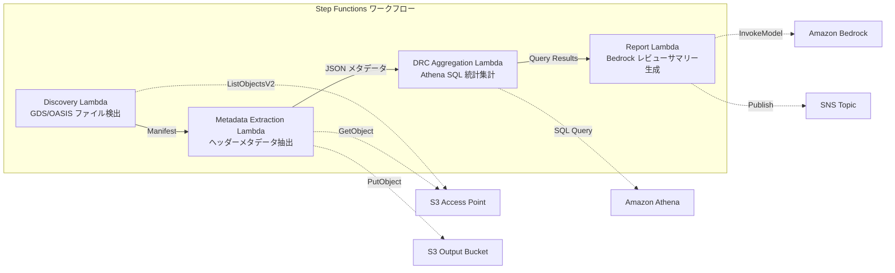

# Use Cas 6 : Semi-conducteurs / EDA — Validation des fichiers de conception et extraction de métadonnées

🌐 **Language / 言語**: [日本語](README.md) | [English](README.en.md) | [한국어](README.ko.md) | [简体中文](README.zh-CN.md) | [繁體中文](README.zh-TW.md) | Français | [Deutsch](README.de.md) | [Español](README.es.md)

Voici le processus recommandé pour valider les fichiers de conception et extraire les métadonnées :

1. Utilisez Amazon Bedrock pour convertir les fichiers de conception aux formats GDSII et OASIS.
2. Exécutez les règles de vérification de la conception (DRC) à l'aide d'Amazon Athena.
3. Stockez les fichiers de conception validés dans Amazon S3.
4. Utilisez AWS Step Functions pour orchestrer le workflow de validation et d'extraction des métadonnées.
5. Appelez AWS Lambda pour extraire les métadonnées des fichiers de conception.
6. Stockez les métadonnées extraites dans Amazon FSx for NetApp ONTAP.
7. Configurez Amazon CloudWatch pour surveiller les erreurs et les anomalies.
8. Utilisez AWS CloudFormation pour déployer et gérer l'infrastructure.

## Aperçu

Amazon Bedrock, AWS Step Functions, Amazon Athena, Amazon S3, AWS Lambda, Amazon FSx pour NetApp ONTAP, Amazon CloudWatch, AWS CloudFormation et d'autres services AWS vous aident à construire et à exécuter vos applications.

L'utilisation d'`AWS Step Functions` vous permet de coordonner les différentes parties de votre application dans un workflow sans avoir à vous soucier de la gestion des ressources. `Amazon Athena` vous permet d'interroger directement vos données stockées dans `Amazon S3`. `AWS Lambda` vous offre le calcul sans serveur pour exécuter votre code en réponse aux événements.

`Amazon FSx pour NetApp ONTAP` fournit un système de fichiers haute performance et entièrement géré, basé sur la technologie ONTAP de NetApp. `Amazon CloudWatch` vous aide à surveiller vos ressources AWS et à prendre des mesures en fonction des informations recueillies.

Enfin, `AWS CloudFormation` vous permet de définir et de provisionner vos ressources AWS de manière déclarative, facilitant ainsi la gestion de votre infrastructure.
Exploitez les points d'accès S3 d'Amazon FSx pour NetApp ONTAP afin d'automatiser un workflow sans serveur pour la validation des fichiers de conception de semi-conducteurs GDSII/OASIS, l'extraction de métadonnées et l'agrégation des statistiques de vérification des règles de conception.
Voici les cas où ce modèle est approprié :

- Lorsque vous avez besoin d'exécuter des charges de travail de manière fiable et évolutive, vous pouvez utiliser des services gérés comme Amazon Bedrock, AWS Step Functions, Amazon Athena et AWS Lambda.
- Lorsque vous devez stocker et accéder à de grandes quantités de données, Amazon S3 peut être une bonne solution.
- Si vous avez besoin d'un stockage de fichiers hautement disponible et évolutif, Amazon FSx for NetApp ONTAP peut être envisagé.
- Pour surveiller les performances de vos applications et services, Amazon CloudWatch peut vous aider.
- Lorsque vous devez déployer et gérer votre infrastructure de manière déclarative, AWS CloudFormation peut être utile.
- Les fichiers de conception GDS/OASIS s'accumulent en masse sur FSx ONTAP.
- Je voudrais cataloguer automatiquement les métadonnées des fichiers de conception (nom de la bibliothèque, nombre de cellules, boîte englobante, etc.).
- Je veux compiler régulièrement les statistiques DRC afin de suivre les tendances de la qualité de la conception.
- J'ai besoin d'une analyse transversale des métadonnées de conception avec SQL Athena.
- Je souhaite générer automatiquement des résumés de revue de conception en langage naturel.
### Les cas où ce modèle n'est pas adapté

Amazon Bedrock, AWS Step Functions, Amazon Athena, Amazon S3, AWS Lambda, Amazon FSx for NetApp ONTAP, Amazon CloudWatch, AWS CloudFormation, GDSII, DRC, OASIS, GDS, Lambda, tapeout, etc.
- Exécution du DRC en temps réel nécessaire (intégration avec les outils EDA est un prérequis)
- Validation physique des fichiers de conception (vérification complète de la conformité aux règles de fabrication) est nécessaire
- La chaîne d'outils EDA basée sur EC2 est déjà opérationnelle, et les coûts de migration ne s'y prêtent pas
- Impossibilité de garantir l'accessibilité réseau à l'API REST ONTAP
### Principales fonctionnalités 

Amazon Bedrock vous permet de concevoir et de développer facilement des circuits intégrés complexes. Avec AWS Step Functions, vous pouvez automatiser les workflows de conception de circuits. Amazon Athena vous permet d'interroger et d'analyser efficacement vos données stockées dans Amazon S3. Utilisez AWS Lambda pour exécuter du code sans avoir à gérer les serveurs. Amazon FSx for NetApp ONTAP vous offre un stockage de fichiers haute performance. Amazon CloudWatch vous aide à surveiller et à diagnostiquer vos applications. AWS CloudFormation vous permet de provisonner et de gérer vos ressources AWS de manière déclarative.
- Détection automatique des fichiers GDS/OASIS (`.gds`, `.gds2`, `.oas`, `.oasis`) via Amazon S3
- Extraction des métadonnées d'en-tête (nom de la bibliothèque, unités, nombre de cellules, boîte englobante, date de création)
- Statistiques DRC agrégées via Amazon Athena SQL (distribution du nombre de cellules, valeurs aberrantes de la boîte englobante, violation des conventions d'affectation des noms)
- Génération de résumés des revues de conception en langage naturel via Amazon Bedrock
- Partage instantané des résultats via des notifications Amazon SNS
## Architecture

La conception de cette infrastructure repose sur l'utilisation de plusieurs services AWS tels qu'Amazon Bedrock, AWS Step Functions, Amazon Athena, Amazon S3, AWS Lambda, Amazon FSx pour NetApp ONTAP, Amazon CloudWatch et AWS CloudFormation. Les processus techniques tels que GDSII, DRC, OASIS, GDS, Lambda et la finalisation de la bande magnétique sont également impliqués. Les fichiers et URL sont conservés dans leur forme originale.



### Étapes du workflow

- Utilisez Amazon Bedrock pour concevoir et fabriquer des circuits intégrés.
- Déployez des workflows avec AWS Step Functions.
- Interrogez des données avec Amazon Athena.
- Stockez des fichiers avec Amazon S3.
- Exécutez du code avec AWS Lambda.
- Utilisez Amazon FSx for NetApp ONTAP pour accéder à vos données.
- Surveillez votre infrastructure avec Amazon CloudWatch.
- Automatisez le déploiement avec AWS CloudFormation.
1. **Découverte** : Détecter les fichiers .gds, .gds2, .oas, .oasis à partir d'Amazon S3 et générer un manifeste.
2. **Extraction des métadonnées** : Extraire les métadonnées des en-têtes de chaque fichier de conception et les écrire dans Amazon S3 sous forme de JSON partitionné par date.
3. **Agrégation des DRC** : Analyser le catalogue des métadonnées avec Amazon Athena SQL et agréger les statistiques DRC.
4. **Génération de rapports** : Générer un résumé de l'examen de la conception avec Amazon Bedrock, le stocker dans Amazon S3 et envoyer une notification via Amazon SNS.
Voici la traduction en français :

## Prérequis

Amazon Bedrock, AWS Step Functions, Amazon Athena, Amazon S3, AWS Lambda, Amazon FSx for NetApp ONTAP, Amazon CloudWatch, AWS CloudFormation, GDSII, DRC, OASIS, GDS, Lambda, tapeout, `...`
- Compte AWS et autorisations IAM appropriées
- Système de fichiers FSx pour NetApp ONTAP (version 9.17.1P4D3 ou ultérieure)
- Volume avec point d'accès S3 activé (pour stocker les fichiers GDS/OASIS)
- VPC, sous-réseaux privés
- **Passerelle NAT ou points de terminaison VPC** (nécessaires pour que la fonction Lambda Discovery accède aux services AWS depuis le VPC)
- Accès aux modèles Amazon Bedrock activé (Claude / Nova)
- Informations d'authentification à l'API REST ONTAP stockées dans Secrets Manager
## Procédure de déploiement

Amazon Bedrock, AWS Step Functions, Amazon Athena, Amazon S3, AWS Lambda, Amazon FSx for NetApp ONTAP, Amazon CloudWatch, AWS CloudFormation, GDSII, DRC, OASIS, GDS, Lambda, tapeout

### 1. Création d'un point d'accès Amazon S3

L'étape suivante consiste à créer un point d'accès Amazon S3. Cela vous permettra d'accéder à vos objets Amazon S3 de manière plus sécurisée et simplifiée.

1. Accédez à la console AWS et sélectionnez le service Amazon S3.
2. Cliquez sur "Créer un point d'accès" et suivez les instructions pour configurer votre point d'accès.
3. Attribuez un nom à votre point d'accès et sélectionnez le compartiment Amazon S3 auquel vous souhaitez l'associer.
4. Configurez les paramètres d'accès selon vos besoins, tels que les autorisations et les politiques.
5. Passez en revue vos paramètres, puis cliquez sur "Créer un point d'accès" pour finaliser la création.
Créez un point d'accès S3 pour le volume stockant les fichiers GDS/OASIS.
Voici la traduction française :

#### Création avec l'AWS CLI

```bash
aws fsx create-and-attach-s3-access-point \
  --name <your-s3ap-name> \
  --type ONTAP \
  --ontap-configuration '{
    "VolumeId": "<your-volume-id>",
    "FileSystemIdentity": {
      "Type": "UNIX",
      "UnixUser": {
        "Name": "root"
      }
    }
  }' \
  --region <your-region>
```
Après la création, notez la valeur de `S3AccessPoint.Alias` dans la réponse (au format `xxx-ext-s3alias`).
#### Création dans la AWS Management Console

Utiliser les services AWS tels que Amazon Bedrock, AWS Step Functions, Amazon Athena, Amazon S3, AWS Lambda, Amazon FSx pour NetApp ONTAP, Amazon CloudWatch et AWS CloudFormation pour créer votre solution.
Voici la traduction :

1. Ouvrir la [console Amazon FSx](https://console.aws.amazon.com/fsx/)
2. Sélectionner le système de fichiers concerné
3. Dans l'onglet "Volumes", sélectionner le volume concerné
4. Sélectionner l'onglet "Points d'accès S3"
5. Cliquer sur "Créer et attacher un point d'accès S3"
6. Saisir un nom pour le point d'accès, spécifier le type d'identifiant du système de fichiers (UNIX/WINDOWS) et l'utilisateur
7. Cliquer sur "Créer"

> Consultez [Création de points d'accès S3 pour FSx for ONTAP](https://docs.aws.amazon.com/fsx/latest/ONTAPGuide/s3-access-points-create-fsxn.html) pour plus d'informations.
Voici la traduction en français :

#### Vérifier l'état du S3 AP

```bash
aws fsx describe-s3-access-point-attachments --region <your-region> \
  --query 'S3AccessPointAttachments[*].{Name:Name,Lifecycle:Lifecycle,Alias:S3AccessPoint.Alias}' \
  --output table
```
Veuillez patienter jusqu'à ce que l'état `Lifecycle` devienne `AVAILABLE` (généralement entre 1 et 2 minutes).
### 2. Téléchargement des fichiers d'exemple (optionnel)

1. Accédez à la console Amazon S3.
2. Créez un nouveau compartiment S3 ou utilisez un compartiment existant.
3. Téléchargez les fichiers d'exemple à partir de votre ordinateur local vers le compartiment S3.
4. Notez le chemin d'accès au fichier dans le compartiment S3.
Téléchargez les fichiers GDS de test sur le volume :
```bash
S3AP_ALIAS="<your-s3ap-alias>"

aws s3 cp test-data/semiconductor-eda/eda-designs/test_chip.gds \
  "s3://${S3AP_ALIAS}/eda-designs/test_chip.gds" --region <your-region>

aws s3 cp test-data/semiconductor-eda/eda-designs/test_chip_v2.gds2 \
  "s3://${S3AP_ALIAS}/eda-designs/test_chip_v2.gds2" --region <your-region>
```

### 3. Création du package de déploiement Lambda

En utilisant AWS Lambda, vous pouvez exécuter votre code sans avoir à vous soucier de la gestion des serveurs. Pour cela, vous devez d'abord créer un package de déploiement Lambda. Ce package contient le code de votre fonction Lambda ainsi que toutes les dépendances nécessaires.

Pour créer le package de déploiement, suivez ces étapes :

1. Préparez votre code Lambda dans un répertoire local.
2. Créez un fichier ZIP contenant tous les fichiers de votre code.
3. Téléchargez ce fichier ZIP en tant que package de déploiement dans votre fonction Lambda.

Voici un exemple de commande pour créer le package de déploiement :

`zip -r function.zip .`

Cette commande crée un fichier ZIP nommé `function.zip` contenant tous les fichiers du répertoire actuel.
Lorsque vous utilisez `template-deploy.yaml`, vous devez télécharger le code de la fonction AWS Lambda sous forme de package zip dans Amazon S3.
```bash
# デプロイ用 S3 バケットの作成
DEPLOY_BUCKET="<your-deploy-bucket-name>"
aws s3 mb "s3://${DEPLOY_BUCKET}" --region <your-region>

# 各 Lambda 関数をパッケージング
for func in discovery metadata_extraction drc_aggregation report_generation; do
  TMPDIR=$(mktemp -d)
  cp semiconductor-eda/functions/${func}/handler.py "${TMPDIR}/"
  cp -r shared "${TMPDIR}/shared"
  (cd "${TMPDIR}" && zip -r "/tmp/semiconductor-eda-${func}.zip" . \
    -x "*.pyc" "__pycache__/*" "shared/tests/*" "shared/cfn/*")
  aws s3 cp "/tmp/semiconductor-eda-${func}.zip" \
    "s3://${DEPLOY_BUCKET}/lambda/semiconductor-eda-${func}.zip" --region <your-region>
  rm -rf "${TMPDIR}"
done
```

### 4. Déploiement de CloudFormation

AWS Step Functions を使用してリソースをプロビジョニングするには、AWS CloudFormation テンプレートを定義する必要があります。CloudFormation は、AWS 上のインフラストラクチャを宣言的に記述するツールです。アプリケーションに必要なリソースを定義し、リソースの依存関係を管理できます。

CloudFormation テンプレートを使用すると、一貫性のあるインフラストラクチャ環境を簡単に作成、更新、削除できます。また、Amazon S3 にテンプレートを保存し、AWS Lambda や Amazon Athena などの他のサービスと統合することもできます。

```bash
aws cloudformation deploy \
  --template-file semiconductor-eda/template-deploy.yaml \
  --stack-name fsxn-semiconductor-eda \
  --parameter-overrides \
    DeployBucket=<your-deploy-bucket> \
    S3AccessPointAlias=<your-s3ap-alias> \
    S3AccessPointName=<your-s3ap-name> \
    OntapSecretName=<your-secret-name> \
    OntapManagementIp=<ontap-mgmt-ip> \
    SvmUuid=<your-svm-uuid> \
    VpcId=<your-vpc-id> \
    PrivateSubnetIds=<subnet-1>,<subnet-2> \
    PrivateRouteTableIds=<rtb-1>,<rtb-2> \
    NotificationEmail=<your-email@example.com> \
    BedrockModelId=amazon.nova-lite-v1:0 \
    EnableVpcEndpoints=true \
    MapConcurrency=10 \
    LambdaMemorySize=512 \
    LambdaTimeout=300 \
  --capabilities CAPABILITY_NAMED_IAM \
  --region <your-region>
```
**Important** : `S3AccessPointName` est le nom (et non l'alias) du point d'accès S3, spécifié lors de la création. Il est utilisé dans les politiques IAM pour l'octroi d'autorisations basées sur les ARN. Omettre cette valeur peut entraîner une erreur `AccessDenied`.
### 5. Vérifier les abonnements SNS

Amazon SNS permet de recevoir des notifications sur les événements importants de vos workflows. Vous pouvez vérifier les abonnements SNS configurés dans votre compte AWS à l'aide de la console AWS ou de l'AWS CLI.

Vous pouvez par exemple lister tous les abonnements SNS dans une région donnée avec la commande AWS CLI suivante :

`aws sns list-subscriptions --region <region>`

Cette commande affiche tous les abonnements SNS, y compris le protocole (e-mail, SMS, Lambda, etc.), le point de terminaison et l'ARN de l'abonnement.

Vous pouvez également afficher les détails d'un abonnement spécifique à l'aide de la commande :

`aws sns get-subscription-attributes --subscription-arn <subscription-arn>`

Cette commande fournit des informations détaillées sur l'abonnement, comme le protocole, le point de terminaison, l'ARN, etc.
Après le déploiement, un e-mail de confirmation sera envoyé à l'adresse électronique spécifiée. Veuillez cliquer sur le lien pour confirmer.
### 6. Vérification du fonctionnement

Amazon Bedrock を使用して新しいチップの設計を作成し、AWS Step Functions を利用してツールチェーンを自動化します。Amazon Athena とAmazon S3 を使用して GDSII ファイルの検証と DRC を実行し、AWS Lambda で RTL コードを合成します。Amazon FSx for NetApp ONTAP を使用して設計データを保存し、Amazon CloudWatch で進捗状況をモニタリングします。最後に AWS CloudFormation を使用してエンドツーエンドのデプロイメントを実行し、OASIS ファイルを生成してテープアウトします。
Vérifier le fonctionnement en exécutant manuellement AWS Step Functions :
```bash
aws stepfunctions start-execution \
  --state-machine-arn "arn:aws:states:<region>:<account-id>:stateMachine:fsxn-semiconductor-eda-workflow" \
  --input '{}' \
  --region <your-region>
```
**Remarque** : Lors de la première exécution, il est possible que les résultats de l'agrégation DRC d'Athena soient de 0 enregistrements. Cela est dû au délai de réflexion des métadonnées dans la table Glue. Les statistiques correctes seront obtenues lors des exécutions suivantes.
### Utilisation des modèles

Voici quelques exemples d'utilisation de modèles dans différents services AWS :

- Utilisez Amazon Bedrock pour créer des modèles de langage avancés.
- Orchestrez vos workflows avec AWS Step Functions.
- Interrogez et analysez vos données avec Amazon Athena.
- Stockez et gérez vos fichiers avec Amazon S3.
- Exécutez du code serverless avec AWS Lambda.
- Utilisez Amazon FSx for NetApp ONTAP pour accéder à des systèmes de fichiers haute performance.
- Surveillez vos ressources avec Amazon CloudWatch.
- Automatisez le provisionnement de vos infrastructures avec AWS CloudFormation.

| テンプレート | 用途 | Lambda コード |
|-------------|------|--------------|
| `template.yaml` | SAM CLI でのローカル開発・テスト | インラインパス参照（`sam build` が必要） |
| `template-deploy.yaml` | 本番デプロイ | S3 バケットから zip 取得 |
Dans le cas où vous utilisez directement `template.yaml` avec `aws cloudformation deploy`, le traitement SAM Transform est nécessaire. Veuillez utiliser `template-deploy.yaml` pour les déploiements en production.
Voici la traduction en français :

## Liste des paramètres de configuration

| パラメータ | 説明 | デフォルト | 必須 |
|-----------|------|----------|------|
| `DeployBucket` | Lambda zip を格納する S3 バケット名 | — | ✅ |
| `S3AccessPointAlias` | FSx ONTAP S3 AP Alias（入力用） | — | ✅ |
| `S3AccessPointName` | S3 AP 名（ARN ベースの IAM 権限付与用） | `""` | ⚠️ 推奨 |
| `OntapSecretName` | ONTAP REST API 認証情報の Secrets Manager シークレット名 | — | ✅ |
| `OntapManagementIp` | ONTAP クラスタ管理 IP アドレス | — | ✅ |
| `SvmUuid` | ONTAP SVM UUID | — | ✅ |
| `ScheduleExpression` | EventBridge Scheduler のスケジュール式 | `rate(1 hour)` | |
| `VpcId` | VPC ID | — | ✅ |
| `PrivateSubnetIds` | プライベートサブネット ID リスト | — | ✅ |
| `PrivateRouteTableIds` | プライベートサブネットのルートテーブル ID リスト（S3 Gateway Endpoint 用） | `""` | |
| `NotificationEmail` | SNS 通知先メールアドレス | — | ✅ |
| `BedrockModelId` | Bedrock モデル ID | `amazon.nova-lite-v1:0` | |
| `MapConcurrency` | Map ステートの並列実行数 | `10` | |
| `LambdaMemorySize` | Lambda メモリサイズ (MB) | `256` | |
| `LambdaTimeout` | Lambda タイムアウト (秒) | `300` | |
| `EnableVpcEndpoints` | Interface VPC Endpoints の有効化 | `false` | |
| `EnableCloudWatchAlarms` | CloudWatch Alarms の有効化 | `false` | |
| `EnableXRayTracing` | X-Ray トレーシングの有効化 | `true` | |
| `EnableSnapStart` | Activer Lambda SnapStart (réduction du démarrage à froid) | `false` | |
⚠️ **`S3AccessPointName`** : Ce paramètre est facultatif, mais si vous ne le spécifiez pas, la politique IAM sera basée uniquement sur les alias et dans certains environnements, une erreur `AccessDenied` peut se produire. Il est recommandé de le spécifier pour l'environnement de production.
Voici la traduction en français :

## Résolution des problèmes

### La fonction Lambda Discovery rencontre des problèmes de dépassement de délai
**Raison** : Le Lambda dans le VPC ne peut pas accéder aux services AWS (Secrets Manager, S3, CloudWatch).

**Solution** : Veuillez vérifier l'un des éléments suivants :
1. Déployez avec `EnableVpcEndpoints=true` et spécifiez `PrivateRouteTableIds`
2. Le VPC a un passerelle NAT et la table de routage du sous-réseau privé a une route vers la passerelle NAT
### Erreur d'accès refusé (ListObjectsV2)
**Raison**: Les autorisations basées sur l'ARN du point d'accès S3 sont insuffisantes dans la politique IAM.

**Solution**: Mettez à jour la pile en spécifiant le nom (et non l'alias) du point d'accès S3 dans le paramètre `S3AccessPointName`.
### Les résultats de l'agrégation DRC d'Athena sont nuls
**Raison** : Il peut y avoir un manque de correspondance entre le filtre `metadata_prefix` utilisé par la fonction Lambda de regroupement DRC et la valeur `file_key` dans le JSON de métadonnées réel. De plus, lors de la première exécution, les métadonnées peuvent ne pas encore exister dans la table Glue, entraînant un résultat de 0 enregistrement.

**Solution** :
1. Exécuter les Step Functions deux fois (la première fois pour écrire les métadonnées dans S3, la seconde pour permettre à Athena d'agréger les données)
2. Exécuter directement dans la console Athena `SELECT * FROM "<db>"."<table>" LIMIT 10` pour vérifier que les données peuvent être lues
3. Si les données peuvent être lues mais l'agrégation donne 0 enregistrement, vérifier la cohérence entre la valeur `file_key` et le filtre `prefix`
## Nettoyage

Vous pouvez utiliser Amazon Bedrock, AWS Step Functions, Amazon Athena, Amazon S3, AWS Lambda, Amazon FSx for NetApp ONTAP, Amazon CloudWatch et AWS CloudFormation pour automatiser le nettoyage de vos ressources. Voici quelques étapes à suivre :

1. Utilisez `aws_cleanup.py` pour identifier les ressources inutilisées.
2. Définissez des règles dans AWS CloudFormation pour supprimer automatiquement les ressources identifiées.
3. Configurez des déclencheurs Amazon CloudWatch pour exécuter le nettoyage à intervalles réguliers.
4. Surveillez les résultats du nettoyage à l'aide d'Amazon CloudWatch.

N'hésitez pas à ajuster ces étapes en fonction de vos besoins spécifiques. N'oubliez pas d'effectuer des tests approfondis avant d'appliquer le nettoyage en production.

```bash
# S3 バケットを空にする
aws s3 rm s3://fsxn-semiconductor-eda-output-${AWS_ACCOUNT_ID} --recursive

# CloudFormation スタックの削除
aws cloudformation delete-stack \
  --stack-name fsxn-semiconductor-eda \
  --region ap-northeast-1

# 削除完了を待機
aws cloudformation wait stack-delete-complete \
  --stack-name fsxn-semiconductor-eda \
  --region ap-northeast-1
```

## Régions prises en charge

Amazon Bedrock est actuellement disponible dans les régions AWS suivantes :
- US East (N. Virginia)
- US West (Oregon)
- Europe (Ireland)

AWS Step Functions est disponible dans la plupart des régions AWS. Consultez la [documentation AWS Step Functions](https://docs.aws.amazon.com/step-functions/latest/dg/regions-availability.html) pour obtenir la liste complète des régions prises en charge.

Amazon Athena est disponible dans la plupart des régions AWS. Consultez la [documentation Amazon Athena](https://docs.aws.amazon.com/athena/latest/ug/regions.html) pour obtenir la liste complète des régions prises en charge.

Amazon S3 est disponible dans toutes les régions AWS. Consultez la [documentation Amazon S3](https://docs.aws.amazon.com/AmazonS3/latest/userguide/access-bucket-intro.html) pour plus d'informations.

AWS Lambda est disponible dans la plupart des régions AWS. Consultez la [documentation AWS Lambda](https://docs.aws.amazon.com/lambda/latest/dg/lambda-services.html) pour obtenir la liste complète des régions prises en charge.

Amazon FSx for NetApp ONTAP est actuellement disponible dans les régions AWS suivantes :
- US East (N. Virginia)
- US West (Oregon)
- Europe (Ireland)

Amazon CloudWatch est disponible dans la plupart des régions AWS. Consultez la [documentation Amazon CloudWatch](https://docs.aws.amazon.com/AmazonCloudWatch/latest/monitoring/cloudwatch-supported-regions.html) pour obtenir la liste complète des régions prises en charge.

AWS CloudFormation est disponible dans la plupart des régions AWS. Consultez la [documentation AWS CloudFormation](https://docs.aws.amazon.com/AWSCloudFormation/latest/UserGuide/cfn-whatis-concepts.html#w2ab1c11c15c17c11) pour plus d'informations.
UC6 utilise les services suivants :

- Amazon Bedrock
- AWS Step Functions
- Amazon Athena
- Amazon S3
- AWS Lambda
- Amazon FSx for NetApp ONTAP
- Amazon CloudWatch
- AWS CloudFormation
- GDSII
- DRC
- OASIS
- GDS
- Lambda
- tapeout
| サービス | リージョン制約 |
|---------|-------------|
| Amazon Athena | ほぼ全リージョンで利用可能 |
| Amazon Bedrock | 対応リージョンを確認（[Bedrock 対応リージョン](https://docs.aws.amazon.com/general/latest/gr/bedrock.html)） |
| AWS X-Ray | ほぼ全リージョンで利用可能 |
| CloudWatch EMF | ほぼ全リージョンで利用可能 |
Veuillez consulter la [matrice de compatibilité des régions](../docs/region-compatibility.md) pour plus de détails.
## Liens de référence

AWS Step Functions permet de créer des workflows d'application complexes à l'aide d'une interface visuelle. Amazon Athena est un service d'analyse de données sans serveur qui vous permet d'interroger facilement des données dans Amazon S3 en utilisant du SQL standard. AWS Lambda vous permet d'exécuter du code sans avoir à gérer des serveurs. Amazon FSx for NetApp ONTAP fournit un stockage de fichiers hautement performant et hautement disponible. Amazon CloudWatch vous permet de surveiller vos ressources AWS et vos applications. AWS CloudFormation vous aide à modéliser et configurer vos ressources AWS.
- [Présentation des points d'accès S3 pour FSx ONTAP](https://docs.aws.amazon.com/fsx/latest/ONTAPGuide/accessing-data-via-s3-access-points.html)
- [Création et attachement de points d'accès S3](https://docs.aws.amazon.com/fsx/latest/ONTAPGuide/s3-access-points-create-fsxn.html)
- [Gestion de l'accès aux points d'accès S3](https://docs.aws.amazon.com/fsx/latest/ONTAPGuide/s3-ap-manage-access-fsxn.html)
- [Guide de l'utilisateur Amazon Athena](https://docs.aws.amazon.com/athena/latest/ug/what-is.html)
- [Référence de l'API Amazon Bedrock](https://docs.aws.amazon.com/bedrock/latest/APIReference/API_runtime_InvokeModel.html)
- [Spécification du format GDSII](https://boolean.klaasholwerda.nl/interface/bnf/gdsformat.html)