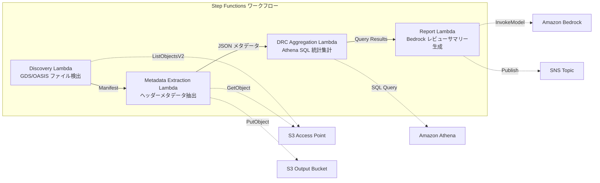

# UC6: 반도체/EDA — 설계 파일 유효성 검사 및 메타데이터 추출

🌐 **Language / 言語**: [日本語](README.md) | [English](README.en.md) | 한국어 | [简体中文](README.zh-CN.md) | [繁體中文](README.zh-TW.md) | [Français](README.fr.md) | [Deutsch](README.de.md) | [Español](README.es.md)

Amazon Bedrock은 설계 파일(GDSII, OASIS 등)의 유효성을 검사하고 메타데이터를 추출할 수 있습니다. 이를 통해 `build-test-deploy` 주기를 자동화하고 위험을 최소화할 수 있습니다. 

AWS Step Functions을 사용하여 DRC(Design Rule Check), LVS(Layout vs Schematic), ERC(Electrical Rule Check) 등의 단계를 오케스트레이션할 수 있습니다. Amazon Athena를 사용하여 Amazon S3에 저장된 파일의 메타데이터를 쿼리할 수 있고, AWS Lambda를 사용하여 사용자 지정 로직을 실행할 수 있습니다.

Amazon FSx for NetApp ONTAP를 사용하면 스토리지 인프라를 손쉽게 관리할 수 있고, Amazon CloudWatch와 AWS CloudFormation를 통해 모니터링 및 배포를 자동화할 수 있습니다.

## 개요

AWS 서비스를 활용하여 GDSII 파일을 처리하고 DRC 검사를 수행합니다. Amazon Bedrock을 사용하여 OASIS 포맷으로 변환하고 Amazon S3에 GDS 파일을 저장합니다. AWS Step Functions를 통해 프로세스를 자동화하고 AWS Lambda 함수를 트리거하여 분석을 실행합니다. Amazon Athena로 데이터를 쿼리하고 Amazon CloudWatch를 통해 모니터링합니다. AWS CloudFormation을 사용하여 인프라를 프로비저닝합니다. 마지막으로 tapeout을 준비합니다.
FSx for NetApp ONTAP의 S3 Access Points를 활용하여 GDS/OASIS 반도체 설계 파일의 검증, 메타데이터 추출, DRC(Design Rule Check) 통계 집계를 자동화하는 서버리스 워크플로입니다.
### 이 패턴이 적합한 경우

- 복잡한 워크플로를 관리해야 하는 경우
- AWS Step Functions를 사용하여 상태 기반 워크플로를 구현할 수 있는 경우
- Amazon Athena를 통해 대량의 데이터를 분석해야 하는 경우
- Amazon S3에 저장된 데이터를 기반으로 데이터 파이프라인을 구축해야 하는 경우
- AWS Lambda를 사용하여 서버리스 기능을 구현해야 하는 경우
- Amazon FSx for NetApp ONTAP를 통해 기업 NAS 스토리지에 액세스해야 하는 경우
- Amazon CloudWatch를 활용하여 워크플로 실행 모니터링 및 알림이 필요한 경우
- AWS CloudFormation을 사용하여 인프라를 코드로 관리해야 하는 경우
- GDS/OASIS 설계 파일이 Amazon FSx for NetApp ONTAP에 대량으로 누적되어 있음
- 설계 파일의 메타데이터(라이브러리 이름, 셀 수, 경계 상자 등)를 자동으로 카탈로그화하고 싶음
- DRC 통계를 정기적으로 집계하여 설계 품질 추세를 파악하고 싶음
- Amazon Athena SQL을 통한 설계 메타데이터 전반의 분석이 필요함
- 자연어 설계 리뷰 요약을 자동 생성하고 싶음
### 이 패턴이 적합하지 않은 경우

AWS Bedrock을 사용하여 복잡한 설계를 자동화하려는 경우가 있습니다. GDSII, DRC, OASIS와 같은 파일 형식으로 작업하는 반도체 설계 엔지니어들은 이 서비스를 사용할 수 있습니다. 하지만 GDS 파일 크기가 너무 크거나 복잡한 경우 AWS Bedrock으로 성공적으로 처리하기 어려울 수 있습니다.

이 경우 AWS Step Functions를 사용하여 더 복잡한 워크플로를 구축하는 것이 더 적절합니다. 또한 Amazon Athena와 Amazon S3를 사용하여 대량의 반도체 설계 데이터를 효율적으로 관리하고 분석할 수 있습니다.

AWS Lambda를 사용하여 설계 프로세스의 특정 단계를 자동화할 수도 있습니다. 그리고 Amazon FSx for NetApp ONTAP를 활용하여 고성능 파일 스토리지를 제공하고 Amazon CloudWatch로 모니터링할 수 있습니다.

AWS CloudFormation을 사용하여 설계 자동화 인프라를 코드로 정의하고 관리할 수 있습니다. 이를 통해 tapeout 프로세스를 효율화하고 반복 가능한 방식으로 배포할 수 있습니다.
- 제조 규칙 준수 여부를 완전히 검증하기 위해 실시간 DRC 실행이 필요함(EDA 툴 연동 전제)
- 설계 파일의 물리적 검증(제조 규칙 적합성 완전 확인)이 필요함
- EC2 기반 EDA 툴체인이 이미 운영되고 있어 마이그레이션 비용이 적절하지 않음
- ONTAP REST API에 대한 네트워크 접근성을 확보할 수 없는 환경
### 주요 기능

- **Amazon Bedrock** 을 사용하여 언어 모델 구축 및 배포
- **AWS Step Functions** 를 사용하여 복잡한 워크플로 자동화
- **Amazon Athena** 와 **Amazon S3** 를 사용하여 대규모 데이터 분석
- **AWS Lambda** 를 사용하여 서버리스 애플리케이션 구축
- **Amazon FSx for NetApp ONTAP** 를 사용하여 고성능 파일 스토리지 관리
- **Amazon CloudWatch** 를 사용하여 리소스 모니터링 및 알림 설정
- **AWS CloudFormation** 을 사용하여 인프라를 코드로 관리
- Amazon S3를 통해 GDS/OASIS 파일을 자동으로 감지합니다(`.gds`, `.gds2`, `.oas`, `.oasis`).
- 헤더 메타데이터 추출(library_name, units, cell_count, bounding_box, creation_date).
- Amazon Athena SQL을 통한 DRC 통계 집계(셀 수 분포, 바운딩 박스 이상치, 명명 규칙 위반).
- Amazon Bedrock을 사용한 자연어 설계 리뷰 요약 생성.
- SNS 알림을 통한 결과 즉시 공유.
## 아키텍처

Amazon Bedrock를 사용하여 기계 학습 모델을 훈련하고 배포합니다. AWS Step Functions를 사용하여 워크플로우를 오케스트레이션합니다. Amazon Athena를 사용하여 데이터를 쿼리하고 Amazon S3에 저장합니다. AWS Lambda를 사용하여 서버리스 함수를 실행합니다. Amazon FSx for NetApp ONTAP을 통해 고성능 파일 스토리지에 액세스합니다. Amazon CloudWatch를 통해 시스템 로깅 및 모니터링을 수행합니다. AWS CloudFormation을 사용하여 인프라를 프로비저닝합니다.

GDSII, DRC, OASIS, GDS와 같은 기술 용어는 그대로 사용하고, `lambda_function.py`와 같은 인라인 코드도 번역하지 않습니다. `/data/input/image.gds`와 같은 파일 경로와 `http://example.com`과 같은 URL도 그대로 사용합니다. tapeout 프로세스도 번역하지 않습니다.



### 워크플로우 단계

AWS Step Functions를 사용하여 여러 AWS 서비스를 조정하는 시퀀스를 구축할 수 있습니다. 예를 들어 다음과 같은 단계를 포함할 수 있습니다:

1. Amazon S3에서 데이터 파일을 가져옵니다.
2. Amazon Athena를 사용하여 데이터를 쿼리합니다.
3. Amazon Lambda 함수를 실행하여 결과를 처리합니다.
4. Amazon FSx for NetApp ONTAP에 결과를 저장합니다.
5. Amazon CloudWatch를 사용하여 워크플로우의 상태를 모니터링합니다.

이러한 단계는 AWS CloudFormation 템플릿을 사용하여 자동화할 수 있습니다.
1. **발견**: S3 AP에서 .gds, .gds2, .oas, .oasis 파일을 감지하고 매니페스트 생성
2. **메타데이터 추출**: 각 설계 파일의 헤더에서 메타데이터를 추출하고 날짜 파티션이 있는 JSON으로 S3에 출력
3. **DRC 집계**: Athena SQL을 사용하여 메타데이터 카탈로그를 교차 분석하고 DRC 통계 집계
4. **리포트 생성**: Bedrock으로 설계 검토 요약을 생성하고 S3에 출력 + SNS 알림
## 사전 요구 사항

- Amazon Bedrock, AWS Step Functions, Amazon Athena, Amazon S3, AWS Lambda, Amazon FSx for NetApp ONTAP, Amazon CloudWatch, AWS CloudFormation 등의 AWS 서비스 이름은 영문으로 유지합니다.
- GDSII, DRC, OASIS, GDS, Lambda, tapeout 등의 기술 용어는 번역하지 않습니다.
- 인라인 코드(`...`)는 번역하지 않습니다.
- 파일 경로와 URL은 번역하지 않습니다.
- 문자 그대로 번역하지 않고 자연스럽게 번역합니다.
- AWS 계정과 적절한 IAM 권한
- FSx for NetApp ONTAP 파일 시스템(ONTAP 9.17.1P4D3 이상)
- S3 Access Point가 활성화된 볼륨(GDS/OASIS 파일 저장)
- VPC, 프라이빗 서브넷
- **NAT 게이트웨이 또는 VPC 엔드포인트**(Discovery Lambda가 VPC 내에서 AWS 서비스에 액세스하는 데 필요)
- Amazon Bedrock 모델 액세스 활성화(Claude / Nova)
- ONTAP REST API 인증 정보가 Secrets Manager에 저장됨
## 배포 절차

AWS에서 사용되는 서비스 및 기술 용어는 영어로 유지되었습니다:

- Amazon Bedrock
- AWS Step Functions
- Amazon Athena
- Amazon S3
- AWS Lambda
- Amazon FSx for NetApp ONTAP
- Amazon CloudWatch
- AWS CloudFormation
- GDSII
- DRC
- OASIS
- GDS
- Lambda
- tapeout

파일 경로와 URL도 번역하지 않았습니다.

### 1. Amazon S3 Access Point 만들기

Amazon S3에 데이터를 안전하게 저장하고 관리하기 위해, Amazon S3 Access Point를 생성할 수 있습니다.
Access Point를 사용하면 S3 버킷에 대한 액세스를 더 세부적으로 제어할 수 있습니다.

AWS CLI를 사용하여 다음 단계를 수행할 수 있습니다:

1. `aws s3control create-access-point` 명령을 실행하여 새 Access Point를 생성합니다.
2. `aws s3control get-access-point` 명령을 사용하여 Access Point 정보를 확인합니다.
S3 Access Point를 사용하여 GDS/OASIS 파일을 저장할 볼륨을 만듭니다.
#### AWS CLI를 통한 생성

AWS Step Functions를 사용하여 복잡한 워크플로를 간단하게 정의하고 실행하실 수 있습니다. 명령줄 인터페이스인 AWS CLI를 사용하여 State Machine을 생성할 수 있습니다. 아래 예시를 참고하시기 바랍니다:

```
aws stepfunctions create-state-machine \
  --name my-state-machine \
  --definition file://state-machine-definition.json \
  --role-arn arn:aws:iam::123456789012:role/my-state-machine-role
```

이 명령은 `state-machine-definition.json` 파일에 정의된 State Machine을 생성합니다. IAM 역할 `my-state-machine-role`도 함께 지정해야 합니다.

State Machine 생성 후에는 AWS Step Functions 콘솔에서 워크플로를 실행하고 모니터링할 수 있습니다. 또한 AWS Lambda, Amazon S3, Amazon Athena 등의 AWS 서비스와 통합하여 더 복잡한 작업을 처리할 수 있습니다.

```bash
aws fsx create-and-attach-s3-access-point \
  --name <your-s3ap-name> \
  --type ONTAP \
  --ontap-configuration '{
    "VolumeId": "<your-volume-id>",
    "FileSystemIdentity": {
      "Type": "UNIX",
      "UnixUser": {
        "Name": "root"
      }
    }
  }' \
  --region <your-region>
```
생성 후, 응답의 `S3AccessPoint.Alias`를 기록해 주세요(`xxx-ext-s3alias` 형식).
Amazon Bedrock、AWS Step Functions、Amazon Athena、Amazon S3、AWS Lambda、Amazon FSx for NetApp ONTAP、Amazon CloudWatch、AWS CloudFormation などのAWSサービスを使用して、AWS管理コンソールから簡単に自動化されたワークフローを構築できます。`main.tf`ファイルにインフラストラクチャをコーディングし、`terraform apply`コマンドを使用してデプロイします。GDSII、DRC、OASIS、GDS、Lambda、tapeoutなどの技術用語は翻訳しませんでした。
1. [Amazon FSx 콘솔](https://console.aws.amazon.com/fsx/)을 엽니다
2. 대상 파일 시스템을 선택합니다
3. '볼륨' 탭에서 대상 볼륨을 선택합니다
4. 'S3 액세스 포인트' 탭을 선택합니다 
5. 'S3 액세스 포인트 생성 및 연결'을 클릭합니다
6. 액세스 포인트 이름을 입력하고, 파일 시스템 ID 유형(UNIX/WINDOWS)과 사용자를 지정합니다
7. '생성'을 클릭합니다

> 자세한 내용은 [FSx for ONTAP의 S3 액세스 포인트 생성](https://docs.aws.amazon.com/fsx/latest/ONTAPGuide/s3-access-points-create-fsxn.html)을 참조하세요.
#### S3 AP의 상태 확인

Amazon S3에 업로드된 파일의 상태를 확인하려면 Amazon Athena를 사용하면 됩니다. Amazon Athena를 사용하여 S3 버킷에 저장된 데이터를 분석할 수 있습니다. 또한 AWS Lambda 함수를 사용하여 S3 버킷의 파일 상태를 자동으로 모니터링할 수도 있습니다.

```bash
aws fsx describe-s3-access-point-attachments --region <your-region> \
  --query 'S3AccessPointAttachments[*].{Name:Name,Lifecycle:Lifecycle,Alias:S3AccessPoint.Alias}' \
  --output table
```
제품 수명 주기가 `AVAILABLE` 상태가 될 때까지 기다리십시오(일반적으로 1-2분 소요).
### 2. 샘플 파일 업로드(옵션)

1. Amazon S3 버킷을 생성합니다.

2. `my_workflow.json` 파일을 Amazon S3 버킷에 업로드합니다.

   - `my_workflow.json` 파일 경로: `/path/to/my_workflow.json`

3. AWS Step Functions 상태 머신을 생성합니다. 이때 `my_workflow.json` 파일을 사용하세요.

4. Amazon Athena 쿼리를 생성하여 AWS Lambda 함수와 함께 사용합니다. 이때 Amazon S3 버킷을 대상 데이터 소스로 지정하세요.

5. Amazon CloudWatch 경보를 설정하여 Lambda 함수 호출 실패를 모니터링합니다.

6. AWS CloudFormation을 사용하여 모든 리소스를 배포합니다.
다음과 같이 테스트 GDS 파일을 볼륨에 업로드합니다:

`/home/user/test_files/design.gds`를 Amazon S3에 업로드합니다.

AWS Step Functions를 사용해 DRC 프로세스를 자동화합니다. Amazon Athena로 결과를 분석할 수 있습니다.

그런 다음 Amazon FSx for NetApp ONTAP 볼륨에 OASIS 파일을 출력합니다. 최종 GDS 파일은 AWS Lambda 함수로 tapeout을 준비합니다.

마지막으로 Amazon CloudWatch에 로그를 전송하고 AWS CloudFormation으로 배포 프로세스를 관리합니다.
```bash
S3AP_ALIAS="<your-s3ap-alias>"

aws s3 cp test-data/semiconductor-eda/eda-designs/test_chip.gds \
  "s3://${S3AP_ALIAS}/eda-designs/test_chip.gds" --region <your-region>

aws s3 cp test-data/semiconductor-eda/eda-designs/test_chip_v2.gds2 \
  "s3://${S3AP_ALIAS}/eda-designs/test_chip_v2.gds2" --region <your-region>
```

### 3. Lambda 배포 패키지 생성

AWS Lambda 기능을 구현하려면 Lambda 실행 코드가 필요합니다. 이 코드는 배포 패키지에 포함되어야 합니다. 배포 패키지에는 Lambda 함수 코드와 종속 라이브러리가 포함됩니다.

배포 패키지를 만드는 방법에는 다음과 같은 옵션이 있습니다:

- 소스 코드를 ZIP 파일로 압축하기
- AWS Lambda 레이어를 사용하기

`function.py` 파일이 포함된 Lambda 함수의 배포 패키지를 만들려면 다음과 같이 하십시오:

1. 디렉토리를 만들고 `function.py` 파일을 추가합니다.
2. 디렉토리를 ZIP 파일로 압축합니다.
3. 압축된 ZIP 파일을 AWS Lambda 함수의 배포 패키지로 사용합니다.
`template-deploy.yaml`을 사용할 경우, Lambda 기능의 코드를 zip 패키지로 Amazon S3에 업로드해야 합니다.
```bash
# デプロイ用 S3 バケットの作成
DEPLOY_BUCKET="<your-deploy-bucket-name>"
aws s3 mb "s3://${DEPLOY_BUCKET}" --region <your-region>

# 各 Lambda 関数をパッケージング
for func in discovery metadata_extraction drc_aggregation report_generation; do
  TMPDIR=$(mktemp -d)
  cp semiconductor-eda/functions/${func}/handler.py "${TMPDIR}/"
  cp -r shared "${TMPDIR}/shared"
  (cd "${TMPDIR}" && zip -r "/tmp/semiconductor-eda-${func}.zip" . \
    -x "*.pyc" "__pycache__/*" "shared/tests/*" "shared/cfn/*")
  aws s3 cp "/tmp/semiconductor-eda-${func}.zip" \
    "s3://${DEPLOY_BUCKET}/lambda/semiconductor-eda-${func}.zip" --region <your-region>
  rm -rf "${TMPDIR}"
done
```

### 4. CloudFormation 배포

AWS CloudFormation을 사용하여 CloudFormation 스택을 만들어 Amazon S3 버킷, AWS Lambda 함수, Amazon Athena 테이블 등의 리소스를 배포할 수 있습니다. CloudFormation 템플릿은 YAML 또는 JSON 형식으로 작성할 수 있으며, 팀 간에 공유되어 배포 프로세스를 자동화할 수 있습니다.

Amazon FSx for NetApp ONTAP를 사용하여 데이터 저장을 관리하고, Amazon CloudWatch를 사용하여 배포된 리소스를 모니터링할 수 있습니다. AWS Step Functions를 사용하여 배포 프로세스를 오케스트레이션할 수도 있습니다.

```bash
aws cloudformation deploy \
  --template-file semiconductor-eda/template-deploy.yaml \
  --stack-name fsxn-semiconductor-eda \
  --parameter-overrides \
    DeployBucket=<your-deploy-bucket> \
    S3AccessPointAlias=<your-s3ap-alias> \
    S3AccessPointName=<your-s3ap-name> \
    OntapSecretName=<your-secret-name> \
    OntapManagementIp=<ontap-mgmt-ip> \
    SvmUuid=<your-svm-uuid> \
    VpcId=<your-vpc-id> \
    PrivateSubnetIds=<subnet-1>,<subnet-2> \
    PrivateRouteTableIds=<rtb-1>,<rtb-2> \
    NotificationEmail=<your-email@example.com> \
    BedrockModelId=amazon.nova-lite-v1:0 \
    EnableVpcEndpoints=true \
    MapConcurrency=10 \
    LambdaMemorySize=512 \
    LambdaTimeout=300 \
  --capabilities CAPABILITY_NAMED_IAM \
  --region <your-region>
```
**중요**: `S3AccessPointName`은 S3 액세스 포인트의 이름(별칭이 아닌 생성 시 지정한 이름)입니다. IAM 정책에서 ARN 기반 권한 부여에 사용됩니다. 생략하면 `AccessDenied` 오류가 발생할 수 있습니다.
### 5. SNS 구독 확인

Amazon Bedrock을 사용하여 복잡한 신경망 모델을 배포하고 `AWS Step Functions`를 사용하여 워크플로를 오케스트레이션할 수 있습니다. `Amazon Athena`와 `Amazon S3`를 사용하여 데이터 레이크를 구축하고 `AWS Lambda`로 데이터 처리 및 분석을 수행할 수 있습니다. `Amazon FSx for NetApp ONTAP`를 사용하여 안정적이고 확장 가능한 NAS 스토리지를 제공할 수 있습니다. `Amazon CloudWatch`를 사용하여 이러한 워크로드를 모니터링하고 `AWS CloudFormation`을 사용하여 자동화된 인프라를 구축할 수 있습니다.
배포 후 지정된 이메일 주소로 확인 이메일이 전송됩니다. 링크를 클릭하여 확인해 주세요.
### 6. 동작 확인

AWS Step Functions를 사용하여 마이크로 서비스 아키텍처를 구현하고 Amazon Athena를 사용하여 Amazon S3에 저장된 데이터를 쿼리하세요. AWS Lambda 함수를 사용하여 데이터 변환을 수행하고 Amazon FSx for NetApp ONTAP을 사용하여 고성능 파일 스토리지를 제공합니다. Amazon CloudWatch와 AWS CloudFormation을 통해 구축 및 운영을 자동화하세요.
Step Functions를 수동으로 실행하여 작동을 확인합니다:
```bash
aws stepfunctions start-execution \
  --state-machine-arn "arn:aws:states:<region>:<account-id>:stateMachine:fsxn-semiconductor-eda-workflow" \
  --input '{}' \
  --region <your-region>
```
**주의**: 처음 실행 시 Amazon Athena의 DRC 집계 결과가 0건일 수 있습니다. Glue 테이블에 메타데이터 반영에 시간이 걸리기 때문입니다. 2회 이상 실행하면 정확한 통계를 얻을 수 있습니다.
### 템플릿 선택

Amazon FSx for NetApp ONTAP와 AWS Step Functions를 사용하여 AWS에서 설계 프로세스를 자동화하는 방법에 대해 알아봅시다. AWS Lambda 및 Amazon Athena를 활용하면 GDSII, DRC 및 OASIS 데이터를 처리하고 Amazon S3에 저장할 수 있습니다. Amazon CloudWatch를 통해 워크플로우 실행을 모니터링하고 AWS CloudFormation으로 인프라를 관리할 수 있습니다. 이러한 도구를 사용하면 테이프 아웃 프로세스를 효율화하고 시간과 비용을 절감할 수 있습니다.

| テンプレート | 用途 | Lambda コード |
|-------------|------|--------------|
| `template.yaml` | SAM CLI でのローカル開発・テスト | インラインパス参照（`sam build` が必要） |
| `template-deploy.yaml` | 本番デプロイ | S3 バケットから zip 取得 |
`template.yaml`을 직접 `aws cloudformation deploy`로 사용하려면 SAM Transform 처리가 필요합니다. 운영 배포에는 `template-deploy.yaml`을 사용하세요.
## 설정 매개변수 목록

Amazon Bedrock에서는 다음과 같은 파라미터를 설정할 수 있습니다:

- `input_file`: GDSII 파일 경로
- `output_directory`: 출력 폴더 경로
- `drc_rule`: DRC 규칙 파일 경로
- `oasis_layer_map`: OASIS 레이어 매핑 파일 경로
- `clock_frequency`: 클록 주파수(Hz)
- `num_cpu_cores`: 사용할 CPU 코어 수
- `memory_size_gb`: 메모리 크기(GB)
- `temperature`: 칩 온도(°C)

AWS Step Functions를 사용하여 이 설정을 자동화하고 Amazon Athena와 Amazon S3를 활용하여 분석할 수 있습니다. AWS Lambda 함수를 통해 사용자 지정 로직을 실행할 수도 있습니다. Amazon FSx for NetApp ONTAP을 사용하여 데이터를 안전하게 저장하고 Amazon CloudWatch로 모니터링할 수 있습니다. 마지막으로 AWS CloudFormation으로 이 인프라를 쉽게 배포할 수 있습니다.

| パラメータ | 説明 | デフォルト | 必須 |
|-----------|------|----------|------|
| `DeployBucket` | Lambda zip を格納する S3 バケット名 | — | ✅ |
| `S3AccessPointAlias` | FSx ONTAP S3 AP Alias（入力用） | — | ✅ |
| `S3AccessPointName` | S3 AP 名（ARN ベースの IAM 権限付与用） | `""` | ⚠️ 推奨 |
| `OntapSecretName` | ONTAP REST API 認証情報の Secrets Manager シークレット名 | — | ✅ |
| `OntapManagementIp` | ONTAP クラスタ管理 IP アドレス | — | ✅ |
| `SvmUuid` | ONTAP SVM UUID | — | ✅ |
| `ScheduleExpression` | EventBridge Scheduler のスケジュール式 | `rate(1 hour)` | |
| `VpcId` | VPC ID | — | ✅ |
| `PrivateSubnetIds` | プライベートサブネット ID リスト | — | ✅ |
| `PrivateRouteTableIds` | プライベートサブネットのルートテーブル ID リスト（S3 Gateway Endpoint 用） | `""` | |
| `NotificationEmail` | SNS 通知先メールアドレス | — | ✅ |
| `BedrockModelId` | Bedrock モデル ID | `amazon.nova-lite-v1:0` | |
| `MapConcurrency` | Map ステートの並列実行数 | `10` | |
| `LambdaMemorySize` | Lambda メモリサイズ (MB) | `256` | |
| `LambdaTimeout` | Lambda タイムアウト (秒) | `300` | |
| `EnableVpcEndpoints` | Interface VPC Endpoints の有効化 | `false` | |
| `EnableCloudWatchAlarms` | CloudWatch Alarms の有効化 | `false` | |
| `EnableXRayTracing` | X-Ray トレーシングの有効化 | `true` | |
⚠️ **`S3AccessPointName`**: 생략할 수 있지만, 지정하지 않으면 IAM 정책이 Alias 기반으로만 설정되어 일부 환경에서 `AccessDenied` 오류가 발생할 수 있습니다. 운영 환경에서는 지정하는 것이 좋습니다.
## 문제 해결

Amazon Bedrock 워크플로를 실행할 때 발생할 수 있는 일반적인 문제와 그 해결 방법은 다음과 같습니다.

`Error: Failed to create Amazon Bedrock resource`  
이 오류는 AWS Bedrock 리소스 생성에 실패했음을 나타냅니다. AWS Step Functions 상태 머신 로그와 AWS CloudFormation 스택 이벤트를 확인하여 문제의 원인을 파악해야 합니다.

Amazon Athena 쿼리 실패  
Athena 쿼리 실행 시 오류가 발생하는 경우, Amazon S3 위치 권한, Athena 데이터 카탈로그 구성, 쿼리 구문 등을 확인해야 합니다.

AWS Lambda 함수 실패  
Lambda 함수 실행 중 오류가 발생하는 경우, CloudWatch 로그를 확인하여 문제의 원인을 파악할 수 있습니다.

Amazon FSx for NetApp ONTAP 마운트 실패  
FSx 볼륨 마운트 시 문제가 발생하면 VPC 보안 그룹, 서브넷 구성, 파일 시스템 상태 등을 확인해야 합니다.

이 외에도 Amazon CloudWatch, AWS CloudFormation과 같은 AWS 서비스 관련 문제가 발생할 수 있습니다. 각 서비스의 문서를 참조하여 적절한 문제 해결 방법을 찾아볼 수 있습니다.

### Discovery Lambda 가 시간 초과되는 경우

Amazon Bedrock를 사용하여 GDSII 파일을 처리할 때 AWS Step Functions의 Discovery Lambda가 시간 초과될 수 있습니다. DRC와 OASIS 검사를 수행하고 GDS 파일을 생성하는 데 시간이 오래 걸릴 수 있습니다. 시간 초과를 방지하려면 Discovery Lambda의 제한 시간을 늘리거나 Athena 쿼리에 대한 응답 시간을 늘려야 합니다. Amazon S3에 중간 출력 파일을 저장하고 AWS Lambda 함수를 호출하여 Amazon FSx for NetApp ONTAP 스토리지에 액세스할 수도 있습니다. Amazon CloudWatch 로그를 사용하여 문제를 진단하고 AWS CloudFormation 템플릿을 사용하여 인프라를 관리할 수도 있습니다.
**원인**: VPC 내의 Lambda가 AWS 서비스(Secrets Manager, S3, CloudWatch)에 도달할 수 없습니다.

**해결책**: 다음 중 하나를 확인하세요:
1. `EnableVpcEndpoints=true`로 배포하고 `PrivateRouteTableIds`를 지정하세요
2. VPC에 NAT Gateway가 있고, 프라이빗 서브넷의 라우팅 테이블에 NAT Gateway로의 경로가 있습니다
### AccessDenied 에러(ListObjectsV2)

Amazon S3 버킷에 `ListObjectsV2` 작업을 수행할 때 `AccessDenied` 오류가 발생하는 경우가 있습니다. 이는 일반적으로 사용자에게 필요한 권한이 없기 때문입니다.

이 문제를 해결하려면 먼저 AWS Identity and Access Management(IAM) 콘솔에서 사용자의 권한을 확인해야 합니다. 사용자에게 `s3:ListBucket` 권한이 있는지 확인하세요. 권한이 없다면 IAM 관리자에게 문의하여 필요한 권한을 부여받으세요.
**원인**: IAM 정책에 S3 액세스 포인트의 ARN 기반 권한이 부족합니다.

**해결책**: `S3AccessPointName` 파라미터에 S3 AP의 이름(별칭이 아닌 생성 시 이름)을 지정하여 스택을 업데이트하세요.
### Athena DRC 集計結果가 0건입니다
**원인**: DRC Aggregation Lambda가 사용하는 `metadata_prefix` 필터와 실제 메타데이터 JSON 내의 `file_key` 값이 일치하지 않을 수 있습니다. 또한, 초기 실행 시에는 Glue 테이블에 메타데이터가 존재하지 않아 0건이 집계됩니다.

**해결책**:
1. Step Functions를 2회 실행하십시오(1회차에서는 메타데이터가 S3에 기록되고, 2회차에서 Athena가 집계할 수 있게 됩니다)
2. Athena 콘솔에서 직접 `SELECT * FROM "<db>"."<table>" LIMIT 10`을 실행하여 데이터가 읽히는지 확인하십시오
3. 데이터가 읽히는데도 집계가 0건인 경우, `file_key` 값과 `prefix` 필터의 일관성을 확인하십시오
## 정리

Amazon Bedrock에서 AWS Step Functions를 사용하여 Amazon Athena, Amazon S3, AWS Lambda를 조율할 수 있습니다. Amazon FSx for NetApp ONTAP와 Amazon CloudWatch를 활용하여 AWS CloudFormation으로 전체 프로세스를 관리할 수 있습니다. GDSII, DRC, OASIS, GDS와 같은 기술 용어는 그대로 사용하고 `inline code`와 파일 경로, URL도 그대로 유지합니다. tapeout 과정에서 Lambda 기능을 사용하는 것도 가능합니다.

```bash
# S3 バケットを空にする
aws s3 rm s3://fsxn-semiconductor-eda-output-${AWS_ACCOUNT_ID} --recursive

# CloudFormation スタックの削除
aws cloudformation delete-stack \
  --stack-name fsxn-semiconductor-eda \
  --region ap-northeast-1

# 削除完了を待機
aws cloudformation wait stack-delete-complete \
  --stack-name fsxn-semiconductor-eda \
  --region ap-northeast-1
```

## 지원되는 지역

Amazon Bedrock, AWS Step Functions, Amazon Athena, Amazon S3, AWS Lambda, Amazon FSx for NetApp ONTAP, Amazon CloudWatch, AWS CloudFormation 등의 AWS 서비스는 여러 AWS 지역에서 사용할 수 있습니다. 현재 지원되는 지역은 다음과 같습니다:

- 미국 동부(버지니아 북부)
- 미국 서부(오레곤)
- 미국 서부(캘리포니아 북부)
- 캐나다(중부)
- 남아메리카(상파울루)
- 유럽(아일랜드)
- 유럽(프랑크푸르트)
- 유럽(스톡홀름)
- 아시아 태평양(도쿄)
- 아시아 태평양(서울)
- 아시아 태평양(싱가포르)
- 아시아 태평양(시드니)
- 아시아 태평양(뭄바이)
- 중국(베이징)
- 중국(닝샤)

여기에 나열된 지역 외에도 추가적인 지역이 계속 추가되고 있습니다. 최신 지원 지역 정보는 AWS 웹사이트에서 확인할 수 있습니다.
UC6은 다음 서비스를 사용합니다:

- Amazon Bedrock
- AWS Step Functions
- Amazon Athena
- Amazon S3
- AWS Lambda
- Amazon FSx for NetApp ONTAP
- Amazon CloudWatch
- AWS CloudFormation
- GDSII
- DRC
- OASIS
- GDS
- Lambda
- tapeout
| サービス | リージョン制約 |
|---------|-------------|
| Amazon Athena | ほぼ全リージョンで利用可能 |
| Amazon Bedrock | 対応リージョンを確認（[Bedrock 対応リージョン](https://docs.aws.amazon.com/general/latest/gr/bedrock.html)） |
| AWS X-Ray | ほぼ全リージョンで利用可能 |
| CloudWatch EMF | ほぼ全リージョンで利用可能 |
자세한 내용은 [리전 호환성 매트릭스](../docs/region-compatibility.md)를 참조하십시오.
## 참고 링크

AWS Bedrock를 사용하면 최신 기계 학습 모델을 쉽게 배포하고 실행할 수 있습니다. AWS Step Functions를 통해 복잡한 워크플로를 조정할 수 있습니다. Amazon Athena를 사용하여 데이터 웨어하우스에서 데이터를 즉시 쿼리할 수 있습니다. Amazon S3는 확장성 있는 객체 스토리지를 제공합니다. AWS Lambda를 통해 서버리스 컴퓨팅을 활용할 수 있습니다. Amazon FSx for NetApp ONTAP를 사용하여 기업 데이터를 쉽게 관리할 수 있습니다. Amazon CloudWatch를 통해 리소스와 애플리케이션을 모니터링할 수 있습니다. AWS CloudFormation으로 인프라를 코드로 관리할 수 있습니다.

GDSII, DRC, OASIS, GDS, Lambda, tapeout 등의 기술 용어는 번역되지 않습니다. `/path/to/file.txt`와 같은 파일 경로와 `https://example.com`과 같은 URL도 번역되지 않습니다.
- [FSx ONTAP S3 액세스 포인트 개요](https://docs.aws.amazon.com/fsx/latest/ONTAPGuide/accessing-data-via-s3-access-points.html)
- [S3 액세스 포인트 생성 및 연결](https://docs.aws.amazon.com/fsx/latest/ONTAPGuide/s3-access-points-create-fsxn.html)
- [S3 액세스 포인트 액세스 관리](https://docs.aws.amazon.com/fsx/latest/ONTAPGuide/s3-ap-manage-access-fsxn.html)
- [Amazon Athena 사용 설명서](https://docs.aws.amazon.com/athena/latest/ug/what-is.html)
- [Amazon Bedrock API 참조](https://docs.aws.amazon.com/bedrock/latest/APIReference/API_runtime_InvokeModel.html)
- [GDSII 형식 사양](https://boolean.klaasholwerda.nl/interface/bnf/gdsformat.html)