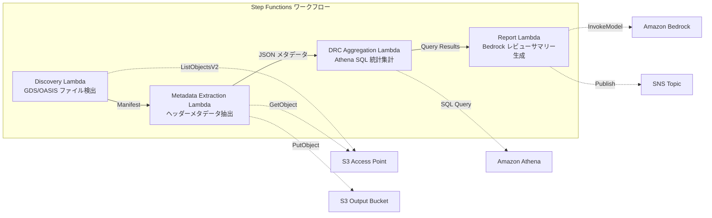

# UC6: 半導体 / EDA — 設計ファイルバリデーション・メタデータ抽出

## 概要

FSx for NetApp ONTAP の S3 Access Points を活用し、GDS/OASIS 半導体設計ファイルのバリデーション、メタデータ抽出、DRC（Design Rule Check）統計集計を自動化するサーバーレスワークフローです。

### このパターンが適しているケース

- GDS/OASIS 設計ファイルが FSx ONTAP 上に大量に蓄積されている
- 設計ファイルのメタデータ（ライブラリ名、セル数、バウンディングボックス等）を自動カタログ化したい
- DRC 統計を定期的に集計し、設計品質の傾向を把握したい
- Athena SQL による横断的な設計メタデータ分析が必要
- 自然言語の設計レビューサマリーを自動生成したい

### このパターンが適さないケース

- リアルタイムの DRC 実行が必要（EDA ツール連携が前提）
- 設計ファイルの物理的なバリデーション（製造ルール適合性の完全検証）が必要
- EC2 ベースの EDA ツールチェーンが既に稼働しており、移行コストが見合わない
- ONTAP REST API へのネットワーク到達性が確保できない環境

### 主な機能

- S3 AP 経由で GDS/OASIS ファイルを自動検出（.gds, .gds2, .oas, .oasis）
- ヘッダーメタデータ抽出（library_name, units, cell_count, bounding_box, creation_date）
- Athena SQL による DRC 統計集計（セル数分布、バウンディングボックス外れ値、命名規則違反）
- Amazon Bedrock による自然言語設計レビューサマリー生成
- SNS 通知による結果の即時共有

## アーキテクチャ



### ワークフローステップ

1. **Discovery**: S3 AP から .gds, .gds2, .oas, .oasis ファイルを検出し、Manifest を生成
2. **Metadata Extraction**: 各設計ファイルのヘッダーからメタデータを抽出し、日付パーティション付き JSON で S3 出力
3. **DRC Aggregation**: Athena SQL でメタデータカタログを横断分析し、DRC 統計を集計
4. **Report Generation**: Bedrock で設計レビューサマリーを生成し、S3 出力 + SNS 通知

## 前提条件

- AWS アカウントと適切な IAM 権限
- FSx for NetApp ONTAP ファイルシステム（ONTAP 9.17.1P4D3 以上）
- S3 Access Point が有効化されたボリューム（GDS/OASIS ファイルを格納）
- VPC、プライベートサブネット
- Amazon Bedrock モデルアクセスが有効（Claude / Nova）

## デプロイ手順

### 1. パラメータの準備

| パラメータ | 説明 |
|-----------|------|
| `S3AccessPointAlias` | FSx ONTAP S3 AP Alias（入力用） |
| `VpcId` | VPC ID |
| `PrivateSubnetIds` | プライベートサブネット ID リスト |
| `NotificationEmail` | SNS 通知先メールアドレス |

### 2. CloudFormation デプロイ

```bash
aws cloudformation deploy \
  --template-file semiconductor-eda/template.yaml \
  --stack-name fsxn-semiconductor-eda \
  --parameter-overrides \
    S3AccessPointAlias=<your-volume-ext-s3alias> \
    VpcId=<your-vpc-id> \
    PrivateSubnetIds=<subnet-1>,<subnet-2> \
    ScheduleExpression="rate(1 hour)" \
    NotificationEmail=<your-email@example.com> \
    EnableVpcEndpoints=false \
    EnableCloudWatchAlarms=false \
  --capabilities CAPABILITY_IAM CAPABILITY_AUTO_EXPAND \
  --region ap-northeast-1
```

### 3. SNS サブスクリプションの確認

デプロイ後、指定したメールアドレスに確認メールが届きます。リンクをクリックして確認してください。

## 設定パラメータ一覧

| パラメータ | 説明 | デフォルト | 必須 |
|-----------|------|----------|------|
| `S3AccessPointAlias` | FSx ONTAP S3 AP Alias（入力用） | — | ✅ |
| `ScheduleExpression` | EventBridge Scheduler のスケジュール式 | `rate(1 hour)` | |
| `VpcId` | VPC ID | — | ✅ |
| `PrivateSubnetIds` | プライベートサブネット ID リスト | — | ✅ |
| `NotificationEmail` | SNS 通知先メールアドレス | — | ✅ |
| `MapConcurrency` | Map ステートの並列実行数 | `10` | |
| `LambdaMemorySize` | Lambda メモリサイズ (MB) | `512` | |
| `LambdaTimeout` | Lambda タイムアウト (秒) | `300` | |
| `EnableVpcEndpoints` | Interface VPC Endpoints の有効化 | `false` | |
| `EnableCloudWatchAlarms` | CloudWatch Alarms の有効化 | `false` | |

## クリーンアップ

```bash
# S3 バケットを空にする
aws s3 rm s3://fsxn-semiconductor-eda-output-${AWS_ACCOUNT_ID} --recursive

# CloudFormation スタックの削除
aws cloudformation delete-stack \
  --stack-name fsxn-semiconductor-eda \
  --region ap-northeast-1

# 削除完了を待機
aws cloudformation wait stack-delete-complete \
  --stack-name fsxn-semiconductor-eda \
  --region ap-northeast-1
```

## Supported Regions

UC6 は以下のサービスを使用します:

| サービス | リージョン制約 |
|---------|-------------|
| Amazon Athena | ほぼ全リージョンで利用可能 |
| Amazon Bedrock | 対応リージョンを確認（[Bedrock 対応リージョン](https://docs.aws.amazon.com/general/latest/gr/bedrock.html)） |
| AWS X-Ray | ほぼ全リージョンで利用可能 |
| CloudWatch EMF | ほぼ全リージョンで利用可能 |

> 詳細は [リージョン互換性マトリックス](../docs/region-compatibility.md) を参照。

## 参考リンク

- [FSx ONTAP S3 Access Points 概要](https://docs.aws.amazon.com/fsx/latest/ONTAPGuide/accessing-data-via-s3-access-points.html)
- [Amazon Athena ユーザーガイド](https://docs.aws.amazon.com/athena/latest/ug/what-is.html)
- [Amazon Bedrock API リファレンス](https://docs.aws.amazon.com/bedrock/latest/APIReference/API_runtime_InvokeModel.html)
- [GDSII フォーマット仕様](https://boolean.klaasholwerda.nl/interface/bnf/gdsformat.html)
