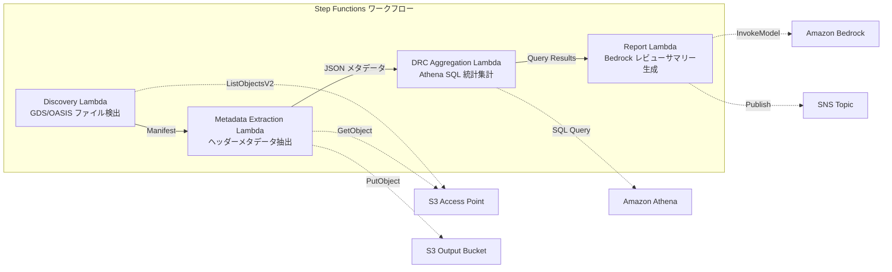

# UC6：半导体 / EDA — 设计文件验证和元数据提取

🌐 **Language / 言語**: [日本語](README.md) | [English](README.en.md) | [한국어](README.ko.md) | 简体中文 | [繁體中文](README.zh-TW.md) | [Français](README.fr.md) | [Deutsch](README.de.md) | [Español](README.es.md)

设计工程师需要确保设计文件符合规范,并从中抽取元数据。这个过程包括:

1. 使用 Amazon Bedrock 将 GDSII、DRC 和 OASIS 等设计文件转换为标准的 GDS 格式。
2. 使用 AWS Step Functions 协调从 Amazon Athena 和 Amazon S3 提取元数据的工作流。
3. 使用 AWS Lambda 函数分析设计文件并验证其合规性。
4. 将结果存储在 Amazon S3 中,并使用 Amazon FSx for NetApp ONTAP 为 tapeout 流程提供共享存储。
5. 使用 Amazon CloudWatch 监控整个流程,并通过 AWS CloudFormation 自动化部署。

## 概述

Amazon Bedrock 提供了一个全托管的人工智能基础设施服务,用于训练和部署大型语言模型。借助 AWS Step Functions 您可以轻松地构建状态机来编排各种 AWS 服务。借助 Amazon Athena,您可以使用标准 SQL 查询分析存储在 Amazon S3 中的数据。借助 AWS Lambda,您可以使用无服务器功能来处理事件和实现轻量级应用程序逻辑。Amazon FSx for NetApp ONTAP 为您的应用程序提供高性能、可扩展的文件存储。您可以使用 Amazon CloudWatch 监控您的 AWS 资源,并使用 AWS CloudFormation 以代码的形式管理它们。
利用 Amazon FSx for NetApp ONTAP 的 S3 访问点，自动化服务器无关工作流程,包括验证 GDS/OASIS 半导体设计文件、提取元数据、以及进行 DRC（设计规则检查）统计分析。
### 适用场景

这个模式适用于以下场景:

- 使用 Amazon Bedrock 和 AWS Step Functions 构建大规模的自动化工作流
- 利用 Amazon Athena 对存储在 Amazon S3 上的数据进行分析
- 将数据从 Amazon FSx for NetApp ONTAP 复制到 Amazon S3 并触发 AWS Lambda 函数进行进一步处理
- 使用 Amazon CloudWatch 监控整个解决方案的运行状况
- 使用 AWS CloudFormation 自动部署和管理整个解决方案
- 大量的GDS/OASIS设计文件积累在FSx ONTAP上
- 希望能自动建立设计文件的元数据目录(包括库名、单元数、边界框等)
- 希望能定期集中统计DRC数据,了解设计质量趋势
- 需要使用Athena SQL进行跨设计元数据的分析
- 希望能自动生成设计评审的自然语言总结
### 在这种情况下不适用的模式

- 需要更复杂的ETL操作或分析的场合。可以使用Amazon Athena、AWS Lambda或Amazon EMR等服务来满足更复杂的需求。
- 需要针对性能或可扩展性进行微调的场合。可以使用Amazon FSx for NetApp ONTAP或Amazon S3等服务来满足这些需求。
- 需要实时分析或仪表板的场合。可以使用Amazon CloudWatch或AWS CloudFormation等服务来满足这些需求。
- 需要编排复杂的工作流的场合。可以使用AWS Step Functions来满足这些需求。
- 需要与其他AWS服务集成的场合。可以使用合适的AWS服务来满足这些需求。
- 需要实时 DRC 执行（前提是 EDA 工具集成）
- 需要对设计文件进行物理验证（完全验证制造规则符合性）
- 已经部署了基于 EC2 的 EDA 工具链，迁移成本不合算
- 无法确保网络可达 ONTAP REST API 的环境
### 主要功能

AWS Step Functions 用于编排和监控工作流程。Amazon Athena 支持无服务器查询数据湖中的数据。Amazon S3 提供可扩展的对象存储。AWS Lambda 允许您以无服务器的方式运行代码。Amazon FSx for NetApp ONTAP 提供企业级的 NAS 存储。Amazon CloudWatch 提供监控和观察功能。AWS CloudFormation 用于管理和编配基础设施即代码。
- 通过 Amazon S3 自动检测 GDS/OASIS 文件（.gds、.gds2、.oas、.oasis）
- 提取头部元数据（library_name、units、cell_count、bounding_box、creation_date）
- 使用 Amazon Athena SQL 进行 DRC 统计分析（单元格数量分布、边界框异常值、命名规则违反）
- 利用 Amazon Bedrock 生成自然语言设计评审摘要
- 通过 Amazon SNS 即时共享分析结果
## 架构

AWS Step Functions和Amazon Athena可用于管理数据流和执行查询。Amazon S3提供了安全的对象存储,AWS Lambda为您提供无服务器计算能力。Amazon FSx for NetApp ONTAPを使用,您可以访问高性能的NetApp文件存储。Amazon CloudWatchでは操作指标を監视し、AWS CloudFormationでシステムを自動化できます。



以下为简体中文翻译:

### 工作流步骤
1. **发现**: 从 S3 AP 中检测到 .gds、.gds2、.oas、.oasis 文件，并生成清单
2. **元数据提取**: 从每个设计文件的标头中提取元数据，以带日期分区的 JSON 格式输出到 S3
3. **DRC 聚合**: 利用 Athena SQL 跨元数据目录进行分析，汇总 DRC 统计信息
4. **报告生成**: 使用 Bedrock 生成设计审查摘要，输出到 S3 并发送 SNS 通知
## 前提条件

Amazon Bedrock 是一种机器学习模型托管服务,可帮助您快速部署和运营高性能的生产级机器学习模型。使用 AWS Step Functions 可以创建服务器无关的工作流程,通过 Amazon Athena 快速查询您存储在 Amazon S3 上的数据。AWS Lambda 使您能够在无服务器环境中运行代码,Amazon FSx for NetApp ONTAP 提供了企业级的网络附加存储。请使用 Amazon CloudWatch 来监控您的应用程序,使用 AWS CloudFormation 来自动化您的基础设施部署。
- AWS账户和适当的IAM权限
- FSx for NetApp ONTAP文件系统（ONTAP 9.17.1P4D3及以上版本）
- 启用了S3访问点的卷（用于存储GDS/OASIS文件）
- VPC、私有子网
- **NAT网关或VPC端点**（Discovery Lambda需要从VPC内部访问AWS服务）
- 已启用Amazon Bedrock模型访问（Claude/Nova）
- ONTAP REST API凭据已存储在Secrets Manager中
## 部署流程

Amazon Bedrock 是一种用于构建自定义语言模型的服务。您可以使用 AWS Step Functions 来编排自动化工作流程,并与 Amazon Athena、Amazon S3、AWS Lambda 等其他 AWS 服务集成。

在您准备就绪部署到生产环境之前,请确保您已完成以下步骤:

1. 使用 Amazon FSx for NetApp ONTAP 创建文件系统,并将其挂载到 EC2 实例。
2. 监控 Amazon CloudWatch 中的部署状态。
3. 使用 AWS CloudFormation 部署所需的基础设施资源。

现在您已准备就绪,可以开始部署了。请确保遵守 GDSII、DRC 和 OASIS 等技术标准,并完成 GDS 和 tapeout 等必要步骤。如果您遇到任何问题,请查看 `README.md` 文件获取更多信息。

### 1. 创建 Amazon S3 访问点

您可以创建 Amazon S3 访问点来控制对特定 Amazon S3 存储桶或对象的访问。您可以使用访问点来管理对存储桶的访问策略、加密配置和基于身份的权限。

在 AWS Management Console 上执行以下步骤:

1. 导航至 Amazon S3 控制台。
2. 选择您要创建访问点的存储桶。
3. 选择"访问点"选项卡,然后单击"创建访问点"。
4. 输入访问点名称并配置所需的设置,例如访问策略、加密和 VPC 配置等。
5. 创建访问点。
在用于存储 GDS/OASIS 文件的卷上创建 Amazon S3 访问点。
#### 使用AWS CLI创建

在AWS CLI中，您可以使用以下命令创建Amazon Bedrock、AWS Step Functions、Amazon Athena、Amazon S3、AWS Lambda、Amazon FSx for NetApp ONTAP、Amazon CloudWatch和AWS CloudFormation资源:

```
aws bedrock create-inference-recommendation-job \
  --job-name "my-inference-recommendation-job" \
  --input-data-config file://input-data-config.json \
  --output-data-config file://output-data-config.json \
  --inference-recommendation-job-config file://inference-recommendation-job-config.json

aws stepfunctions create-state-machine \
  --name "my-state-machine" \
  --definition file://state-machine-definition.json \
  --role-arn arn:aws:iam::123456789012:role/my-state-machine-role

aws athena start-query-execution \
  --query-string "SELECT * FROM my_table LIMIT 10" \
  --result-configuration OutputLocation=s3://my-athena-results

aws s3 cp file.gdsii s3://my-bucket/file.gdsii
aws lambda invoke --function-name my-lambda-function out.txt
aws fsx create-file-system --file-system-type ONTAP --storage-capacity 1024 --subnet-ids subnet-0123456789abcdef
aws cloudwatch put-metric-data --namespace "MyService" --metric-name "Requests" --value 1
aws cloudformation create-stack --template-body file://my-stack.yaml --parameters ParameterKey=Env,ParameterValue=prod
```

```bash
aws fsx create-and-attach-s3-access-point \
  --name <your-s3ap-name> \
  --type ONTAP \
  --ontap-configuration '{
    "VolumeId": "<your-volume-id>",
    "FileSystemIdentity": {
      "Type": "UNIX",
      "UnixUser": {
        "Name": "root"
      }
    }
  }' \
  --region <your-region>
```
创建完成后,请记录响应中的 `S3AccessPoint.Alias` (格式为 `xxx-ext-s3alias`)。
#### 在AWS 管理控制台中创建

创建Amazon Bedrock 部署,配合使用AWS Step Functions 来管理您的机器学习流程。利用Amazon Athena分析存储在Amazon S3 中的数据,并使用AWS Lambda函数来执行数据转换任务。配合使用Amazon FSx for NetApp ONTAP为您的应用程序提供高性能文件存储服务。使用Amazon CloudWatch监控您的工作负载,并使用AWS CloudFormation管理您的基础架构。
1. 打开[Amazon FSx 控制台](https://console.aws.amazon.com/fsx/)
2. 选择目标文件系统
3. 在"卷"选项卡中选择目标卷
4. 选择"S3 访问点"选项卡
5. 单击"创建并附加S3访问点"
6. 输入访问点名称,指定文件系统 ID 类型(UNIX/WINDOWS)和用户
7. 单击"创建"

> 有关详细信息,请参阅[创建 FSx for ONTAP 的 S3 访问点](https://docs.aws.amazon.com/fsx/latest/ONTAPGuide/s3-access-points-create-fsxn.html)。
#### 检查 Amazon S3 AP 的状态

Amazon Athena 可用于查询 Amazon S3 中存储的数据。您可以使用 AWS Step Functions 来创建一个自动化工作流程,以定期检查 Amazon S3 AP 的状态。该工作流程可以包括以下步骤:

1. 使用 `aws s3 ls` 命令列出 Amazon S3 AP 中的对象。
2. 使用 `aws s3api head-object` 命令检查每个对象的元数据,确保它们处于预期状态。
3. 如果发现任何异常,可以使用 AWS Lambda 函数来采取相应的修正措施,例如触发警报或自动修复。
4. 使用 Amazon CloudWatch 监控工作流程的执行情况,并设置警报以及时发现问题。
5. 使用 AWS CloudFormation 管理工作流程的基础设施,确保环境一致且易于部署。

此外,您可以考虑使用 Amazon FSx for NetApp ONTAP 来备份和存储 Amazon S3 中的关键数据,以提高数据的可靠性和可用性。

```bash
aws fsx describe-s3-access-point-attachments --region <your-region> \
  --query 'S3AccessPointAttachments[*].{Name:Name,Lifecycle:Lifecycle,Alias:S3AccessPoint.Alias}' \
  --output table
```
请等待 `Lifecycle` 变为 `AVAILABLE` 状态（通常需要 1 至 2 分钟）。
### 2. 上传示例文件（可选）

您可以通过使用 Amazon S3 上传示例 GDSII 文件。Amazon S3 是一种安全、可扩展的对象存储服务,非常适合存储 GDSII 文件。以下步骤可帮助您上传示例文件:

1. 登录 Amazon Web Services (AWS) 控制台。
2. 导航到 Amazon S3 服务。
3. 创建一个新的 S3 存储桶。
4. 将 GDSII 文件上传到该存储桶。
5. 记下 GDSII 文件的 S3 URL,您稍后会用到它。

如果您想要使用 AWS Lambda 对 GDSII 文件进行预处理,也可以在此时进行设置。有关更多信息,请参阅 AWS Lambda 文档。
将测试用的 GDSII 文件上传到卷中:
```bash
S3AP_ALIAS="<your-s3ap-alias>"

aws s3 cp test-data/semiconductor-eda/eda-designs/test_chip.gds \
  "s3://${S3AP_ALIAS}/eda-designs/test_chip.gds" --region <your-region>

aws s3 cp test-data/semiconductor-eda/eda-designs/test_chip_v2.gds2 \
  "s3://${S3AP_ALIAS}/eda-designs/test_chip_v2.gds2" --region <your-region>
```

### 3. 创建 Lambda 部署软件包

AWS Lambda 函数需要一个部署软件包才能运行。这个软件包可以是一个 ZIP 文件,其中包含您的代码和任何依赖项。在本教程中,您将创建一个简单的 `hello-world` Lambda 函数,并将其部署为一个 ZIP 文件。

您可以使用以下步骤创建部署软件包:

1. 在您的本地机器上创建一个新目录,例如 `hello-world`。
2. 在此目录中创建一个新的 Python 文件,例如 `lambda_function.py`,并添加以下代码:

   ```python
   def lambda_handler(event, context):
       return {
           'statusCode': 200,
           'body': 'Hello from AWS Lambda!'
       }
   ```

3. 使用以下命令创建 ZIP 文件:

   ```
   zip -r hello-world.zip lambda_function.py
   ```

现在您已经准备好将此 ZIP 文件部署到 AWS Lambda 了。
使用 `template-deploy.yaml` 时,需要将 Lambda 函数的代码作为 zip 包上传到 Amazon S3。
```bash
# デプロイ用 S3 バケットの作成
DEPLOY_BUCKET="<your-deploy-bucket-name>"
aws s3 mb "s3://${DEPLOY_BUCKET}" --region <your-region>

# 各 Lambda 関数をパッケージング
for func in discovery metadata_extraction drc_aggregation report_generation; do
  TMPDIR=$(mktemp -d)
  cp semiconductor-eda/functions/${func}/handler.py "${TMPDIR}/"
  cp -r shared "${TMPDIR}/shared"
  (cd "${TMPDIR}" && zip -r "/tmp/semiconductor-eda-${func}.zip" . \
    -x "*.pyc" "__pycache__/*" "shared/tests/*" "shared/cfn/*")
  aws s3 cp "/tmp/semiconductor-eda-${func}.zip" \
    "s3://${DEPLOY_BUCKET}/lambda/semiconductor-eda-${func}.zip" --region <your-region>
  rm -rf "${TMPDIR}"
done
```

### 4. AWS CloudFormation 部署

Amazon S3 を使用して、チップ設計ファイル(GDSII、DRC、OASIS、GDS)をアップロードします。AWS Step Functions を使用してチップ製造ワークフローを実行し、Amazon Athena と Amazon CloudWatch を使用してクエリとモニタリングを行います。AWS Lambda で独自のカスタムロジックを実装し、Amazon FSx for NetApp ONTAP を使用してファイルを管理します。最後に、AWS CloudFormation テンプレートを使用して、リソースの一括デプロイを行います。

```bash
aws cloudformation deploy \
  --template-file semiconductor-eda/template-deploy.yaml \
  --stack-name fsxn-semiconductor-eda \
  --parameter-overrides \
    DeployBucket=<your-deploy-bucket> \
    S3AccessPointAlias=<your-s3ap-alias> \
    S3AccessPointName=<your-s3ap-name> \
    OntapSecretName=<your-secret-name> \
    OntapManagementIp=<ontap-mgmt-ip> \
    SvmUuid=<your-svm-uuid> \
    VpcId=<your-vpc-id> \
    PrivateSubnetIds=<subnet-1>,<subnet-2> \
    PrivateRouteTableIds=<rtb-1>,<rtb-2> \
    NotificationEmail=<your-email@example.com> \
    BedrockModelId=amazon.nova-lite-v1:0 \
    EnableVpcEndpoints=true \
    MapConcurrency=10 \
    LambdaMemorySize=512 \
    LambdaTimeout=300 \
  --capabilities CAPABILITY_NAMED_IAM \
  --region <your-region>
```
**重要**：`S3AccessPointName` 是 S3 访问点的名称（不是别名，而是创建时指定的名称）。在 IAM 策略中使用基于 ARN 的权限授予。如果省略可能会导致 `AccessDenied` 错误。
### 5. 检查 SNS 订阅

サブスクリプションを確認するには、Amazon SNS コンソールを使用します。

1. Amazon SNS コンソールにアクセスする
2. 左側のナビゲーションで「Subscriptions」を選択する
3. 作成したサブスクリプションが表示されることを確認する
部署后,将向指定的电子邮件地址发送确认邮件。请点击链接进行确认。
### 6. 操作确认

在完成所有设置和配置后,您需要确认整个工作流程是否如预期运行。您可以使用以下服务和工具来进行操作确认:

- 使用 Amazon Athena 运行查询来检查 Amazon S3 存储桶中的数据
- 使用 AWS Lambda 函数来测试自动化流程
- 使用 Amazon CloudWatch 监控系统健康状况和性能指标
- 使用 AWS CloudFormation 验证基础设施配置

如果发现任何问题,请根据需要调整配置并重新测试。一旦一切运行正常,您就可以将解决方案投入生产使用了。
使用Step Functions手动运行并确认其运行:
```bash
aws stepfunctions start-execution \
  --state-machine-arn "arn:aws:states:<region>:<account-id>:stateMachine:fsxn-semiconductor-eda-workflow" \
  --input '{}' \
  --region <your-region>
```
**注意**：在首次运行中，Amazon Athena 的 DRC 聚合结果可能为 0 条。这是因为 AWS Glue 表的元数据反映存在时间延迟。在第二次及以后的运行中将能获得正确的统计信息。
### 使用适合的模板

您可以根据不同的用例和要求选择合适的AWS服务。例如:

- 对于无服务器应用程序,可以使用AWS Lambda和Amazon S3。
- 对于复杂的数据处理工作流,可以使用AWS Step Functions。
- 对于交互式分析,可以使用Amazon Athena。 
- 对于企业级文件共享和存储,可以使用Amazon FSx for NetApp ONTAP。
- 对于监控和报警,可以使用Amazon CloudWatch。
- 对于自动化基础设施部署,可以使用AWS CloudFormation。

| テンプレート | 用途 | Lambda コード |
|-------------|------|--------------|
| `template.yaml` | SAM CLI でのローカル開発・テスト | インラインパス参照（`sam build` が必要） |
| `template-deploy.yaml` | 本番デプロイ | S3 バケットから zip 取得 |
`template.yaml`直接使用于`aws cloudformation deploy`时需要进行SAM Transform处理。生产环境部署请使用`template-deploy.yaml`。
## 参数列表

您可以使用以下参数来配置 AWS Bedrock、AWS Step Functions、Amazon Athena、Amazon S3、AWS Lambda、Amazon FSx for NetApp ONTAP、Amazon CloudWatch 和 AWS CloudFormation:

- `format`: 设置输出格式,可选值为 `GDSII`、`DRC`、`OASIS` 或 `GDS`
- `timeout`: 设置运行时超时时间,单位为秒
- `memory`: 设置运行内存大小,单位为 MB
- `region`: 指定AWS区域,如 `us-east-1`
- `bucket`: 指定用于存储结果的 Amazon S3 存储桶
- `log_group`: 指定 Amazon CloudWatch 日志组名称

您也可以使用 AWS Lambda 函数和 AWS CloudFormation 模板来自动化这些配置。

| パラメータ | 説明 | デフォルト | 必須 |
|-----------|------|----------|------|
| `DeployBucket` | Lambda zip を格納する S3 バケット名 | — | ✅ |
| `S3AccessPointAlias` | FSx ONTAP S3 AP Alias（入力用） | — | ✅ |
| `S3AccessPointName` | S3 AP 名（ARN ベースの IAM 権限付与用） | `""` | ⚠️ 推奨 |
| `OntapSecretName` | ONTAP REST API 認証情報の Secrets Manager シークレット名 | — | ✅ |
| `OntapManagementIp` | ONTAP クラスタ管理 IP アドレス | — | ✅ |
| `SvmUuid` | ONTAP SVM UUID | — | ✅ |
| `ScheduleExpression` | EventBridge Scheduler のスケジュール式 | `rate(1 hour)` | |
| `VpcId` | VPC ID | — | ✅ |
| `PrivateSubnetIds` | プライベートサブネット ID リスト | — | ✅ |
| `PrivateRouteTableIds` | プライベートサブネットのルートテーブル ID リスト（S3 Gateway Endpoint 用） | `""` | |
| `NotificationEmail` | SNS 通知先メールアドレス | — | ✅ |
| `BedrockModelId` | Bedrock モデル ID | `amazon.nova-lite-v1:0` | |
| `MapConcurrency` | Map ステートの並列実行数 | `10` | |
| `LambdaMemorySize` | Lambda メモリサイズ (MB) | `256` | |
| `LambdaTimeout` | Lambda タイムアウト (秒) | `300` | |
| `EnableVpcEndpoints` | Interface VPC Endpoints の有効化 | `false` | |
| `EnableCloudWatchAlarms` | CloudWatch Alarms の有効化 | `false` | |
| `EnableXRayTracing` | X-Ray トレーシングの有効化 | `true` | |
⚠️ **`S3AccessPointName`**：虽然可以省略该参数,但不指定的话IAM策略将只能使用别名,这可能在某些环境下会导致 `AccessDenied` 错误。建议在生产环境中指定该参数。
## 故障診断

AWS Stepfunctions可以用于长时间运行的工作流程。当工作流程执行失败时,AWS Stepfunctions会自动重试操作,直到工作流程完成或达到最大重试次数。

如果工作流程始终失败,可以使用Amazon CloudWatch日志排查故障原因。Amazon Athena可用于查询和分析这些日志。

或者,您也可以配置AWS CloudFormation模板以自动化故障排查过程。例如,您可以通过AWS Lambda函数监控工作流程执行并采取修正措施,如重新启动失败的任务或发送警报。

对于涉及硅制造的工作流程(如GDSII转换或DRC检查),您可以使用Amazon FSx for NetApp ONTAP来存储和管理设计文件,并通过AWS Stepfunctions自动化整个流程。

如果您需要进一步协助,请随时与我们联系。

### Discovery Lambda出现超时

您可以检查以下几点来解决Discovery Lambda超时的问题:

1. 检查Discovery Lambda函数的执行时间是否超出了AWS Lambda的限制(最大15分钟)。如果是,可以考虑将任务拆分为多个更小的Lambda函数,或者使用AWS Step Functions来协调更复杂的工作流程。

2. 确保您的Discovery Lambda函数足够高效,不会消耗过多的计算资源。可以使用Amazon CloudWatch的指标来监控函数的性能,并优化代码以降低执行时间。

3. 如果您的Discovery Lambda函数需要访问其他AWS服务,如Amazon Athena、Amazon S3或Amazon FSx for NetApp ONTAP,请确保这些服务能够及时响应,不会成为性能瓶颈。

4. 考虑使用AWS CloudFormation来管理和配置您的AWS资源,以确保环境一致和可复制。

如果通过以上步骤仍无法解决问题,您可以进一步诊断Lambda函数的问题,例如增加日志记录或使用AWS X-Ray进行分布式跟踪。
**原因**: VPC内的Lambda无法访问AWS服务（Secrets Manager、S3、Amazon CloudWatch）。

**解决方案**: 请检查以下任一项:
1. 使用`EnableVpcEndpoints=true`部署,并指定`PrivateRouteTableIds`
2. VPC中存在NAT网关,且私有子网路由表中存在通往NAT网关的路由
### AccessDenied 错误（ListObjectsV2）

Amazon S3上的 `ListObjectsV2` 操作失败,出现 AccessDenied 错误。这通常意味着用户凭证没有执行此操作的权限。可以检查IAM权限策略,确保给予了正确的权限。如果仍无法解决,可以尝试使用AWS Security Token Service获取临时凭证,或者联系AWS管理员进行进一步排查。
**原因**：IAM 策略缺乏基于 S3 访问点 ARN 的权限。

**解决方案**：更新堆栈时，在 `S3AccessPointName` 参数中指定 S3 访问点的名称（不是别名，而是创建时的名称）。
### Athena DRC汇总结果为0 

Amazon Athena用于执行DRC分析。由于未发现任何结果,请检查输入数据是否正确。
**原因**：DRC Aggregation Lambda 使用的 `metadata_prefix` 过滤器与实际元数据 JSON 内 `file_key` 值可能不一致。此外,首次运行时 Glue 表中可能不存在元数据,因此返回 0 条记录。

**解决方案**:
1. 运行两次 Step Functions（第一次将元数据写入 S3,第二次即可由 Athena 进行聚合）
2. 直接在 Athena 控制台执行 `SELECT * FROM "<db>"."<table>" LIMIT 10`,确认能够读取数据
3. 如果能读取数据但聚合结果为 0 条记录,请检查 `file_key` 值与 `prefix` 过滤器的一致性
## 清理

Amazon Bedrock 是一种无需编码即可构建和部署生成性人工智能模型的服务。使用 AWS Step Functions 协调您的工作流程,并利用 Amazon Athena 查询您存储在 Amazon S3 中的数据。您可以使用 AWS Lambda 来自动完成各种任务,例如调用 Amazon FSx for NetApp ONTAP 以管理文件存储。此外,您还可以使用 Amazon CloudWatch 监控您的系统,并使用 AWS CloudFormation 以编程方式管理您的云基础设施。

```bash
# S3 バケットを空にする
aws s3 rm s3://fsxn-semiconductor-eda-output-${AWS_ACCOUNT_ID} --recursive

# CloudFormation スタックの削除
aws cloudformation delete-stack \
  --stack-name fsxn-semiconductor-eda \
  --region ap-northeast-1

# 削除完了を待機
aws cloudformation wait stack-delete-complete \
  --stack-name fsxn-semiconductor-eda \
  --region ap-northeast-1
```

## 支持的区域

Amazon Bedrock、AWS Step Functions、Amazon Athena、Amazon S3、AWS Lambda、Amazon FSx for NetApp ONTAP、Amazon CloudWatch 和 AWS CloudFormation 在以下 AWS 区域可用:

- 美国东部(维吉尼亚北部)
- 美国东部(俄亥俄)
- 美国西部(奥勒冈)
- 美国西部(加利福尼亚北部)
- 亚太区(东京)
- 亚太区(首尔)
- 亚太区(新加坡)
- 亚太区(悉尼)
- 亚太区(孟买)
- 加拿大(中部)
- 欧洲(爱尔兰)
- 欧洲(法兰克福)
- 欧洲(斯德哥尔摩)
- 南美洲(圣保罗)
- 中东(巴林)
- 非洲(开普敦)
UC6使用以下的服务:

Amazon Bedrock、AWS Step Functions、Amazon Athena、Amazon S3、AWS Lambda、Amazon FSx for NetApp ONTAP、Amazon CloudWatch、AWS CloudFormation
| サービス | リージョン制約 |
|---------|-------------|
| Amazon Athena | ほぼ全リージョンで利用可能 |
| Amazon Bedrock | 対応リージョンを確認（[Bedrock 対応リージョン](https://docs.aws.amazon.com/general/latest/gr/bedrock.html)） |
| AWS X-Ray | ほぼ全リージョンで利用可能 |
| CloudWatch EMF | ほぼ全リージョンで利用可能 |
更多详情请参见 [Region Compatibility Matrix](../docs/region-compatibility.md)。
## 参考链接

Amazon Bedrock是一个应用机器学习(ML)模型的全托管服务。通过AWS Step Functions,您可以构建复杂的无服务器应用程序。Amazon Athena是一种交互式查询服务,可直接在Amazon S3存储的数据中运行SQL查询。AWS Lambda是一种无服务器计算服务,可以无需预置或管理服务器即可运行代码。Amazon FSx for NetApp ONTAP提供了一个高性能的文件存储系统。Amazon CloudWatch是一项监控和观察性服务。AWS CloudFormation是一种用于创建和管理AWS资源的服务。
- [FSx ONTAP S3访问点概述](https://docs.aws.amazon.com/fsx/latest/ONTAPGuide/accessing-data-via-s3-access-points.html)
- [创建和附加S3访问点](https://docs.aws.amazon.com/fsx/latest/ONTAPGuide/s3-access-points-create-fsxn.html)
- [管理S3访问点的访问权限](https://docs.aws.amazon.com/fsx/latest/ONTAPGuide/s3-ap-manage-access-fsxn.html)
- [Amazon Athena用户指南](https://docs.aws.amazon.com/athena/latest/ug/what-is.html)
- [Amazon Bedrock API参考](https://docs.aws.amazon.com/bedrock/latest/APIReference/API_runtime_InvokeModel.html)
- [GDSII格式规范](https://boolean.klaasholwerda.nl/interface/bnf/gdsformat.html)