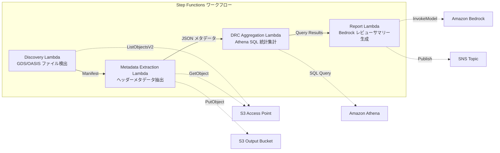

# UC6: 半導體 / EDA — 設計檔案驗證及元數據提取

🌐 **Language / 言語**: [日本語](README.md) | [English](README.en.md) | [한국어](README.ko.md) | [简体中文](README.zh-CN.md) | 繁體中文 | [Français](README.fr.md) | [Deutsch](README.de.md) | [Español](README.es.md)

AWS Serverless Architecture:
- Amazon Bedrock: 用於驗證設計檔案格式並提取相關元數據
- AWS Step Functions: 協調整個驗證及元數據提取工作流程
- Amazon Athena: 查詢和分析從設計檔案中提取的元數據
- Amazon S3: 存儲設計檔案和元數據
- AWS Lambda: 執行驗證和元數據提取的無伺服器功能
- Amazon FSx for NetApp ONTAP: 提供高性能的檔案儲存
- Amazon CloudWatch: 監控和分析整個解決方案的運行狀況
- AWS CloudFormation: 以程式碼形式定義和佈建整個基礎設施

## 概述

Amazon Bedrock是AWS提供的一款可自動化機器學習模型開發和部署的服務。它利用AWS Step Functions協調不同的機器學習任務,如Amazon Athena分析資料、Amazon S3存放資料、AWS Lambda執行代碼等。透過Amazon Bedrock,您可以快速建立自己的機器學習管道,並將其部署在Amazon FSx for NetApp ONTAP、Amazon CloudWatch等AWS服務上。此外,AWS CloudFormation可以協助您以程式化的方式管理整個基礎設施。

所有這些都有助於簡化機器學習的複雜性,縮短模型上線的時間,並確保其可靠性和可擴展性。不論您是初學者還是專家,Amazon Bedrock都將幫助您更快地開始使用機器學習。
FSx for NetApp ONTAP 的 S3 Access Points 可用於自動化無伺服器工作流程,包括驗證 GDS/OASIS 半導體設計檔案、擷取元資料,以及執行 DRC（Design Rule Check）統計分析。
### 此類模式適用於以下情況

需要整合多種AWS服務(例如Amazon Bedrock、AWS Step Functions、Amazon Athena、Amazon S3、AWS Lambda、Amazon FSx for NetApp ONTAP、Amazon CloudWatch、AWS CloudFormation等)進行資料收集、處理和部署等操作的複雜工作流程。

需要在高度自動化且可靠的環境中,進行GDSII、DRC、OASIS或GDS檔案的轉換、驗證、合成、布局、路由、tapeout等電子設計自動化(EDA)工作流程。

需要使用`lambda_function.py`、`index.html`等程式碼,在AWS服務如AWS Lambda中進行架構和部署的複雜應用程式開發。

需要存取`https://example.com/data/`等位於Amazon S3儲存桶或其他AWS服務中的資料。
- 大量的 GDS/OASIS 設計檔案已累積在 Amazon FSx for NetApp ONTAP 上
- 希望能自動化彙編設計檔案的元數據（如庫名、儲存元件數、邊界框等）
- 希望定期彙整 DRC 統計數據，以了解設計品質趨勢
- 需要使用 Amazon Athena SQL 進行跨設計元數據的分析
- 希望自動產生設計檢閱摘要的自然語言報告
### 此模式並不適合的情況

- 設計規範（DRC）、GDSII、OASIS等製程檢測無法完全自動化
- 無法完全覆蓋 `chip_design.gds` 等複雜的 GDS 檔案
- 無法靈活支援客製化的晶片設計流程，例如特殊的tapeout需求
- AWS Step Functions、Amazon Athena、Amazon S3、AWS Lambda等雲端運算服務難以整合
- 需要即時進行 DRC 執行(前提為 EDA 工具整合)
- 需要設計檔案的實體驗證(完整製造規則合規性確認)
- 已有運作的 EC2 基礎 EDA 工具鏈,遷移成本不值得
- 無法保證網路可達 ONTAP REST API 的環境
### 主要功能

亞馬遜 Bedrock 可協助您快速且可靠地建置自定義語音助理應用程式。透過 AWS Step Functions 管理複雜的工作流程,並使用亞馬遜 Athena 分析儲存在亞馬遜 S3 上的資料。使用 AWS Lambda 部署無伺服器功能,並使用亞馬遜 FSx for NetApp ONTAP 存取企業級 NAS 儲存。透過亞馬遜 CloudWatch 監控應用程式健康狀態,並使用 AWS CloudFormation 自動佈建整個基礎設施。
- 透過 S3 AP 自動偵測 GDS/OASIS 檔案 (`.gds`, `.gds2`, `.oas`, `.oasis`)
- 擷取標題中繼資料 (library_name, units, cell_count, bounding_box, creation_date)
- 透過 Athena SQL 彙集 DRC 統計資料 (cell count 分佈、bounding box 異常值、命名規則違反) 
- 透過 Amazon Bedrock 生成自然語言設計檢視摘要
- 透過 SNS 通知立即分享結果
## 架構

Amazon Bedrock是一個可視化人工智能模型建構、部署和監控的雲端服務。結合AWS Step Functions和Amazon Athena提供完整的人工智能開發週期管理。Amazon S3作為資料湖,再搭配AWS Lambda提供無伺服器運算,打造完整的人工智能解決方案。Amazon FSx for NetApp ONTAP提供穩定的檔案儲存。Amazon CloudWatch收集監控指標,並與AWS CloudFormation整合,方便基礎設施的部署和管理。



### 工作流程步驟

AWS Step Functions可以讓您以視覺化的方式定義應用程式的工作流程。透過AWS Step Functions,您可以將您的工作流程分解為離散的步驟,並定義每個步驟之間的關聯。這些步驟可以是AWS Lambda函數、Amazon Athena查詢或其他AWS服務。定義好工作流程後,AWS Step Functions會自動管理工作流程的執行和狀態,讓您可以專注於應用程式邏輯的開發。

Amazon S3提供安全、持久和可擴展的對像儲存服務。您可以使用Amazon S3存儲和檢索任何類型的資料,例如圖像、視頻、文檔和備份檔案。Amazon S3提供豐富的功能,包括生命週期管理、跨區域複製和事件通知。

AWS Lambda是一種無伺服器的計算服務,讓您可以運行代碼而無需管理伺服器。您可以使用AWS Lambda運行幾乎任何類型的應用程式或後端服務,而無需配置或管理基礎設施。AWS Lambda會自動管理計算資源,並根據您的代碼執行情況自動擴展。
1. **發現**：從 S3 AP 偵測 .gds、.gds2、.oas、.oasis 檔案並生成 Manifest
2. **元資料擷取**：從各設計檔案的標頭中提取元資料,以日期分區的 JSON 格式輸出到 S3
3. **DRC 彙總**：使用 Athena SQL 跨越元資料目錄進行分析,彙總 DRC 統計資訊
4. **報告生成**：使用 Bedrock 生成設計審查摘要,輸出到 S3 並發送 SNS 通知
## 前置條件

Amazon Bedrock、AWS Step Functions、Amazon Athena、Amazon S3、AWS Lambda、Amazon FSx for NetApp ONTAP、Amazon CloudWatch、AWS CloudFormation等AWS服務需要使用。技術術語如GDSII、DRC、OASIS、GDS、Lambda、tapeout等需保持原文。程式碼內容`...`也需要保留原文。檔案路徑和URL也不要翻譯。
- AWS帳戶和合適的IAM權限
- 適用ONTAP 9.17.1P4D3或更新版本的FSx for NetApp ONTAP檔案系統
- 已啟用S3存取點的儲存量（用於存放GDS/OASIS檔案）
- VPC、私有子網
- **NAT Gateway或VPC Endpoints**（Discovery Lambda需要從VPC內部存取AWS服務）
- 已啟用Amazon Bedrock模型存取（Claude / Nova）
- ONTAP REST API認證資訊已儲存於Secrets Manager
## 部署程序

1. 設定 Amazon Bedrock 機器學習模型
2. 配置並啟用 AWS Step Functions 工作流
3. 設置並執行 Amazon Athena 查詢
4. 將資料上傳至 Amazon S3 儲存體
5. 創建 AWS Lambda 函式來處理資料
6. 配置 Amazon FSx for NetApp ONTAP 檔案系統
7. 監控 Amazon CloudWatch 指標
8. 使用 AWS CloudFormation 模板部署資源

### 1. 建立 Amazon S3 存取點
在用於儲存 GDS/OASIS 檔案的磁碟區上建立 Amazon S3 Access Point。
#### 在 AWS CLI 建立

Amazon Bedrock 是一項提供雲端矽晶片設計工具的服務。透過 AWS Step Functions 協調各項設計流程，再利用 Amazon Athena 分析設計成果。設計完成後，可以直接將成果上傳至 Amazon S3，並使用 AWS Lambda 進行自動化部署。若需要特殊檔案系統，Amazon FSx for NetApp ONTAP 便是一個很好的選擇。整個過程可利用 Amazon CloudWatch 進行監控，並以 AWS CloudFormation 自動化佈建。

```bash
aws fsx create-and-attach-s3-access-point \
  --name <your-s3ap-name> \
  --type ONTAP \
  --ontap-configuration '{
    "VolumeId": "<your-volume-id>",
    "FileSystemIdentity": {
      "Type": "UNIX",
      "UnixUser": {
        "Name": "root"
      }
    }
  }' \
  --region <your-region>
```
建立後,請記下回應的 `S3AccessPoint.Alias` (形式為 `xxx-ext-s3alias`)。
#### 透過 AWS 管理控制台建立

您可透過 AWS 管理控制台建立以下資源:
- Amazon Bedrock
- AWS Step Functions
- Amazon Athena
- Amazon S3
- AWS Lambda
- Amazon FSx for NetApp ONTAP
- Amazon CloudWatch
- AWS CloudFormation

您還可以建立 `GDSII`、`DRC`、`OASIS`、`GDS`、`Lambda` 等技術術語,並進行 `tapeout` 動作。
1. 開啟[Amazon FSx 控制台](https://console.aws.amazon.com/fsx/)
2. 選擇目標檔案系統
3. 在「磁碟區」標籤中選擇目標磁碟區
4. 選擇「Amazon S3 存取點」標籤
5. 按一下「建立並附加 Amazon S3 存取點」
6. 輸入存取點名稱,並指定檔案系統 ID 類型(UNIX/WINDOWS)和使用者
7. 按一下「建立」

詳情請參閱[為 FSx for ONTAP 建立 Amazon S3 存取點](https://docs.aws.amazon.com/fsx/latest/ONTAPGuide/s3-access-points-create-fsxn.html)。
以下是上述文本的繁體中文翻譯:

#### 檢查 Amazon S3 AP 的狀態

```bash
aws fsx describe-s3-access-point-attachments --region <your-region> \
  --query 'S3AccessPointAttachments[*].{Name:Name,Lifecycle:Lifecycle,Alias:S3AccessPoint.Alias}' \
  --output table
```
請等待 `Lifecycle` 狀態變為 `AVAILABLE`（通常需 1-2 分鐘）。
### 2. 上傳樣本文件（選擇性）

Amazon S3 是用於儲存和檢索資料的雲端物件儲存服務。您可以使用 Amazon S3 來上傳 GDSII、DRC 或 OASIS 格式的設計檔案。上傳檔案後,您就可以在後續步驟中使用這些檔案。

如果您已經準備好了設計檔案,請執行以下步驟上傳檔案至 Amazon S3:

1. 登入 AWS 管理主控台。
2. 導覽至 Amazon S3 服務。
3. 建立一個新的儲存貯體(bucket)或選擇現有的儲存貯體。
4. 上傳您的設計檔案至儲存貯體。

上傳完成後,請記下儲存貯體名稱和檔案路徑,稍後將會用到。
將測試用的 GDSII 檔案上傳至 Amazon S3 Volume:
```bash
S3AP_ALIAS="<your-s3ap-alias>"

aws s3 cp test-data/semiconductor-eda/eda-designs/test_chip.gds \
  "s3://${S3AP_ALIAS}/eda-designs/test_chip.gds" --region <your-region>

aws s3 cp test-data/semiconductor-eda/eda-designs/test_chip_v2.gds2 \
  "s3://${S3AP_ALIAS}/eda-designs/test_chip_v2.gds2" --region <your-region>
```

### 3. 建立 Lambda 部署封裝
使用 `template-deploy.yaml` 時,需將 Lambda 函式的程式碼以 zip 套件的形式上傳至 Amazon S3。
```bash
# デプロイ用 S3 バケットの作成
DEPLOY_BUCKET="<your-deploy-bucket-name>"
aws s3 mb "s3://${DEPLOY_BUCKET}" --region <your-region>

# 各 Lambda 関数をパッケージング
for func in discovery metadata_extraction drc_aggregation report_generation; do
  TMPDIR=$(mktemp -d)
  cp semiconductor-eda/functions/${func}/handler.py "${TMPDIR}/"
  cp -r shared "${TMPDIR}/shared"
  (cd "${TMPDIR}" && zip -r "/tmp/semiconductor-eda-${func}.zip" . \
    -x "*.pyc" "__pycache__/*" "shared/tests/*" "shared/cfn/*")
  aws s3 cp "/tmp/semiconductor-eda-${func}.zip" \
    "s3://${DEPLOY_BUCKET}/lambda/semiconductor-eda-${func}.zip" --region <your-region>
  rm -rf "${TMPDIR}"
done
```

### 4. AWS CloudFormation部署

この手順では、AWS CloudFormationを使用してAWS Lambdaファンクションを含むインフラストラクチャをデプロイします。cloudformation.yamlテンプレートファイルを使用して、Lambdaファンクション、Amazon S3バケット、AWS Step Functionsステートマシンなどのリソースを作成します。このプロセスでは、Amazon Athenaクエリを実行してAmazon FSx for NetApp ONTAPのファイルを処理することも行います。Amazon CloudWatchのログ記録を設定して、デプロイの進行状況を監視できます。

```bash
aws cloudformation deploy \
  --template-file semiconductor-eda/template-deploy.yaml \
  --stack-name fsxn-semiconductor-eda \
  --parameter-overrides \
    DeployBucket=<your-deploy-bucket> \
    S3AccessPointAlias=<your-s3ap-alias> \
    S3AccessPointName=<your-s3ap-name> \
    OntapSecretName=<your-secret-name> \
    OntapManagementIp=<ontap-mgmt-ip> \
    SvmUuid=<your-svm-uuid> \
    VpcId=<your-vpc-id> \
    PrivateSubnetIds=<subnet-1>,<subnet-2> \
    PrivateRouteTableIds=<rtb-1>,<rtb-2> \
    NotificationEmail=<your-email@example.com> \
    BedrockModelId=amazon.nova-lite-v1:0 \
    EnableVpcEndpoints=true \
    MapConcurrency=10 \
    LambdaMemorySize=512 \
    LambdaTimeout=300 \
  --capabilities CAPABILITY_NAMED_IAM \
  --region <your-region>
```
**重要**: `S3AccessPointName` 是 S3 AP 的名稱(非別名,而是在建立時指定的名稱)。在 IAM 政策中會使用基於 ARN 的授權。如果省略,可能會發生 `AccessDenied` 錯誤。
### 5. 確認 SNS 訂閱

Amazon SNS 主題已成功建立。現在請確認是否已建立正確的訂閱。可以在 AWS Management Console 中的 Amazon SNS 服務控制台中查看訂閱詳細資訊。

Amazon SNS 主題是用來接收來自 AWS Lambda 函數的通知。您可以設定 Amazon SNS 主題以傳送電子郵件、SMS、HTTP POST 或其他通知類型。

如果一切設定正確,當 AWS Lambda 函數執行時,您應該會收到相關通知。
部署後,將向指定的電子郵件地址發送確認郵件。請點擊鏈接進行確認。
### 6. 動作確認

將設計檔案匯出為 `GDSII` 格式,並通過 DRC 檢查。成功後,將檔案轉換為 `OASIS` 格式並上傳至 Amazon S3。

接下來,觸發 AWS Step Functions 工作流程,它會自動呼叫 AWS Lambda 函數來執行晶片設計工艱辛過程,如 tapeout 等。

整個過程可以透過 Amazon CloudWatch 監控,並使用 AWS CloudFormation 管理 Amazon FSx for NetApp ONTAP 等相關資源。最後,可以利用 Amazon Athena 查詢 Amazon S3 上的輸出結果。
手動執行步驟函數來確認其運作:
```bash
aws stepfunctions start-execution \
  --state-machine-arn "arn:aws:states:<region>:<account-id>:stateMachine:fsxn-semiconductor-eda-workflow" \
  --input '{}' \
  --region <your-region>
```
**注意**:初次執行可能會導致 Amazon Athena 的 DRC 彙總結果為 0 筆。這是因為 AWS Glue 表格的元數據更新需要一些時間延遲。從第二次執行開始即可獲得正確的統計數據。
### 使用不同模板

Amazon Bedrock 可為您設計自訂矽晶片。您可使用AWS Step Functions協調多個服務,如Amazon Athena、Amazon S3 和AWS Lambda,以自動化複雜的工作流程。在 Amazon FSx for NetApp ONTAP 上,您可存儲和分析大量資料,並以 Amazon CloudWatch 監視系統健康狀況。使用AWS CloudFormation建立和管理資源堆疊。

| テンプレート | 用途 | Lambda コード |
|-------------|------|--------------|
| `template.yaml` | SAM CLI でのローカル開発・テスト | インラインパス参照（`sam build` が必要） |
| `template-deploy.yaml` | 本番デプロイ | S3 バケットから zip 取得 |
`template-deploy.yaml` 檔案應該用於生產環境部署,因為它已經處理了 SAM Transform。您可以直接使用 `aws cloudformation deploy` 命令進行部署。
## 參數設定列表

Amazon Bedrock是一項完整的無伺服器機器學習服務,可讓您輕鬆建立、訓練和部署高度可用和可擴展的機器學習模型。AWS Step Functions提供狀態自動化和順序控制服務,可協助您協調分散式應用程式和微服務。Amazon Athena是一種交互式查詢服務,可用於使用標準SQL查詢從Amazon S3直接分析數據。AWS Lambda是無伺服器計算服務,可讓您運行代碼而無需管理服務器。Amazon FSx for NetApp ONTAP是一種完全受管的第三方檔案儲存服務,提供高性能的NetApp ONTAP文件系統。Amazon CloudWatch是一種監控和觀察服務,可幫助您理解您的應用程式和微服務,並有效地進行運營。AWS CloudFormation是一項基於模板的服務,可自動化和簡化AWS資源的部署和管理。

| パラメータ | 説明 | デフォルト | 必須 |
|-----------|------|----------|------|
| `DeployBucket` | Lambda zip を格納する S3 バケット名 | — | ✅ |
| `S3AccessPointAlias` | FSx ONTAP S3 AP Alias（入力用） | — | ✅ |
| `S3AccessPointName` | S3 AP 名（ARN ベースの IAM 権限付与用） | `""` | ⚠️ 推奨 |
| `OntapSecretName` | ONTAP REST API 認証情報の Secrets Manager シークレット名 | — | ✅ |
| `OntapManagementIp` | ONTAP クラスタ管理 IP アドレス | — | ✅ |
| `SvmUuid` | ONTAP SVM UUID | — | ✅ |
| `ScheduleExpression` | EventBridge Scheduler のスケジュール式 | `rate(1 hour)` | |
| `VpcId` | VPC ID | — | ✅ |
| `PrivateSubnetIds` | プライベートサブネット ID リスト | — | ✅ |
| `PrivateRouteTableIds` | プライベートサブネットのルートテーブル ID リスト（S3 Gateway Endpoint 用） | `""` | |
| `NotificationEmail` | SNS 通知先メールアドレス | — | ✅ |
| `BedrockModelId` | Bedrock モデル ID | `amazon.nova-lite-v1:0` | |
| `MapConcurrency` | Map ステートの並列実行数 | `10` | |
| `LambdaMemorySize` | Lambda メモリサイズ (MB) | `256` | |
| `LambdaTimeout` | Lambda タイムアウト (秒) | `300` | |
| `EnableVpcEndpoints` | Interface VPC Endpoints の有効化 | `false` | |
| `EnableCloudWatchAlarms` | CloudWatch Alarms の有効化 | `false` | |
| `EnableXRayTracing` | X-Ray トレーシングの有効化 | `true` | |
⚠️ **`S3AccessPointName`**：可能忽略，但若未指定則 IAM 政策將僅限於別名型，部分環境可能會出現 `AccessDenied` 錯誤。建議於生產環境中指定。
## 疑難排解

AWS服務包括 Amazon Bedrock、AWS Step Functions、Amazon Athena、Amazon S3、AWS Lambda、Amazon FSx for NetApp ONTAP、Amazon CloudWatch和AWS CloudFormation等。 技術術語如GDSII、DRC、OASIS、GDS、Lambda及tapeout等則保持不變。 程式碼片段 (`...`) 也不予翻譯。 檔案路徑和網址亦維持原文。

### Amazon Lambda 功能逾時

Amazon Bedrock 可自動建立及佈署 machine learning 模型,不需複雜的基礎設施管理。AWS Step Functions 能協調各種AWS服務,建立複雜的無伺服器工作流程。您可以利用 Amazon Athena 查詢存放於 Amazon S3 的大型資料集。Amazon Lambda 提供無伺服器計算,讓您專注在程式碼而非基礎設施。Amazon FSx for NetApp ONTAP 提供高效能、可擴展的儲存,並整合 NetApp 技術。Amazon CloudWatch 監控應用程式及基礎設施的效能與健康狀態。AWS CloudFormation 可程式化地佈署及管理您的AWS資源。
**原因**：VPC 內的 Lambda 無法存取 AWS 服務 (Secrets Manager、S3、CloudWatch)。

**解決方案**：請檢查以下任一項:
1. 使用 `EnableVpcEndpoints=true` 部署，並指定 `PrivateRouteTableIds`
2. VPC 中有NAT Gateway，且私有子網路路由表中有通往 NAT Gateway 的路由
### 訪問權限受限（ListObjectsV2）

Amazon S3 バケットにアクセスしようとすると、時として「AccessDenied」エラーが発生することがあります。これは、適切なアクセス許可がないためです。

例えば、AWS Lambda 関数から Amazon S3 バケットにリストアクセスしようとすると、「AccessDenied」エラーが発生する可能性があります。この問題を修正するには、AWS Identity and Access Management（IAM）ポリシーを更新して、Lambda 関数に必要なアクセス許可を付与する必要があります。

ご参考ウェブページ：
https://docs.aws.amazon.com/ja_jp/AmazonS3/latest/userguide/example-bucket-policies.html

Amazon Athena クエリで、同様の「AccessDenied」エラーが発生することもあります。この場合は、Athena クエリの実行に必要なアクセス許可が不足していることが原因です。AWS CloudFormation スタックを使ってアクセス許可を設定する必要があります。

ご参考ウェブページ：
https://docs.aws.amazon.com/ja_jp/athena/latest/ug/access.html
**原因**: IAM 政策中缺少S3存取點的ARN基礎權限。

**解決方案**: 更新堆疊時,在 `S3AccessPointName` 參數中指定S3 AP的名稱(而非別名)。
### Athena DRC 彙總結果為 0 筆
**原因**: DRC Aggregation Lambda 使用的 `metadata_prefix` 過濾器與實際的元數據 JSON 內的 `file_key` 值可能不匹配。此外,初次運行時 Glue 表中可能沒有元數據,因此會返回 0 筆記錄。

**解決方案**:
1. 執行兩次 Step Functions(第一次將元數據寫入 S3,第二次 Athena 才能彙總)
2. 直接在 Athena 控制台執行 `SELECT * FROM "<db>"."<table>" LIMIT 10`,確認數據可以讀取
3. 如果數據可以讀取但彙總結果為 0 筆,請檢查 `file_key` 值與 `prefix` 過濾器的一致性
## 清理工作

Amazon Bedrock是一個集成開發環境(IDE),可用於設計和建立客制化AI模型。 AWS Step Functions則是一個完全受管的服務,可協調分散式應用程式和微服務的工作流程。Amazon Athena是一項交互式查詢服務,可讓您使用標準的SQL語言對Amazon S3上的資料進行查詢和分析。使用AWS Lambda,您可以運行程式碼而無需管理伺服器。Amazon FSx for NetApp ONTAP是一項完全受管的NetApp ONTAP檔案系統。Amazon CloudWatch是一項監控和觀察服務,可收集和追蹤指標、日誌和事件。AWS CloudFormation是一項服務,可使用程式碼定義和佈建您的AWS資源。

在結束工作時,請務必清理以下內容:

- `temporary_file.gdsii` - 此檔案包含最終電路設計檔案,只需刪除即可。
- `verification_report.drc` - 這是設計規則檢查(DRC)報告,不再需要時請刪除。
- `optimized_design.oasis` - 這是最終最佳化電路設計,可以刪除。
- `output_layout.gds` - 這是最終電路版面圖檔,也可刪除。
- `lambda_function.zip` - 這是封裝的Lambda函數,可刪除。
- `tapeout_artifacts/` - 此目錄包含送片工作相關的所有檔案,可以刪除。

請確保所有這些項目都已從您的本地系統和雲端儲存空間中刪除,以確保不會佔用額外的儲存空間。

```bash
# S3 バケットを空にする
aws s3 rm s3://fsxn-semiconductor-eda-output-${AWS_ACCOUNT_ID} --recursive

# CloudFormation スタックの削除
aws cloudformation delete-stack \
  --stack-name fsxn-semiconductor-eda \
  --region ap-northeast-1

# 削除完了を待機
aws cloudformation wait stack-delete-complete \
  --stack-name fsxn-semiconductor-eda \
  --region ap-northeast-1
```

## 支援的區域

AWS Lambda、Amazon S3、Amazon Athena及其他AWS服務在全球多個區域提供服務。您可以在AWS管理主控台上查看所有可用的區域列表,或使用AWS SDK程式設計存取這些資訊。區域的選擇可能會影響您的應用程式效能和成本,因此請仔細考慮您的需求。
UC6 使用以下服務:

Amazon Bedrock、AWS Step Functions、Amazon Athena、Amazon S3、AWS Lambda、Amazon FSx for NetApp ONTAP、Amazon CloudWatch、AWS CloudFormation
| サービス | リージョン制約 |
|---------|-------------|
| Amazon Athena | ほぼ全リージョンで利用可能 |
| Amazon Bedrock | 対応リージョンを確認（[Bedrock 対応リージョン](https://docs.aws.amazon.com/general/latest/gr/bedrock.html)） |
| AWS X-Ray | ほぼ全リージョンで利用可能 |
| CloudWatch EMF | ほぼ全リージョンで利用可能 |
詳細請參閱[地區相容性矩陣](../docs/region-compatibility.md)。
## 參考連結

Amazon Bedrock 是一個可擴展的機器學習模型基礎設施,可以大規模部署、調整和監控機器學習模型。AWS Step Functions 是一項完全受管的東西狀態機服務,可以輕鬆地協調分佈式應用程式和微服務。Amazon Athena 是一個交互式查詢服務,可用於使用標準 SQL 直接查詢儲存在 Amazon S3 中的資料。AWS Lambda 是一項無伺服器運算服務,您可以使用它來運行程式碼,而無需配置或管理伺服器。Amazon FSx for NetApp ONTAP 是一種完全受管的網絡附加儲存 (NAS) 檔案系統,提供本機 ONTAP 體驗。Amazon CloudWatch 是一項監控和管理服務,可收集和跟踪指標、日誌和事件。AWS CloudFormation 是一項服務,可使用模板以宣告式方式管理 AWS 和第三方資源。
- [FSx ONTAP S3 存取點概覽](https://docs.aws.amazon.com/fsx/latest/ONTAPGuide/accessing-data-via-s3-access-points.html)
- [建立和連接 S3 存取點](https://docs.aws.amazon.com/fsx/latest/ONTAPGuide/s3-access-points-create-fsxn.html)
- [管理 S3 存取點的訪問權限](https://docs.aws.amazon.com/fsx/latest/ONTAPGuide/s3-ap-manage-access-fsxn.html)
- [Amazon Athena 使用者指南](https://docs.aws.amazon.com/athena/latest/ug/what-is.html)
- [Amazon Bedrock API 參考](https://docs.aws.amazon.com/bedrock/latest/APIReference/API_runtime_InvokeModel.html)
- [GDSII 格式規範](https://boolean.klaasholwerda.nl/interface/bnf/gdsformat.html)