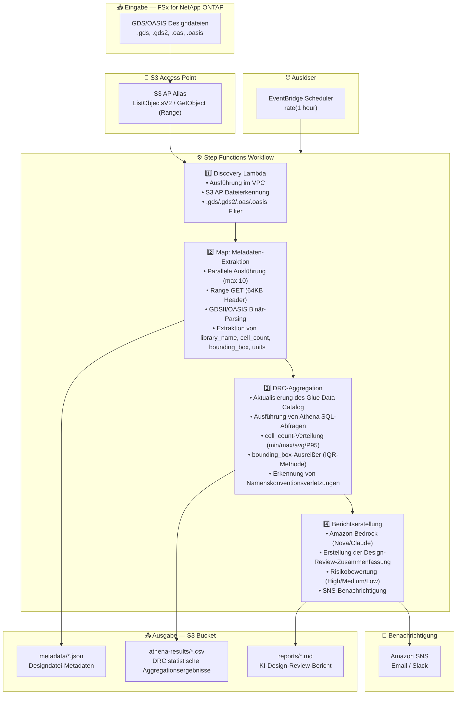

# UC6: Halbleiter / EDA — Validierung von Designdateien

🌐 **Language / 言語**: [日本語](architecture.md) | [English](architecture.en.md) | [한국어](architecture.ko.md) | [简体中文](architecture.zh-CN.md) | [繁體中文](architecture.zh-TW.md) | [Français](architecture.fr.md) | Deutsch | [Español](architecture.es.md)

## End-to-End-Architektur (Eingabe → Ausgabe)

---

## Übergeordneter Ablauf

```
┌─────────────────────────────────────────────────────────────────────────────┐
│                         FSx for NetApp ONTAP                                 │
│                                                                              │
│  /vol/eda_designs/                                                           │
│  ├── top_chip_v3.gds        (GDSII format, multi-GB)                        │
│  ├── block_a_io.gds2        (GDSII format)                                  │
│  ├── memory_ctrl.oasis      (OASIS format)                                  │
│  └── analog_frontend.oas    (OASIS format)                                  │
│                                                                              │
└──────────────────────────────────┬───────────────────────────────────────────┘
                                   │
                                   ▼
┌──────────────────────────────────────────────────────────────────────────────┐
│                      S3 Access Point (Data Path)                              │
│                                                                              │
│  Alias: fsxn-eda-vol-ext-s3alias                                             │
│  • ListObjectsV2 (Dateierkennung)                                            │
│  • GetObject with Range header (64KB Header-Lesung)                          │
│  • No NFS mount required from Lambda                                         │
│                                                                              │
└──────────────────────────────────┬───────────────────────────────────────────┘
                                   │
                                   ▼
┌──────────────────────────────────────────────────────────────────────────────┐
│                    EventBridge Scheduler (Trigger)                            │
│                                                                              │
│  Schedule: rate(1 hour) — configurable                                       │
│  Target: Step Functions State Machine                                        │
│                                                                              │
└──────────────────────────────────┬───────────────────────────────────────────┘
                                   │
                                   ▼
┌──────────────────────────────────────────────────────────────────────────────┐
│                    AWS Step Functions (Orchestration)                         │
│                                                                              │
│  ┌─────────────┐    ┌──────────────────────┐    ┌────────────────┐          │
│  │  Discovery   │───▶│  Map State           │───▶│ DRC Aggregation│          │
│  │  Lambda      │    │  (MetadataExtraction)│    │ Lambda         │          │
│  │             │    │  MaxConcurrency: 10  │    │               │          │
│  │  • VPC内     │    │  • Retry 3x          │    │  • Athena SQL  │          │
│  │  • S3 AP List│    │  • Catch → MarkFailed│    │  • Glue Catalog│          │
│  │  • ONTAP API │    │  • Range GET 64KB    │    │  • IQR outliers│          │
│  └─────────────┘    └──────────────────────┘    └───────┬────────┘          │
│                                                          │                   │
│                                                          ▼                   │
│                                                 ┌────────────────┐          │
│                                                 │Report Generation│          │
│                                                 │ Lambda         │          │
│                                                 │               │          │
│                                                 │ • Bedrock      │          │
│                                                 │ • SNS notify   │          │
│                                                 └────────────────┘          │
│                                                                              │
└──────────────────────────────────────────────────────────────────────────────┘
                                   │
                                   ▼
┌──────────────────────────────────────────────────────────────────────────────┐
│                         Output (S3 Bucket)                                    │
│                                                                              │
│  s3://{stack}-output-{account}/                                              │
│  ├── metadata/YYYY/MM/DD/                                                    │
│  │   ├── top_chip_v3.json          ← Extrahierte Metadaten                  │
│  │   ├── block_a_io.json                                                     │
│  │   ├── memory_ctrl.json                                                    │
│  │   └── analog_frontend.json                                                │
│  ├── athena-results/                                                         │
│  │   └── {query-execution-id}.csv  ← DRC-Statistiken                        │
│  └── reports/YYYY/MM/DD/                                                     │
│      └── eda-design-review-{id}.md ← Bedrock-Bericht                        │
│                                                                              │
└──────────────────────────────────────────────────────────────────────────────┘
```

---

## Mermaid-Diagramm (für Präsentationen / Dokumentation)



---

## Datenfluss im Detail

### Eingabe
| Element | Beschreibung |
|---------|--------------|
| **Quelle** | FSx for NetApp ONTAP Volume |
| **Dateitypen** | .gds, .gds2 (GDSII), .oas, .oasis (OASIS) |
| **Zugriffsmethode** | S3 Access Point (kein NFS-Mount) |
| **Lesestrategie** | Range-Anfrage — nur erste 64KB (Header-Parsing) |

### Verarbeitung
| Schritt | Service | Funktion |
|---------|---------|----------|
| Discovery | Lambda (VPC) | Designdateien über S3 AP auflisten |
| Metadaten-Extraktion | Lambda (Map) | GDSII/OASIS Binär-Header parsen |
| DRC-Aggregation | Lambda + Athena | SQL-basierte statistische Analyse |
| Berichtserstellung | Lambda + Bedrock | KI-Design-Review-Zusammenfassung |

### Ausgabe
| Artefakt | Format | Beschreibung |
|----------|--------|--------------|
| Metadaten-JSON | `metadata/YYYY/MM/DD/{stem}.json` | Extrahierte Metadaten pro Datei |
| Athena-Ergebnisse | `athena-results/{id}.csv` | DRC-Statistiken (Zellverteilung, Ausreißer) |
| Design-Review | `reports/YYYY/MM/DD/eda-design-review-{id}.md` | Von Bedrock generierter Bericht |
| SNS-Benachrichtigung | Email | Zusammenfassung mit Dateianzahl und Berichtsstandort |

---

## Wichtige Designentscheidungen

1. **S3 AP statt NFS** — Lambda kann kein NFS mounten; S3 AP bietet serverlosen nativen Zugriff auf ONTAP-Daten
2. **Range-Anfragen** — GDS-Dateien können mehrere GB groß sein; nur 64KB Header für Metadaten benötigt
3. **Athena für Analytik** — SQL-basierte DRC-Aggregation skaliert auf Millionen von Dateien
4. **IQR-Ausreißererkennung** — Statistische Methode zur Erkennung von Bounding-Box-Anomalien
5. **Bedrock für Berichte** — Zusammenfassungen in natürlicher Sprache für nicht-technische Stakeholder
6. **Polling (nicht ereignisgesteuert)** — S3 AP unterstützt `GetBucketNotificationConfiguration` nicht

---

## Verwendete AWS-Services

| Service | Rolle |
|---------|-------|
| FSx for NetApp ONTAP | Enterprise-Dateispeicher (GDS/OASIS-Dateien) |
| S3 Access Points | Serverloser Datenzugriff auf ONTAP-Volumes |
| EventBridge Scheduler | Periodischer Auslöser |
| Step Functions | Workflow-Orchestrierung mit Map-Status |
| Lambda | Compute (Discovery, Extraction, Aggregation, Report) |
| Glue Data Catalog | Schema-Verwaltung für Athena |
| Amazon Athena | SQL-Analytik auf Metadaten |
| Amazon Bedrock | KI-Berichtserstellung (Nova Lite / Claude) |
| SNS | Benachrichtigung |
| CloudWatch + X-Ray | Observability |
